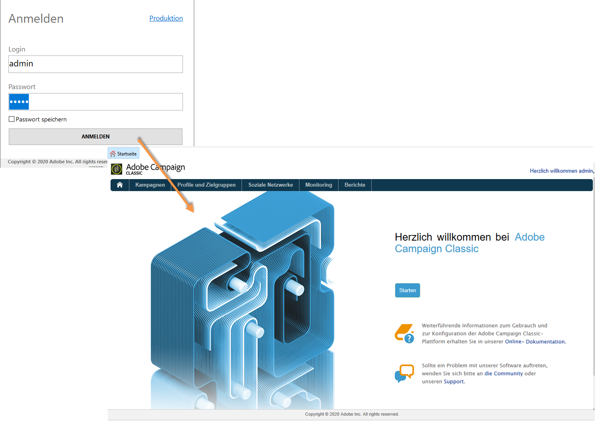

# IMS implementieren{#implementing-ims}

## Aktivierung der Verbindung über IMS {#enabling-the-ims-connection}

1. Aktivieren Sie im Fenster zur Verbindungskonfiguration der Konsole die Option **[!UICONTROL Anmeldung mit einer Adobe ID]**, um sich mit IMS anzumelden.

   

1. Geben Sie Ihre Kennung sowie Ihr Adobe-Kennwort ein. Daraufhin wird die Adobe-Campaign-Startseite angezeigt.

   

## Deaktivierung der Verbindung über IMS {#disabling-the-ims-connection}

Um die Verbindung über die Adobe ID zu deaktivieren, müssen Sie sich zunächst ausloggen. Gehen Sie dann in das Menü **[!UICONTROL Datei > Verbindungen]** und deaktivieren Sie die Option **[!UICONTROL Anmeldung mit einer Adobe ID]**.

