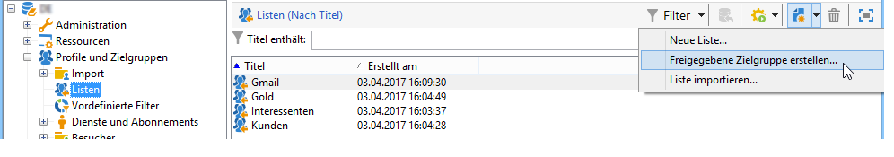
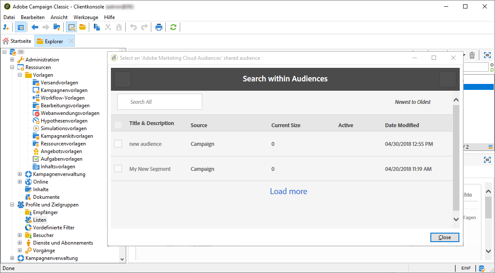
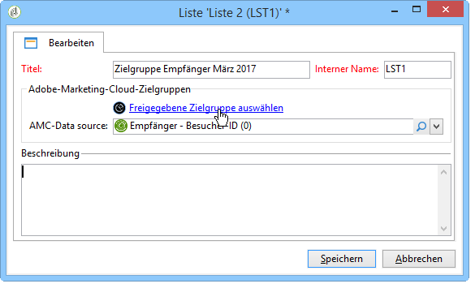
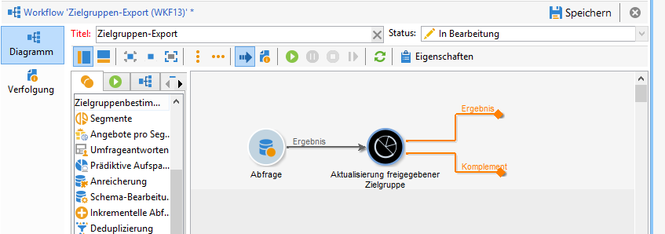
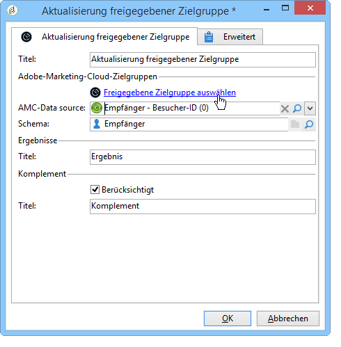

# Zielgruppenimport und -export{#importing-and-exporting-audiences}

## Audience importieren {#importing-an-audience}

Der Import von Zielgruppen/Segmenten aus Audience Manager oder People Core Service in Adobe Campaign erfolgt mithilfe von Empfängerlisten.

1. Gehen Sie in den Knoten **[!UICONTROL Profile und Zielgruppen]** > **[!UICONTROL Listen]** des Adobe-Campaign-Navigationsbaums.
1. Klicken Sie in der Symbolleiste auf die Schaltfläche **[!UICONTROL Neu]** > **[!UICONTROL Freigegebene Zielgruppe erstellen...]**

   

1. Klicken Sie dann im sich öffnenden Fenster auf **[!UICONTROL Freigegebene Zielgruppe auswählen]**, um auf die Liste der von anderen Adobe Experience Cloud-Lösungen freigegebenen Zielgruppen/Segmente zugreifen zu können.
1. Wählen Sie die gewünschte Zielgruppe aus und validieren Sie. Die Informationen zur ausgewählten Zielgruppe werden automatisch ausgefüllt.

   Um freigegebene Zielgruppen importieren zu können, sollte Ihnen das Produkt **[!UICONTROL Audience Library]** in der Admin Console zugewiesen worden sein. Außerdem sollten Sie in Audience Manager Administratorrechte besitzen. Weiterführende Informationen dazu finden Sie im [Handbuch zur Admin Console](https://helpx.adobe.com/de/enterprise/managing/user-guide.html).

   

1. Wählen Sie im Feld **[!UICONTROL AMC Data source]** die Adobe-Marketing-Cloud-Datenquelle aus, um den erwarteten Datentyp zu definieren.

   

1. Speichern Sie die Zielgruppe.

Die Zielgruppe wird mithilfe eines technischen Workflows importiert. Die importierte Liste enthält die Elemente, die mithilfe der AMC-Datenquelle abgestimmt werden konnten. Von Adobe Campaign nicht erkannte Elemente werden nicht importiert.

Wenn Segmente direkt von People Core Service oder Audience Manager importiert werden, dauert die Synchronisation des Imports 24 bis 36 Stunden. Danach ist die neue Audience in Adobe Campaign auffindbar und verwendbar.

>[!NOTE]
>
>Wenn Sie Zielgruppen aus Adobe Analytics in Adobe Campaign importieren, müssen diese Zielgruppen zunächst in People Core Service oder Audience Manager freigegeben werden. Dieser Vorgang dauert 12 bis 24 Stunden. Diese Zeit muss zu den 24 bis 36 Stunden für die Synchronisation mit Campaign addiert werden.
>
>In diesem speziellen Fall kann die Zielgruppenfreigabe bis zu 60 Stunden dauern. Weitere Informationen zur Adobe Analytics-Zielgruppenfreigabe in People Core Service und Audience Manager finden Sie in dieser [Dokumentation](https://docs.adobe.com/content/help/de-DE/analytics/components/segmentation/segmentation-workflow/seg-publish.html).

Bei jeder späteren Synchronisation werden alle Daten der zuvor erstellten Zielgruppe vollständig ersetzt. Nur Segmente können importiert werden. Granulare Daten wie Schlüssel/Wert-Paare, Merkmale und Regeln werden nicht unterstützt.

## Audiences exportieren {#exporting-an-audience}

Der Export von Zielgruppen aus Adobe Campaign in Audience Manager oder People Core Service erfolgt mithilfe eines Workflows. Weiterführende Informationen zur Erstellung und Verwendung von Workflows finden Sie in [diesem Dokument](../../workflow/using/building-a-workflow.md). Die exportierten Zielgruppen werden in Form von Segmenten in People Core Service gespeichert:

1. Erstellen Sie einen neuen Zielgruppen-Workflow.
1. Verwenden Sie die diversen zur Verfügung stehenden Aktivitäten, um eine Gruppe von Empfängern auszuwählen.
1. Platzieren Sie im Anschluss an die Zielgruppenbestimmung die Aktivität **[!UICONTROL Aktualisierung freigegebener Zielgruppe]** im Workflow-Diagramm und öffnen Sie sie.

   

1. Definieren Sie die zu exportierende Zielgruppe anhand der Option **[!UICONTROL Freigegebene Zielgruppe auswählen]**. Im sich öffnenden Fenster können Sie zwischen der Auswahl einer existierenden und der Erstellung einer neuen Zielgruppe wählen.

   Wenn Sie eine existierende Zielgruppe verwenden, wird sie mit den neuen Datensätzen ergänzt.

   Zum Export der Empfängerliste in eine neue Zielgruppe ist zunächst das Feld **[!UICONTROL Segment name]** auszufüllen. Klicken Sie dann auf **[!UICONTROL Create]**, um die Zielgruppe zu erstellen, und wählen Sie diese für den Export aus.

   Schließen Sie den Vorgang ab, indem Sie auf die Validierungsschaltfläche oben rechts im Fenster und dann auf **[!UICONTROL OK]** klicken.

1. Wählen Sie im Feld **[!UICONTROL AMC Data source]** die Adobe-Marketing-Cloud-Datenquelle aus, um den erwarteten Datentyp zu definieren. Das Schema wird automatisch abgeleitet.

   

1. Speichern Sie die Zielgruppe.

Die Zielgruppe wird daraufhin exportiert. Die Aktivität zum Zielgruppenexport weist zwei ausgehende Transitionen auf. Die erste Transition enthält die Empfänger, die erfolgreich exportiert wurden. Die zweite Transition enthält die Empfänger, denen keine Besucherkennung oder Declared ID zugeordnet werden konnte.

Die Synchronisation von Adobe Campaign und People Core Service dauert 24 bis 36 Stunden. Danach ist Ihre neue Audience in People Core Service auffindbar und kann in anderen Adobe Experience Cloud-Lösungen verwendet werden. Weiterführende Informationen zur Verwendung einer in Adobe Campaign freigegebenen Audience in Adobe People Core Service finden Sie in dieser [Dokumentation](https://docs.adobe.com/content/help/de-DE/core-services/interface/audiences/t-audience-create.html).

>[!NOTE]
>
>Um abgestimmt werden zu können, müssen die Datensätze eine Adobe-Experience-Cloud-Kennung (&#39;visitor ID&#39; oder &#39;declared ID&#39;) aufweisen. Datensätze, die keine Adobe-Experience-Cloud-Kennung aufweisen, werden beim Import und Export der Zielgruppen ignoriert.

