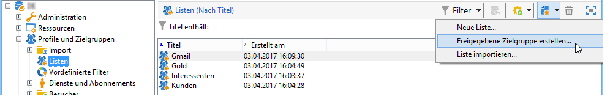
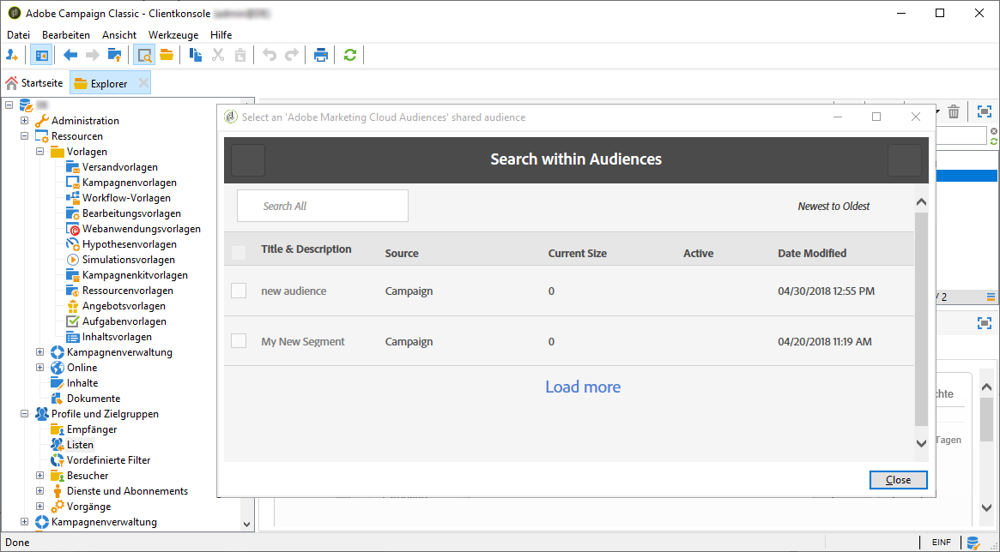
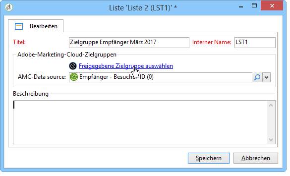
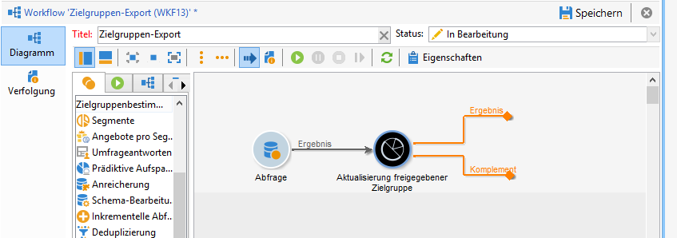
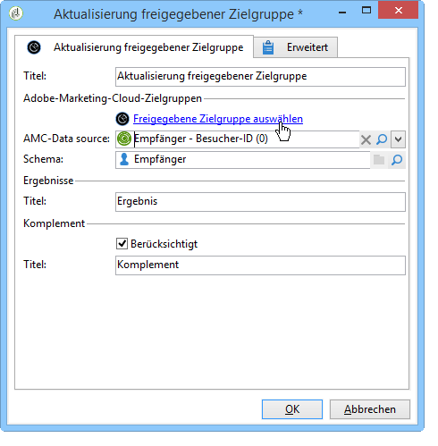

# Import und Export von Zielgruppen{#importing-and-exporting-audiences}

## Zielgruppe importieren {#importing-an-audience}

Der Import von Zielgruppen/Segmenten aus Audience Manager in Adobe Campaign erfolgt mithilfe von Empfängerlisten.

1. Gehen Sie in den Knoten **[!UICONTROL Profile und Zielgruppen]** > **[!UICONTROL Listen]** des Adobe Campaign Explorer.
1. Klicken Sie in der Aktionsleiste auf die Schaltfläche **[!UICONTROL Neu]** > **[!UICONTROL Freigegebene Zielgruppe erstellen...]**

   

1. Klicken Sie dann im sich öffnenden Fenster auf **[!UICONTROL Freigegebene Zielgruppe auswählen]**, um auf die Liste der von anderen Adobe Experience Cloud-Lösungen freigegebenen Audiences/Segmente zugreifen zu können.
1. Audience auswählen und bestätigen. Die Informationen zur Zielgruppe werden automatisch ausgefüllt.

   Um freigegebene Zielgruppen importieren zu können, sollte Ihnen das Produkt **[!UICONTROL Audience Library]** in der Admin Console zugewiesen worden sein. Außerdem sollten Sie in Audience Manager Administratorrechte besitzen. Weiterführende Informationen dazu finden Sie im [Handbuch zur Admin Console](https://helpx.adobe.com/de/enterprise/managing/user-guide.html).

   

1. Wählen Sie im Feld **[!UICONTROL AMC Data source]** die Adobe-Marketing-Cloud-Datenquelle aus, um den erwarteten Datentyp zu definieren.

   

1. Speichern Sie die Zielgruppe.

Die Audience wird über einen technischen Workflow importiert. Die importierte Liste enthält Elemente, die mit der AMC-Datenquelle abgestimmt werden können. Die von Adobe Campaign nicht erkannten Elemente werden nicht importiert.

Wenn Segmente direkt aus Audience Manager importiert werden, dauert die Synchronisation des Imports 24 bis 36 Stunden. Danach ist die neue Zielgruppe in Adobe Campaign auffindbar und kann verwendet werden.

>[!NOTE]
>
>Beim Import von Zielgruppen von Adobe Analytics nach Adobe Campaign müssen diese Zielgruppen zuerst in Audience Manager freigegeben werden. Dieser Prozess dauert 12 bis 24 Stunden, die zu den 24 bis 36 Stunden für die Synchronisation mit Campaign hinzugezählt werden müssen.
>
>Die Freigabe einer Zielgruppe kann demnach in diesem Fall bis zu 60 Stunden dauern. Weitere Informationen zur Freigabe einer Adobe Analytics-Zielgruppe in Audience Manager finden Sie in der [Dokumentation zu Adobe Analytics](https://experienceleague.adobe.com/docs/analytics/components/segmentation/segmentation-workflow/seg-publish.html?lang=de){target="_blank"}.

Bei jeder späteren Synchronisation werden alle Daten der zuvor erstellten Zielgruppe vollständig ersetzt. Nur Segmente können importiert werden. Granulare Daten wie Schlüssel/Wert-Paare, Merkmale und Regeln werden nicht unterstützt.

## Zielgruppe exportieren {#exporting-an-audience}

Der Export von Zielgruppen aus Adobe Campaign in Audience Manager erfolgt mithilfe eines Workflows. Weiterführende Informationen zur Erstellung und Verwendung von Workflows finden Sie in der [Dokumentation zu Campaign v8](https://experienceleague.adobe.com/docs/campaign/automation/workflows/introduction/build-a-workflow.html?lang=de){target="_blank"}. Die exportierten Zielgruppen werden als Segmente gespeichert:

1. Erstellen Sie einen neuen Zielgruppen-Workflow.
1. Verwenden Sie die diversen zur Verfügung stehenden Aktivitäten, um eine Gruppe von Empfängern auszuwählen.
1. Platzieren Sie im Anschluss an die Zielgruppenbestimmung die Aktivität **[!UICONTROL Aktualisierung freigegebener Zielgruppe]** im Workflow-Diagramm und öffnen Sie sie.

   

1. Definieren Sie die zu exportierende Audience über die Option **[!UICONTROL Freigegebene Audience auswählen]**. Im sich öffnenden Fenster können Sie zwischen der Auswahl einer existierenden und der Erstellung einer neuen Audience wählen.

   Wenn Sie eine existierende Zielgruppe verwenden, wird sie mit den neuen Datensätzen ergänzt.

   Zum Export der Empfängerliste in eine neue Zielgruppe ist zunächst das Feld **[!UICONTROL Segment name]** auszufüllen. Klicken Sie dann auf **[!UICONTROL Create]**, um die Zielgruppe zu erstellen, und wählen Sie diese für den Export aus.

   Schließen Sie den Vorgang ab, indem Sie auf die Validierungsschaltfläche oben rechts im Fenster und dann auf **[!UICONTROL OK]** klicken.

1. Wählen Sie die **[!UICONTROL AMC-Datenquelle]**, um den erwarteten Datentyp anzugeben. Das Schema wird automatisch bestimmt.

   

1. Speichern Sie die Zielgruppe.

Die Zielgruppe wird dann exportiert. Die Aktivität „Zielgruppe speichern“ hat zwei ausgehende Transitionen. Die Hauptübergabe enthält die Empfänger, die erfolgreich exportiert wurden. Die zusätzliche Transition enthält die Empfänger, die keiner Besucher-ID oder deklarierten ID zugeordnet werden konnten.

Die Synchronisation zwischen Lösungen dauert 24 bis 36 Stunden. Danach ist Ihre neue Zielgruppe auffindbar und kann in anderen Adobe Experience Cloud-Lösungen verwendet werden. Weiterführende Informationen zur Verwendung einer in Adobe Campaign freigegebenen Zielgruppe finden Sie in dieser [Dokumentation](https://experienceleague.adobe.com/de/docs/core-services/interface/services/audiences/create){target="_blank"}.

>[!NOTE]
>
>Um abgestimmt werden zu können, müssen die Datensätze eine Adobe Experience Cloud-ID (&#39;visitor ID&#39; oder &#39;declared ID&#39;) aufweisen. Die Datensätze ohne Adobe Experience Cloud-ID werden beim Exportieren und Importieren von Audiences ignoriert.
