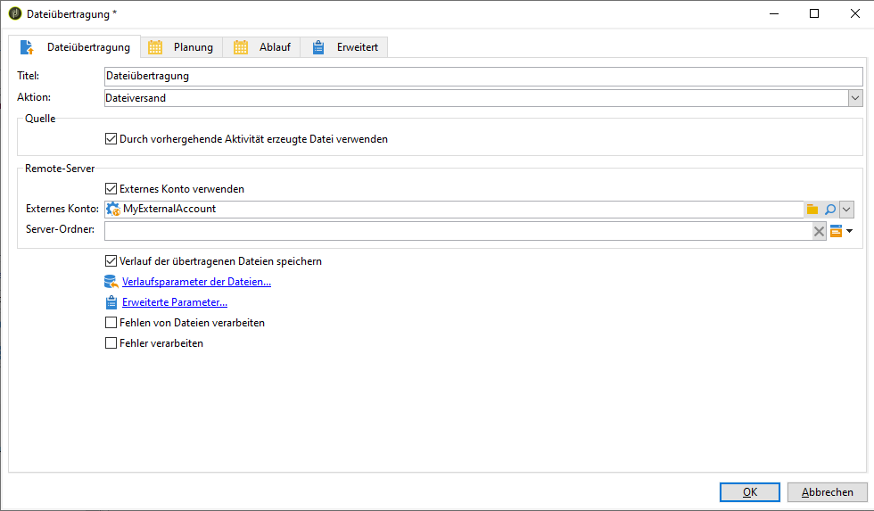
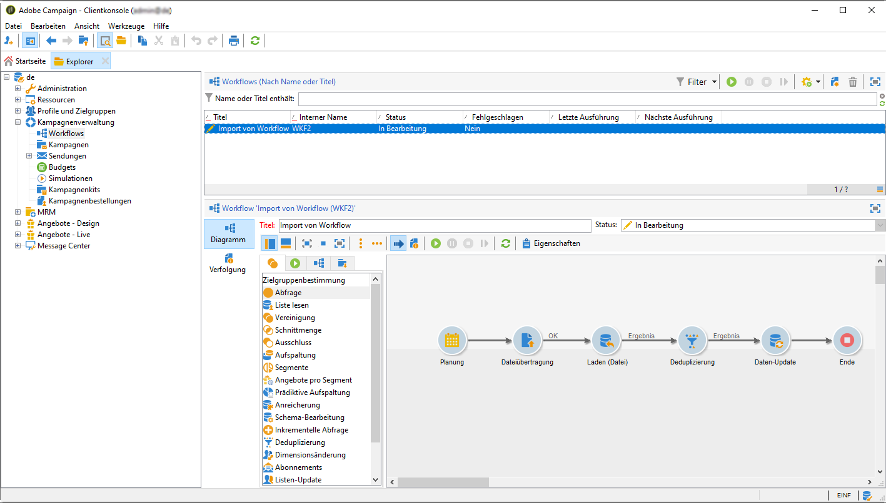

# Adobe Experience Platform-Segmente in Kampagne {#destinations} aufnehmen

Um Adobe Experience Platform in die Kampagne zu integrieren und sie in Ihrer Workflows zu verwenden, müssen Sie zunächst das Adobe Campaign als Adobe Experience Platform **Ziel** verbinden und es mit dem zu exportierenden Segment konfigurieren.

Nachdem das Ziel konfiguriert wurde, werden die Daten an Ihren Speicherort in der Datenspeicherung exportiert und Sie müssen einen eigenen Arbeitsablauf in Campaign Classic erstellen, um die Daten zu erfassen.

## Adobe Campaign als Ziel verbinden

Konfigurieren Sie auf der Adobe Experience-Plattform eine Verbindung mit Adobe Campaign, indem Sie einen Speicherort für die Datenspeicherung für die exportierten Segmente auswählen. Mit diesen Schritten können Sie auch die zu exportierenden Segmente auswählen und zusätzliche XDM-Felder angeben, die einbezogen werden sollen.

Weitere Informationen finden Sie in der [Dokumentation zu Zielen](https://experienceleague.adobe.com/docs/experience-platform/destinations/catalog/email-marketing/adobe-campaign.html).

Nachdem das Ziel konfiguriert wurde, erstellt Adobe Experience Platform eine tabulatorgetrennte .txt- oder .csv-Datei am Speicherort der Datenspeicherung, den Sie bereitgestellt haben. Dieser Vorgang wird einmal pro 24 Stunden geplant und ausgeführt.

Sie können jetzt einen Campaign Classic-Workflow konfigurieren, um das Segment in Kampagne zu erfassen.

## Erstellen eines Importarbeitsablaufs in Campaign Classic

Nachdem Campaign Classic als Ziel konfiguriert wurde, müssen Sie einen dedizierten Arbeitsablauf erstellen, um die Datei zu importieren, die von Adobe Experience Platform exportiert wurde.

Dazu müssen Sie eine **[!UICONTROL Dateiübertragung]**-Aktivität hinzufügen und konfigurieren. Weitere Informationen zum Konfigurieren dieser Aktivität finden Sie in [diesem Abschnitt](../../workflow/using/file-transfer.md).

Anschließend können Sie Ihren Workflow entsprechend Ihren Anforderungen erstellen (aktualisieren Sie die Datenbank mit den Segmentdaten, senden Sie einen Kanal-übergreifenden Versand an das Segment usw.)

Beispielsweise lädt der unten stehende Arbeitsablauf die Datenspeicherung täglich von Ihrem Speicherort herunter und aktualisiert dann die Kampagne-Datenbank mit den Segmentdaten.

