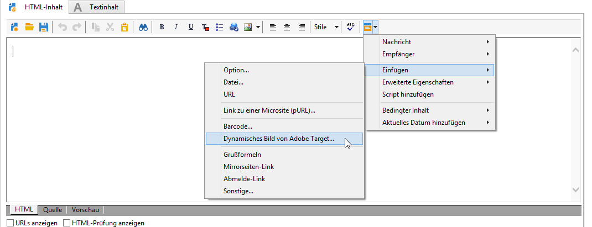
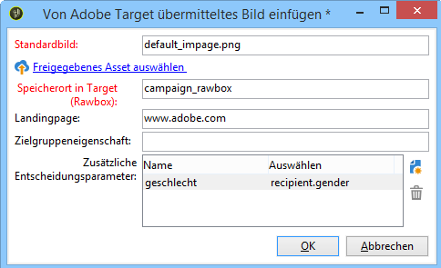
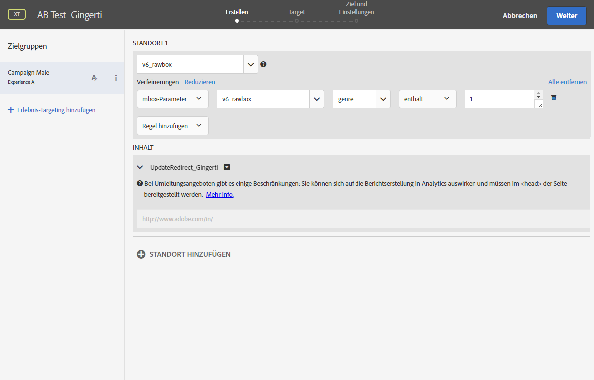
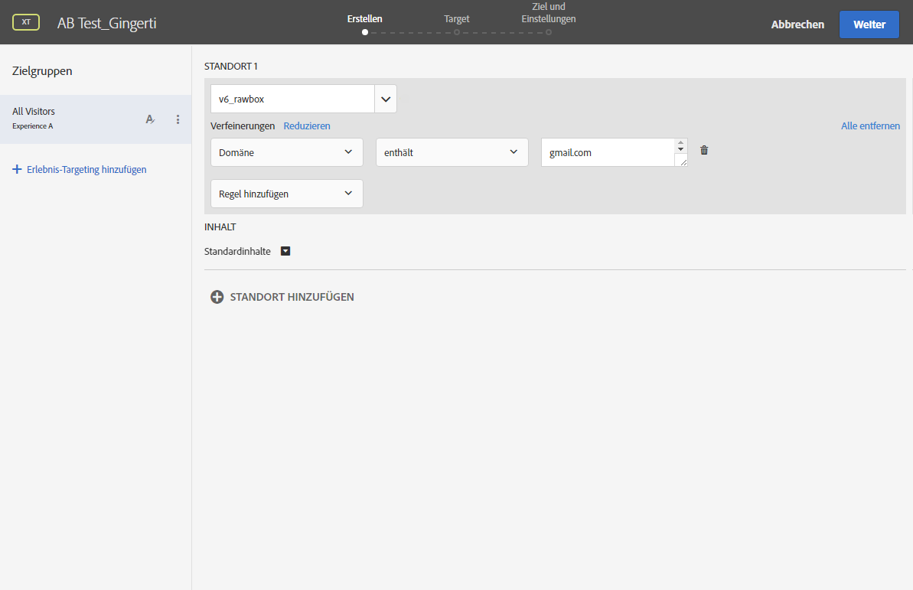
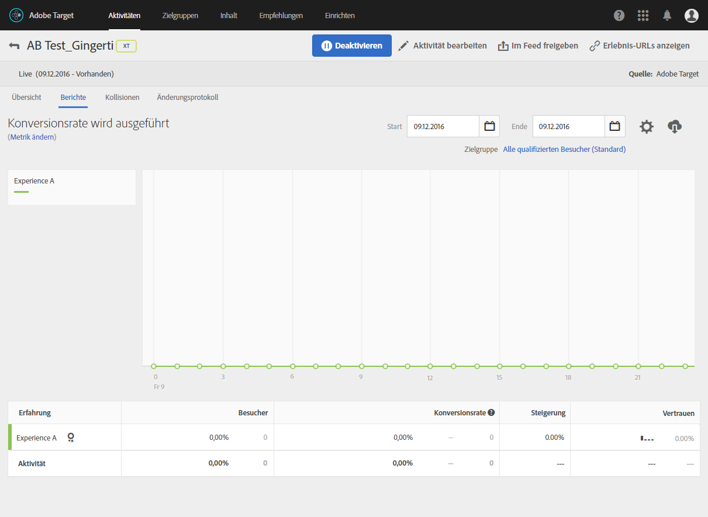

# Dynamisches Bild einfügen{#inserting-a-dynamic-image}

Der folgende Abschnitt beschreibt die in Adobe Campaign erforderlichen Konfigurationsschritte, um ein Bild aus Adobe Target in eine E-Mail zu integrieren.

Die Verwendung von dynamischen Bildern setzt das Vorhandensein diverser Elemente in Adobe Target voraus:

* [Umleitungsangebote](https://marketing.adobe.com/resources/help/en_US/tnt/help/t_Creating_a_Redirect_Offer.html), in denen die URL der zu verwendenden Bilder anzugeben ist;
* [Zielgruppen](https://marketing.adobe.com/resources/help/en_US/target/target/t_create-audience.html), die die durch Ihre Aktivität anzusprechenden Kontakte enthalten;
* Aktivität vom Typ [formularbasierter Experience Composer](https://marketing.adobe.com/resources/help/en_US/tnt/help/t_Creating_an_A_B_Test.html), in der eine Rawbox auszuwählen und entsprechend der Anzahl erstellter Umleitungsangebote Erlebnisse zu definieren sind. Für jedes Erlebnis ist eins der erstellten Umleitungsangebote auszuwählen.

   Zur Definition der Erlebnisse können unter Einbeziehung aus Adobe Campaign stammender Informationen Segmente erstellt werden. Wenn Sie in den Angebotsauswahlregeln Daten aus Adobe Campaign verwenden möchten, müssen diese in der Adobe-Target-Rawbox angegeben werden.

Gehen Sie wie folgt vor, um ein Bild aus Adobe Target in einen Adobe-Campaign-Versand einzufügen:

1. Erstellen Sie in Adobe Campaign einen E-Mail-Versand.
1. Wählen Sie in den verfügbaren Personalisierungsfeldern **[!UICONTROL Include > Dynamic image served by Adobe Target]**.

   

1. Im sich öffnenden Fenster haben Sie nun die Möglichkeit, das Bild auszuwählen, das standardmäßig in der E-Mail angezeigt werden soll. Sie können die Bild-URL angeben oder ein [freigegebenes Bild](../../integrations/using/sharing-assets-with-adobe-experience-cloud.md) verwenden.
1. Geben Sie den Namen der in Adobe Target definierten Rawbox an.
1. Geben Sie eine URL in das **[!UICONTROL Landing Page]** Feld ein, wenn das Standardbild zu einer Standard-Landingpage umgeleitet werden soll. Diese URL gilt nur für die Fälle, in denen das Standardbild in der letzten E-Mail angezeigt wird und optional ist.
1. Wenn Sie in Ihren Einstellungen in Adobe Target Enterprise-Genehmigungen verwenden, geben Sie in diesem Feld die entsprechende Eigenschaft ein. Weiterführende Informationen zu Enterprise-Genehmigungen bei Target finden Sie auf [dieser Seite](https://marketing.adobe.com/resources/help/en_US/target/target/properties-overview.html). Dieses Feld ist optional und nicht erforderlich, wenn Sie keine Enterprise-Genehmigungen in Target verwenden.
1. In **[!UICONTROL Additional decision parameters]**, specify the mapping between the fields defined in the Adobe Target segments and the Adobe Campaign fields. Die in Adobe Campaign verwendeten Felder müssen zuvor in der Rawbox angegeben werden.

   

   Die Bestimmung des Parameters in Adobe Target erfolgt über die im Zuge der Integration des Target-Bilds in Adobe Campaign erstellen Rawboxes und die Option **Refinements**.

   

   Die voranstehende Abbildung zeigt die Definition geschlechtsspezifischer Erlebnisse.

Eine weitere Möglichkeit besteht beispielsweise darin, den E-Mail-Inhalt von der Domain der E-Mail-Adresse abhängig zu machen. Die Daten werden automatisch mithilfe des Empfänger-Browsers abgerufen.

In der E-Mail-Vorschau können Sie feststellen, dass je nach ausgewähltem Profil das angezeigte Bild wechselt. Die Anzeige erfolgt in Abhängigkeit von den Parametern, die in Adobe Campaign und in der Aktivität in Adobe Target konfiguriert wurden.

Der Erfolg Ihrer Sendungen kann in Adobe Target gemessen werden.

