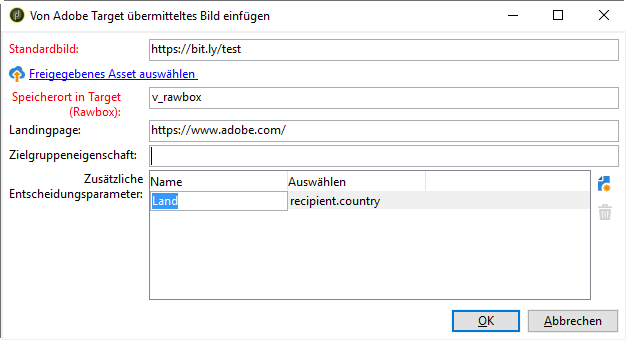

# Dynamische Inhalte aus Target einfügen {#inserting-a-dynamic-image}

In diesem Dokument erfahren Sie, wie Sie ein dynamisches Angebot von Target in eine E-Mail in Adobe Campaign integrieren können.

Wir möchten einen Versand erstellen, der einen Bild-Baustein enthält, der sich entsprechend dem Land des Empfängers dynamisch ändert. Die Daten werden bei jeder mbox-Abfrage gesendet und sind abhängig von der IP-Adresse des Besuchers.

Wir möchten, dass eines der Bilder in dieser E-Mail entsprechend den folgenden Benutzererlebnissen dynamisch angepasst wird:

* Die E-Mail wird in Frankreich geöffnet.
* Die E-Mail wird in den USA geöffnet.
* Wenn keine dieser Bedingungen zutrifft, wird ein Standardbild angezeigt.

Gehen Sie zur Umsetzung unseres Beispiels in Adobe Campaign und Target wie folgt vor:

1. [Einfügen des dynamischen Angebots in eine E-Mail](../../integrations/using/inserting-a-dynamic-image.md#inserting-dynamic-offer)
1. [Erstellen von Umleitungsangeboten](../../integrations/using/inserting-a-dynamic-image.md#create-redirect-offers)
1. [Audiences erstellen](../../integrations/using/inserting-a-dynamic-image.md#audiences-target)
1. [Erstellen einer Erlebnis-Targeting-Aktivität](../../integrations/using/inserting-a-dynamic-image.md#creating-targeting-activity)
1. [Erstellen der Vorschau und Senden der E-Mail](../../integrations/using/inserting-a-dynamic-image.md#preview-send-email)

## Einfügen des dynamischen Angebots in eine E-Mail {#inserting-dynamic-offer}

Sobald Sie mit der Definition der Zielgruppe und des Inhalts Ihrer E-Mail in Adobe Campaign fertig sind, können Sie ein dynamisches Bild aus Target einfügen.

Geben Sie dazu die URL des Standardbildes an, den Speicherort und die Felder, die an Target übermittelt werden sollen.

In Adobe Campaign gibt es zwei Möglichkeiten, ein dynamisches Bild von Target in eine E-Mail einzufügen:

* Wenn Sie den Digital Content Editor verwenden, wählen Sie ein vorhandenes Bild und dann aus der Symbolleiste **[!UICONTROL Einfügen]** > **[!UICONTROL Dynamisches Bild von Adobe Target]**.

   

* Wenn Sie den Standardeditor verwenden, platzieren Sie den Cursor an die Stelle, an der das Bild eingefügt werden soll, und wählen Sie aus dem Dropdown-Menü „Personalisierung“ **[!UICONTROL Einfügen]** > **[!UICONTROL Dynamisches Bild von Adobe Target...]**.

   

### Definieren der Bildparameter {#defining-image-parameters}

* URL des **[!UICONTROL Standardbilds]**: Dieses Bild wird angezeigt, wenn keine der Bedingungen erfüllt ist. Sie können auch ein Bild aus Ihrer Assets-Bibliothek verwenden.
* **[!UICONTROL Speicherort in Target]**: Geben Sie einen Namen für den Speicherort Ihres dynamischen Angebots ein. Sie müssen diesen Speicherort später in Ihrer Target-Aktivität auswählen.
* **[!UICONTROL Landingpage]**: Wenn das Standardbild zu einer standardmäßigen Landingpage weiterleiten soll. Diese URL gilt nur dann, wenn das Standardbild in der letzten E-Mail angezeigt wird und optional ist.
* Stellen Sie im Bereich **[!UICONTROL Zusätzliche Entscheidungsparameter]** das Mapping zwischen den in den Adobe Target-Segmenten definierten Feldern und den Feldern in Adobe Campaign her. Die in Adobe Campaign verwendeten Felder müssen zuvor in der Rawbox angegeben werden. In unserem Beispiel haben wir das Feld „Country“ (Land) hinzugefügt.

Wenn Sie in Ihren Einstellungen in Adobe Target Unternehmensberechtigungen verwenden, fügen Sie die entsprechende Eigenschaft in dieses Feld ein. Weitere Informationen zu Unternehmensberechtigungen in Target finden Sie auf [dieser Seite](https://docs.adobe.com/content/help/en/target/using/administer/manage-users/enterprise/properties-overview.html).

## Erstellen von Umleitungsangeboten {#create-redirect-offers}

In Target können Sie für ein Angebot unterschiedliche Versionen erstellen. Für jedes Benutzererlebnis können Sie ein spezifisches Umleitungsangebot definieren und ein anderes Bild wählen.

In unserem Fall benötigen wir zwei Umleitungsangebote. Das dritte (das Standardangebot) wird in Adobe Campaign definiert.

1. Um in Target Standard ein neues Umleitungsangebot zu erstellen, klicken Sie auf dem Tab **[!UICONTROL Inhalt]** auf **[!UICONTROL Code-Angebote]**.

1. Klicken Sie auf **[!UICONTROL Erstellen]** und dann auf **[!UICONTROL Umleitungsangebot]**.

   

1. Geben Sie einen Namen für das Angebot und die URL Ihres Bildes ein.

   

1. Führen Sie dieselben Schritte für das andere Umleitungsangebot durch. Weiterführende Informationen hierzu finden Sie auf dieser [Seite](https://docs.adobe.com/help/de-DE/target/using/experiences/offers/offer-redirect.html).

## Audiences erstellen {#audiences-target}

Erstellen Sie in Target die zwei Zielgruppen, in die die Besucher Ihres Angebots unterteilt werden und denen die unterschiedlichen Inhalte präsentiert werden. Fügen Sie für jede Zielgruppe eine Regel hinzu, um festzulegen, wer das Angebot sehen kann.

1. Um in Target eine neue Zielgruppe zu erstellen, klicken Sie auf dem Tab **[!UICONTROL Audiences]** auf **[!UICONTROL Zielgruppe erstellen]**.

   

1. Fügen Sie Ihrer Zielgruppe einen Namen hinzu.

   

1. Klicken Sie auf **[!UICONTROL Add a rule (Regel hinzufügen)]** und wählen Sie eine Kategorie aus. Die Regel benutzt spezifische Kriterien für die Besucher. Sie können die Regeln verfeinern, indem Sie Bedingungen hinzufügen oder neue Regeln in anderen Kategorien erstellen.

1. Führen Sie dieselben Schritte für die anderen Zielgruppen durch.

## Erstellen einer Erlebnis-Targeting-Aktivität {#creating-targeting-activity}

Wir müssen in Target eine Erlebnis-Targeting-Aktivität erstellen, die diversen Erlebnisse definieren und sie mit den entsprechenden Angeboten verknüpfen.

### Audience definieren {#defining-the-audience}

1. Um eine Erlebnis-Targeting-Aktivität zu erstellen, klicken Sie auf dem Tab **[!UICONTROL Aktivitäten]** auf **[!UICONTROL Aktivität erstellen]** und dann auf **[!UICONTROL Erlebnis-Targeting]**.

   

1. Wählen Sie **[!UICONTROL Formular]** als **[!UICONTROL Experience Composer]**.

1. Wählen Sie eine Zielgruppe aus, indem Sie auf die Schaltfläche **[!UICONTROL Audience ändern]** klicken.

   

1. Wählen Sie die Zielgruppe aus, die in den vorherigen Schritten erstellt wurde.

   

1. Erstellen Sie ein weiteres Erlebnis durch Anklicken von **[!UICONTROL Erlebnis-Targeting hinzufügen]**.

### Definieren des Speicherorts und Inhalts {#defining-location-content}

Fügen Sie für jede Zielgruppe Inhalt hinzu:

1. Wählen Sie den Namen des Speicherorts, den Sie beim Einfügen des dynamischen Angebots in Adobe Campaign festgelegt haben.

   

1. Klicken Sie auf die Dropdown-Schaltfläche und wählen Sie **[!UICONTROL Umleitungsangebot ändern]** aus.

   

1. Wählen Sie das zuvor erstellte Umleitungsangebot aus.

   

1. Führen Sie dieselben Schritte für das zweite Erlebnis aus.

### Definieren der Aktivität {#defining-activity}

Im Fenster **[!UICONTROL Target]** finden Sie einen Überblick über Ihre Aktivitäten. Bei Bedarf können Sie weitere Erlebnisse hinzufügen.

Im Fenster **[!UICONTROL Ziele und Einstellungen]** können Sie Ihre Aktivität personalisieren, indem Sie eine Priorität, ein Ziel oder eine Dauer festlegen.

Im Abschnitt **[!UICONTROL Einstellungen für die Berichterstellung]** können Sie eine Aktion auswählen und die Parameter bearbeiten, anhand derer bestimmt wird, wann die Zielvorgabe erreicht ist.

## Erstellen einer Vorschau und Senden der E-Mail in Campaign Classic {#preview-send-email}

Sie können nun in Adobe Campaign Ihre E-Mail in der Vorschau ansehen und ihre Darstellung bei verschiedenen Empfängern testen. Sie werden bemerken, dass sich das Bild entsprechend den unterschiedlichen Erlebnissen ändert. Weiterführende Informationen zur Erstellung von E-Mails finden Sie auf dieser [Seite](../../delivery/using/defining-the-email-content.md).

Jetzt können Sie Ihre E-Mail einschließlich eines dynamischen Angebots von Target versenden.

