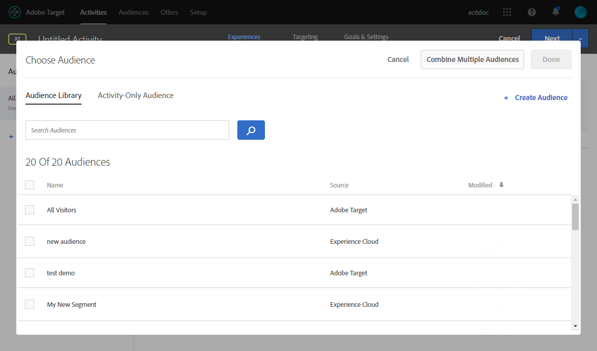

# Dynamischen Inhalt aus Target einfügen {#inserting-a-dynamic-image}

Auf dieser Seite erfahren Sie, wie Sie ein dynamisches Angebot von Adobe Target in eine E-Mail in Adobe Campaign integrieren.

Ziel ist die Erstellung eines Versands mit einem Bildblock, der sich je nach Land des Empfängers dynamisch ändert: die Daten werden mit jeder Mbox-Anfrage gesendet und hängen von der IP-Adresse des Empfängers ab.

In dieser Nachricht können Bilder je nach den folgenden Benutzererlebnissen dynamisch variieren:

* Die E-Mail wird in Frankreich geöffnet.
* Die E-Mail wird in den USA geöffnet.
* Wenn keine dieser Bedingungen zutrifft, wird ein Standardbild angezeigt.

Gehen Sie dazu wie folgt vor:

1. [Dynamisches Angebot in eine E-Mail einfügen](../../integrations/using/inserting-a-dynamic-image.md#inserting-dynamic-offer)
1. [Umleitungsangebote erstellen](../../integrations/using/inserting-a-dynamic-image.md#create-redirect-offers)
1. [Audiences erstellen](../../integrations/using/inserting-a-dynamic-image.md#audiences-target)
1. [Experience Targeting-Aktivität erstellen](../../integrations/using/inserting-a-dynamic-image.md#creating-targeting-activity)
1. [Vorschau erstellen und E-Mail senden](../../integrations/using/inserting-a-dynamic-image.md#preview-send-email)

## Dynamisches Angebot in eine E-Mail einfügen {#inserting-dynamic-offer}

Sobald Sie mit der Definition der Zielgruppe und des Inhalts Ihrer E-Mail in Adobe Campaign fertig sind, können Sie ein dynamisches Bild aus Target einfügen.

Geben Sie dazu die URL des Standardbildes an, den Speicherort und die Felder, die an Target übermittelt werden sollen.

In Adobe Campaign gibt es zwei Möglichkeiten, ein dynamisches Bild von Target in eine E-Mail einzufügen:

* Wenn Sie den Digital Content Editor verwenden, wählen Sie ein vorhandenes Bild und dann aus der Symbolleiste **[!UICONTROL Einfügen]** > **[!UICONTROL Dynamisches Bild von Adobe Target]**.

   

* Wenn Sie den Standardeditor verwenden, platzieren Sie den Cursor an die Stelle, an der das Bild eingefügt werden soll, und wählen Sie aus dem Dropdown-Menü &quot;Personalisierung&quot; **[!UICONTROL Einfügen]** > **[!UICONTROL Dynamisches Bild von Adobe Target...]**.

   

### Bildparameter definieren {#defining-image-parameters}

* URL des **[!UICONTROL Standardbilds]**: Dieses Bild wird angezeigt, wenn keine der Bedingungen erfüllt ist. Sie können auch ein Bild aus Ihrer Assets-Bibliothek verwenden.
* **[!UICONTROL Speicherort in Target]**: Geben Sie einen Namen für den Speicherort Ihres dynamischen Angebots ein. Sie müssen diesen Speicherort später in Ihrer Target-Aktivität auswählen.
* **[!UICONTROL Landingpage]**: Wenn das Standardbild zu einer standardmäßigen Landingpage weiterleiten soll. Diese URL gilt nur dann, wenn das Standardbild in der letzten E-Mail angezeigt wird und optional ist.
* Stellen Sie im Bereich **[!UICONTROL Zusätzliche Entscheidungsparameter]** das Mapping zwischen den in den Adobe Target-Segmenten definierten Feldern und den Feldern in Adobe Campaign her. Die in Adobe Campaign verwendeten Felder müssen zuvor in der Rawbox angegeben werden. In unserem Beispiel haben wir das Feld &quot;Country&quot; (Land) hinzugefügt.

Wenn Sie in Ihren Einstellungen in Adobe Target Unternehmensberechtigungen verwenden, fügen Sie die entsprechende Eigenschaft in dieses Feld ein. Weitere Informationen zu Unternehmensberechtigungen in Target finden Sie auf [dieser Seite](https://experienceleague.adobe.com/docs/target/using/administer/manage-users/enterprise/properties-overview.html?lang=de).

## Umleitungsangebote erstellen {#create-redirect-offers}

In Target können Sie für ein Angebot unterschiedliche Versionen erstellen. Für jedes Benutzererlebnis können Sie ein spezifisches Umleitungsangebot definieren und ein anderes Bild wählen.

In unserem Fall benötigen wir zwei Umleitungsangebote. Das dritte (das Standardangebot) wird in Adobe Campaign definiert.

1. Um in Target Standard ein neues Umleitungsangebot zu erstellen, klicken Sie auf dem Tab **[!UICONTROL Inhalt]** auf **[!UICONTROL Code-Angebote]**.

1. Klicken Sie auf **[!UICONTROL Erstellen]** und dann auf **[!UICONTROL Umleitungsangebot]**.

   

1. Geben Sie einen Namen für das Angebot und die URL Ihres Bildes ein.

   

1. Führen Sie dieselben Schritte für das andere Umleitungsangebot durch. Weiterführende Informationen hierzu finden Sie auf dieser [Seite](https://experienceleague.adobe.com/docs/target/using/experiences/offers/offer-redirect.html?lang=de).

## Audiences erstellen {#audiences-target}

Erstellen Sie in Target die zwei Audiences, in die die Besucher Ihres Angebots unterteilt werden und denen die unterschiedlichen Inhalte präsentiert werden. Fügen Sie für jede Audience eine Regel hinzu, um festzulegen, wer das Angebot sehen kann.

1. Um in Target eine neue Audience zu erstellen, klicken Sie auf dem Tab **[!UICONTROL Zielgruppen]** auf **[!UICONTROL Zielgruppe erstellen]**.

   

1. Fügen Sie Ihrer Audience einen Namen hinzu.

   

1. Klicken Sie auf **[!UICONTROL Add a rule (Regel hinzufügen)]** und wählen Sie eine Kategorie aus. Die Regel benutzt spezifische Kriterien für die Besucher. Sie können die Regeln verfeinern, indem Sie Bedingungen hinzufügen oder neue Regeln in anderen Kategorien erstellen.

1. Führen Sie dieselben Schritte für die anderen Audiences durch.

## Experience Targeting-Aktivität erstellen {#creating-targeting-activity}

Wir müssen in Target eine Experience Targeting-Aktivität erstellen, die diversen Erlebnisse definieren und sie mit den entsprechenden Angeboten verknüpfen.

### Audience definieren {#defining-the-audience}

1. Um eine Experience Targeting-Aktivität zu erstellen, klicken Sie auf dem Tab **[!UICONTROL Aktivitäten]** auf **[!UICONTROL Aktivität erstellen]** und dann auf **[!UICONTROL Experience Targeting]**.

   

1. Wählen Sie **[!UICONTROL Formular]** als **[!UICONTROL Experience Composer]**.

1. Wählen Sie eine Audience aus, indem Sie auf die Schaltfläche **[!UICONTROL Zielgruppe ändern]** klicken.

   

1. Wählen Sie die Audience aus, die in den vorherigen Schritten erstellt wurde.

   

1. Erstellen Sie ein weiteres Erlebnis durch Klicken auf **[!UICONTROL Experience Targeting hinzufügen]**.

### Speicherort und Inhalt definieren {#defining-location-content}

Fügen Sie für jede Audience Inhalt hinzu:

1. Wählen Sie den Namen des Speicherorts, den Sie beim Einfügen des dynamischen Angebots in Adobe Campaign festgelegt haben.

   

1. Klicken Sie auf die Dropdown-Schaltfläche und wählen Sie **[!UICONTROL Umleitungsangebot ändern]** aus.

   

1. Wählen Sie das zuvor erstellte Umleitungsangebot aus.

   

1. Führen Sie dieselben Schritte für das zweite Erlebnis aus.

### Aktivität definieren {#defining-activity}

Im Fenster **[!UICONTROL Target]** finden Sie einen Überblick über Ihre Aktivitäten. Bei Bedarf können Sie weitere Erlebnisse hinzufügen.

Im Fenster **[!UICONTROL Ziele und Einstellungen]** können Sie Ihre Aktivität personalisieren, indem Sie eine Priorität, ein Ziel oder eine Dauer festlegen.

Im Abschnitt **[!UICONTROL Einstellungen für die Berichterstellung]** können Sie eine Aktion auswählen und die Parameter bearbeiten, anhand derer bestimmt wird, wann die Zielvorgabe erreicht ist.

## Vorschau erstellen und E-Mail senden {#preview-send-email}

Sie können nun in Adobe Campaign Ihre E-Mail in der Vorschau ansehen und ihre Darstellung bei verschiedenen Empfängern testen. Sie werden bemerken, dass sich das Bild entsprechend den unterschiedlichen Erlebnissen ändert. Weiterführende Informationen zur Erstellung von E-Mails finden Sie auf dieser [Seite](../../delivery/using/defining-the-email-content.md).

Jetzt können Sie Ihre E-Mail einschließlich eines dynamischen Angebots von Target versenden.

