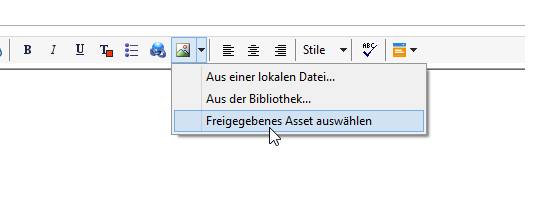
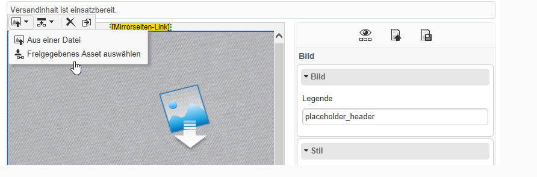
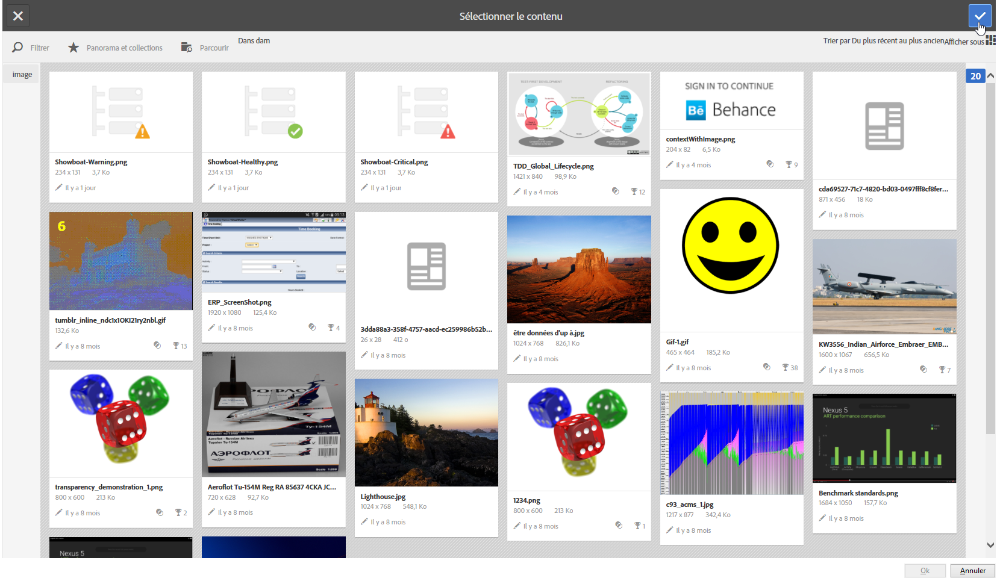

# Freigegebene Assets nutzen{#inserting-a-shared-asset}

Freigegebene Assets der Adobe Experience Cloud können in E-Mails und Landingpages wie nachfolgend beschrieben eingesetzt werden:

1. Erstellen Sie eine neue E-Mail oder eine neue Landingpage.

   Verwenden Sie beim Gebrauch von Assets aus der Adobe-Experience-Manager-Bibliothek eine bei der [Integrationskonfiguration](../../integrations/using/configuring-access-to-assets.md#integrating-with-aem-assets) erstellte Versandvorlage.

   Sollten Sie über keine spezielle Vorlage verfügen, vergewissern Sie sich, dass in den **Eigenschaften** des Versands im Feld **[!UICONTROL Inhaltserstellung]** (im **[!UICONTROL Erweitert]**-Tab) die Option **DCE** ausgewählt ist und dass das externe AEM-Konto, das Sie für den Zugriff auf Ihre AEM-Assets-Bibliothek verwenden möchten, angegeben ist.

1. Wählen Sie im Bearbeitungsfenster die Option zum Einfügen eines Bilds aus:

   * Wenn Sie sich im [Standard-Bearbeitungsmodus](../../delivery/using/defining-the-email-content.md#adding-images) befinden, wählen Sie aus der **[!UICONTROL Bild]**-Dropdown-Liste die Option **[!UICONTROL Freigegebenes Asset auswählen]** aus.

      

   * Wenn Sie sich im [erweiterten Bearbeitungsmodus](../../web/using/about-campaign-html-editor.md) (DCE) befinden, markieren Sie einen Inhaltsbaustein und wählen Sie im Kontextmenü die Option **[!UICONTROL Freigegebenes Asset auswählen]** aus.

      

      >[!NOTE]
      >
      >Das Einfügen von freigegebenen Bildern steht im DCE bei Verwendung des [Webzugriffs](../../platform/using/adobe-campaign-workspace.md#console-and-web-access) von Adobe Campaign nicht zur Verfügung.

1. Wählen Sie im sich öffnenden Fenster das gewünschte Bild aus und bestätigen Sie Ihre Auswahl.

   Die verfügbaren Bilder stammen je nach der Konfiguration Ihrer Adobe Campaign-Instanz entweder aus Ihrer Adobe Experience Cloud-Bibliothek oder aus Ihrer AEM Assets-Bibliothek. Weitere Informationen finden Sie im Abschnitt [Zugriff auf Assets konfigurieren](../../integrations/using/configuring-access-to-assets.md).

   

>[!NOTE]
>
>Wenn Sie die Integration mit Adobe Target nutzen, haben Sie die Möglichkeit, ein freigegebenes Bild als Standardbild zu verwenden. Weiterführende Informationen dazu finden Sie auf [dieser Seite](../../integrations/using/integrating-with-adobe-target.md).

