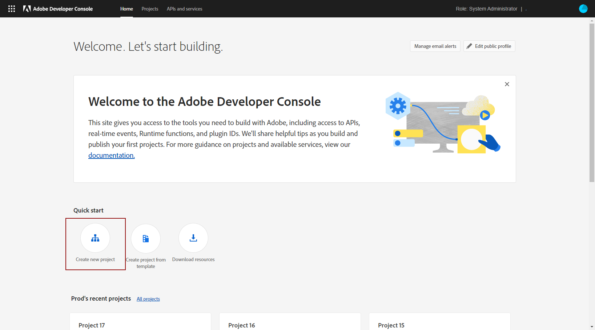
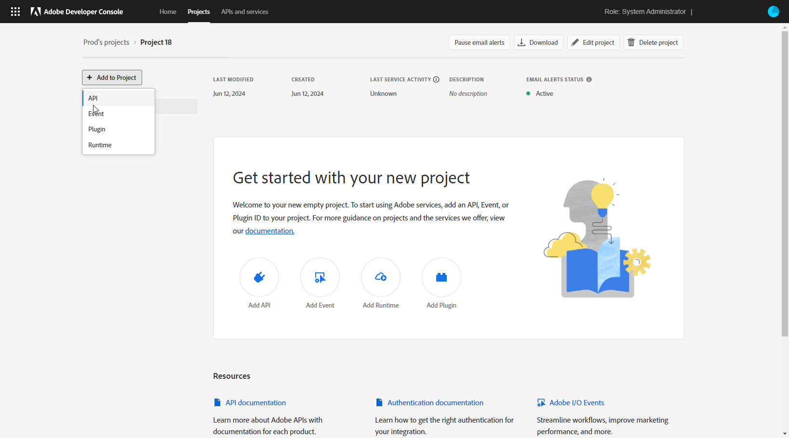
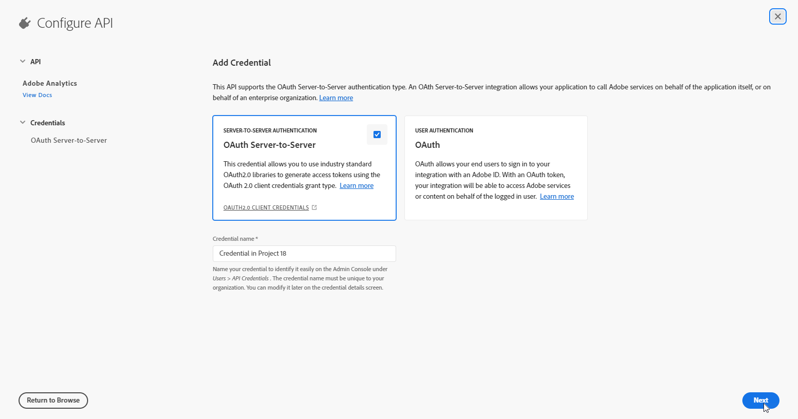
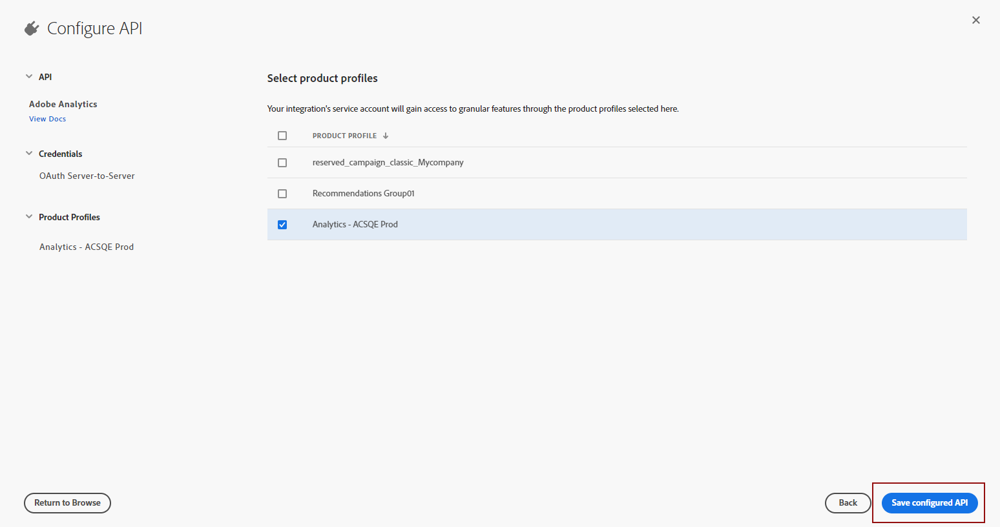

# Erstellen eines technischen Adobe-Kontos {#create-service-account}

Mit den Server-zu-Server-Authentifizierungsberechtigungen kann der Server Ihrer Anwendung Zugriffstoken generieren und API-Aufrufe im Namen Ihrer Anwendung selbst durchführen. [Weitere Informationen](https://developer.adobe.com/developer-console/docs/guides/authentication/ServerToServerAuthentication/)

## Migrieren vorhandener Integrationen {#migrate-jwt}

Die Berechtigung für Service-Konten (JWT) wird von Adobe nicht mehr unterstützt. Campaign-Integrationen mit Adobe-Lösungen und -Apps müssen jetzt mit OAuth-Server-zu-Server-Anmeldedaten arbeiten.

Wenn Sie vor Juni 2024 eingehende oder ausgehende Integrationen mit Campaign implementiert haben, müssen Sie Ihre Campaign-Umgebung auf Version 7.4.1 aktualisieren und Ihr technisches Konto zu OAuth migrieren, wie [in dieser Dokumentation](https://developer.adobe.com/developer-console/docs/guides/authentication/ServerToServerAuthentication/migration){target="_blank"} beschrieben. Bestehende Service-Konto(JWT)-Anmeldedaten funktionieren noch bis **30. Juni 2025**.

Nach Abschluss der Migration müssen Sie Ihre neuen Anmeldedaten Campaign zuweisen, wie in [diesem Abschnitt](#add-credentials) beschrieben.

## Erstellen eines neuen technischen OAuth-Kontos für neue Integrationen {#oauth-service}

Gehen Sie wie folgt vor, um Ihr technisches OAuth-Konto für neue Integrationen zu erstellen:

1. Greifen Sie auf die Adobe Developer Console zu und melden Sie sich als **Systemadmin** Ihrer Organisation an.

   Weiterführende Informationen zu Administratorrollen finden Sie auf dieser [Seite](https://helpx.adobe.com/de/enterprise/using/admin-roles.html).

1. Klicken Sie auf **[!UICONTROL Neues Projekt erstellen]**.

   

1. Klicken Sie auf **[!UICONTROL Zum Projekt hinzufügen]** und wählen Sie **[!UICONTROL API]** aus.

   

1. Wählen Sie das Produkt aus, das Sie in Campaign integrieren möchten, und klicken Sie auf **[!UICONTROL Weiter]**.

1. Wählen Sie als Authentifizierungstyp **[!UICONTROL OAuth-Server-zu-Server]** aus und klicken Sie auf **[!UICONTROL Weiter]**.

   

1. Wählen Sie den **[!UICONTROL Produktprofil]**-Link zu Ihrem Projekt.

   Bei Bedarf können Sie einen neuen erstellen. [Weitere Informationen](https://helpx.adobe.com/de/enterprise/using/manage-product-profiles.html)

1. Klicken Sie dann auf **[!UICONTROL Konfigurierte API speichern]**.

   

1. Wählen Sie in Ihrem Projekt unter „Berechtigungen“ die Option [!DNL OAuth Server-to-Server] und kopieren Sie die folgenden Informationen:

   * **[!UICONTROL Client-ID]**
   * **[!UICONTROL Client-Geheimnis]**
   * **[!UICONTROL Technical account ID]** (Kennung des technischen Kontos)
   * **[!UICONTROL Organization ID]** (Organisationskennung)

## Hinzufügen von OAuth-Projektanmeldedaten in Campaign {#add-credentials}

Fügen Sie nach Durchführung der oben genannten Schritte Ihre OAuth-Projektanmeldedaten in Adobe Campaign hinzu.

>[!NOTE]
>
>Für Kundinnen und Kunden von Hosted oder Managed Cloud Services ist dies nicht erforderlich: Adobe hat Ihre OAuth-Projektanmeldedaten bereits zu Ihrer Umgebung hinzugefügt.
>

On-Premise-/Hybrid-Kundinnen und -Kunden müssen die folgenden Schritte ausführen:

1. Melden Sie sich über SSH bei jedem Container an, in dem die Adobe Campaign-Instanz installiert ist.

1. Fügen Sie Ihre OAuth-Projektanmeldedaten in Adobe Campaign hinzu, indem Sie den folgenden Befehl als `neolane`-Benutzerin oder -Benutzer ausführen. Dadurch werden die Anmeldeinformationen für das **[!UICONTROL Technische Konto]** in die Konfigurationsdatei der Instanz eingefügt.

   ```
   nlserver config -instance:<instance_name> -setimsoauth:ims-org-id/client-id/technical-account-id/client-secret
   ```

   >[!NOTE]
   >
   > Verwenden Sie für Versionen, die älter als 7.4.1 sind, `setimsauth` oder `setimsjwtauth` anstelle von `setimsoauth`.


