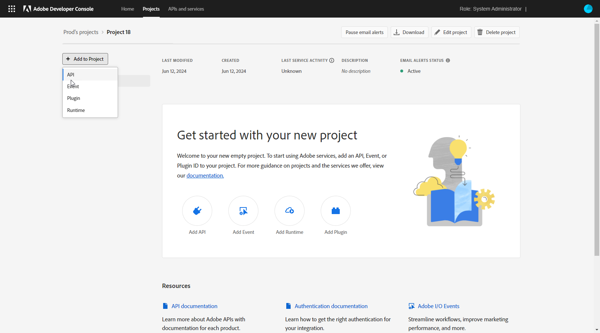

# Technisches Adobe-Konto erstellen {#create-service-account}

Mit den Server-zu-Server-Authentifizierungsberechtigungen kann der Server Ihrer Anwendung Zugriffstoken generieren und API-Aufrufe im Namen Ihrer Anwendung selbst durchführen. [Weitere Informationen](https://developer.adobe.com/developer-console/docs/guides/authentication/ServerToServerAuthentication/)

## Vorhandene Integrationen migrieren {#migrate-jwt}

Die Berechtigung für Dienstkonten (JWT) wird von Adobe nicht mehr unterstützt. Campaign-Integrationen mit Adobe-Lösungen und -Apps müssen jetzt auf OAuth Server-zu-Server-Anmeldedaten basieren.

Wenn Sie vor Juni 2024 eingehende oder ausgehende Integrationen mit Campaign implementiert haben, müssen Sie Ihre Campaign-Umgebung auf Version 7.4.1 aktualisieren und Ihr technisches Konto so detailliert zu oAuth migrieren [in dieser Dokumentation](https://developer.adobe.com/developer-console/docs/guides/authentication/ServerToServerAuthentication/migration){target="_blank"}. Vorhandene Service-Konto-Anmeldedaten (JWT) funktionieren weiterhin, bis **27. Januar 2025**.

Nach Abschluss der Migration müssen Sie Ihre neuen Anmeldedaten Campaign zuweisen, wie hier beschrieben: [diesem Abschnitt](#add-credentials).

## Neues OAuth-technisches Konto für neue Integrationen erstellen {#oauth-service}

Gehen Sie wie folgt vor, um Ihr technisches OAuth-Konto für neue Integrationen zu erstellen:

1. Zugriff auf die Adobe Developer-Konsole und Anmeldung als **Systemadministrator** Ihrer Organisation.

   Weiterführende Informationen zu Administratorrollen finden Sie auf dieser [Seite](https://helpx.adobe.com/de/enterprise/using/admin-roles.html).

1. Klicken Sie auf **[!UICONTROL Neues Projekt erstellen]**.

   

1. Klicken Sie auf **[!UICONTROL Zum Projekt hinzufügen]** und wählen Sie **[!UICONTROL API]** aus.

   

1. Wählen Sie das Produkt aus, das Sie in Campaign integrieren möchten, und klicken Sie auf **[!UICONTROL Nächste]**.

1. Auswählen **[!UICONTROL OAuth Server-zu-Server]** als Authentifizierungstyp und klicken Sie auf **[!UICONTROL Nächste]**.

   

1. Wählen Sie die **[!UICONTROL Produktprofil]** zu Ihrem Projekt.

   Bei Bedarf können Sie eine neue erstellen. [Weitere Informationen](https://helpx.adobe.com/enterprise/using/manage-product-profiles.html)

1. Klicken Sie dann auf **[!UICONTROL Konfigurierte API speichern]**.

   

1. Wählen Sie in Ihrem Projekt unter &quot;Berechtigungen&quot;die Option [!DNL OAuth Server-to-Server] und kopieren Sie die folgenden Informationen:

   * **[!UICONTROL Client ID]** (Client-ID)
   * **[!UICONTROL Client-Geheimschlüssel]**
   * **[!UICONTROL Technical account ID]** (Kennung des technischen Kontos)
   * **[!UICONTROL Organization ID]** (Organisationskennung)

## Hinzufügen von OAuth-Projektanmeldedaten in Adobe Campaign {#add-credentials}

Gehen Sie wie folgt vor, um Ihre OAuth-Projektanmeldedaten in Adobe Campaign hinzuzufügen:

1. Melden Sie sich über SSH bei jedem Container an, in dem die Adobe Campaign-Instanz installiert ist.

1. Fügen Sie Ihre OAuth-Projektanmeldedaten in Adobe Campaign hinzu, indem Sie den folgenden Befehl ausführen als `neolane` Benutzer. Dadurch werden die Anmeldeinformationen für das **[!UICONTROL Technische Konto]** in die Konfigurationsdatei der Instanz eingefügt.

   ```
   nlserver config -instance:<instance_name> -setimsoauth:ims-org-id/client-id/technical-account-id/client-secret
   ```
