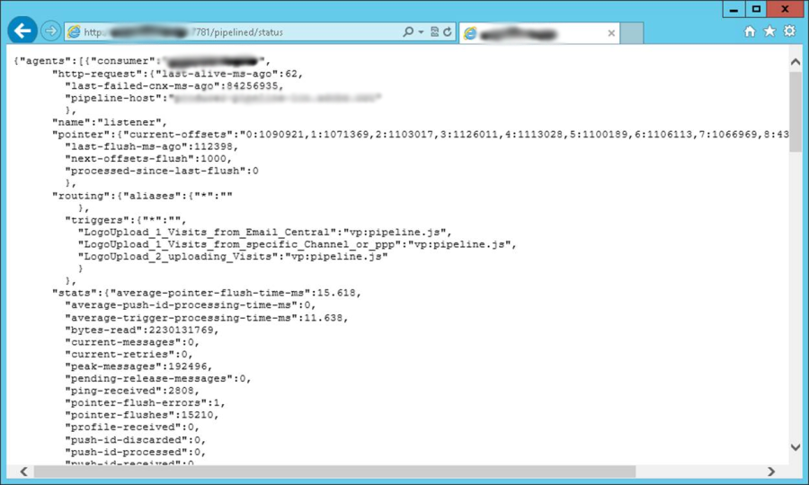
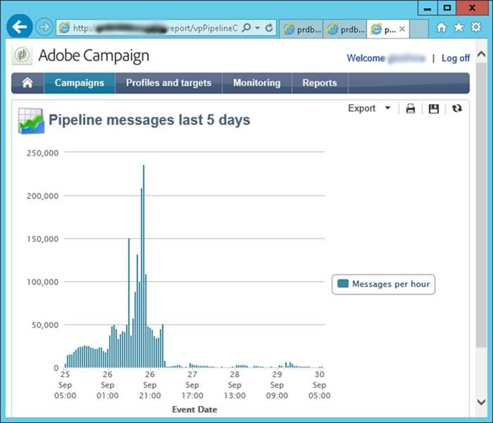

# Pipeline-Überwachung {#pipeline-monitoring}

Der [!DNL pipelined]-Status-Web-Dienst liefert Informationen zum Status des [!DNL pipelined]-Prozesses.

Er kann manuell über einen Browser oder automatisch mit einer Überwachungsanwendung aufgerufen werden.

Er weist das REST-Format auf, das unten beschrieben wird.

## Indicators {#indicators}

In diesem Abschnitt werden die Indikatoren im Status-Web-Dienst aufgelistet.

Zur Überwachung empfohlene Indikatoren sind hervorgehoben.

* Verbraucher: Name des Clients, der die Auslöser aktiviert. In der Pipeline-Option konfiguriert.
* http-request
   * last-live-ms-ago: Zeit in ms seit der letzten Verbindungsprüfung.
   * last-failed-cnx-ms-ago: Zeit in ms seit dem letzten Fehlschlagen der Verbindungsprüfung.
   * pipeline-host: Name des Hosts, von dem die Pipeline-Daten abgerufen werden.
* pointer
   * current offsets: Wert des Zeigers in die Pipeline, nach untergeordnetem Thread.
   * last-flush-ms-ago: Zeit in ms seit dem Abruf eines Batches von Auslösern.
   * next-offset-flush: Wartezeit bis zum nächsten Batch, wenn fertig.
   * processing-since-last-flush: Anzahl der im letzten Batch verarbeiteten Auslöser.
* routing
   * triggers: Liste der abgerufenen Auslöser. In der [!DNL pipelined]-Option konfiguriert.
* stats
   * average-cursor-flush-time-ms: durchschnittliche Verarbeitungszeit für einen Batch von Auslösern.
   * average-trigger-processing-time-ms: durchschnittliche Zeit, die für die Analyse der Auslöserdaten benötigt wurde.
   * bytes-read: Anzahl der Bytes, die seit dem Start des Prozesses aus der Warteschlange gelesen wurden.
   * current-messages: aktuelle Anzahl ausstehender Nachrichten, die aus der Warteschlange abgerufen worden sind und auf Verarbeitung warten. **Dieser Indikator sollte nahe null liegen**.
   * current-retries: aktuelle Anzahl der Nachrichten, bei denen die Verarbeitung fehlgeschlagen ist und die auf eine erneute Ausführung warten.
   * peak-messages: maximale Anzahl ausstehender Nachrichten, die der Prozess seit dem Start bearbeitet hat.
   * pointer-flushes: Anzahl der Batches von Nachrichten, die seit dem Start verarbeitet wurden.
   * routing-JS-custom: Anzahl der Nachrichten, die vom benutzerdefinierten JS verarbeitet wurden.
   * trigger-discarded: Anzahl der Nachrichten, die aufgrund von Verarbeitungsfehlern nach zu vielen weiteren Zustellversuchen verworfen wurden.
   * trigger-processed: Anzahl der Nachrichten, die ohne Fehler verarbeitet wurden.
   * trigger-received: Anzahl der Nachrichten, die von der Warteschlange empfangen wurden.

Diese Statistiken werden pro Verarbeitungs-Thread angezeigt.

* average-trigger-processing-time-ms: durchschnittliche Zeit, die für die Analyse der Auslöserdaten benötigt wurde.
* is-JS-processor: Wert &quot;1&quot;, wenn der Thread den benutzerdefinierten JS verwendet.
* trigger-discarded: Anzahl der Nachrichten, die aufgrund von Verarbeitungsfehlern nach zu vielen weiteren Zustellversuchen verworfen wurden. **Dieser Indikator sollte null sein**.
* trigger-failures: Anzahl der Verarbeitungsfehler im JS. **Dieser Indikator sollte null sein**.
* trigger-received: Anzahl der Nachrichten, die von der Warteschlange empfangen wurden.

* Einstellungen: Diese werden in den Konfigurationsdateien vorgenommen.
   * flush-cursor-msg-count: Anzahl der Nachrichten in einem Batch.
   * flush-pointer-period-ms: Zeit zwischen zwei Batches (in Millisekunden).
   * processing-threads-JS: Anzahl der Verarbeitungs-Threads, die den benutzerdefinierten JS ausführen.
   * retry-period-ms: Zeit zwischen zwei weiteren Versuchen, wenn ein Verarbeitungsfehler auftritt.
   * retry-validity-duration-ms: Zeit von dem Punkt, an dem die Verarbeitung erneut versucht wird, bis zum Verwerfen der Nachricht.
   * Pipeline-Nachrichtenbericht

## Pipeline-Nachrichtenbericht {#pipeline-report}

Dieser Bericht zeigt die Anzahl der Nachrichten pro Stunde in den letzten fünf Tagen an.

