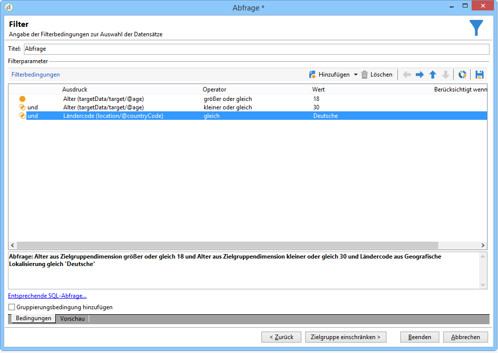
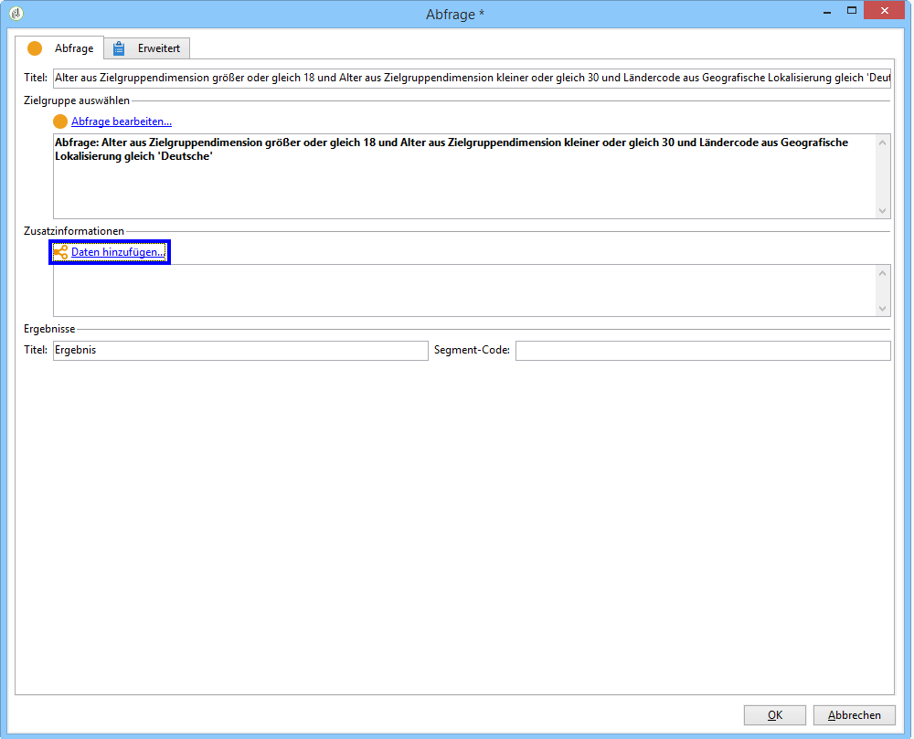
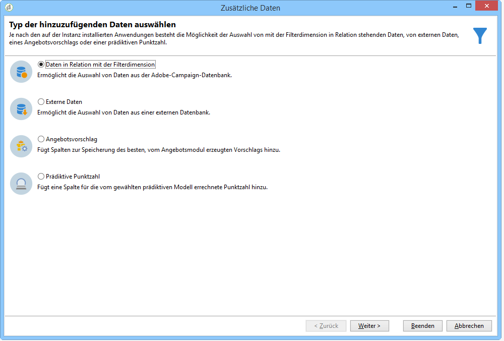
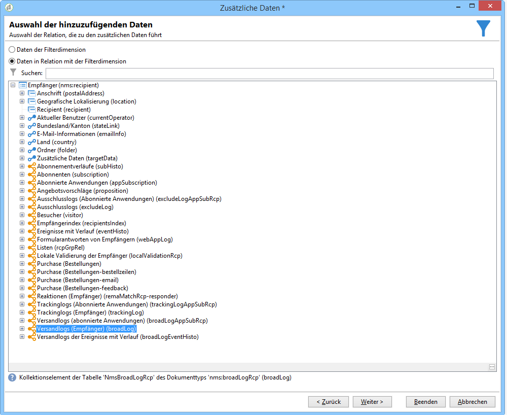
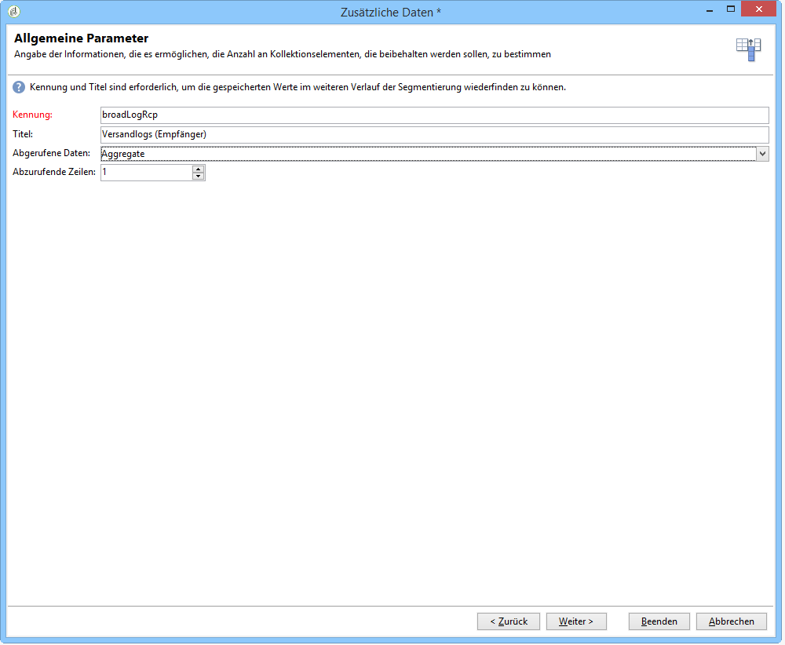
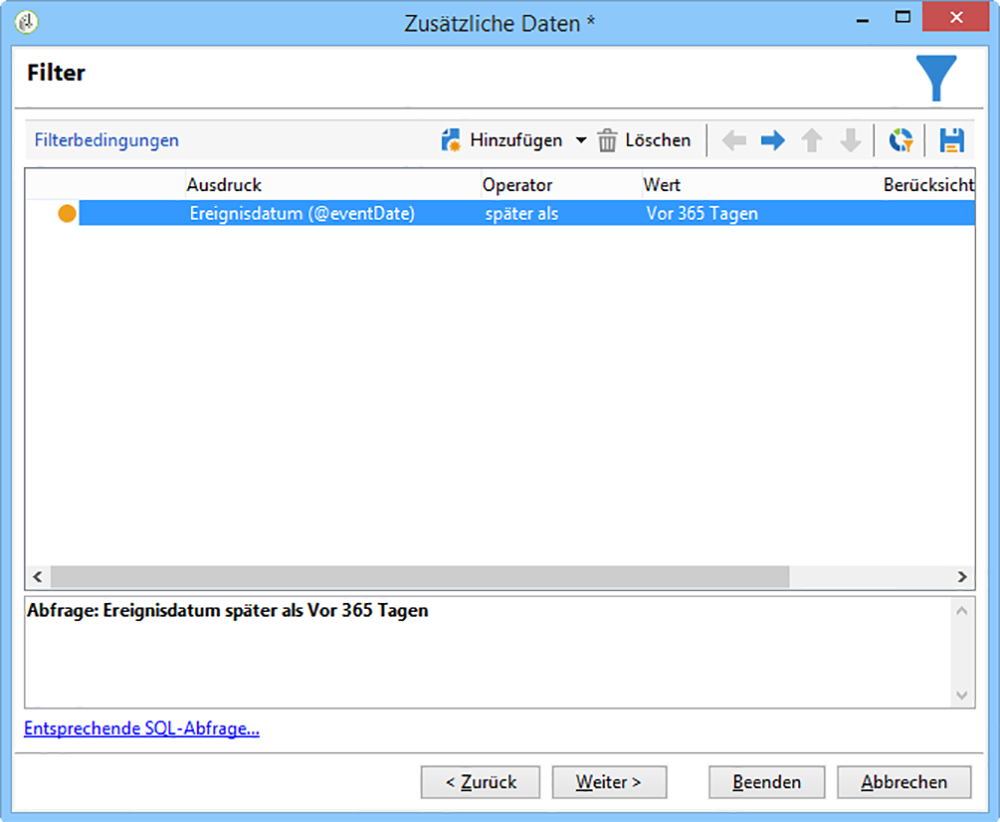
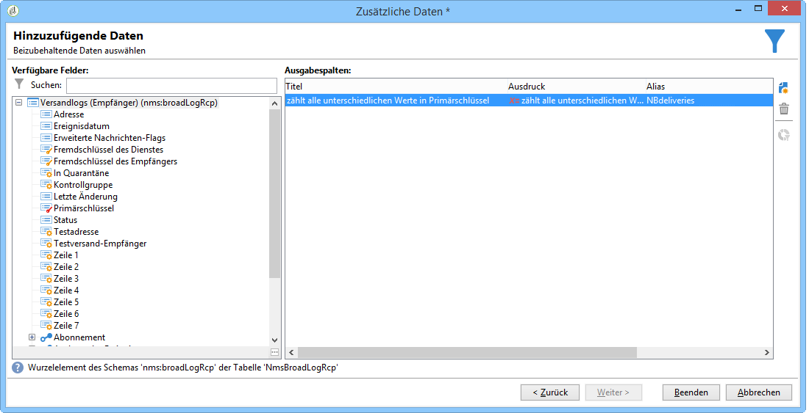
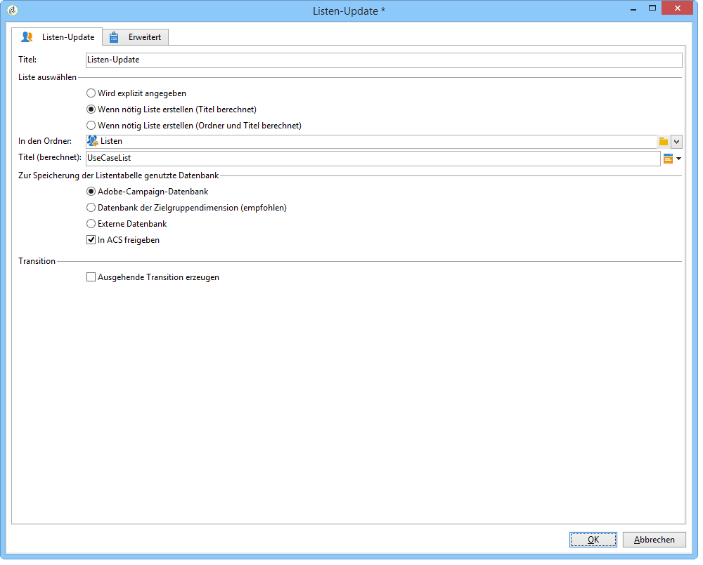
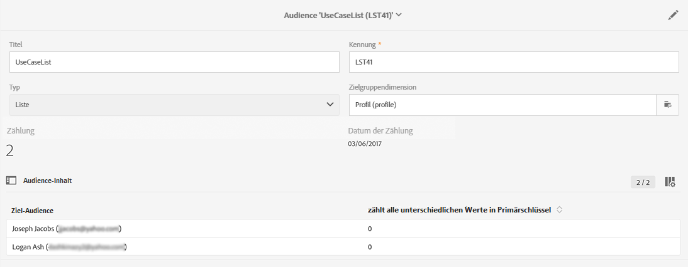
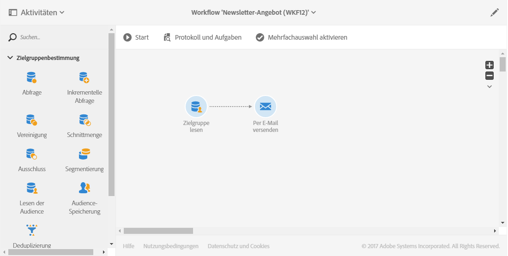

# Zielgruppen synchronisieren{#synchronizing-audiences}

Sie können mit den erweiterten Funktionen von Campaign v7 eine umfangreiche Liste erstellen und als Zielgruppe direkt und in Echtzeit in Campaign Standard freigeben (einschließlich zusätzlicher Daten). Ihr Campaign-Standard-Benutzer kann dann die Zielgruppe in Adobe Campaign Standard verwenden.

Eine komplexe Zielgruppenbestimmung einschließlich zusätzlicher Daten, die nicht in Campaign Standard repliziert werden, kann nur mithilfe von Campaign v7 durchgeführt werden.

Sie können auch über einen Connector wie beispielsweise Microsoft Dynamics bereitgestellte Empfänger- oder Datenlisten einfach in Campaign Standard freigeben.

Dieser Anwendungsfall zeigt, wie Sie in Campaign v7 einen Zieldatensatz für den Versand vorbereiten und gemeinsam mit zusätzlichen Daten in einem in Adobe Campaign Standard erstellten und durchgeführten Versand verwenden können.

>[!NOTE]
>
>Zusätzlich können Sie Daten mit Aggregaten und Kollektionen in Adobe Campaign Standard anreichern, wenn alle erforderlichen Daten bereits repliziert wurden.

## Voraussetzungen {#prerequisites}

Dazu ist Folgendes erforderlich:

* Empfänger, die in der Campaign v7-Datenbank gespeichert und mit Campaign Standard synchronisiert werden. Siehe Abschnitt [Profile synchronisieren](../../integrations/using/synchronizing-profiles.md).
* Zusätzliche in Tabellen gespeicherte Daten, wie Abmeldungen oder Transaktionen, die mit nms:recipients in der Campaign v7-Datenbank verknüpft sind. Diese Daten können aus nativen Schemata oder benutzerdefinierten Tabellen in Campaign v7 stammen. Sie sind standardmäßig nicht in Campaign Standard verfügbar, da sie nicht synchronisiert werden.
* Die Berechtigung zur Durchführung von Workflows in sowohl Campaign v7 als auch Campaign Standard.
* Die Berechtigung zur Erstellung und Durchführung eines Versands in Campaign Standard.

## Zielgruppen-Workflow mit zusätzlichen Daten in Campaign v7 erstellen {#create-a-targeting-workflow-with-additional-data-in-campaign-v7}

Eine komplexe Zielgruppenbestimmung einschließlich zusätzlicher Daten, die nicht in Campaign Standard repliziert werden, kann nur mithilfe von Campaign v7 durchgeführt werden.

Nachdem die Zielgruppe und ihre zusätzlichen Daten definiert wurden, können sie als Liste gespeichert und in Campaign Standard freigegeben werden.

>[!NOTE]
>
>Dies ist ein Beispiel. Je nach Anforderungen können Sie eine Empfängerliste einfach abfragen und in ACS ohne jegliche Weiterverarbeitung freigeben. Sie können zur Erstellung Ihrer endgültigen Zielgruppe auch andere Datenverwaltungsaktivitäten nutzen.

Gehen Sie folgendermaßen vor, um die endgültige Zielgruppe und ihre zusätzlichen Daten zu erhalten:

1. Erstellen Sie einen neuen Workflow in **[!UICONTROL Profile und Zielgruppen]** > **[!UICONTROL Vorgänge]** > **[!UICONTROL Zielgruppen-Workflow]**.
1. Fügen Sie die Aktivität **[!UICONTROL Abfrage]** hinzu und wählen Sie die Empfänger aus, denen Sie die E-Mail senden möchten, wie z. B. alle Empfänger zwischen 18 und 30 Jahren, die in Frankreich leben.

   

1. Fügen Sie in der Abfrageoption zusätzliche Daten hinzu. Weiterführende Informationen hierzu finden Sie im Abschnitt [Daten hinzufügen](../../workflow/using/query.md#adding-data).

   In diesem Beispiel wird gezeigt, wie ein Aggregat hinzugefügt wird, das zählt, wie viele Sendungen ein Empfänger pro Jahr erhält.

   Wählen Sie in **[!UICONTROL Abfrage]** die Option **[!UICONTROL Daten hinzufügen...]**.

   

1. Wählen Sie zuerst **[!UICONTROL Daten in Relation mit der Filterdimension]** und danach **[!UICONTROL Weiter]** aus.

   

1. Wählen Sie **[!UICONTROL Daten in Relation mit der Filterdimension]** und danach den Knoten **[!UICONTROL Versandlogs des Empfängers]** und abschließend **[!UICONTROL Weiter]** aus.

   

1. Wählen Sie **[!UICONTROL Aggregate]** im Feld **[!UICONTROL Abgerufene Daten]** und danach **[!UICONTROL Weiter]** aus.

   

1. Fügen Sie eine Filterbedingung hinzu, sodass nur Logs berücksichtigt werden, die in den letzten 365 Tagen erstellt wurden, und klicken Sie auf **[!UICONTROL Weiter]**.

   

1. Definieren Sie die Ausgabespalten. In unserem Beispiel ist nur eine einzige Spalte nötig, in der die Anzahl der Sendungen gezählt wird. Gehen Sie dazu folgendermaßen vor:

   * Wählen Sie rechts im Fenster **[!UICONTROL Hinzufügen]**.
   * Wählen Sie im Fenster **[!UICONTROL Feldauswahl]** die Schaltfläche **[!UICONTROL Erweiterte Auswahl]** aus.
   * Wählen Sie **[!UICONTROL Aggregat]** und danach **[!UICONTROL Zählung]** aus. Markieren Sie die Option **[!UICONTROL Unterschiedlich]** und wählen Sie **[!UICONTROL Weiter]** aus.
   * Wählen Sie in der Felderliste das für die Funktion **Zählung** verwendete Feld aus. Wählen Sie ein Feld aus, das immer befüllt wird, wie z. B. das Feld **[!UICONTROL Primärschlüssel]**, und wählen Sie danach **[!UICONTROL Beenden]** aus.
   * Ändern Sie den Ausdruck in der Spalte **[!UICONTROL Alias]** in z. B. **NBdeliveries**, um die hinzugefügte Spalte im endgültigen Versand einfach abrufen zu können.
   * Wählen Sie **[!UICONTROL Beenden]** aus und speichern Sie die Konfiguration der Aktivität **[!UICONTROL Abfrage]**.

   

1. Speichern Sie den Workflow. Im nächsten Abschnitt sehen Sie, wie Sie die Population in ACS freigeben können.

## Zielgruppe in Campaign Standard freigeben {#share-the-target-with-campaign-standard}

Sobald die Zielpopulation definiert ist, können Sie sie in ACS mit der Aktivität **[!UICONTROL Listen-Update]** freigeben.

1. Fügen Sie im zuvor erstellten Workflow die Aktivität **[!UICONTROL Listen-Update]** hinzu und spezifizieren Sie die Liste, die Sie aktualisieren oder erstellen möchten.

   Spezifizieren Sie den Ordner, in dem die Liste in Campaign v7 gespeichert werden soll. Die Listen werden beeinflusst vom während der Implementierung definierten Ordner-Mapping, das sich auf ihre Sichtbarkeit nach der Übermittlung in Campaign Standard auswirken kann. Siehe Abschnitt [Konvertierung der Berechtigungen](../../integrations/using/acs-connector-principles-and-data-cycle.md#rights-conversion).

1. Vergewissern Sie sich, dass die Option **[!UICONTROL In ACS freigeben]** mit einem Häkchen versehen ist. Standardmäßig ist diese Option aktiviert.

   

1. Speichern und starten Sie den Workflow.

   Die Zielgruppe und ihre zusätzlichen Daten werden in einer Liste in Campaign v7 gespeichert und sofort als eine Audience vom Typ Liste in Campaign Standard freigegeben. Nur die replizierten Profile werden in ACS freigegeben.

Wenn bei der Aktivität **[!UICONTROL Listen-Update]** ein Fehler auftritt, ist möglicherweise die Synchronisation mit Campaign Standard fehlgeschlagen. Um zu sehen, wo der Fehler liegt, gehen Sie zu **[!UICONTROL Administration]** > **[!UICONTROL ACS Connector]** > **[!UICONTROL Prozesse]** > **[!UICONTROL Prüfung]**. Dieser Ordner enthält Synchronisations-Workflows, die von der Aktivität **[!UICONTROL Listen-Update]** ausgelöst wurden. Weitere Informationen finden Sie im Abschnitt [Fehlerbehebung bei ACS Connector](../../integrations/using/troubleshooting-the-acs-connector.md).

## Daten in Campaign Standard abrufen und in einem Versand verwenden {#retrieve-the-data-in-campaign-standard-and-use-it-in-a-delivery}

Sobald der Zielgruppen-Workflow in Campaign v7 ausgeführt wird, finden Sie die Audience vom Typ Liste im schreibgeschützten Format im **[!UICONTROL Audiences]**-Menü in Campaign Standard.

Durch die Erstellung eines Versand-Workflows in Campaign Standard können Sie dann diese Zielgruppe sowie die darin enthaltenen zusätzlichen Daten in einem Versand verwenden.

1. Erstellen Sie einen neuen Workflow im Menü **[!UICONTROL Marketingaktivitäten]**.
1. Fügen Sie die Aktivität **[!UICONTROL Zielgruppe lesen]** hinzu und wählen Sie die zuvor von Campaign v7 übertragene Zielgruppe aus.

   Mit dieser Aktivität können Daten aus der ausgewählten Audience abgerufen werden. Sie können bei Bedarf auch eine zusätzliche **[!UICONTROL Filterung der Quelle]** anwenden, indem Sie den entsprechenden Tab dieser Aktivität auswählen.

1. Fügen Sie die Aktivität **[!UICONTROL E-Mail-Versand]** hinzu und konfigurieren Sie sie wie eine übliche [E-Mail-Versand-Aktivität](https://docs.adobe.com/content/help/de-DE/campaign-standard/using/managing-processes-and-data/channel-activities/email-delivery.html).
1. Öffnen Sie den Versandinhalt.
1. Fügen Sie ein Personalisierungsfeld hinzu. Suchen Sie im Popup den Knoten **[!UICONTROL Zusätzliche Daten (targetData)]**. Dieser Knoten enthält die zusätzlichen Audience-Daten, die im anfänglichen Zielgruppen-Workflow erstellt wurden. Sie können sie wie jedes andere Personalisierungsfeld verwenden.

   In unserem Beispiel beinhalten die zusätzlichen, vom ursprünglichen Zielgruppen-Workflow stammenden Daten die Anzahl der Sendungen an jeden Empfänger in den letzten 365 Tagen. Das im Zielgruppen-Workflow spezifizierte NBdeliveries-Alias ist hier sichtbar.

   

1. Speichern Sie den Versand und den Workflow.

   Der Workflow kann jetzt ausgeführt werden. Der Versand wird analysiert und kann durchgeführt werden.

   

## Versand durchführen und überwachen {#send-and-monitor-your-delivery}

Sobald der Versand und sein Inhalt fertig sind, führen Sie den Versand laut Beschreibung in [diesem Abschnitt](https://docs.adobe.com/content/help/de-DE/campaign-standard/using/managing-processes-and-data/channel-activities/email-delivery.html) durch:

1. Führen Sie den Versand-Workflow aus. In diesem Schritt werden die E-Mails für den Versand vorbereitet.
1. Bestätigen Sie manuell im Versand-Dashboard, dass der Versand durchgeführt werden kann.
1. Überwachen Sie die Berichte und Logs des Versandes:

   * **In Campaign Standard**: die üblichen [Berichte](https://docs.adobe.com/content/help/de-DE/campaign-standard/using/reporting/about-reporting/about-dynamic-reports.html) und [Logs](https://docs.adobe.com/content/help/de-DE/campaign-standard/using/testing-and-sending/monitoring-messages/monitoring-a-delivery.html) in Verbindung mit dem Versand
   * **in Campaign v7 und Campaign Standard**: Versandkennungen, E-Mail-Broadlogs und E-Mail-Trackinglogs werden mit Campaign v7 synchronisiert. Dies ermöglicht einen umfassenden Überblick Ihrer Marketingkampagnen in Campaign v7.

      Quarantänen werden automatisch nach Campaign v7 zurücksynchronisiert. Dadurch können Unzustellbarkeitsinformationen bei der nächsten Zielgruppenbestimmung in Campaign v7 berücksichtigt werden.

      Mehr Informationen zur Quarantäneverwaltung in Campaign Standard finden Sie in [diesem Abschnitt](https://docs.adobe.com/content/help/de-DE/campaign-standard/using/testing-and-sending/monitoring-messages/understanding-quarantine-management.html).

