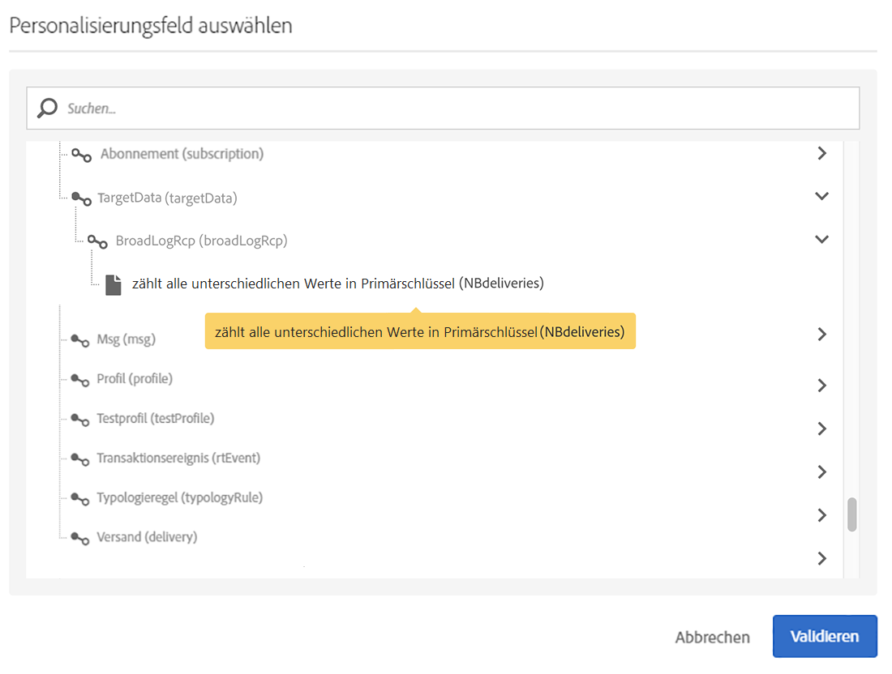

# Zielgruppen synchronisieren{#synchronizing-audiences}

Sie können mit den erweiterten Funktionen von Campaign v7 eine umfangreiche Liste erstellen und als Zielgruppe direkt und in Echtzeit in Campaign Standard freigeben (einschließlich zusätzlicher Daten). Ihr Campaign-Standard-Benutzer kann dann die Zielgruppe in Adobe Campaign Standard verwenden.

Eine komplexe Zielgruppenbestimmung einschließlich zusätzlicher Daten, die nicht in Campaign Standard repliziert werden, kann nur mithilfe von Campaign v7 durchgeführt werden.

Sie können auch über einen Connector wie beispielsweise Microsoft Dynamics bereitgestellte Empfänger- oder Datenlisten einfach in Campaign Standard freigeben.

Dieser Anwendungsfall zeigt, wie Sie in Campaign v7 einen Zieldatensatz für den Versand vorbereiten und gemeinsam mit zusätzlichen Daten in einem in Adobe Campaign Standard erstellten und durchgeführten Versand verwenden können.

>[!NOTE]
>
>Zusätzlich können Sie Daten mit Aggregaten und Kollektionen in Adobe Campaign Standard anreichern, wenn alle erforderlichen Daten bereits repliziert wurden.

## Voraussetzungen {#prerequisites}

Dazu ist Folgendes erforderlich:

* Empfänger, die in der Campaign v7-Datenbank gespeichert und mit Campaign Standard synchronisiert werden. Siehe Abschnitt [Synchronisierungsprofile](../../integrations/using/synchronizing-profiles.md) .
* Zusätzliche in Tabellen gespeicherte Daten, wie Abmeldungen oder Transaktionen, die mit nms:recipients in der Campaign v7-Datenbank verknüpft sind. Diese Daten können aus nativen Schemata oder benutzerdefinierten Tabellen in Campaign v7 stammen. Sie sind standardmäßig nicht in Campaign Standard verfügbar, da sie nicht synchronisiert werden.
* Die Berechtigung zur Durchführung von Workflows in sowohl Campaign v7 als auch Campaign Standard.
* Die Berechtigung zur Erstellung und Durchführung eines Versands in Campaign Standard.

## Zielgruppen-Workflow mit zusätzlichen Daten in Campaign v7 erstellen {#create-a-targeting-workflow-with-additional-data-in-campaign-v7}

Eine komplexe Zielgruppenbestimmung einschließlich zusätzlicher Daten, die nicht in Campaign Standard repliziert werden, kann nur mithilfe von Campaign v7 durchgeführt werden.

Nachdem die Zielgruppe und ihre zusätzlichen Daten definiert wurden, können sie als Liste gespeichert und in Campaign Standard freigegeben werden.

>[!NOTE]
>
>Dies ist ein Beispiel. Je nach Anforderungen können Sie eine Empfängerliste einfach abfragen und in ACS ohne jegliche Weiterverarbeitung freigeben. Sie können zur Erstellung Ihrer endgültigen Zielgruppe auch andere Datenverwaltungsaktivitäten nutzen.

Gehen Sie folgendermaßen vor, um die endgültige Zielgruppe und ihre zusätzlichen Daten zu erhalten:

1. Erstellen Sie einen neuen Workflow aus **[!UICONTROL Profiles and Targets]** > **[!UICONTROL Jobs]** > **[!UICONTROL Targeting workflows]**.
1. Fügen Sie eine **[!UICONTROL Query]** Aktivität hinzu und wählen Sie die Empfänger aus, an die Sie eine letzte E-Mail senden möchten. Beispielsweise alle Empfänger zwischen 18 und 30 Jahren, die in Frankreich leben.

   

1. Fügen Sie in der Abfrageoption zusätzliche Daten hinzu. Weiterführende Informationen hierzu finden Sie im Abschnitt [Daten hinzufügen](../../workflow/using/query.md#adding-data).

   In diesem Beispiel wird gezeigt, wie ein Aggregat hinzugefügt wird, das zählt, wie viele Sendungen ein Empfänger pro Jahr erhält.

   Wählen Sie **[!UICONTROL Query]** im Menü **[!UICONTROL Add data...]**.

   

1. Wählen Sie **[!UICONTROL Data linked to the filtering dimension]** und klicken Sie auf **[!UICONTROL Next]**.

   

1. Wählen Sie **[!UICONTROL Data linked to the filtering dimension]** die **[!UICONTROL Recipient delivery logs]** Node aus und klicken Sie auf **[!UICONTROL Next]**.

   

1. Wählen Sie **[!UICONTROL Aggregates]** im **[!UICONTROL Data collected]** Feld aus und klicken Sie auf **[!UICONTROL Next]**.

   

1. Add a filtering condition to only take into account logs that were created during the last 365 days and click **[!UICONTROL Next]**.

   

1. Definieren Sie die Ausgabespalten. In unserem Beispiel ist nur eine einzige Spalte nötig, in der die Anzahl der Sendungen gezählt wird. Gehen Sie dazu folgendermaßen vor:

   * Select **[!UICONTROL Add]** on the right of the window.
   * Klicken Sie im **[!UICONTROL Select field]** Fenster auf **[!UICONTROL Advanced selection]**.
   * Wählen Sie **[!UICONTROL Aggregate]** dann **[!UICONTROL Count]**. Markieren Sie die **[!UICONTROL Distinct]** Option und klicken Sie auf **[!UICONTROL Next]**.
   * Wählen Sie in der Liste der Felder das für die Funktion **Count** verwendete Feld aus. Wählen Sie ein Feld aus, das immer ausgefüllt wird, z. B. das **[!UICONTROL Primary key]** Feld, und klicken Sie auf **[!UICONTROL Finish]**.
   * Ändern Sie den Ausdruck in der **[!UICONTROL Alias]** Spalte. Mit diesem Alias können Sie die hinzugefügte Spalte bei der endgültigen Auslieferung problemlos abrufen. Zum Beispiel **NBelieferungen**.
   * Klicken Sie auf **[!UICONTROL Finish]** und speichern Sie die **[!UICONTROL Query]** Aktivitätskonfiguration.
   

1. Speichern Sie den Workflow. Im nächsten Abschnitt sehen Sie, wie Sie die Population in ACS freigeben können.

## Zielgruppe in Campaign Standard freigeben {#share-the-target-with-campaign-standard}

Once the target population is defined, you can share it with ACS through a **[!UICONTROL List update]** activity.

1. In the workflow created previously, add a **[!UICONTROL List update]** activity and specify the list you want to update or create.

   Geben Sie den Ordner an, in dem Sie die Liste in Campaign v7 speichern möchten. Listen unterliegen der während der Implementierung definierten Ordnerzuordnung, was sich auf ihre Besuchbarkeit auswirken kann, sobald sie in Campaign Standard freigegeben wurden. Siehe Abschnitt [Rights Conversion](../../integrations/using/acs-connector-principles-and-data-cycle.md#rights-conversion) .

1. Stellen Sie sicher, dass die **[!UICONTROL Share with ACS]** Option aktiviert ist. Es ist standardmäßig aktiviert.

   

1. Speichern und starten Sie den Workflow.

   Die Zielgruppe und ihre zusätzlichen Daten werden in einer Liste in Campaign v7 gespeichert und sofort als eine Audience vom Typ Liste in Campaign Standard freigegeben. Nur die replizierten Profile werden in ACS freigegeben.

Tritt bei der **[!UICONTROL List update]** Aktivität ein Fehler auf, bedeutet dies, dass die Synchronisierung mit Campaign Standard möglicherweise fehlgeschlagen ist. Um weitere Details zu den Fehlern anzuzeigen, gehen Sie zu **[!UICONTROL Administration]** > **[!UICONTROL ACS Connector]** > **[!UICONTROL Process]** > **[!UICONTROL Diagnosis]**. Dieser Ordner enthält Synchronisierungs-Workflows, die durch die Ausführung der **[!UICONTROL List update]** Aktivität ausgelöst werden. Weitere Informationen finden Sie im Abschnitt [Fehlerbehebung beim ACS Connector](../../integrations/using/troubleshooting-the-acs-connector.md) .

## Daten in Campaign Standard abrufen und in einem Versand verwenden {#retrieve-the-data-in-campaign-standard-and-use-it-in-a-delivery}

Sobald der Zielgruppen-Workflow in Campaign v7 ausgeführt wird, finden Sie die Audience vom Typ Liste im schreibgeschützten Format im **[!UICONTROL Audiences]**-Menü in Campaign Standard.

Durch die Erstellung eines Versand-Workflows in Campaign Standard können Sie dann diese Zielgruppe sowie die darin enthaltenen zusätzlichen Daten in einem Versand verwenden.

1. Create a new workflow from the **[!UICONTROL Marketing activities]** menu.
1. Add a **[!UICONTROL Read audience]** activity and select the audience you previously shared from Campaign v7.

   Diese Aktivität wird zum Abrufen der Daten der ausgewählten Zielgruppe verwendet. Sie können bei **[!UICONTROL Source Filtering]** Bedarf auch zusätzliche Aktionen über die Registerkarte &quot;Je&quot;dieser Aktivität durchführen.

1. Add an **[!UICONTROL Email delivery]** activity and configure it as any other [email delivery activity](https://docs.adobe.com/content/help/en/campaign-standard/using/managing-processes-and-data/channel-activities/email-delivery.html).
1. Öffnen Sie den Versandinhalt.
1. Personalisierungsfeld hinzufügen; Suchen Sie im Popup den **[!UICONTROL Additional data (targetData)]** Knoten. Dieser Knoten enthält die zusätzlichen Daten der Zielgruppe, die im anfänglichen Targeting-Arbeitsablauf berechnet wurden. Sie können sie als beliebige andere Personalisierungsfelder verwenden.

   In unserem Beispiel beinhalten die zusätzlichen, vom ursprünglichen Zielgruppen-Workflow stammenden Daten die Anzahl der Sendungen an jeden Empfänger in den letzten 365 Tagen. Das im Zielgruppen-Workflow spezifizierte NBdeliveries-Alias ist hier sichtbar.

   

1. Speichern Sie den Versand und den Workflow.

   Der Workflow kann jetzt ausgeführt werden. Der Versand wird analysiert und kann durchgeführt werden.

   

## Versand durchführen und überwachen {#send-and-monitor-your-delivery}

Sobald der Versand und sein Inhalt fertig sind, führen Sie den Versand laut Beschreibung in [diesem Abschnitt](https://docs.adobe.com/content/help/en/campaign-standard/using/managing-processes-and-data/channel-activities/email-delivery.html) durch:

1. Führen Sie den Versand-Workflow aus. In diesem Schritt werden die E-Mails für den Versand vorbereitet.
1. Bestätigen Sie manuell im Versand-Dashboard, dass der Versand durchgeführt werden kann.
1. Überwachen Sie die Berichte und Logs des Versandes:

   * **In Campaign Standard**: die üblichen [Berichte](https://docs.adobe.com/content/help/en/campaign-standard/using/reporting/about-reporting/about-dynamic-reports.html) und [Logs](https://docs.adobe.com/content/help/en/campaign-standard/using/testing-and-sending/monitoring-messages/monitoring-a-delivery.html) in Verbindung mit dem Versand
   * **in Campaign v7 und Campaign Standard**: Versandkennungen, E-Mail-Broadlogs und E-Mail-Trackinglogs werden mit Campaign v7 synchronisiert. Dies ermöglicht einen umfassenden Überblick Ihrer Marketingkampagnen in Campaign v7.

      Quarantänen werden automatisch nach Campaign v7 zurücksynchronisiert. Dadurch können Unzustellbarkeitsinformationen bei der nächsten Zielgruppenbestimmung in Campaign v7 berücksichtigt werden.

      Mehr Informationen zur Quarantäneverwaltung in Campaign Standard finden Sie in [diesem Abschnitt](https://docs.adobe.com/content/help/en/campaign-standard/using/testing-and-sending/monitoring-messages/understanding-quarantine-management.html).

