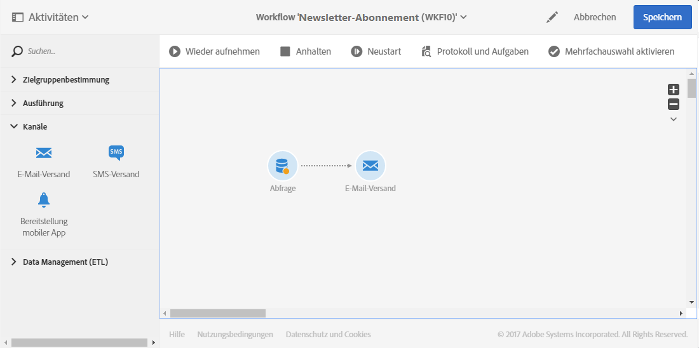

# Profile synchronisieren{#synchronizing-profiles}

ACS Connector repliziert Daten von Campaign v7 nach Campaign Standard. Die von Campaign v7 übertragenen Daten können in Campaign Standard zur Versanderstellung verwendet werden. Führen Sie die folgenden Schritte aus, um Profile zu synchronisieren.

* **Neue Empfänger hinzufügen**: Erstellen Sie in Campaign v7 einen neuen Empfänger und vergewissern Sie sich, dass ein entsprechendes Profil nach Campaign Standard repliziert wurde. See [Creating a new recipient](#creating-a-new-recipient).
* **Empfänger aktualisieren**: Bearbeiten Sie einen neuen Empfänger in Campaign v7 und vergewissern Sie sich in Campaign Standard, dass die Änderung repliziert wurde. Siehe [Bearbeiten eines Empfängers](#editing-a-recipient).
* **Workflow in Campaign Standard erstellen**: Erstellen Sie einen Workflow in Campaign Standard, der eine Abfrage mit einer Zielgruppe oder mit Profilen enthält, die aus Campaign v7 repliziert wurden. Lesen Sie diesbezüglich auch den Abschnitt [Workflows erstellen](#creating-a-workflow).
* **Versand in Campaign Standard erstellen**: Führen Sie den Workflow aus und schließen Sie ihn mit einem Versand ab. See [Creating a delivery](#creating-a-delivery).
* **Überprüfen Sie den Link** zum Rückgängigmachen des Abonnements: Verwenden Sie eine Campaign v7-Webanwendung, um sicherzustellen, dass die Entscheidung des Empfängers, einen Dienst abzumelden, an die Campaign v7-Datenbank gesendet wird. Die Option, den Empfang des Dienstes zu beenden, wird in Campaign Standard repliziert. See [Changing the unsubscription link](#changing-the-unsubscription-link).

## Voraussetzungen {#prerequisites}

Im folgenden Abschnitt wird beschrieben, wie Sie mithilfe von ACS Connector Empfänger in Campaign v7 hinzufügen und bearbeiten und dann in einem Campaign Standard-Versand verwenden können. ACS Connector benötigt dazu Folgendes:

* Empfänger in Campaign v7, die nach Campaign Standard repliziert wurden
* Benutzerrechte zur Durchführung von Workflows in sowohl Campaign v7 als auch Campaign Standard
* Benutzerrechte zur Erstellung und Durchführung eines Versands in Campaign Standard

## Abmelde-Link ändern {#changing-the-unsubscription-link}

Wenn ein Empfänger in einer von Campaign Standard gesendeten E-Mail einen Abmelde-Link anklickt, wird das entsprechende Profil in Campaign Standard aktualisiert. Um sicherzustellen, dass ein repliziertes Profil die Benutzerentscheidung enthält, sich von einem Dienst abzumelden, muss diese Information an Campaign v7 und nicht an Campaign Standard gesendet werden. Deshalb ist der Abmeldedienst zur Ausführung dieser Änderung mit einer Webanwendung von Campaign v7 verbunden, und nicht mit Campaign Standard.

>[!NOTE]
>
>Ersuchen Sie bitte Ihren Berater, die Webanwendung für den Abmeldedienst zu konfigurieren, bevor Sie die folgenden Schritte ausführen.

## Neuen Empfänger erstellen {#creating-a-new-recipient}

1. Erstellen Sie in Campaign v7 einen neuen Empfänger für die Replikation in Campaign Standard. Geben Sie so viele Informationen wie möglich ein, einschließlich Nachname, Vorname, E-Mail-Adresse und Postanschrift des Empfängers. Wählen Sie jedoch keine Empfänger aus, **[!UICONTROL Salutation]** da sie im nächsten Abschnitt hinzugefügt werden, indem Sie einen Empfänger [bearbeiten](#editing-a-recipient). Weitere Informationen finden Sie unter [Hinzufügen von Empfängern](../../platform/using/adding-profiles.md).

   

1. Vergewissern Sie sich, dass der neue Empfänger in Campaign Standard hinzugefügt wurde. Achten Sie bei der Überprüfung des Profils darauf, dass die in Campaign v7 eingegebenen Daten auch in Campaign Standard verfügbar sind. Informationen darüber, wo Sie Profile in Campaign Standard ansehen können, finden Sie im Abschnitt [Navigationsprinzipien](https://docs.adobe.com/content/help/en/campaign-standard/using/getting-started/discovering-the-interface/interface-description.html).

   

   Standardmäßig erfolgt die regelmäßige Replikation für ACS Connector einmal alle 15 Minuten. Weitere Informationen finden Sie unter [Datenreplikation](../../integrations/using/acs-connector-principles-and-data-cycle.md#data-replication).

## Empfänger bearbeiten {#editing-a-recipient}

Im Folgenden wird anhand der Änderung eines einzelnen Datensatzes gezeigt, dass Campaign v7 bei der Datenreplikation als Hauptdatenbank für Campaign Standard fungiert. Werden replizierte Daten in Campaign v7 geändert oder gelöscht, werden diese Änderungen in Campaign Standard übernommen.

1. Wählen Sie unter [Erstellen eines neuen Empfängers](#creating-a-new-recipient) den neu erstellten Empfänger aus und bearbeiten Sie den Namen des Empfängers. Wählen Sie beispielsweise einen Empfänger **[!UICONTROL Salutation]** (z. B. Herrn oder Frau). Weitere Informationen finden Sie unter [Bearbeiten eines Profils](../../platform/using/editing-a-profile.md).

   

1. Vergewissern Sie sich, dass der Name des Empfängers in Campaign Standard aktualisiert wurde. Um zu erfahren, wo Sie die Profile in Campaign Standard finden, lesen Sie den Abschnitt [Navigationsprinzipien](https://docs.adobe.com/content/help/en/campaign-standard/using/getting-started/discovering-the-interface/interface-description.html).

   

   Standardmäßig erfolgt die regelmäßige Replikation für ACS Connector einmal alle 15 Minuten. Weitere Informationen finden Sie unter [Datenreplikation](../../integrations/using/acs-connector-principles-and-data-cycle.md#data-replication).

## Workflow erstellen   {#creating-a-workflow}

Marketer können die umfassenden von Campaign v7 replizierten Profile und Dienste in Campaign Standard nutzen. Die folgende Anleitung zeigt, wie eine Abfrage zu einem Campaign-Standard-Workflow hinzugefügt wird und mit der replizierten Datenbank genutzt wird.

Weiterführende Informationen und die vollständige Anleitung zu Campaign Standard-Workflows finden Sie im Abschnitt [Workflows](https://docs.adobe.com/content/help/en/campaign-standard/using/managing-processes-and-data/about-workflows-and-data-management/workflow-data-and-processes.html).

1. Go to Campaign Standard and click **[!UICONTROL Marketing Activities]**.
1. Click **[!UICONTROL Create]** on the upper right.
1. Klicks **[!UICONTROL Workflow]**.
1. Klicken **[!UICONTROL New workflow]** und **[!UICONTROL Next]**.
1. Enter a name for the workflow in the **[!UICONTROL Label]** field and additional information if needed. Klicks **[!UICONTROL Next]**.
1. From **[!UICONTROL Targeting]** on the left, drag a **[!UICONTROL Query]** target to the workspace.

   

1. Double click the **[!UICONTROL Query]** activity and choose a parameter that can be used with the replicated database. Sie können beispielsweise:

   * Ziehen Sie **[!UICONTROL Profiles]** in den Arbeitsbereich. Verwenden Sie das Feld-Pulldown-Menü, um Profile **[!UICONTROL Is external resource]** zu suchen, die aus Campaign v7 repliziert wurden.
   * Schränken Sie die Zielgruppe weiter ein, indem Sie weitere Abfrageparameter in den Arbeitsbereich ziehen.

## Versanderstellung {#creating-a-delivery}

>[!NOTE]
>
>The instructions for creating the delivery continue the workflow started with [Creating a workflow](#creating-a-workflow).

Digital-Marketingexperten können eine Campaign v7-Webanwendung nutzen, um sicherzustellen, dass die Entscheidung eines Empfängers, einen Dienst abzumelden, an die Campaign v7-Datenbank gesendet wird. Nachdem der Empfänger auf den Link zum Rückgängigmachen des Abonnements geklickt hat, wird die Option, den Empfang des Dienstes zu beenden, von Campaign v7 in Campaign Standard repliziert. Weitere Informationen finden Sie unter [Ändern des Links](#changing-the-unsubscription-link)zum Rückgängigmachen des Abonnements.

Folgen Sie den unten beschriebenen Schritten, um einem bestehenden Workflow einen E-Mail-Versand hinzuzufügen, wobei der Abmeldedienst in Campaign v7 erstellt wird. Weiterführende Informationen und eine vollständige Anleitung zu Campaign-Standard-Workflows finden Sie in diesem [Dokument](https://docs.adobe.com/content/help/en/campaign-standard/using/managing-processes-and-data/about-workflows-and-data-management/workflow-data-and-processes.html).

>[!NOTE]
>
>Ersuchen Sie bitte Ihren Berater, die Webanwendung für den Abmeldedienst zu konfigurieren, bevor Sie die folgenden Schritte ausführen.

1. Click **[!UICONTROL Channels]** on the left.
1. Drag **[!UICONTROL Email delivery]** to the existing workflow in the workspace.

   

1. Doppelklicken Sie auf die **[!UICONTROL Email delivery]** Aktivität und wählen Sie **[!UICONTROL Single send email]** oder **[!UICONTROL Recurring email]**. Wählen Sie Ihre Optionen aus und klicken Sie auf **[!UICONTROL Next]**.
1. Klicken Sie **[!UICONTROL Send via email]** und dann auf **[!UICONTROL Next]**.

   

1. Enter a name for the delivery in the **[!UICONTROL Label]** field and additional information if needed. Klicks **[!UICONTROL Next]**.

   

1. In the **[!UICONTROL Subject]** field, enter the subject that will appear in the recipient&#39;s email inbox.
1. Klicken Sie auf **[!UICONTROL Change content]** , um eine HTML-Vorlage hinzuzufügen.

   

1. Choose content that includes the link to unsubscribe to the service. Click **[!UICONTROL Confirm]**.

   

1. Der aktuelle Abmelde-Link muss durch einen neuen ersetzt werden, der auf die von Ihrem Consultant erstellte Webanwendung verweist. Gehen Sie zum Abmelde-Link am unteren Ende der E-Mail und wählen Sie ihn durch einen Einfachklick aus. Wählen Sie dann das Papierkorbsymbol aus, um den Link zu entfernen.

   

1. Klicken Sie in denselben Inhaltsbereich und geben Sie **Abmelde-Link** ein.

   

1. Heben Sie den Text mit dem Cursor hervor und wählen Sie dann das Kettensymbol aus.
1. Klicks **[!UICONTROL Link to a landing page]**.

   

1. Klicken Sie auf das Ordnersymbol, um die Landingpage auszuwählen.

   

1. Choose the web application created by the consultant and click **[!UICONTROL Confirm]**.

   

1. Klicks **[!UICONTROL Create]**.
1. Kehren Sie durch die Auswahl des Versandnamens zum Workflow zurück.

   

1. Klicken Sie auf **[!UICONTROL Start]** , um die Lieferung zu senden. Das Symbol für die E-Mail-Auslieferung zeigt an, dass die Auslieferung vorbereitet wird.

   

1. Doppelklicken Sie auf den **[!UICONTROL Email delivery]** Kanal und wählen Sie **[!UICONTROL Confirm]** den Versand der E-Mail. Klicken Sie auf **[!UICONTROL OK]** , um die Nachrichten zu senden.

   

## Abmeldedienst verifizieren {#verifying-the-unsubscription-service}

Befolgen Sie die Anweisungen unter [Erstellen eines Workflows](#creating-a-workflow) und [Erstellen einer Bereitstellung](#creating-a-delivery) , bevor Sie zu den unten stehenden Schritten wechseln.

1. Der Empfänger klickt auf den Abmelde-Link in der E-Mail.

   

1. Der Empfänger bestätigt die Abmeldung.

   

1. Die Empfängerdaten in Campaign v7 werden aktualisiert, um anzuzeigen, dass sich der Benutzer abgemeldet hat. Vergewissern Sie sich, dass das Feld für den Empfänger markiert **[!UICONTROL No longer contact (by any channel)]** ist. Informationen zum Anzeigen eines Empfängers in Campaign v7 finden Sie unter [Bearbeiten eines Profils](../../platform/using/editing-a-profile.md).

   

1. Go to Campaign Standard and open the profile details for the recipient. Confirm that a checkbox appears next to **[!UICONTROL No longer contact (by any channel)]**. To learn where to find profiles in Campaign Standard, see [Navigation Basics](https://docs.adobe.com/content/help/en/campaign-standard/using/getting-started/discovering-the-interface/interface-description.html).

   

