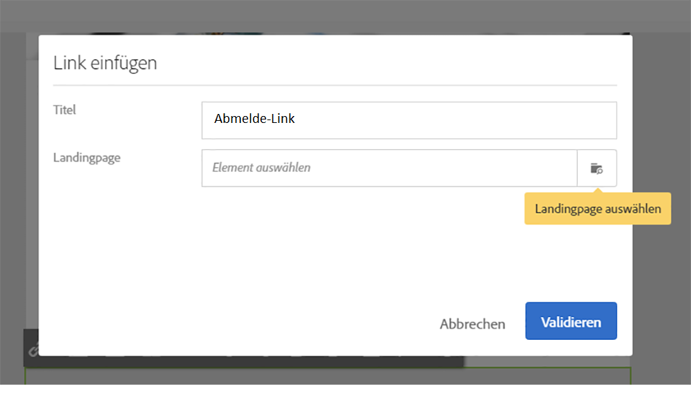

# Synchronisieren von Profilen{#synchronizing-profiles}

ACS Connector repliziert Daten von Campaign v7 nach Campaign Standard. Die von Campaign v7 übertragenen Daten können in Campaign Standard zur Versanderstellung verwendet werden. Führen Sie die folgenden Schritte aus, um Profile zu synchronisieren.

* **Neue Empfänger hinzufügen**: Erstellen Sie in Campaign v7 einen neuen Empfänger und vergewissern Sie sich, dass ein entsprechendes Profil nach Campaign Standard repliziert wurde. Siehe [Erstellen eines neuen Empfängers](#creating-a-new-recipient).
* **Empfänger aktualisieren**: Bearbeiten Sie einen neuen Empfänger in Campaign v7 und vergewissern Sie sich in Campaign Standard, dass die Änderung repliziert wurde. Siehe [Bearbeiten eines Empfängers](#editing-a-recipient).
* **Workflow in Campaign Standard erstellen**: Erstellen eines Workflows in Campaign Standard, der eine Abfrage mit einer Audience oder mit Profilen enthält, die aus Campaign v7 repliziert wurden. Siehe [Erstellen eines Workflows](#creating-a-workflow).
* **Versand in Campaign Standard erstellen**: Befolgen Sie den Workflow bis zum Ende, um eine Lieferung zu versenden. Siehe [Erstellen eines Versands](#creating-a-delivery).
* **Abmelde-Link verifizieren**: Verifizieren Sie mit einem Web-Programm von Campaign v7, dass die Entscheidung des Empfängers, sich von einem Service abzumelden, an die Datenbank von Campaign v7 gesendet wurde. Die Entscheidung, diesen Service nicht mehr in Anspruch zu nehmen, wird nach Campaign Standard repliziert. Siehe [Ändern des Abmelde-Links](#changing-the-unsubscription-link).

## Voraussetzungen {#prerequisites}

Im folgenden Abschnitt wird beschrieben, wie Sie mithilfe von ACS Connector Empfänger in Campaign v7 hinzufügen und bearbeiten und dann in einem Campaign Standard-Versand verwenden können. ACS Connector benötigt dazu Folgendes:

* Empfänger in Campaign v7, die nach Campaign Standard repliziert wurden
* Benutzerrechte zur Durchführung von Workflows in sowohl Campaign v7 als auch Campaign Standard
* Benutzerrechte zur Erstellung und Durchführung eines Versands in Campaign Standard

## Ändern des Abmelde-Links {#changing-the-unsubscription-link}

Wenn ein Empfänger in einer von Campaign Standard gesendeten E-Mail einen Abmelde-Link anklickt, wird das entsprechende Profil in Campaign Standard aktualisiert. Um sicherzustellen, dass ein repliziertes Profil die Benutzerentscheidung enthält, sich von einem Dienst abzumelden, muss diese Information an Campaign v7 und nicht an Campaign Standard gesendet werden. Deshalb ist der Abmeldedienst zur Ausführung dieser Änderung mit einer Webanwendung von Campaign v7 verbunden, und nicht mit Campaign Standard.

>[!NOTE]
>
>Ersuchen Sie bitte Ihren Berater, die Webanwendung für den Abmeldedienst zu konfigurieren, bevor Sie die folgenden Schritte ausführen.

## Erstellen eines neuen Empfängers {#creating-a-new-recipient}

1. Erstellen Sie in Campaign v7 einen neuen Empfänger für die Replikation nach Campaign Standard. Geben Sie so viele Informationen wie möglich ein, einschließlich Nachname, Vorname, E-Mail-Adresse und Postanschrift des Empfängers. Wählen Sie jedoch keine **[!UICONTROL Anrede]**, da diese im nächsten Abschnitt [Bearbeiten eines Empfängers](#editing-a-recipient) hinzugefügt wird. Weitere Informationen hierzu finden Sie unter [Hinzufügen von Empfängern](../../platform/using/adding-profiles.md).

   

1. Vergewissern Sie sich, dass der neue Empfänger zum Campaign Standard hinzugefügt wurde. Stellen Sie bei der Profilüberprüfung sicher, dass die in Campaign v7 eingegebenen Daten auch in Campaign Standard verfügbar sind. Informationen darüber, wo Sie in Campaign Standard Profile finden, finden Sie unter [Navigationsprinzipien](https://experienceleague.adobe.com/docs/campaign-standard/using/getting-started/discovering-the-interface/interface-description.html?lang=de).

   

   Standardmäßig wird für den ACS Connector alle 15 Minuten eine Replikation durchgeführt. Weiterführende Informationen finden Sie unter [Datenreplikation](../../integrations/using/acs-connector-principles-and-data-cycle.md#data-replication).

## Bearbeiten eines Empfängers {#editing-a-recipient}

Die folgenden Schritte zum Ändern eines einzelnen Datenpunkts veranschaulichen auf einfache Weise, wie Campaign v7 bei Verwendung von Datenreplikation zur primären Datenbank für Campaign Standard wird. Das Ändern oder Löschen replizierter Daten in Campaign v7 hat dieselbe Wirkung auf die entsprechenden Daten in Campaign Standard.

1. Wählen Sie unter [Neuen Empfänger erstellen](#creating-a-new-recipient) den neu erstellten Empfänger aus und bearbeiten Sie seinen Namen. Wählen Sie beispielsweise eine **[!UICONTROL Anrede]** für den Empfänger (z. B. Herr oder Frau). Weitere Informationen finden Sie unter [Bearbeiten eines Profils](../../platform/using/editing-a-profile.md).

   

1. Vergewissern Sie sich, dass der Empfängername in Campaign Standard aktualisiert wurde. Informationen darüber, wo Sie in Campaign Standard Profile finden, finden Sie unter [Navigationsprinzipien](https://experienceleague.adobe.com/docs/campaign-standard/using/getting-started/discovering-the-interface/interface-description.html?lang=de).

   

   Standardmäßig wird für den ACS Connector alle 15 Minuten eine Replikation durchgeführt. Weiterführende Informationen finden Sie unter [Datenreplikation](../../integrations/using/acs-connector-principles-and-data-cycle.md#data-replication).

## Erstellen eines Workflows {#creating-a-workflow}

Marketer können die umfassenden von Campaign v7 replizierten Profile und Dienste in Campaign Standard nutzen. Die folgende Anleitung zeigt, wie eine Abfrage zu einem Campaign-Standard-Workflow hinzugefügt wird und mit der replizierten Datenbank genutzt wird.

Weiterführende Informationen und die vollständige Anleitung zu Campaign Standard-Workflows finden Sie im Abschnitt [Workflows](../../workflow/using/about-workflows.md).

1. Gehen Sie zu Campaign Standard und wählen Sie **[!UICONTROL Marketing-Aktivitäten]** aus.
1. Wählen Sie rechts oben **[!UICONTROL Erstellen]** aus.
1. Wählen Sie **[!UICONTROL Workflow]** aus.
1. Wählen Sie **[!UICONTROL Neuer Workflow]** und **[!UICONTROL Weiter]** aus.
1. Geben Sie im **[!UICONTROL Titel]** und bei Bedarf zusätzliche Informationen. Klicken Sie auf **[!UICONTROL Weiter]**.
1. Ziehen Sie aus dem Bereich **[!UICONTROL Zielgruppenbestimmung]** auf der linken Seite ein **[!UICONTROL Abfrage]**-Ziel in den Arbeitsbereich.

   

1. Wählen Sie mit einem Doppelklick die Aktivität **[!UICONTROL Abfrage]** aus und wählen Sie danach einen Parameter aus, der mit der replizierten Datenbank verwendet werden kann. Beispielsweise können Sie:

   * Ziehen **[!UICONTROL Profile]** in den Arbeitsbereich. Verwenden Sie das Pulldown-Menü für Felder, um **[!UICONTROL Ist externe Ressource]** , um Profile zu finden, die von Campaign v7 repliziert wurden.
   * Schränken Sie die Zielgruppe weiter ein, indem Sie weitere Abfrageparameter in den Arbeitsbereich ziehen.

## Erstellen eines Versands {#creating-a-delivery}

>[!NOTE]
>
>In der Anleitung zur Erstellung des Versands wird der Vorgang fortgesetzt, der mit dem [Erstellen eines Workflows](#creating-a-workflow) begonnen wurde.

Digitale Marketer können mit einem Web-Programm von Campaign v7 verifizieren, dass die Entscheidung eines Empfängers, sich von einem Service abzumelden, an die Datenbank von Campaign v7 gesendet wurde. Nachdem der Empfänger auf den Abmelde-Link geklickt hat, wird die Entscheidung, diesen Service nicht mehr in Anspruch zu nehmen, von Campaign v7 nach Campaign Standard repliziert. Weitere Informationen finden Sie unter [Ändern des Abmelde-Links](#changing-the-unsubscription-link).

Gehen Sie wie folgt vor, um einem bestehenden Workflow einen E-Mail-Versand hinzuzufügen, wobei der Abmeldedienst in Campaign v7 erstellt wird. Weitere Informationen und vollständige Anweisungen zu Campaign Standard-Workflows finden Sie in diesem [Dokument](../../workflow/using/about-workflows.md).

>[!NOTE]
>
>Ersuchen Sie bitte Ihren Berater, die Webanwendung für den Abmeldedienst zu konfigurieren, bevor Sie die folgenden Schritte ausführen.

1. Wählen Sie links **[!UICONTROL Kanäle]** aus.
1. Ziehen Sie **[!UICONTROL E-Mail-Versand]** zum vorhandenen Workflow im Arbeitsbereich.

   

1. Doppelklicken Sie auf **[!UICONTROL Email delivery]** Aktivität und Auswahl **[!UICONTROL Einmalige Versand-E-Mail]** oder **[!UICONTROL Wiederkehrende E-Mail]**. Wählen Sie Ihre Optionen aus und klicken Sie auf **[!UICONTROL Nächste]**.
1. Wählen Sie **[!UICONTROL Per E-Mail versenden]** und danach **[!UICONTROL Weiter]** aus.

   

1. Geben Sie einen Namen für den Versand im **[!UICONTROL Titel]** und bei Bedarf zusätzliche Informationen. Klicken Sie auf **[!UICONTROL Weiter]**.

   

1. Geben Sie im Feld **[!UICONTROL Betreff]** den Betreff ein, der im Posteingang des Empfängers angezeigt werden soll.
1. Wählen Sie **[!UICONTROL Inhalt wechseln]** aus, um eine HTML-Vorlage hinzuzufügen.

   

1. Wählen Sie Inhalte aus, die den Link zum Abmelden vom Dienst enthalten. Klicken Sie auf **[!UICONTROL Bestätigen]**.

   

1. Der aktuelle Abmelde-Link muss durch einen neuen ersetzt werden, der auf die von Ihrem Consultant erstellte Webanwendung verweist. Gehen Sie zum Abmelde-Link am unteren Ende der E-Mail und wählen Sie ihn durch einen Einfachklick aus. Wählen Sie dann das Papierkorbsymbol aus, um den Link zu entfernen.

   

1. Klicken Sie in denselben Inhaltsbereich und geben Sie **Abmelde-Link** ein.

   

1. Heben Sie den Text mit dem Cursor hervor und wählen Sie dann das Kettensymbol aus.
1. Wählen Sie **[!UICONTROL Link zu einer Landingpage]** aus.

   

1. Klicken Sie auf das Ordnersymbol, um die Landingpage auszuwählen.

   

1. Wählen Sie die vom Consultant erstellte Webanwendung und danach **[!UICONTROL Bestätigen]** aus.

   

1. Wählen Sie **[!UICONTROL Erstellen]** aus.
1. Kehren Sie durch die Auswahl des Versandnamens zum Workflow zurück.

   

1. Wählen Sie **[!UICONTROL Starten]** aus, um den Versand durchzuführen. Das blinkende E-Mail-Versand-Symbol zeigt an, dass der Versand vorbereitet wird.

   

1. Doppelklicken Sie auf **[!UICONTROL Email delivery]** Kanal und Auswahl **[!UICONTROL Bestätigen]** , um die E-Mail zu senden. Klicks **[!UICONTROL OK]** , um die Nachrichten zu senden.

   

## Verifizieren des Abmelde-Services {#verifying-the-unsubscription-service}

Befolgen Sie die Anweisungen in [Erstellen eines Workflows](#creating-a-workflow) und [Erstellen eines Versands](#creating-a-delivery), bevor Sie mit den folgenden Schritten fortfahren.

1. Der Empfänger klickt auf den Abmelde-Link in der E-Mail.

   

1. Der Empfänger bestätigt die Abmeldung.

   

1. Die Empfängerdaten in Campaign v7 werden aktualisiert und geben an, dass sich der Benutzer abgemeldet hat. Bestätigen Sie, dass das Feld **[!UICONTROL No longer contact (by any channel)]** auf den Empfänger überprüft wird. Informationen zum Anzeigen eines Empfängers in Campaign v7 finden Sie unter [Profile bearbeiten](../../platform/using/editing-a-profile.md).

   

1. Gehen Sie zu Campaign Standard und öffnen Sie die Profildetails für den Empfänger. Bestätigen, dass neben **[!UICONTROL No longer contact (by any channel)]**. Informationen darüber, wo Sie in Campaign Standard Profile finden, finden Sie unter [Navigationsprinzipien](https://experienceleague.adobe.com/docs/campaign-standard/using/getting-started/discovering-the-interface/interface-description.html?lang=de).

   
