# Synchronisieren von Web-Programmen{#synchronizing-web-applications}

In diesem Anwendungsbeispiel senden wir mithilfe von Campaign Standard eine Mitteilung, die einen Link zu einer Web-Anwendung von Campaign v7 enthält. Wenn der Empfänger auf den Link in der E-Mail klickt, zeigt die Web-Anwendung ein Formular mit mehreren Feldern an, die vorab mit den Empfängerdaten geladen wurden, sowie einen Anmelde-Link zu einem Newsletter. Der Empfänger kann seine Daten aktualisieren und den Dienst abonnieren. Sein Profil wird in Campaign v7 aktualisiert und die Informationen werden in Campaign Standard repliziert.

Wenn Sie in Campaign v7 über viele Services und Web-Anwendungen verfügen, sollten Sie diese möglicherweise nicht alle in Campaign Standard neu erstellen. Mit dem ACS-Connector können Sie alle Ihre vorhandenen Web-Anwendungen und -Services von Campaign v7 verwenden und mit einem von Campaign Standard gesendeten Versand verknüpfen.

## Voraussetzungen {#prerequisites}

Dazu ist Folgendes erforderlich:

* Empfänger, die in der Campaign v7-Datenbank gespeichert und mit Campaign Standard synchronisiert werden. Siehe den Abschnitt [Synchronisieren von Profilen](../../integrations/using/synchronizing-profiles.md).
* Ein Dienst und eine Webanwendung, die in Campaign v7 erstellt und veröffentlicht wurden.
* Die Webanwendung muss die Aktivität **[!UICONTROL Vorausfüllen]** enthalten, die die Verschlüsselungsmethode **[!UICONTROL Adobe Campaign-Verschlüsselung]** verwendet.

## Erstellen von Web-Programm und -Service {#creating-the-web-application-and-service}

In Campaign v7 können Sie Web-Anwendungen erstellen, mit denen Empfängerinnen und Empfänger einen Dienst abonnieren können. Die Web-Anwendung und der Service werden in Campaign v7 entwickelt und gespeichert. Sie können diesen Service über eine Campaign Standard-Kommunikation aktualisieren. Weiterführende Informationen zu Webanwendungen in Campaign v7 finden Sie in [diesem Abschnitt](../../web/using/adding-fields-to-a-web-form.md#subscription-checkboxes).

In Campaign v7 wurden die folgenden Objekte erstellt:

* ein Newsletter-Dienst
* eine Webanwendung, die die Aktivität **[!UICONTROL Vorausfüllen]**, **[!UICONTROL Seite]** und **[!UICONTROL Speicherung]** enthält.

1. Gehen Sie zu **[!UICONTROL Ressourcen > Online > Webanwendungen]** und wählen Sie eine vorhandene Webanwendung aus.

   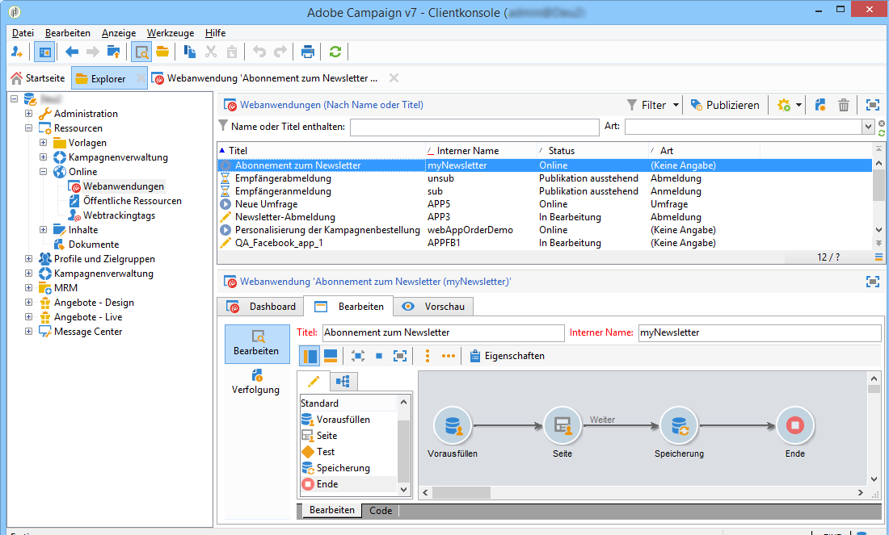

1. Bearbeiten Sie die Aktivität **[!UICONTROL Vorausfüllen]**. Das Feld **[!UICONTROL Referenzierte Daten werden automatisch in das Formular geladen]** ist mit einem Häkchen versehen und die Identifizierungsmethode **[!UICONTROL Adobe Campaign-Verschlüsselung]** ist ausgewählt. Dadurch kann die Webanwendung die Felder des Formulars mit den in der Adobe Campaign-Datenbank gespeicherten Daten ausfüllen. Weiterführende Informationen hierzu finden Sie in [diesem Dokument](../../web/using/publishing-a-web-form.md#pre-loading-the-form-data).

   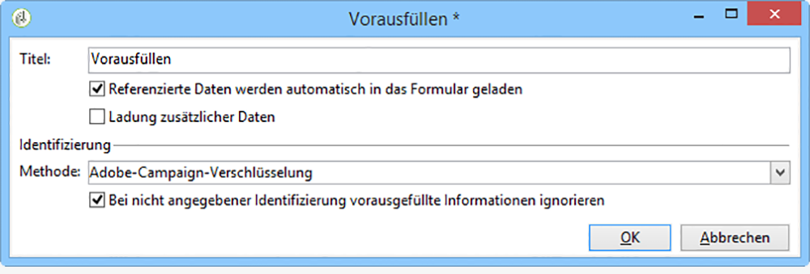

1. Bearbeiten Sie die **[!UICONTROL Seite]**. Drei Felder (Name, E-Mail und Telefonnummer) wurden eingefügt sowie das Kontrollkästchen, mit dem sich der Empfänger zum Newsletter anmelden kann (**[!UICONTROL Newsletter]**-Dienst).

   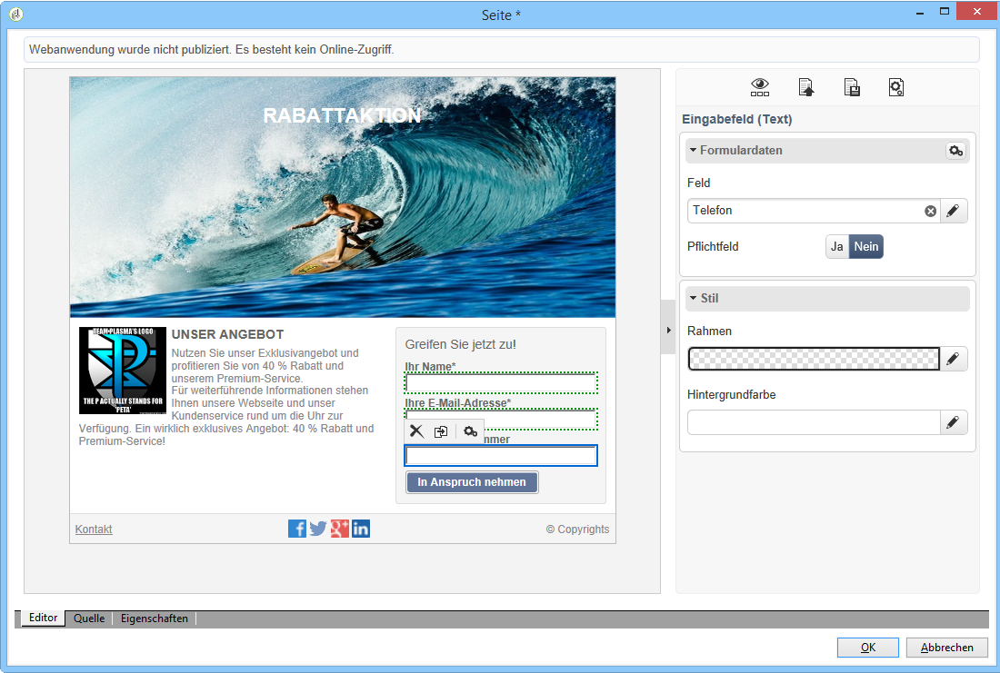

1. Gehen Sie zu **[!UICONTROL Profile und Target > Services und Abonnements]** und öffnen Sie den **[!UICONTROL Newsletter]** Service. Dies ist der Service, der über die Campaign Standard-Kommunikation aktualisiert wird. Sie können sehen, dass noch kein Empfänger diesen Dienst abonniert hat.

   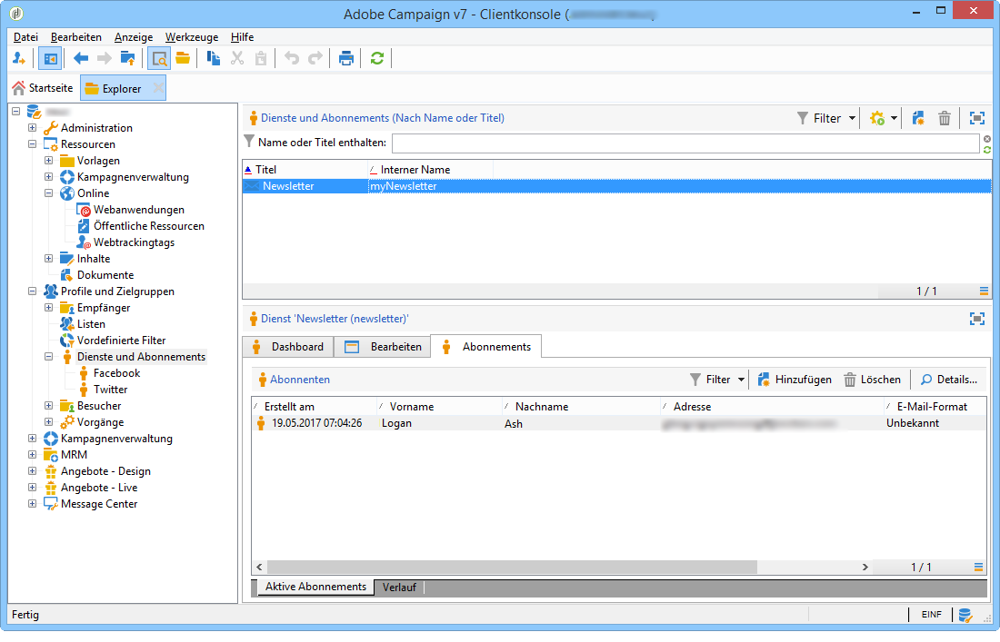

1. Gehen Sie zu **[!UICONTROL Profile und Zielgruppen > Empfänger]** und wählen Sie einen Empfänger aus. Sie können sehen, dass dieses Profil den Service noch nicht abonniert hat.

   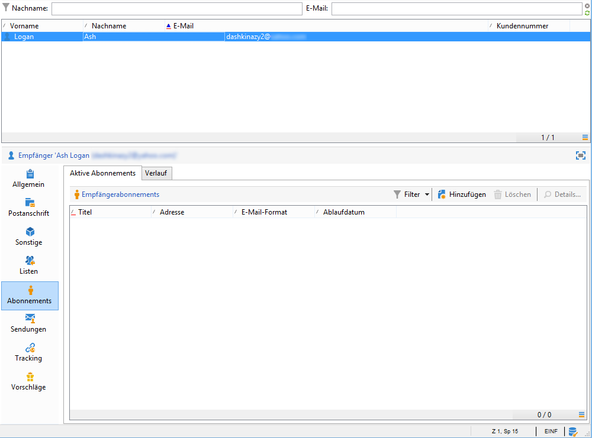

## Replizieren der Daten {#replicating-the-data}

Um die erforderlichen Daten zwischen Campaign v7 und Campaign Standard zu replizieren, stehen verschiedene Workflow-Vorlagen für die Replikation zur Verfügung. Der Workflow für die **[!UICONTROL Profilreplikation]** repliziert automatisch alle Campaign v7-Empfänger nach Campaign Standard. Siehe [Technische und Replikations-Workflows](../../integrations/using/acs-connector-principles-and-data-cycle.md#technical-and-replication-workflows). Der Workflow für die **[!UICONTROL Landingpage-Replikation]** ermöglicht eine Replikation der Webanwendungen, die wir in Campaign Standard nutzen möchten.

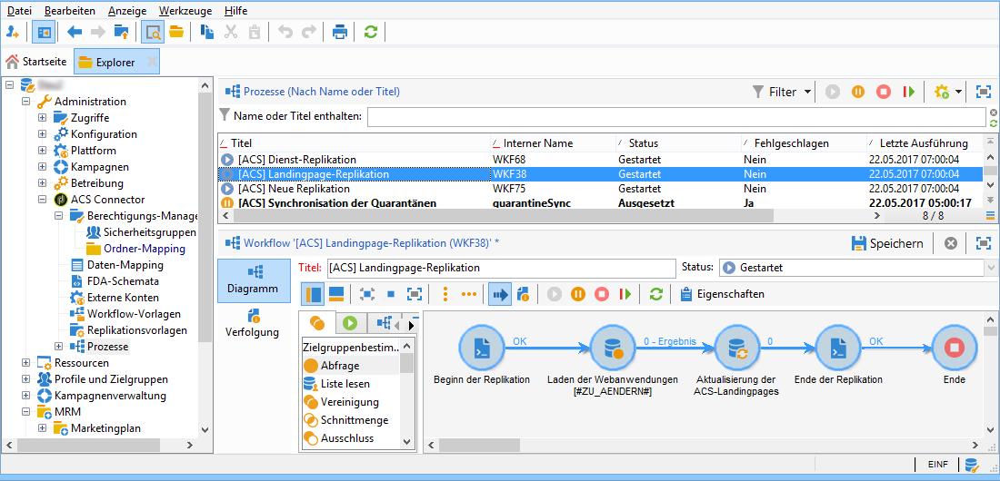

Um zu überprüfen, ob die Daten korrekt repliziert wurden, gehen Sie in Campaign Standard folgendermaßen vor:

1. Wählen Sie auf der Startseite die Option **[!UICONTROL Kundenprofile]** aus.

   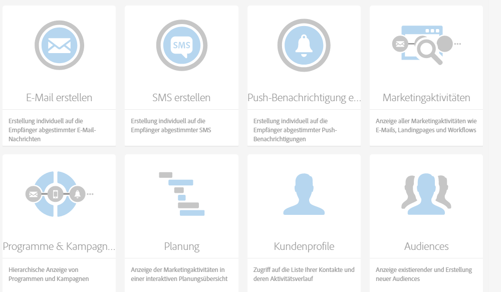

1. Suchen Sie nach Ihrem Campaign v7-Empfänger und vergewissern Sie sich, dass dieser Empfänger in Campaign Standard angezeigt wird.

   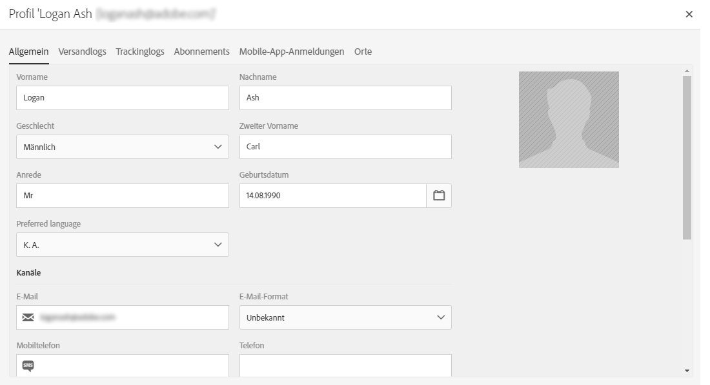

1. Klicken Sie in der oberen Leiste auf **[!UICONTROL Marketing-Aktivitäten]** und suchen Sie nach der Web-Anwendung von Campaign v7. Sie wird in Campaign Standard als Landingpage angezeigt.

   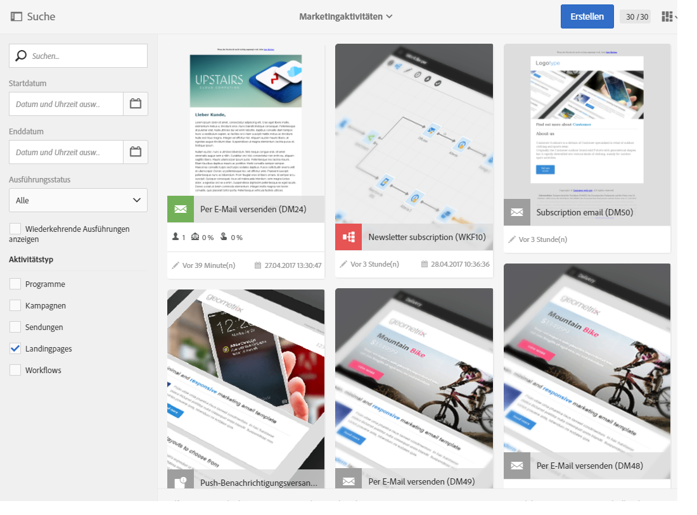

1. Klicken Sie links oben auf das **[!UICONTROL Adobe Campaign]**-Logo, wählen Sie dann **Profile und Zielgruppen > Dienste** aus und vergewissern Sie sich, dass auch der Newsletter-Dienst angezeigt wird.

   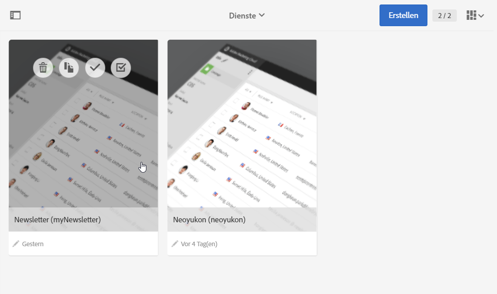

## Entwerfen und Versenden der E-Mail {#designing-and-sending-the-email}

In diesem Abschnitt erfahren Sie, wie in eine E-Mail in Campaign Standard ein Link eingefügt wird, der zu einer Landingpage weist, die von einer Campaign v7-Webanwendung repliziert wurde.

Die Schritte für die Erstellung, die Konzeption und den Versand der E-Mail erfolgen wie üblich. Siehe das [Adobe Campaign Standard](https://experienceleague.adobe.com/docs/campaign-standard/using/campaign-standard-home.html?lang=de)-Handbuch.

1. Erstellen Sie eine neue E-Mail und wählen Sie mindestens ein repliziertes Profil als Zielgruppe.
1. Bearbeiten Sie den Inhalt und fügen Sie einen **[!UICONTROL Link zu einer Landingpage]** hinzu.

   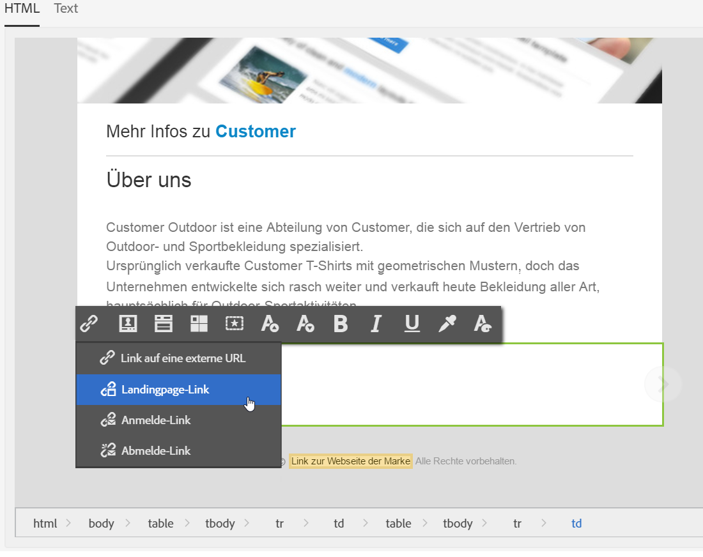

1. Wählen Sie die von der Campaign v7-Webanwendung replizierte Landingpage aus.

   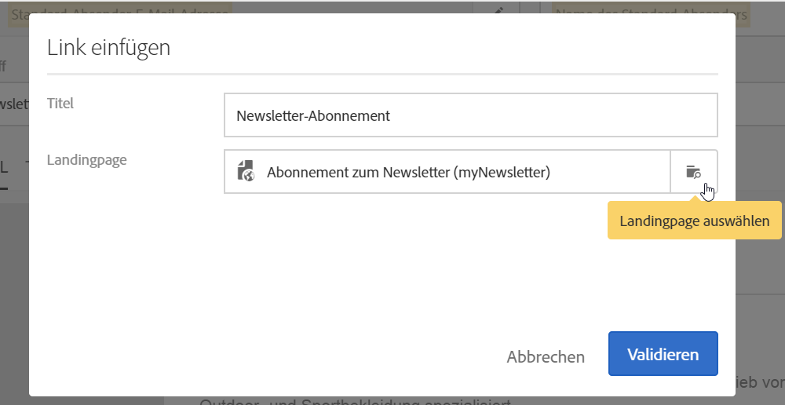

1. Stellen Sie Ihre E-Mail zusammen, führen Sie Testsendungen durch und senden Sie die endgültige E-Mail.
1. Einer der Empfänger öffnet die E-Mail und klickt auf den Link zur Newsletter-Anmeldung.

   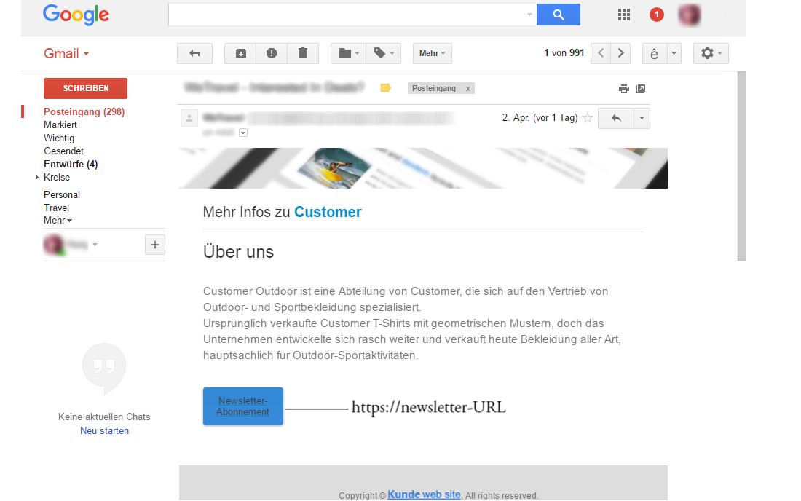

1. Dieser Empfänger gibt eine Telefonnummer ein und fügt dem Kästchen zur Newsletter-Anmeldung ein Häkchen hinzu.

   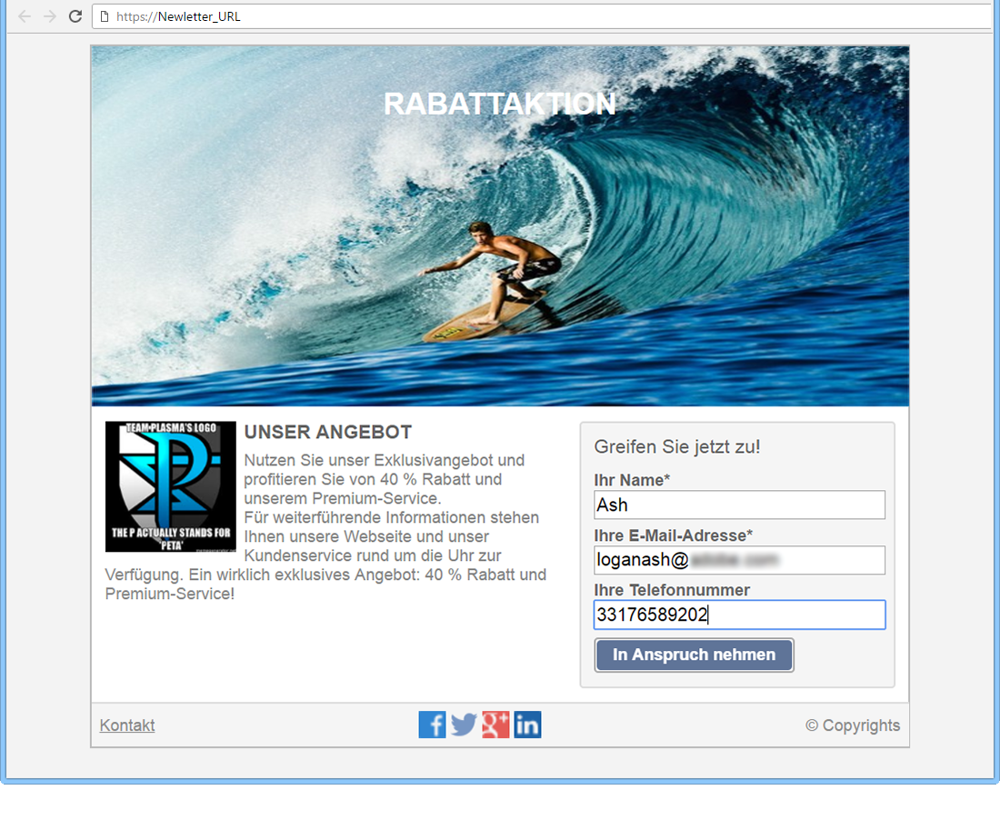

## Aktualisierte Daten abrufen {#retrieving-the-updated-information}

Wenn der Empfänger seine Daten von über die Web-Anwendung aktualisiert, ruft Adobe Campaign v7 die aktualisierten Informationen synchron ab. Sie wird dann von Campaign v7 nach Campaign Standard repliziert.

1. Navigieren Sie in Campaign v7 zu **[!UICONTROL Profile und Zielgruppe > Services und Abonnements]** öffnen Sie den **[!UICONTROL Newsletter]**-Service. Sie können sehen, dass der Empfänger jetzt in der Abonnentenliste angezeigt wird.

   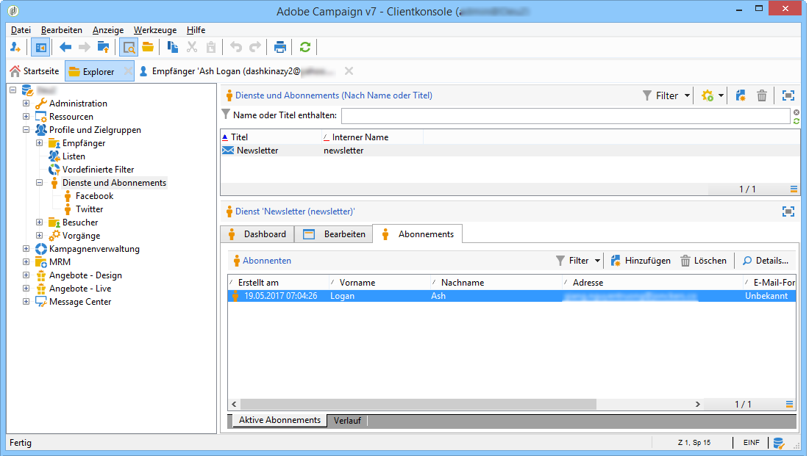

1. Gehen Sie **[!UICONTROL Profile und Zielgruppen > Empfänger]** und wählen Sie den Empfänger aus. Sie können sehen, dass die Telefonnummer jetzt gespeichert ist.

   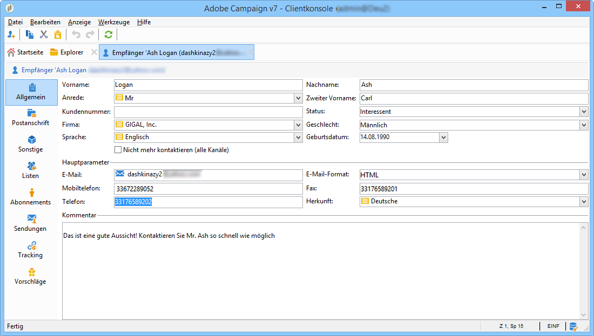

1. Außerdem ist auf der Registerkarte **[!UICONTROL Abonnements]** ebenfalls ersichtlich, dass dieser Empfänger sich für den Newsletter angemeldet hat.

   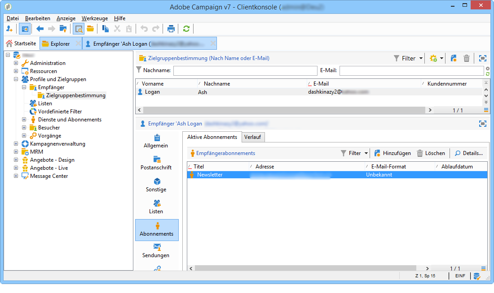

1. Warten Sie ein paar Minuten, bis der Profilreplikations-Workflow durchgeführt wurde.
1. Öffnen Sie in Campaign Standard das Empfängerprofil und überprüfen Sie, ob die aktualisierten Daten korrekt von Campaign v7 repliziert wurden.

   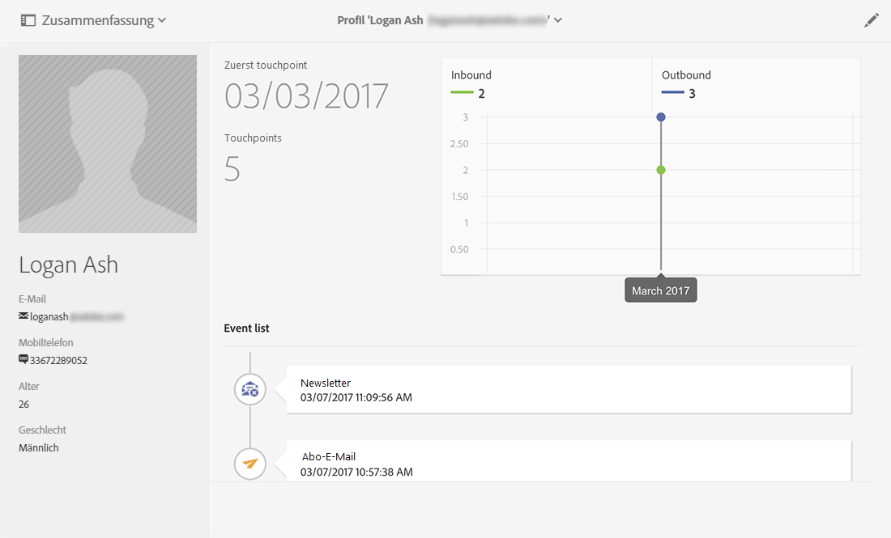

1. Bearbeiten Sie das Profil. Sie können sehen, dass die Telefonnummer aktualisiert wurde.

   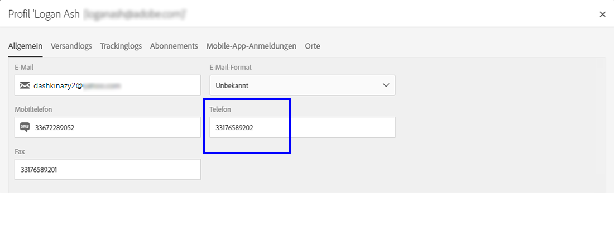

1. Klicken Sie auf die Registerkarte **[!UICONTROL Abonnements]**. Der Newsletter-Dienst wird jetzt angezeigt.

   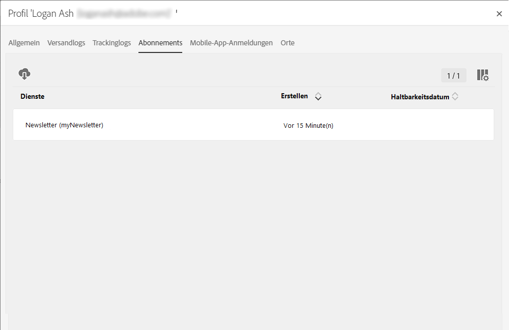
