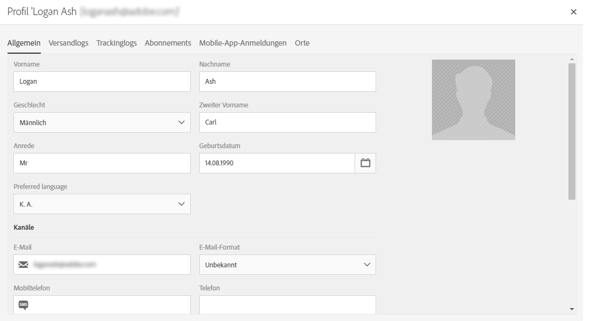

# Webanwendungen synchronisieren{#synchronizing-web-applications}

In diesem Anwendungsbeispiel versenden wir eine Nachricht mit Campaign Standard, die einen Link zu einer Webanwendung von Campaign v7 enthält. Wenn der Empfänger den Link in der E-Mail anklickt, öffnet sich die Webanwendung mit einem Formular mit mehreren mit Empfängerdaten vorausgefüllten Feldern sowie einem Anmelde-Link zu einem Newsletter. Der Empfänger kann seine Daten aktualisieren und sich für den Dienst anmelden. Sein Profil wir in Campaign v7 aktualisiert und die Informationen werden nach Campaign Standard repliziert.

Wenn Sie über zahlreiche Dienste und Webanwendungen in Campaign v7 verfügen, ist es empfehlenswert, nicht alle nach Campaign Standard zu übertragen. ACS Connector ermöglicht Ihnen, alle bestehenden Campaign v7-Webanwendungen und -Dienste mit einem in Campaign Standard erstellten Versand zu verknüpfen.

## Voraussetzungen {#prerequisites}

Dazu ist Folgendes erforderlich:

* Empfänger, die in der Campaign v7-Datenbank gespeichert und mit Campaign Standard synchronisiert werden. Siehe Abschnitt [Profile synchronisieren](../../integrations/using/synchronizing-profiles.md).
* Ein Dienst und eine Webanwendung, die in Campaign v7 erstellt und publiziert wurden.
* Die Webanwendung muss die Aktivität **[!UICONTROL Vorausfüllen]** enthalten, die die Verschlüsselungsmethode **[!UICONTROL Adobe-Campaign-Verschlüsselung]** verwendet.

## Webanwendung und Dienst erstellen {#creating-the-web-application-and-service}

Sie können in Campaign v7 Webanwendungen erstellen, mit denen sich Empfänger für einen Dienst anmelden können. Die Webanwendung und der Dienst werden in Campaign v7 konzipiert und gespeichert und Sie können diesen Dienst über eine Campaign Standard-Kommunikation aktualisieren. Weiterführende Informationen zu Webanwendungen in Campaign v7 finden Sie in [diesem Abschnitt](../../web/using/adding-fields-to-a-web-form.md#subscription-checkboxes).

In Campaign v7 wurden die folgenden Objekte erstellt:

* ein Newsletter-Dienst
* eine Webanwendung, die die Aktivität **[!UICONTROL Vorausfüllen]**, **[!UICONTROL Seite]** und **[!UICONTROL Speicherung]** enthält.

1. Gehen Sie zu **[!UICONTROL Ressourcen > Online > Webanwendungen]** und wählen Sie eine vorhandene Webanwendung aus.

   

1. Bearbeiten Sie die Aktivität **[!UICONTROL Vorausfüllen]**. Das Feld **[!UICONTROL Referenzierte Daten werden automatisch in das Formular geladen]** ist mit einem Häkchen versehen und die Identifizierungsmethode **[!UICONTROL Adobe-Campaign-Verschlüsselung]** ist ausgewählt. Dadurch kann die Webanwendung die Felder des Formulars mit den in der Adobe Campaign-Datenbank gespeicherten Daten ausfüllen. Weiterführende Informationen hierzu finden Sie in [diesem Dokument](../../web/using/publishing-a-web-form.md#pre-loading-the-form-data).

   

1. Bearbeiten Sie die **[!UICONTROL Seite]**. Drei Felder (Name, E-Mail und Telefonnummer) wurden eingefügt sowie das Kontrollkästchen, mit dem sich der Empfänger zum Newsletter anmelden kann (**[!UICONTROL Newsletter]**-Dienst).

   

1. Gehen Sie zu **[!UICONTROL Profile und Zielgruppen > Dienste und Abonnements]** und öffnen Sie den Dienst **[!UICONTROL Newsletter]**. Dieser Dienst wird durch die Campaign Standard-Kommunikation aktualisiert. Sie sehen, dass sich noch kein Empfänger für diesen Dienst angemeldet hat.

   

1. Gehen Sie zu **[!UICONTROL Profile und Zielgruppen > Empfänger]** und wählen Sie einen Empfänger aus. Sie sehen, dass er sich noch nicht für den Dienst angemeldet hat.

   

## Daten replizieren {#replicating-the-data}

Um die erforderlichen Daten zwischen Campaign v7 und Campaign Standard zu replizieren, stehen verschiedene Workflow-Vorlagen für die Replikation zur Verfügung. Der Workflow für die **[!UICONTROL Profilreplikation]** repliziert automatisch alle Campaign v7-Empfänger nach Campaign Standard. Siehe [Technische und Replikations-Workflows](../../integrations/using/acs-connector-principles-and-data-cycle.md#technical-and-replication-workflows). Der Workflow für die **[!UICONTROL Landingpage-Replikation]** ermöglicht eine Replikation der Webanwendungen, die wir in Campaign Standard nutzen möchten.

Um zu überprüfen, ob die Daten korrekt repliziert wurden, gehen Sie in Campaign Standard folgendermaßen vor:

1. Wählen Sie auf der Startseite die Option **[!UICONTROL Kundenprofile]** aus.

   

1. Suchen Sie nach Ihrem Campaign v7-Empfänger und vergewissern Sie sich, dass er in Campaign Standard angezeigt wird.

   

1. Klicken Sie auf der obersten Leiste auf **[!UICONTROL Marketingaktivitäten]** und suchen Sie nach der Campaign v7-Webanwendung. Sie wird in Campaign Standard als Landingpage angezeigt.

   

1. Klicken Sie links oben auf das **[!UICONTROL Adobe Campaign]**-Logo, wählen Sie dann **Profiles &amp; Audiences > Dienste** aus und vergewissern Sie sich, dass auch der Newsletter-Dienst angezeigt wird.

   

## E-Mail konzipieren und senden {#designing-and-sending-the-email}

In diesem Abschnitt erfahren Sie, wie in eine E-Mail in Campaign Standard ein Link eingefügt wird, der zu einer Landingpage weist, die von einer Campaign v7-Webanwendung repliziert wurde.

Die Schritte für die Erstellung, die Konzeption und den Versand der E-Mail erfolgen wie üblich. Siehe das [Adobe Campaign Standard](https://helpx.adobe.com/de/support/campaign/standard.html)-Handbuch.

1. Erstellen Sie eine neue E-Mail und wählen Sie mindestens ein repliziertes Profil als Zielgruppe.
1. Bearbeiten Sie den Inhalt und fügen Sie einen **[!UICONTROL Link zu einer Landingpage]** hinzu.

   

1. Wählen Sie die von der Campaign v7-Webanwendung replizierte Landingpage aus.

   

1. Stellen Sie Ihre E-Mail zusammen, führen Sie Testsendungen durch und senden Sie die endgültige E-Mail.
1. Einer der Empfänger öffnet die E-Mail und klickt auf den Link zur Newsletter-Anmeldung.

   

1. Er gibt eine Telefonnummer ein und fügt dem Kästchen zur Newsletter-Anmeldung ein Häkchen hinzu.

   

## Aktualisierte Daten abrufen {#retrieving-the-updated-information}

Wenn der Empfänger seine Daten über die Webanwendung aktualisiert, ruft Adobe Campaign v7 synchron die aktualisierten Daten ab. Diese werden anschließend von Campaign v7 nach Campaign Standard repliziert.

1. Gehen Sie in Campaign v7 zu **[!UICONTROL Profile und Zielgruppen > Dienste und Abonnements]** und öffnen Sie den **[!UICONTROL Newsletter]**-Dienst. Sie sehen, dass der Empfänger jetzt in der Abonnentenliste angezeigt wird.

   

1. Gehen Sie zu **[!UICONTROL Profile und Zielgruppen > Empfänger]** und wählen Sie den Empfänger aus. Sie sehen, dass die Telefonnummer gespeichert ist.

   

1. Außerdem ist im Tab **[!UICONTROL Abonnements]** ebenfalls ersichtlich, dass er sich für den Newsletter angemeldet hat.

   

1. Warten Sie ein paar Minuten, bis der Profilreplikations-Workflow durchgeführt wurde.
1. Öffnen Sie in Campaign Standard das Empfängerprofil und überprüfen Sie, ob die aktualisierten Daten korrekt von Campaign v7 repliziert wurden.

   

1. Bearbeiten Sie das Profil. Sie sehen, dass die Telefonnummer aktualisiert wurde.

   

1. Wählen Sie den Tab **[!UICONTROL Abonnements]** aus. Der Newsletter-Dienst wird angezeigt.

   

