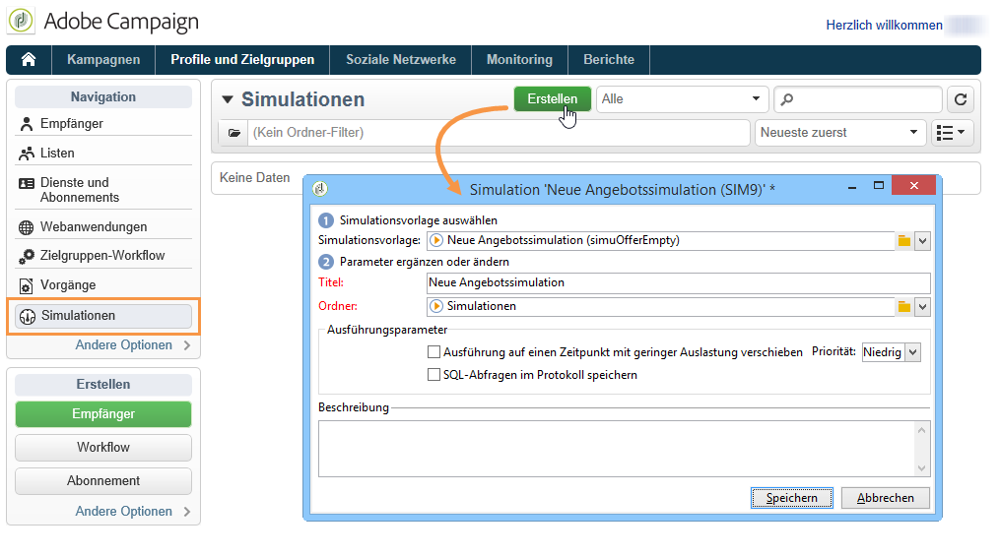
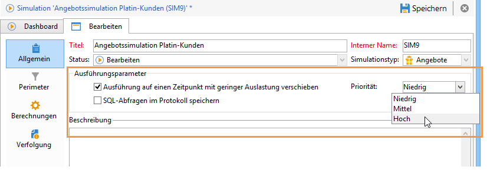
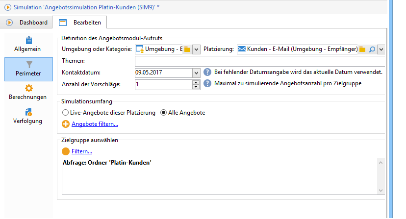
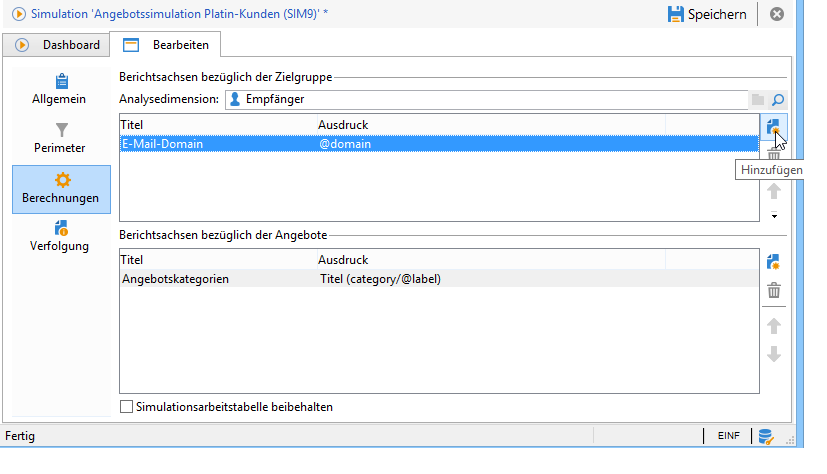
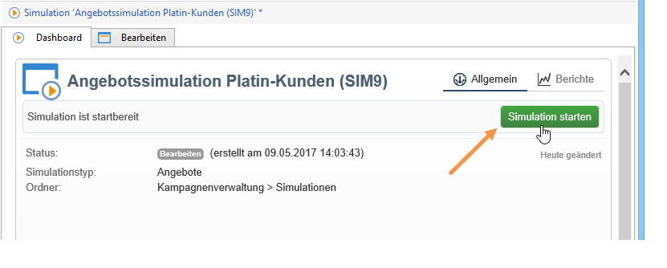
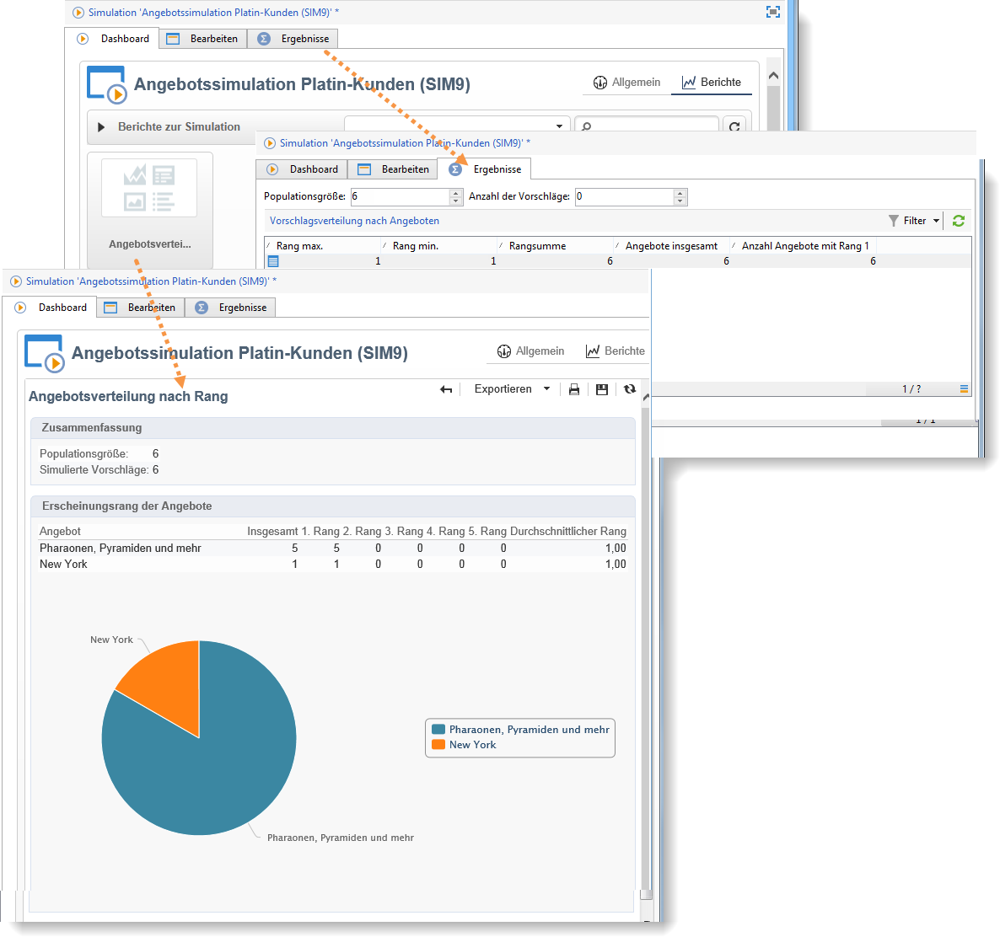

# Über die Angebotssimulation{#about-offers-simulation}

Mithilfe von **Simulationen** können Sie die Verteilung der Angebote einer Kategorie oder einer Umgebung evaluieren, bevor Sie den Vorschlag den Empfängern unterbreiten.

Bei einer Simulation werden die Kontexte und Eignungsregeln berücksichtigt, die zuvor auf Angebote angewendet wurden (siehe [Angebotskatalog – Übersicht](../../interaction/using/offer-catalog-overview.md)), sowie deren Unterbreitungsregeln (siehe [Angebotsunterbreitung](../../interaction/using/managing-offer-presentation.md)). Auf diese Weise können Sie verschiedene Versionen Ihres Angebotsvorschlags testen und verfeinern, ohne tatsächlich ein Angebot zu verwenden oder eine Zielgruppe zu häufig oder zu wenig anzusprechen, da die Simulation keine Auswirkungen auf die Zielgruppenempfänger hat.

Um zu erfahren, wie Sie ein Angebot simulieren können, lesen Sie die folgenden Schritte. Außerdem können Sie sich dieses [Video](https://helpx.adobe.com/campaign/classic/how-to/simulate-offer-in-acv6.html?playlist=/ccx/v1/collection/product/campaign/classic/segment/digital-marketers/explevel/intermediate/applaunch/introduction/collection.ccx.js&amp;ref=helpx.adobe.com) ansehen.

## Simulationen erstellen {#main-steps-for-creating-a-simulation}

Gehen Sie wie folgt vor, um eine Angebotssimulation zu erstellen:

1. Klicken Sie in der Rubrik **[!UICONTROL Profile und Zielgruppen]** auf die Schaltfläche **[!UICONTROL Simulationen]** und anschließend auf **[!UICONTROL Erstellen]**.

   

1. Wählen Sie eine Vorlage aus, benennen Sie die Simulation und speichern Sie sie.
1. Gehen Sie nun in den Tab **[!UICONTROL Bearbeiten]** und konfigurieren Sie die Ausführungsparameter.

   Weiterführende Informationen hierzu finden Sie unter [Ausführungsparameter](../../interaction/using/execution-settings.md).

   

   >[!NOTE]
   >
   >Die Ausführungsparameter stehen nur zur Verfügung, wenn Sie Interaction in Verbindung mit Campaign benutzen.

1. Bestimmen Sie den Simulationsperimeter.

   Weitere Informationen hierzu finden Sie unter [Perimeter konfigurieren](../../interaction/using/simulation-scope.md#definition-of-the-scope).

   

1. Fügen Sie gegebenenfalls Berichtsachsen hinzu, um den Bericht **[!UICONTROL Angebotsverteilung nach Rang]** anzureichern (optional).

   Weitere Informationen hierzu finden Sie unter [Berichtsachsen hinzufügen](../../interaction/using/simulation-scope.md#adding-reporting-axes).

   

1. Klicken Sie zum Abschluss auf **[!UICONTROL Speichern]**.
1. Gehen Sie in das Dashboard, um die Simulation zu starten.

   

1. Sobald die Simulation abgeschlossen ist, können Sie das Ergebnis und den Bericht zur Simulation anzeigen.

   Weitere Informationen hierzu finden Sie im Abschnitt [Verfolgung](../../interaction/using/simulation-tracking.md).

   
