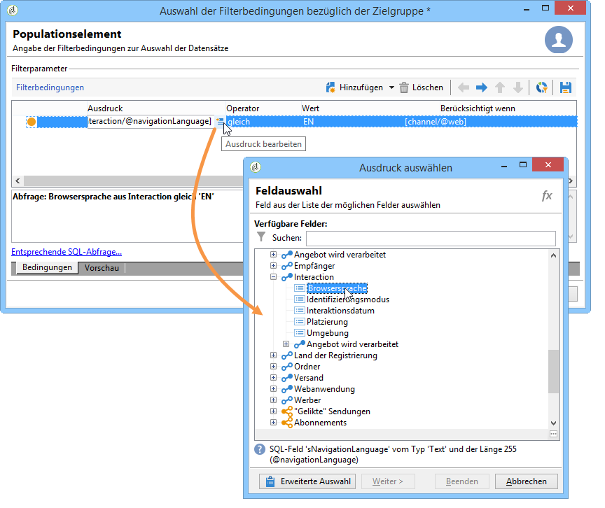
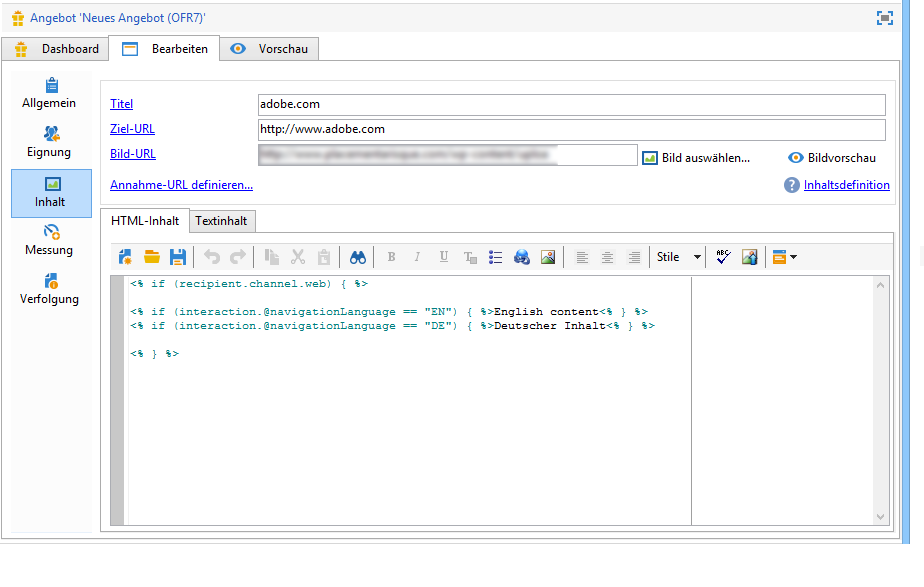
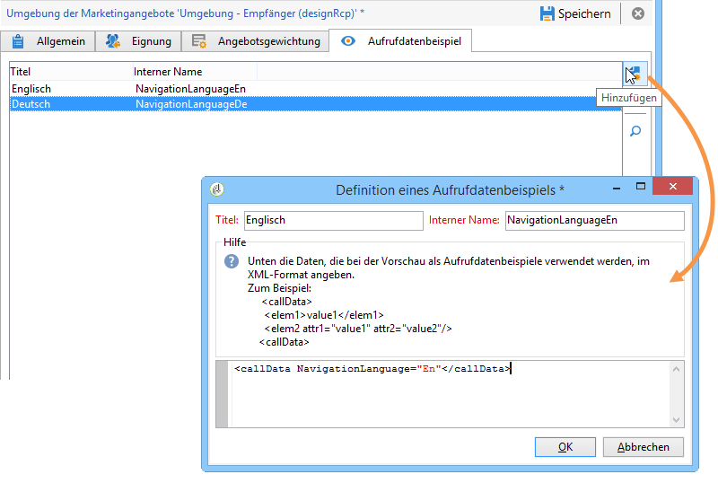
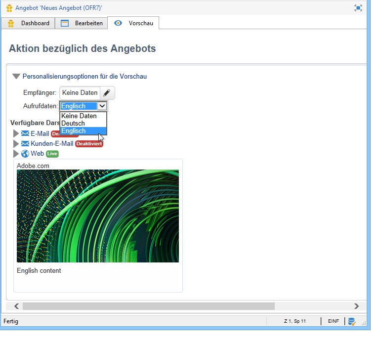
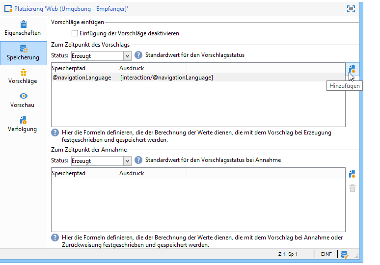

# Additional data{#additional-data}


Während eines Aufrufs an das Interaction-Modul können Sie zusätzliche kontextuelle Informationen übertragen. Diese Daten können aus den Zielgruppendaten stammen, die in der Arbeitstabelle eines Workflows (ausgehender Kanal) gespeichert sind, oder aus den Anrufdaten, die von der Website während des Anrufs gesendet werden (eingehender Kanal). Sie können diese zusätzlichen Daten in den Eignungsregeln und in der Personalisierung von Angeboten verwenden und sie auch in einer Vorschlagstabelle speichern.

Für den eingehenden Kanal kann es nützlich sein, Informationen wie die Browser-Sprache der Personen, die das Angebot konsultieren, oder den Namen des Callcenter-Agenten abzurufen. Sie können diese Aufrufdaten dann in den Eignungsregeln verwenden, um ein Angebot nur denjenigen Personen anzubieten, die die Web-Seite in französischer oder englischer Sprache anzeigen.

In einem Zielgruppen-Workflow (ausgehender Kanal) können Sie die Zielgruppendaten während eines Aufrufs an die Engine verwenden. Sie können die Zielgruppe beispielsweise mit Daten aus einer mit einem Empfänger verknüpften Transaktion oder einer externen Datenbank über die FDA anreichern.

## Weitere Konfigurationsmöglichkeiten {#additional-data-configuration}

Sie müssen das **nms:interaction**-Schema erweitern, das mit der Umgebung verknüpft ist, und die Liste der zusätzlichen Felder deklarieren, die während eines Aufrufs an die Interaction-Engine verwendet werden. Beim Erstellen der Eignungsregel oder Personalisieren eines Angebots können diese Felder über den Knoten **Interaction** aufgerufen werden (siehe [Verwendung zusätzlicher Daten](#using-additional-data)).

Für eingehende Kanäle müssen im Knoten **Interaction** die Aufrufdaten eingefügt werden.

```
<element label="Interactions" labelSingular="Interaction" name="interaction">
  <attribute label="Navigation language" name="navigationLanguage" type="string"/>
</element>
```

>[!NOTE]
>
>XML-Sammlungen werden für den eingehenden Kanal unterstützt, Relationen zu anderen Schemata jedoch nicht.

Für ausgehende Kanäle muss im Knoten **Interaction** ein die zusätzlichen Felder enthaltendes **targetData**-Element eingefügt werden.

```
<element label="Interactions" labelSingular="Interaction" name="interaction">
  <element name="targetData">
    <attribute label="Date of last transaction" name="lastTransactionDate" type="datetime"/>
  </element>
</element>
```

>[!NOTE]
>
>Sammlungen werden für den ausgehenden Kanal nicht unterstützt. Sie können jedoch Links zu anderen Schemata erstellen.

Wenn Sie diese Daten in der Vorschlagstabelle speichern möchten, müssen Sie auch das Schema **nms:propositionRcp** erweitern und diese Felder deklarieren.

```
<element label="Recipient offer propositions" labelSingular="Recipient offer proposition" name="propositionRcp">
  <attribute label="Last transaction date" name="lastTransactionDate" type="datetime"/>
  <attribute label="Navigation language" name="navigationLanguage" type="string"/>
</element>
```

## Implementierung zusätzlicher Daten {#additional-data-implementation}

### Eingehender Kanal (Webseite) {#input-channel--web-page-}

Um bei der Angebotsmodul-Abfrage zusätzliche Daten zu übergeben, muss der JavaScript-Code der Web-Seite um die Variable **interactionGlobalCtx** ergänzt werden. Fügen Sie in diese Variable den die Aufrufdaten enthaltenden **Interaction**-Knoten ein. Sie müssen dieselbe XML-Struktur wie im Schema **nms:interaction** berücksichtigen. Siehe [Weitere Konfigurationsmöglichkeiten](#additional-data-configuration).

```
interactionGlobalCtx = "<interaction navigationLanguage='"+myLanguage+"'/>";
```

### Ausgehender Kanal {#output-channel}

Es muss ein Zielgruppen-Workflow erstellt werden, mit dem zusätzliche Daten in die Arbeitstabelle geladen werden. Dabei müssen dieselbe XML-Struktur und dieselben internen Namen wie im **nms:interaction**-Schema beachtet werden. Siehe [Weitere Konfigurationsmöglichkeiten](#additional-data-configuration).

## Verwendung der zusätzlichen Daten {#using-additional-data}

### Eignungsregeln {#eligibility-rules}

Zusätzliche Daten können in den Eignungsregeln auf Ebene der Angebote, der Kategorien und der Gewichtungen verwendet werden.

Sie können beispielsweise die Unterbreitung eines Angebots auf Kontakte beschränken, die die Webseite in englischer Sprache ansehen.



>[!NOTE]
>
>Die Regel muss sich auf die Kanäle beziehen, für die die Daten definiert wurden. Im vorliegenden Beispiel wurde die Regel auf den eingehenden Web-Kanal begrenzt (Feld **[!UICONTROL Berücksichtigt wenn]**).

### Personalisierung {#personalization}

Sie können diese zusätzlichen Daten auch bei der Personalisierung eines Angebots verwenden. Sie können beispielsweise eine Bedingung für die Navigationssprache hinzufügen



>[!NOTE]
>
>Sie müssen die Personalisierung der Kanäle, für die die Daten definiert sind, einschränken. In unserem Beispiel schränken wir die Regel für den eingehenden Web-Kanal ein.

Wenn Sie ein Angebot mit zusätzlichen Daten personalisieren, werden diese nicht automatisch in der Angebotsvorschau angezeigt, da sie nicht in der Datenbank enthalten sind. Fügen Sie daher im Tab **[!UICONTROL Aufrufdatenbeispiel]** Musterwerte ein, die in der Vorschau verwendet werden können. Beachten Sie dieselbe XML-Struktur wie in der Schemaerweiterung **nms:interaction**. Lesen Sie diesbezüglich auch den Abschnitt [Weitere Konfigurationsmöglichkeiten](#additional-data-configuration).



Klicken Sie im Vorschau-Tab auf **[!UICONTROL Personalisierungsoptionen für die Vorschau]** und wählen Sie im Feld **[!UICONTROL Aufrufdaten]** einen Wert aus der Dropdown-Liste aus.



### Speicherung {#storage}

Bei einem Aufruf des Moduls können Sie zusätzliche Daten in der Vorschlagstabelle speichern, um die Datenbank anzureichern. Diese Daten können beispielsweise in Berichten, in ROI-Berechnungen oder für spätere Prozesse verwendet werden.

>[!NOTE]
>
>Sie müssen das Schema **nms:propositionRcp** erweitert und die Felder deklariert haben, die die zu speichernden Daten enthalten werden. Weitere Informationen hierzu finden Sie unter [Weitere Konfigurationsmöglichkeiten](#additional-data-configuration).

Gehen Sie in den Tab **[!UICONTROL Speicherung]** der Platzierung und klicken Sie auf **[!UICONTROL Hinzufügen]**.

Wählen Sie in der Spalte **[!UICONTROL Speicherpfad]** das Feld aus der Vorschlagstabelle aus, das zur Speicherung der zusätzlichen Daten verwendet werden soll. Wählen Sie dann in der Spalte **[!UICONTROL Ausdruck]** das entsprechende Feld aus dem **[!UICONTROL Interaction]**-Knoten aus.

Die Aufrufdaten können entweder zum Zeitpunkt der Vorschlagserzeugung oder zum Zeitpunkt seiner Annahme (durch Klick des Kontakts auf das Angebot) abgerufen werden.


