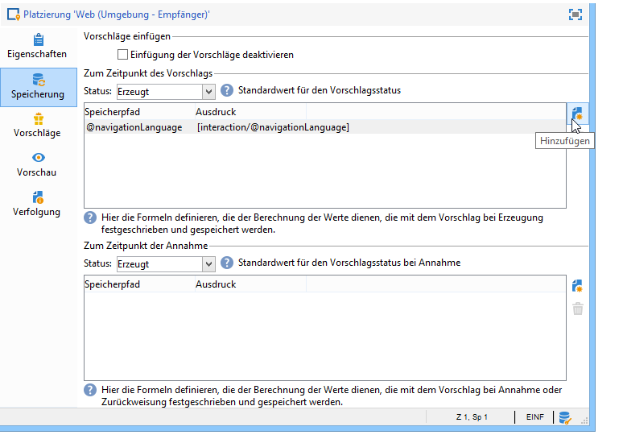

# Zusätzliche Daten{#additional-data}


Es besteht die Möglichkeit, bei Abfrage des Angebotsmoduls zusätzliche kontextuelle Daten zu übergeben. Dies können entweder aus der Arbeitstabelle eines Workflows stammende Daten der Zielgruppe (ausgehender Kanal) oder von der Webseite zum Zeitpunkt der Abfrage gesendete Aufrufdaten (eingehender Kanal) sein. Die zusätzlichen Daten können in Eignungsregeln und der Angebotspersonalisierung verwendet und in der Vorschlagstabelle gespeichert werden.

Bei eingehenden Interaktionen beispielsweise kann es interessant sein, die Browsersprache eines Webseitenbesuchers oder den Namen des Callcenter-Mitarbeiters, der einen Anruf entgegengenommen hat, abzufragen. In den Eignungsregeln können Sie auf diese Aufrufdaten (call data) Bezug nehmen, um ein Angebot z. B. nur Personen zu unterbreiten, die Ihre Webseite auf Deutsch oder Englisch ansehen.

In einem Zielbestimmungs-Workflow (ausgehender Kanal) können Sie die Zielgruppendaten (target data) in der Abfrage des Angebotsmoduls nutzen. Die Zielgruppe kann so z. B. durch Transaktionsdaten der Empfänger oder durch eine externe Datenbank über den FDA angereichert werden.

## Weitere Konfigurationsmöglichkeiten {#additional-data-configuration}

Sie müssen das mit der Umgebung verknüpfte **nms:interaction**-Schema erweitern und die Liste der zusätzlichen Felder deklarieren, die bei einem Aufruf des Interaction-Moduls verwendet werden. Beim Erstellen der Eignungsregel oder Personalisieren eines Angebots können diese Felder über den Knoten **Interaction** aufgerufen werden (siehe [Verwendung zusätzlicher Daten](#using-additional-data)).

Für eingehende Kanäle müssen im Knoten **Interaction** die Aufrufdaten eingefügt werden.

```
<element label="Interactions" labelSingular="Interaction" name="interaction">
  <attribute label="Navigation language" name="navigationLanguage" type="string"/>
</element>
```

>[!NOTE]
>
>XML-Sammlungen werden für den eingehenden Kanal unterstützt, Relationen zu anderen Schemata jedoch nicht.

Für ausgehende Kanäle muss im Knoten **Interaction** ein die zusätzlichen Felder enthaltendes **targetData**-Element eingefügt werden.

```
<element label="Interactions" labelSingular="Interaction" name="interaction">
  <element name="targetData">
    <attribute label="Date of last transaction" name="lastTransactionDate" type="datetime"/>
  </element>
</element>
```

>[!NOTE]
>
>Sammlungen werden für den ausgehenden Kanal nicht unterstützt. Sie können jedoch Relationen zu anderen Schemata konfigurieren.

Wenn Sie diese Daten in der Vorschlagstabelle speichern möchten, muss außerdem das Schema **nms:propositionRcp** erweitert werden, um die neuen Felder zu deklarieren.

```
<element label="Recipient offer propositions" labelSingular="Recipient offer proposition" name="propositionRcp">
  <attribute label="Last transaction date" name="lastTransactionDate" type="datetime"/>
  <attribute label="Navigation language" name="navigationLanguage" type="string"/>
</element>
```

## Implementierung zusätzlicher Daten {#additional-data-implementation}

### Eingehender Kanal (Webseite) {#input-channel--web-page-}

Um beim Aufruf des Moduls zusätzliche Daten zu übertragen, müssen Sie die **interactionGlobalCtx** in den JavaScript-Code der Webseite ein. Fügen Sie die **Interaction** Knoten, der die Aufrufdaten in diese Variable enthält. Sie müssen dieselbe XML-Struktur beachten, die sich im **nms:interaction** Schema. Siehe [Weitere Konfigurationsmöglichkeiten](#additional-data-configuration).

```
interactionGlobalCtx = "<interaction navigationLanguage='"+myLanguage+"'/>";
```

### Ausgehender Kanal {#output-channel}

Erstellen Sie einen Zielgruppen-Workflow zum Laden der zusätzlichen Daten in die Arbeitstabelle. Dabei müssen die gleiche XML-Struktur und die gleichen internen Namen beachtet werden wie im Schema **nms:interaction**. Siehe [Weitere Konfigurationsmöglichkeiten](#additional-data-configuration).

## Verwendung der zusätzlichen Daten {#using-additional-data}

### Eignungsregeln {#eligibility-rules}

Zusätzliche Daten können in den Eignungsregeln auf Ebene der Angebote, der Kategorien und der Gewichtungen verwendet werden.

Sie können beispielsweise die Unterbreitung eines Angebots auf Kontakte beschränken, die die Webseite in englischer Sprache ansehen.


>[!NOTE]
>
>Sie müssen die Regel auf die Kanäle beschränken, für die die Daten definiert sind. In unserem Beispiel begrenzen wir die Regel auf den eingehenden Webkanal (**[!UICONTROL Wird berücksichtigt, wenn]** -Feld).

### Personalisierung {#personalization}

Zusätzliche Daten können des Weiteren bei der Angebotspersonalisierung zum Einsatz kommen. Sie können beispielsweise eine Bedingung bezüglich der Browsersprache des Besuchers formulieren.


>[!NOTE]
>
>Die Regel muss sich auf die Kanäle beziehen, für die die Daten definiert wurden. Im vorliegenden Beispiel wurde die Regel auf den eingehenden Web-Kanal begrenzt.

Wenn Sie ein Angebot mithilfe zusätzlicher Daten personalisiert haben, werden diese Daten nicht standardmäßig in der Vorschau angezeigt, da sie nicht in der Datenbank verfügbar sind. In der Umwelt **[!UICONTROL Beispiel für Aufrufdaten]** hinzufügen, müssen Sie Wertbeispiele hinzufügen, die in der Vorschau verwendet werden sollen. Beachten Sie die gleiche XML-Struktur wie im **nms:interaction** Schemaerweiterung. Lesen Sie diesbezüglich auch den Abschnitt [Weitere Konfigurationsmöglichkeiten](#additional-data-configuration).


Klicken Sie im Vorschau-Tab auf **[!UICONTROL Personalisierungsoptionen für die Vorschau]** und wählen Sie im Feld **[!UICONTROL Aufrufdaten]** einen Wert aus der Dropdown-Liste aus.


### Speicherung {#storage}

Zum Zeitpunkt der Abfrage des Angebotsmoduls besteht die Möglichkeit, die zusätzlichen Daten in der Vorschlagstabelle zu speichern, um die Datenbank anzureichern. Auf diese Weise können die Daten beispielsweise in Berichten, zur Berechnung des ROI oder in späteren Vorgängen verwendet werden.

>[!NOTE]
>
>Hierzu müssen das Schema **nms:propositionRcp** erweitert und die Felder, die die Daten aufnehmen sollen, deklariert worden sein. Weitere Informationen hierzu finden Sie unter [Weitere Konfigurationsmöglichkeiten](#additional-data-configuration).

Gehen Sie in den Tab **[!UICONTROL Speicherung]** der Platzierung und klicken Sie auf **[!UICONTROL Hinzufügen]**.

Im **[!UICONTROL Speicherpfad]** das Speicherfeld in der Vorschlagstabelle auswählen. Im **[!UICONTROL Ausdruck]** das zusätzliche Feld im **[!UICONTROL Interaction]** Knoten.

Die Aufrufdaten können entweder zum Zeitpunkt der Vorschlagserzeugung oder zum Zeitpunkt seiner Annahme (durch Klick des Kontakts auf das Angebot) abgerufen werden.


