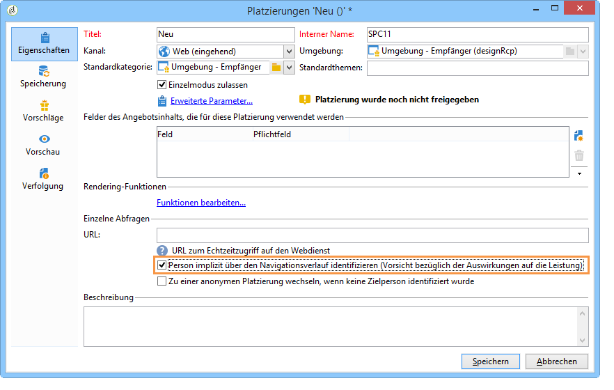
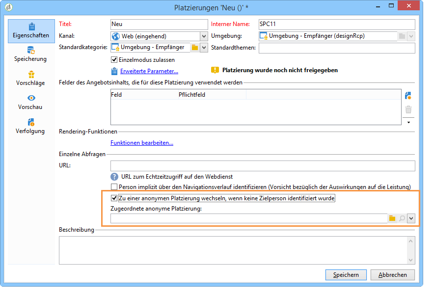

# Anonyme Interaktionen{#anonymous-interactions}

Sehen Sie sich dieses [Video](https://helpx.adobe.com/campaign/classic/how-to/indetified-and-anonymous-interaction-in-acv6.html?playlist=/ccx/v1/collection/product/campaign/classic/segment/digital-marketers/explevel/intermediate/applaunch/get-started/collection.ccx.js&ref=helpx.adobe.com) an, um einen Überblick darüber zu erhalten, wie Angebote an identifizierte und anonyme Ziele gesendet werden.

## Umgebung für anonyme Interaktionen {#targeting-and-storing-an-environment-for-anonymous-interactions}

Interaktion verfügt standardmäßig über eine vorkonfigurierte Umgebung, um die Empfängertabelle (identifizierte Angebote) als Ziel festzulegen. Wenn Sie eine andere Tabelle als Ziel auswählen möchten (Besuchstabelle für anonyme Angebote oder eine bestimmte Empfängertabelle), müssen Sie den Assistenten für die Zielzuordnung verwenden, um die Umgebung zu erstellen. For more on this, see [Creating an offer environment](../../interaction/using/live-design-environments.md#creating-an-offer-environment).

Wenn Sie eine anonyme Umgebung über den Assistenten zum Erstellen der Zuordnung erstellen, wird das **[!UICONTROL Environment dedicated to incoming anonymous interactions]** Feld automatisch auf der **[!UICONTROL General]** Registerkarte der Umgebung markiert.

Der Vorgang **[!UICONTROL Targeting dimension]** wird automatisch abgeschlossen. Standardmäßig wird eine Verknüpfung zur Besuchstabelle erstellt.

Das **[!UICONTROL Visitor folder]** Feld wird angezeigt. Es wird automatisch abgeschlossen, um eine Verknüpfung zum **[!UICONTROL Visitors]** Ordner herzustellen. In diesem Feld können Sie festlegen, wo Besucherprofile gespeichert werden sollen.

>[!NOTE]
>
>If you want to filter several types of visitors, for instance in the case of anonymous offers presented for one or more brands, you need to create an environment for each brand, and a **[!UICONTROL Visitors]** type folder for each environment.

## Angebotskataloge für anonyme Interaktionen {#offer-catalog-for-anonymous-interactions}

Wie bei ausgehenden spielt der Angebotskatalog auch bei eingehenden Interaktionen eine zentrale Rolle. Er enthält alle nach Kategorien geordneten Angebote.

Wenden Sie zum Erstellen von Kategorien und Räumen denselben Prozess an wie für identifizierte Besucher (siehe [Erstellen von Angebotskategorien](../../interaction/using/creating-offer-categories.md) und [Erstellen einer Angebotsumgebung](../../interaction/using/live-design-environments.md#creating-an-offer-environment)).

## Anonyme Besucher {#anonymous-visitors}

Anonyme Besucher können beim Webseitenaufruf einem Identifizierungsversuch durch Cookies unterzogen werden. Diese s. g. implizite Erkennung beruht auf dem Navigationsverlauf des Besuchers.

Während dieser Etappe werden die mithilfe der Cookies gesammelten Informationen zu den in Ihrer Datenbank enthaltenen Daten in Beziehung gebracht. Auf diese Weise können gewisse Besucher erkannt, also implizit identifiziert werden. Gelingt die Identifizierung nicht, bleibt der Besucher anonym.

Um diese Analyse auszuführen, aktivieren Sie für den Angebotsbereich die **[!UICONTROL Implicitly identify the individual based on their browser history]** Option.

## Umgang mit anonymen, nicht identifizierten Besuchern {#processing-unidentified-anonymous-visitors}

Wenn ein Besucher nicht identifiziert werden konnte, können seine Daten in einer bestimmten Platzierung gespeichert werden. Auf diese Weise können ihm spezifische Angebote unterbreitet werden, die speziell für diesen Besuchertyp definierten Typologieregeln entsprechen.

Für nicht identifizierte Kontakte oder solche, die zwar implizit identifiziert werden können, denen Sie aber keine für bekannte Kontakte erstellten Angebote unterbreiten möchten, haben Sie die Möglichkeit, in eine anonyme Umgebung wechseln.

Überprüfen Sie dazu die **[!UICONTROL Fall back on an anonymous environment if no individuals were identified]** und geben Sie dann bei Angabe eines Angebotsbereichs die Umgebung an, die diesen nicht identifizierten Besuchern gewidmet ist **[!UICONTROL Linked anonymous space]** .

