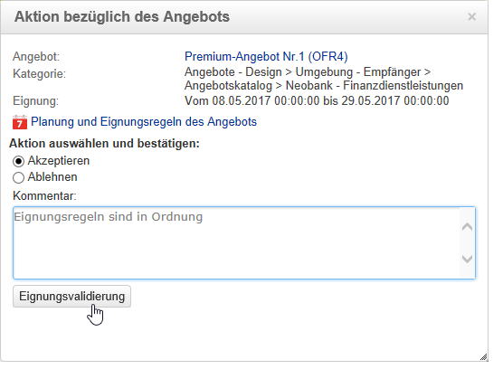

# Angebotsvalidierung{#approving-and-activating-an-offer}

Nach Erstellung seines Inhalts muss ein Angebot validiert werden, um in die Live-Umgebung dupliziert zu werden und somit zur Unterbreitung zur Verfügung zu stehen. Die Validierung bezieht sich sowohl auf den Inhalt als auch auf die Eignung des Angebots.

Ein Banner im Dashboard zeigt den Validierungsstatus an.

## Angebotsinhalte validieren {#approving-offer-content}

Die Validierung des Angebotsinhalts besteht darin, die Darstellung(en) des Angebots auszuwählen, die in der Live-Umgebung zur Verfügung gestellt werden sollen.

Ein Angebotsinhalt hat pro Platzierung eine Darstellung. Da jede Platzierung ihre eigene Struktur und eigene Rendering-Funktionen aufweist, kann die Darstellung eines Angebots je nach Platzierung variieren.

Sie haben daher die Möglichkeit, den Inhalt eines Angebots für gewisse Platzierungen zu validieren, ihn für andere jedoch abzulehnen.

>[!CAUTION]
>
>Sobald Inhalt und Eignung eines Angebots validiert wurden, startet automatisch der Publikations-Workflow (Angebotsbenachrichtigung), welcher das Angebot in die Live-Umgebung dupliziert und für die aktivierten Platzierungen verfügbar macht.

Gehen Sie wie folgt vor, um den Inhalt eines Angebots zu validieren:

1. Klicken Sie im Angebots-Dashboard auf die Schaltfläche **[!UICONTROL Validierung]** und wählen Sie im Kontextmenü die Option **[!UICONTROL Inhalt validieren]** aus.

   

1. Geben Sie für jede Angebotsdarstellung mithilfe der Dropdown-Liste an, ob sie für die Live-Umgebung aktiviert oder in der Design-Umgebung in Bearbeitung gelassen werden soll. Bestätigen Sie Ihre Wahl durch Klick auf die Schaltfläche **[!UICONTROL Inhaltsvalidierung]**.

   

   Nach erfolgter Validierung werden die Informationen im Angebots-Dashboard aktualisiert.

   

   >[!NOTE]
   >
   >Die Kennzeichnung **[!UICONTROL Inhalt validiert]** bedeutet nicht, dass alle Angebotsdarstellungen aktiviert und validiert wurden. Sie bedeutet, dass der Inhaltsvalidierungsprozess abgeschlossen ist, unabhängig davon, ob alle Angebote aktiviert/validiert wurden oder nicht.

## Angebotseignungen validieren {#approving-offer-eligibility}

Die Eignungsvalidierung umfasst die Prüfung der Gewichtung sowie der im Angebot konfigurierten oder aus der übergeordneten Kategorie resultierenden Eignungsregeln.

>[!CAUTION]
>
>Sobald Inhalt und Eignung eines Angebots validiert wurden, startet automatisch der Publikations-Workflow (Angebotsbenachrichtigung), welcher das Angebot in die Live-Umgebung dupliziert und für die aktivierten Platzierungen verfügbar macht.

* Um eine Übersicht aller konfigurierten Regeln zu erhalten, klicken Sie auf **[!UICONTROL Planung und Eignungsregeln des Angebots]**.

   

* Falls Sie die Eignungsregeln ändern möchten, müssen Sie die Eignung zunächst **[!UICONTROL Ablehnen]**. Bestätigen Sie Ihre Wahl durch Klick auf die Schaltfläche **[!UICONTROL Eignungsvalidierung]**.

   

   Die diversen Status werden im Angebots-Dashboard aktualisiert.

   

* Um die Eignung eines Angebots zu akzeptieren, klicken Sie auf die Schaltfläche **[!UICONTROL Eignung validieren]**.

   

   Kreuzen Sie die Option Akzeptieren an, geben Sie gegebenenfalls einen Kommentar ein und klicken Sie zur Bestätigung auf **[!UICONTROL Eignungsvalidierung]**.

   

   Die diversen Status werden im Angebots-Dashboard aktualisiert.

   

## Validierungsverfolgung {#approval-tracking}

Der Validierungsverlauf kann im Dashboard nachvollzogen werden. Klicken Sie hierfür auf den Link **[!UICONTROL Protokoll anzeigen/ausblenden]**.

>[!NOTE]
>
>Auf den Verlauf kann auch im Tab **[!UICONTROL Verfolgung]** des Angebots zugegriffen werden. Hier werden zusätzlich die Kommentare der validierenden Benutzer angezeigt.

## Validierungen zurücksetzen {#restart-the-approval}

Sie haben die Möglichkeit, eine bereits erfolgte Validierung zurückzusetzen. Gehen Sie wie folgt vor:

1. Klicken Sie im Dashboard auf den Link **[!UICONTROL Inhalt validiert]**.
1. Markieren Sie im sich öffnenden **[!UICONTROL Bearbeiten]**-Fenster die Validierung, die rückgängig gemacht werden soll, und klicken Sie auf den Link **[!UICONTROL Validierung zurücksetzen, um sie erneut durchzuführen]**.
1. Klicken Sie zur Bestätigung der Zurücksetzung auf **[!UICONTROL OK]**.

## Angebote freigeben {#publishing-the-offer}

Nach Validierung wird das Angebot für die Live-Umgebung freigegeben. Dies geschieht mithilfe eines technischen Workflows, der automatisch startet, sobald der Validierungszyklus eines Angebots abgeschlossen wurde. Der Workflow **[!UICONTROL Angebotsbenachrichtigung]** startet darüber hinaus stündlich, um die Platzierungen und im Angebotskatalog enthaltene Kategorien der Design-Umgebung mit denen der Live-Umgebung zu synchronisieren.

Das Angebots-Dashboard in der Design-Umgebung enthält alle Informationen bezüglich seiner Freigabe für die Live-Umgebung, insbesondere den dortigen Angebotstitel.

Bei freigegebenen Angeboten werden Sie durch Klick auf den Angebotstitel in die Live-Umgebung weitergeleitet. Das dort angezeigte Dashboard enthält alle relevanten Informationen.

## Angebote deaktivieren {#disabling-an-offer}

Es besteht die Möglichkeit, bereits validierte Angebote zu deaktivieren.

Klicken Sie hierfür im Dashboard des entsprechenden Angebots auf die Schaltfläche **[!UICONTROL Angebot deaktivieren]**.

Sie können darüber hinaus auch ganze Angebotskategorien deaktivieren. Gehen Sie hierfür auf Kategorieebene in den Tab **[!UICONTROL Eignung]** und entfernen Sie das Kreuz im Feld **[!UICONTROL Aktiviert]**.

>[!NOTE]
>
>Wenn Sie ein freigegebenes Angebot löschen, wird es automatisch in der Live-Umgebung deaktiviert. Nach Ablauf der Beibehaltungsdauer der Vorschläge werden die deaktivierten Angebote aus der Live-Umgebung gelöscht.

