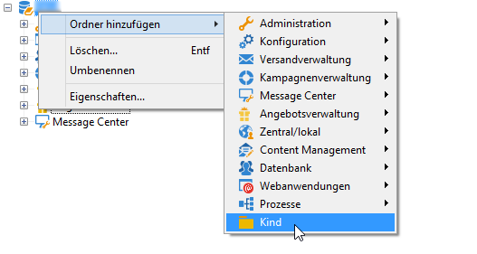
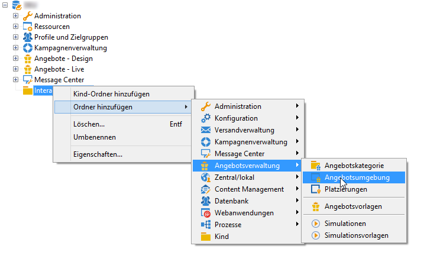
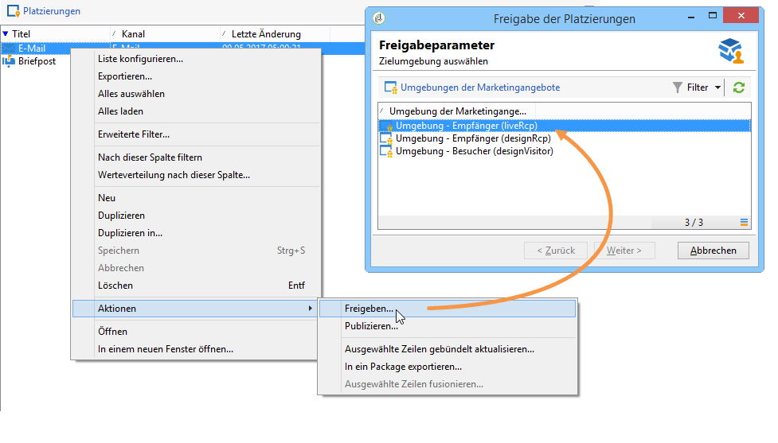

# Erstellung einer Testumgebung{#creating-a-test-environment}

Gehen Sie wie folgt vor, um eine Testumgebung (Sandbox) zu erstellen:

>[!CAUTION]
>
>Verwenden Sie diese Erstellungsmethode für Umgebungen nur für Testumgebungen. Verwenden Sie in allen anderen Fällen den Assistenten für das Zielgruppen-Mapping. Weiterführende Informationen dazu finden Sie unter [Angebotsumgebungen](../../interaction/using/live-design-environments.md#creating-an-offer-environment).

1. Gehen Sie in den Adobe-Campaign-Explorer und markieren Sie die Wurzel der Instanz.
1. Klicken Sie mit der rechten Maustaste und fügen Sie mithilfe des Kontextmenüs einen **[!UICONTROL Kind]**-Ordner hinzu.

   

1. Markieren Sie nun den zuvor erstellten Ordner und fügen Sie einen **[!UICONTROL Angbotsumgebung]**-Ordner hinzu.

   

1. Erstellen Sie auf die gleiche Weise die Unterordner und Elemente der Umgebung und führen Sie die gewünschten Tests durch.
1. Nach Abschluss Ihrer Tests können Sie die in der Testumgebung enthaltenen Elemente zur tatsächlichen Verwendung freigeben. Duplizieren Sie hierzu die Angebote und Platzierungen in Ihre Live-Umgebung (Rechtsklick > **[!UICONTROL Aktionen]** > **[!UICONTROL Freigeben]** ).

   

