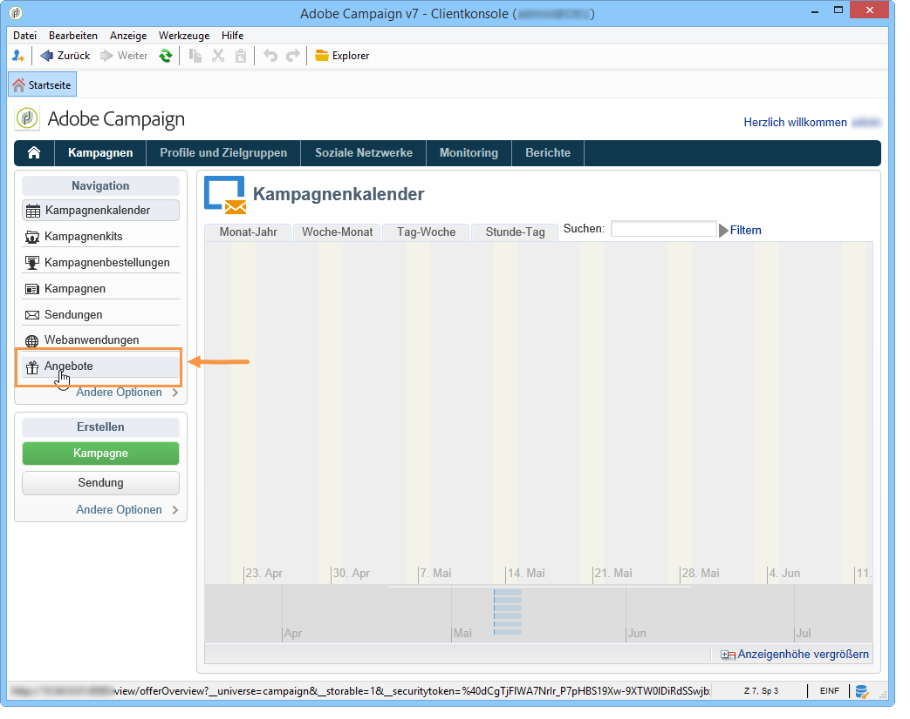

# Erstellung eines Angebots{#creating-an-offer}

## Angebote erstellen {#creating-the-offer}

Gehen Sie wie folgt vor, um ein Angebot zu erstellen:

1. Go to the **[!UICONTROL Campaigns]** universe and click the **[!UICONTROL Offers]** link.

   

1. Click the **[!UICONTROL Create]** button.

   

1. Benennen Sie das Angebot und wählen Sie die Kategorie aus, zu der es gehören soll.

   

1. Click **[!UICONTROL Save]** to create the offer.

   

   Das Angebot ist nun in der Plattform verfügbar und kann konfiguriert werden.

   

## Angebotseignungen konfigurieren {#configuring-offer-eligibility}

In the **[!UICONTROL Eligibility]** tab, define the period the offer will be valid for and can be presented, the filters to apply to the target and the offer weight.

### Verwendungsdaten definieren {#defining-the-eligibility-period-of-an-offer}

Wählen Sie mithilfe der Dropdown-Listen Start und Ende der Verwendung des Angebots aus den Kalendern aus.


Außerhalb dieses Zeitraums wird das Angebot nicht vom Angebotsmodul ausgewählt. Wenn Sie auch auf Ebene der Kategorie Verwendungsdaten definiert haben, kommt nur der sich überschneidende Zeitraum zum Tragen.

### Zielgruppenfilter {#filters-on-the-target}

Sie können mithilfe von Filtern die Zielgruppe der Angebote einschränken.

Klicken Sie dazu auf den **[!UICONTROL Edit query]** Link und wählen Sie den Filter aus, den Sie anwenden möchten. (Siehe [diesen Abschnitt](../../platform/using/steps-to-create-a-query.md#step-4---filter-data)).


Wenn bereits vordefinierte Filter erstellt wurden, können Sie diese in der Liste der Benutzerfilter auswählen. For more on this, refer to [Creating predefined filters](../../interaction/using/creating-predefined-filters.md).


### Angebotsgewichtung {#offer-weight}

Um dem Angebotsmodul die Möglichkeit zu geben, zwischen verschiedenen für eine Person geeigneten Angeboten zu wählen, ist es empfehlenswert, jedem Angebot eine Gewichtung zuzuweisen. Sie können darüber hinaus Filter auf die Zielgruppe anwenden oder die Platzierung, auf die sich das Gewicht beziehen soll, einschränken. Ein Angebot mit einer höheren Gewichtung wird demzufolge einem Angebot mit niedriger Gewichtung vorgezogen.

Es besteht weiterhin die Möglichkeit, für ein Angebot verschiedene Gewichtungen zu definieren, z. B. in Bezug auf einen Zeitraum, eine Zielgruppe oder auch eine Platzierung.

Ein Angebot kann für Kontakte im Alter von 18 bis 25 Jahren eine Gewichtung A aufweisen und eine Gewichtung B für alle Kontakte über 25 Jahre. Einem Angebot, dessen Verwendungszeitraum auf die Sommermonate beschränkt ist, kann im Juli eine Gewichtung A und im August eine Gewichtung B zugewiesen werden.

>[!NOTE]
>
>Die zugewiesene Gewichtung kann vorübergehend entsprechend den Parametern der Kategorie geändert werden, zu der das Angebot gehört. For more on this, refer to [Creating offer categories](../../interaction/using/creating-offer-categories.md).

Gehen Sie wie folgt vor, um eine Gewichtung zu konfigurieren:

1. Klicks **[!UICONTROL Add]**.

   

1. Geben Sie den Wert der Gewichtung an und benennen Sie sie. Standardmäßig wird der Wert 1 zugeteilt.

   

   >[!CAUTION]
   >
   >Bei Angabe von 0 wird das Angebot als für die Zielgruppe nicht infrage kommend angesehen.

1. Geben Sie gegebenenfalls ein Start- und ein Enddatum ein.

   

1. Beschränken Sie bei Bedarf die Anwendung der Gewichtung auf eine bestimmte Platzierung.

   

1. Konfigurieren Sie einen Zielgruppenfilter.

   

1. Klicken Sie zum Abschluss auf **[!UICONTROL OK]**.

   

   >[!NOTE]
   >
   >Wenn ein bestimmtes Angebot mit verschiedenen Gewichtungen für einen Kontakt infrage kommt, wählt das Angebotsmodul die höchste Gewichtung aus. Das Angebotsmodul schlägt pro Abfrage einem Kontakt jedes Angebot maximal einmal vor.

### Übersicht der für ein Angebot konfigurierten Eignungsregeln {#a-summary-of-offer-eligibility-rules}

Im Dashboard des Angebots können Sie auf die Details der Eignungskonfiguration zugreifen.

Klicken Sie zum Anzeigen auf den **[!UICONTROL Schedule and eligibility rules]** Link.


## Angebotsinhalte erstellen {#creating-the-offer-content}

1. Click the **[!UICONTROL Edit]** tab, then click the **[!UICONTROL Content]** tab.

   

1. Füllen Sie die diversen zur Verfügung stehenden Felder aus:

   * **[!UICONTROL Title]** : Geben Sie den Titel an, der in Ihrem Angebot angezeigt werden soll. Warnung: Dies bezieht sich nicht auf die Beschreibung des Angebots, die auf der **[!UICONTROL General]** Registerkarte definiert ist.
   * **[!UICONTROL Destination URL]** : Geben Sie die URL Ihres Angebots an. Um richtig verarbeitet zu werden, muss es mit &quot;http://&quot;oder &quot;https://&quot;beginnen.
   * **[!UICONTROL Image URL]** : Geben Sie eine URL oder einen Zugriffspfad zum Bild Ihres Angebots an.
   * **[!UICONTROL HTML content]** / **[!UICONTROL Text content]** : Geben Sie den Hauptteil Ihres Angebots auf der Registerkarte ein, die Sie möchten. Um eine Verfolgung zu generieren, **[!UICONTROL HTML content]** muss die aus HTML-Elementen bestehen, die in ein `<div>` Typelement eingeschlossen werden können. Beispielsweise lautet das Ergebnis eines `<table>` Elements auf der HTML-Seite wie folgt:

   ```
      <div> 
       <table>
        <tr>
         <th>Month</th>
         <th>Savings</th>   
        </tr>   
        <tr>    
         <td>January</td>
         <td>$100</td>   
        </tr> 
       </table> 
      </div>
   ```

   Die Definition der Akzeptanz-URL wird im Abschnitt Status [konfigurieren angezeigt, wenn der Vorschlag akzeptiert](../../interaction/using/creating-offer-spaces.md#configuring-the-status-when-the-proposition-is-accepted) wird.

   

   Um die erforderlichen Felder zu finden, wie sie bei der Konfiguration des Angebotsraums definiert wurden, klicken Sie auf den **[!UICONTROL Content definitions]** Link, um die Liste anzuzeigen. For more on this, refer to [Creating offer spaces](../../interaction/using/creating-offer-spaces.md).

   

   In unserem Beispiel muss das Angebot mindestens einen Titel, ein Bild, einen HTML-Inhalt und eine Ziel-URL aufweisen.

## Angebotsvorschau {#previewing-the-offer}

Sobald der Angebotsinhalt konfiguriert wurde, können Sie die endgültige Darstellung des Angebots für die Empfänger prüfen. Gehen Sie wie folgt vor:

1.  Klicken Sie auf die **[!UICONTROL Preview]** Registerkarte.

   

1. Wählen Sie die Darstellung aus, die Sie prüfen möchten.

   

1. Wenn Sie den Inhalt des Angebots personalisiert haben, ist die Auswahl eines Empfängers erforderlich, um die Personalisierung prüfen zu können.

   

## Angebotshypothese erstellen {#creating-a-hypothesis-on-an-offer}

Sie haben die Möglichkeit, Hypothesen bezüglich Ihrer Angebotsvorschläge zu definieren. Auf diese Weise lässt sich der Einfluss der Angebote auf die Verkaufszahlen des derart beworbenen Produkts ermitteln.

>[!NOTE]
>
>Die Hypothesen werden mithilfe von Response Manager erstellt. Bitte prüfen Sie Ihren Lizenzvertrag.

Hypotheses carried out on an offer proposition are referenced in their **[!UICONTROL Measure]** tab.

Weiterführende Informationen zum Erstellen von Hypothesen finden Sie auf [dieser Seite](../../campaign/using/about-response-manager.md).


