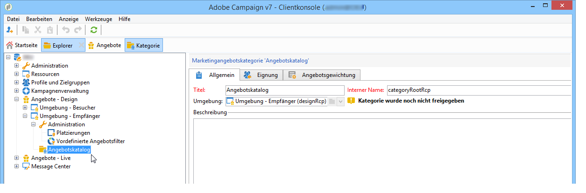
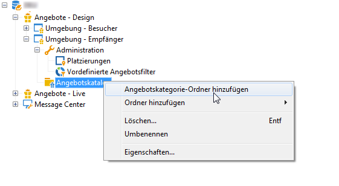
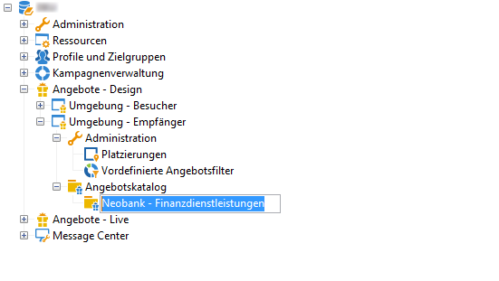
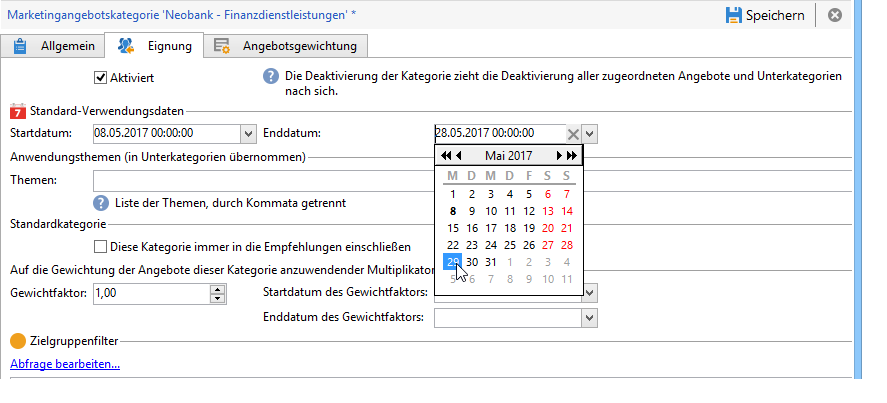
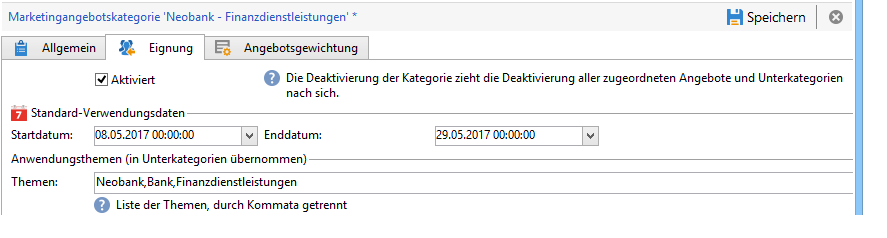
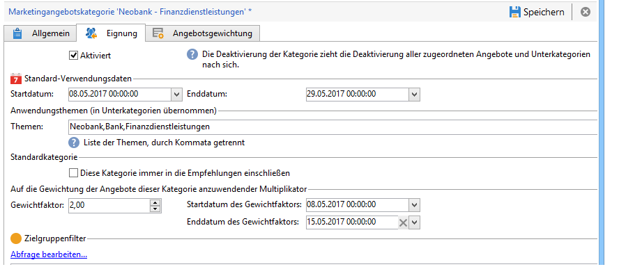
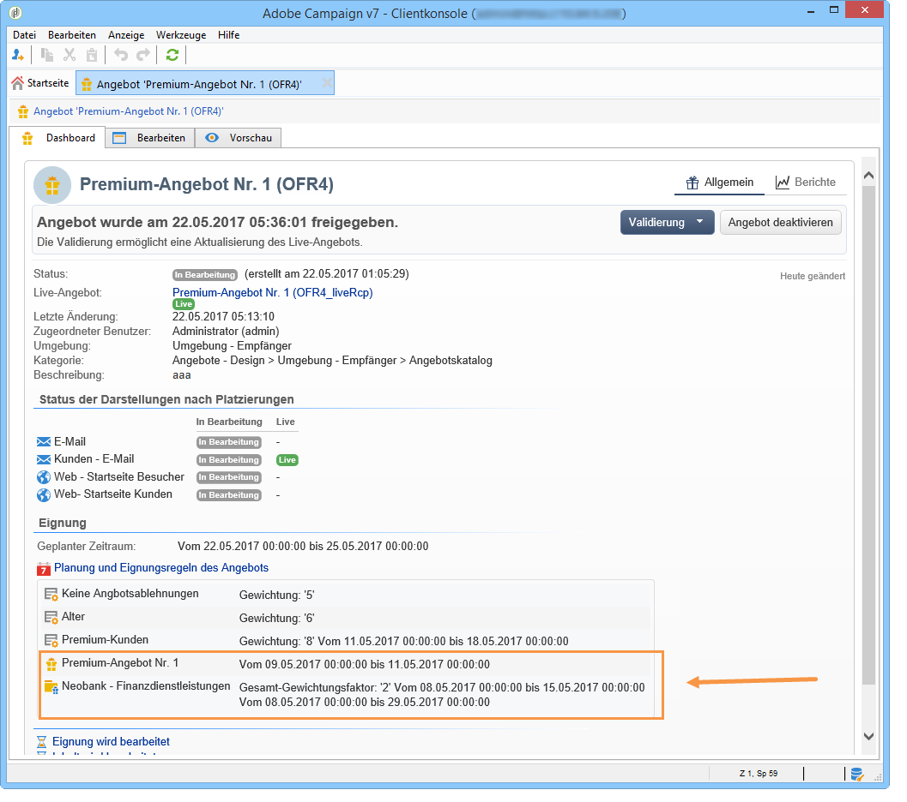

# Angebotskategorien{#creating-offer-categories}

Angebotskategorien werden ausschließlich in der **[!UICONTROL Design-Umgebung]** erstellt. Sie werden automatisch für die **[!UICONTROL Live-Umgebung]** freigegeben (d. h. zur Unterbreitung verfügbar gemacht), wenn die enthaltenen Angebote oder ihre Änderungen validiert wurden. Standardmäßig ist in der **[!UICONTROL Design-Umgebung]** bereits eine Kategorie (der Angebotskatalog) enthalten. Sie haben die Möglichkeit, Unterkategorien zu erstellen, um die Angebote zu ordnen und zu hierarchisieren.

Für jede Kategorie können verschiedene Verwendungsdaten konfiguriert werden. Nach Ablauf des angegebenen Zeitraums stehen die in der Kategorie enthaltenen Angebote nicht mehr zur Unterbreitung zur Verfügung. Sie haben weiterhin die Möglichkeit, Angeboten einer bestimmten Kategorie bei der Auswahl durch das Angebotsmodul den Vorzug einzuräumen, beispielsweise um ein Produkt zeitlich begrenzt besonders hervorzuheben. Definieren Sie hierfür in der Kategorie einen Gewichtfaktor für den gewünschten Zeitraum. Innerhalb dieses Zeitraums wird die Gewichtung der in der Kategorie enthaltenen Angebote mit dem Faktor multipliziert.

Gehen Sie wie folgt vor, um eine neue Kategorie zu erstellen:

1. Markieren Sie im Navigationsbaum den Ordner **[!UICONTROL Angebotskatalog]**.

   

1. Klicken Sie mit der rechten Maustaste und wählen Sie im Kontextmenü die Option **[!UICONTROL Angebotskategorie-Ordner hinzufügen]** aus.

   

1. Benennen Sie die Kategorie. Der Titel kann später auch über den **[!UICONTROL Allgemein]**-Tab der Kategorie geändert werden.

   

   >[!NOTE]
   >
   >Wiederholen Sie diese Schritte gegebenenfalls, bis Sie die gewünschte Anzahl an Kategorien erstellt haben.

   Nun haben Sie je nach Bedarf die Möglichkeit,

   * Assign eligibility dates from the **[!UICONTROL Eligibility]** tab.

      

   * Enter key words that may be used to select offers from within this category, using the **[!UICONTROL Themes]** field.

      

      >[!NOTE]
      >
      >Bei Abfrage des Angebotsmoduls werden nur die Angebote ausgegeben, deren Themen oder Kategorien mit den in der Abfrage angegebenen Parametern übereinstimmen.

   * Temporarily &quot;boost&quot; the offer weight of a category for a given period via the **[!UICONTROL Multiplier weight]** field.

      

Über den Link **[!UICONTROL Planung und Eignungsregeln des Angebots]** im Dashboard der in der Kategorie enthaltenen Angebote können Sie auf die Details der Eignungskonfiguration zugreifen.

