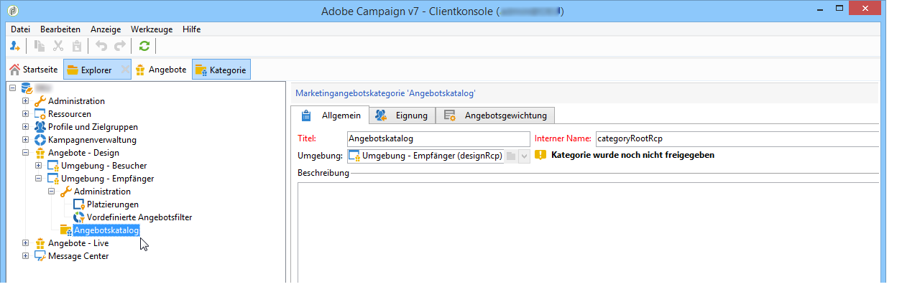
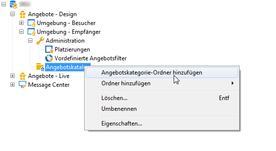
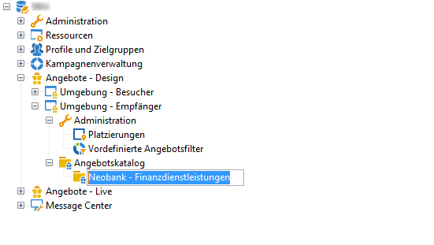
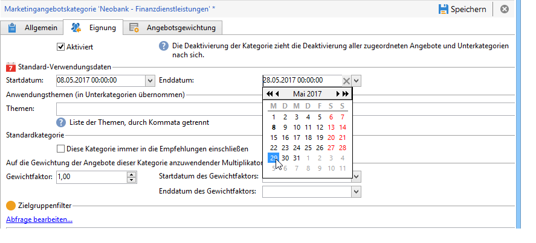
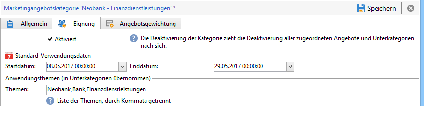
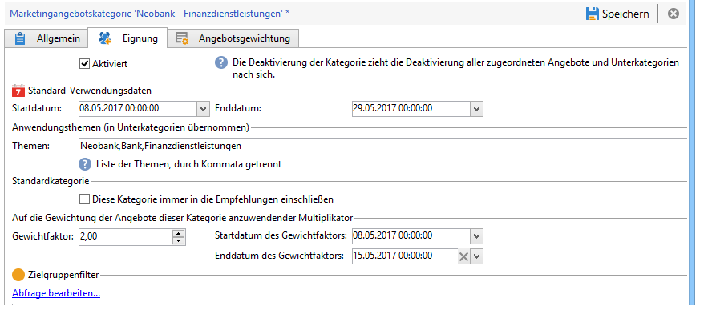
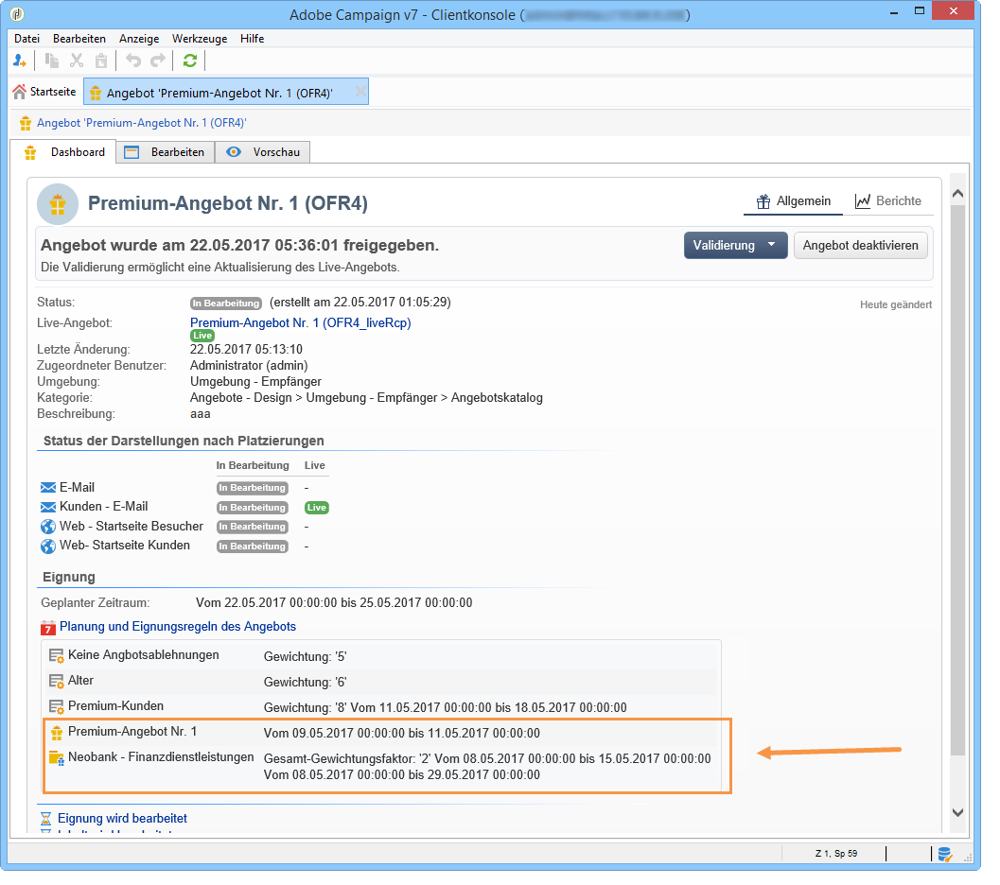

# Erstellen von Angebotskategorien{#creating-offer-categories}

Die Erstellung von Angebotskategorien kann nur in der Umgebung **[!UICONTROL Design]** erfolgen. Sie werden automatisch in der **[!UICONTROL Live]**-Umgebung bereitgestellt, sobald die darin enthaltenen erstellten/geänderten Angebote validiert wurden. Standardmäßig enthält die Umgebung **[!UICONTROL Design]** eine Kategorie, in der alle Angebote empfangen werden sollen. Unterkategorien können erstellt werden, um den Katalogangeboten eine Hierarchie hinzuzufügen.

Für jede Kategorie können Sie ein Eignungsdatum festlegen, d. h. einen Zeitraum, nach dem die in der Kategorie enthaltenen Angebote ihrer Zielgruppe nicht mehr unterbreitet werden dürfen. Wenn Sie möchten, dass die Angebote einer bestimmten Kategorie von der Angebotsmodul-Engine als Priorität ausgewählt werden, um beispielsweise ein Produkt besser verfügbar zu machen, können Sie deren Gewichtung für einen bestimmten Zeitraum erhöhen, indem Sie eine Multiplikationsgewichtung zur Kategorie hinzufügen.

Gehen Sie wie folgt vor, um eine neue Kategorie zu erstellen:

1. Markieren Sie im Navigationsbaum den Ordner **[!UICONTROL Angebotskatalog]**.

   

1. Klicken Sie mit der rechten Maustaste und wählen Sie im Kontextmenü die Option **[!UICONTROL Neuen Angebotskategorie-Ordner erstellen]** aus.

   

1. Benennen Sie die Kategorie. Der Titel kann später auch über den **[!UICONTROL Allgemein]**-Tab der Kategorie geändert werden.

   

   >[!NOTE]
   >
   >Wiederholen Sie diese Schritte gegebenenfalls, bis Sie die gewünschte Anzahl an Kategorien erstellt haben.

   Nun haben Sie je nach Bedarf die Möglichkeit,

   * im Tab **[!UICONTROL Eignung]** Daten für die Verwendung zuzuweisen.

     

   * im Feld **[!UICONTROL Themen]** Schlüsselwörter anzugeben, die eine spätere Auswahl der in der Kategorie enthaltenen Angebote erleichtern.

     

     >[!NOTE]
     >
     >Bei Abfrage des Angebotsmoduls werden nur die Angebote ausgegeben, deren Themen oder Kategorien mit den in der Abfrage angegebenen Parametern übereinstimmen.

   * im Feld **[!UICONTROL Angebotsgewichtung]** können Sie die Gewichtung von einer Kategorie zugehörigen Angeboten für einen von Ihnen festgelegten Zeitraum erhöhen.

     

Eine Zusammenfassung der Eignungsregeln finden Sie im Dashboard der in der Kategorie enthaltenen Angebote. Um sie anzuzeigen, klicken Sie auf den Link **[!UICONTROL Zeitplan und Eignungsregeln des Angebots]**.

