# Angebotsplatzierungen{#creating-offer-spaces}

Die Erstellung von Platzierungen erfolgt in der Design-Umgebung. Sie erfordert ein Benutzerprofil vom Typ **Technischer Administrator** mit Zugriff auf den Platzierungs-Unterordner. Die Platzierungen eines Angebots werden automatisch in die Live-Umgebung dupliziert, sobald das entsprechende Angebot validiert wurde.

Der Inhalt der im Katalog enthaltenen Angebote wird in den Platzierungen konfiguriert. Standardmäßig kann der Inhalt folgende Felder beinhalten: **[!UICONTROL Titel]**, **[!UICONTROL Ziel-URL]**, **[!UICONTROL Bild-URL]**, **[!UICONTROL HTML-Inhalt]** und **[!UICONTROL Textinhalt]**. Die Reihenfolge der Felder wird ebenfalls in den Platzierungen bestimmt.

In den erweiterten Parametern können Sie Identifikationsschlüssel für Kontakte definieren. Diese können aus mehreren Elementen (z. B. Name und E-Mail-Adresse) zusammengesetzt sein. Die Vorgehensweise wird im Abschnitt [Angebote für identifizierte Kontakte](../../interaction/using/integration-via-javascript--client-side-.md#presenting-an-identified-offer) erläutert.

Die HTML- oder XML-Darstellungen werden über Rendering-Funktionen definiert. Die in der jeweiligen Rendering-Funktion definierte Reihenfolge der Felder muss mit der im Inhalt definierten übereinstimmen.

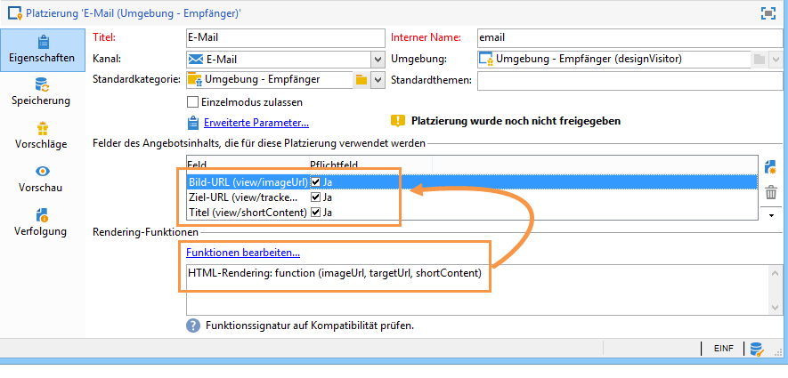

Gehen Sie wie folgt vor, um eine neue Platzierung zu erstellen:

1. Klicken Sie auf **[!UICONTROL Neu]** in der Liste der Platzierungen.

   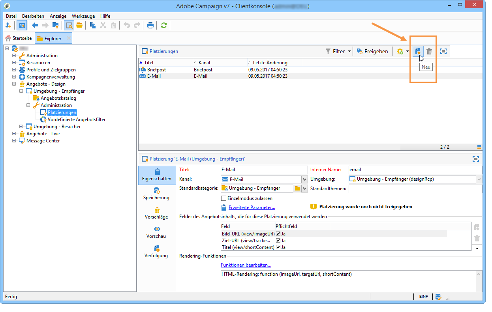

1. Benennen Sie die Platzierung und wählen Sie aus der Dropdown-Liste den E-Mail-Kanal aus.

   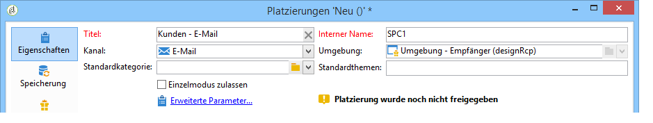

1. Kreuzen Sie die Option **[!UICONTROL Einzelmodus zulassen]** an, wenn einer der beiden folgenden Fälle für Sie zutrifft:

   * Sie verwenden Interaction in Kombination mit Message Center,
   * Sie verwenden den Interaction-Einzelmodus (eingehende Interaktionen).

1. Klicken Sie dann im Bereich **[!UICONTROL Felder des Angebotsinhalts]** auf **[!UICONTROL Hinzufügen]**.

   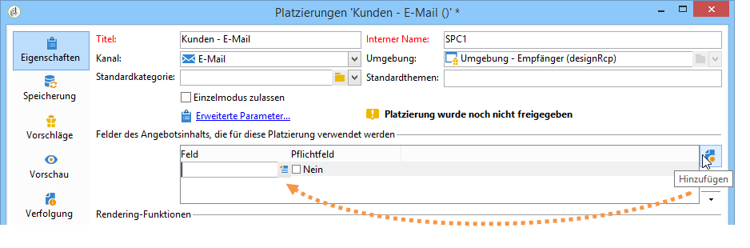

1. Wählen Sie aus dem **[!UICONTROL Inhalt]**-Knoten unter Berücksichtigung der Reihenfolge folgende Felder aus: **[!UICONTROL Titel]**, **[!UICONTROL Bild-URL]**, **[!UICONTROL HTML-Inhalt]** und schließlich **[!UICONTROL Ziel-URL]**.

   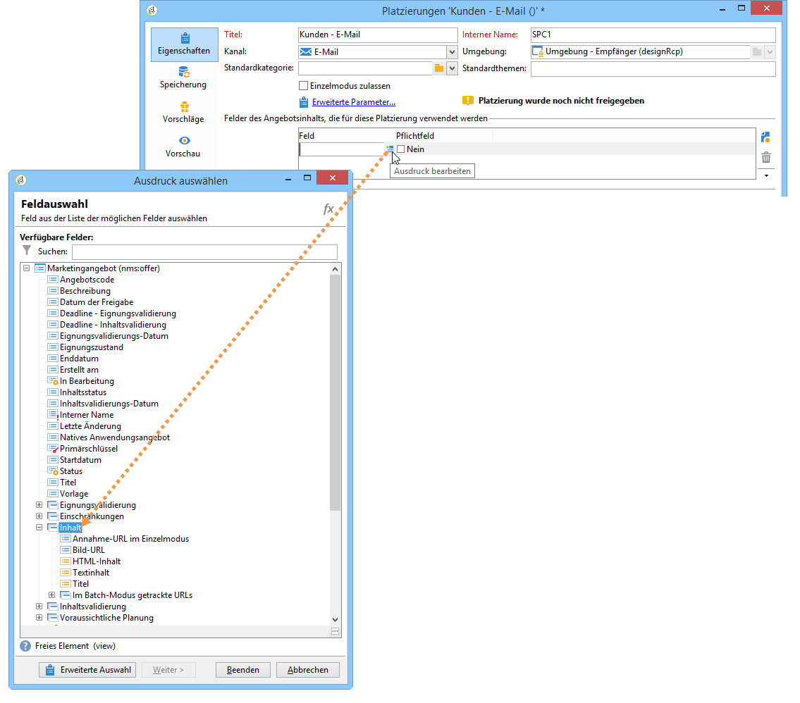

1. Machen Sie jedes Feld zum **[!UICONTROL Pflichtfeld]**.

   >[!NOTE]
   >
   >Dieser Parameter wird bei der Vorschau verwendet und verhindert die Publikation der Platzierungen, falls eines der Pflichtfelder nicht ausgefüllt wurde. Wenn ein Angebot jedoch bereits für eine Platzierung freigegeben wurde, wird diese Bedingung nicht berücksichtigt.

   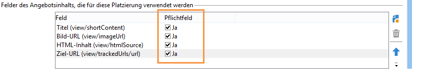

1. Klicken Sie auf **[!UICONTROL Funktionen bearbeiten...]**, um eine Rendering-Funktion zu erstellen.

   Diese Funktionen dienen der Erzeugung der Angebotsdarstellung in einer Platzierung. Sie haben die Wahl zwischen verschiedenen Formaten: HTML oder Text für ausgehende Interaktionen und XML für eingehende Interaktionen.

   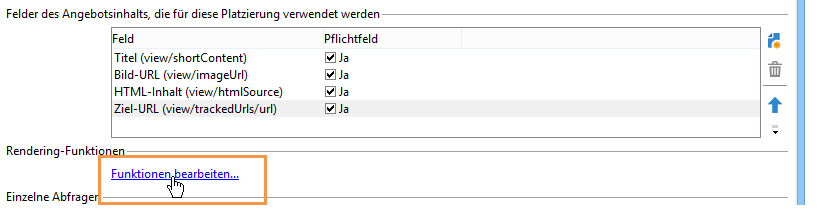

1. Gehen Sie in den **[!UICONTROL HTML-Rendering]**-Tab und kreuzen Sie die Option **[!UICONTROL HTML-Rendering-Funktion überschreiben]** an.
1. Geben Sie nun Ihre Rendering-Funktion ein.

   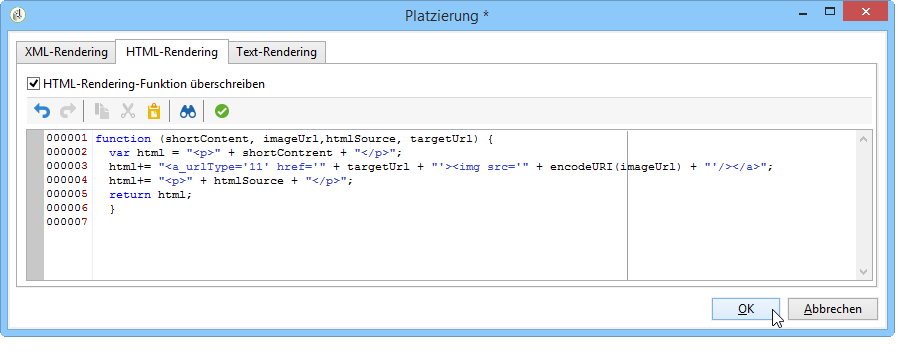

Für eingehende Interaktionen können die XML-Rendering-Funktionen, für ausgehende die HTML- und Text-Rendering-Funktionen überschrieben werden. Weitere Informationen finden Sie unter [Über eingehende Kanäle](../../interaction/using/about-inbound-channels.md).

## Status von Angebotsvorschlägen {#offer-proposition-statuses}

Angebotsvorschläge können je nach Interaktion mit der Zielgruppe verschiedene Status aufweisen. Interaction enthält hierfür werksmäßig eine Reihe von Werten, die dem Angebotsvorschlag über seinen Lebenszyklus hinweg zugewiesen werden können. Es ist jedoch an Ihnen, die Plattform dahingehend zu konfigurieren, dass der bei Angebotsvorschlagserzeugung zugewiesene Status bei Annahme des Vorschlags durch einen Kontakt wechselt.

>[!NOTE]
>
>Die Aktualisierung des Vorschlagsstatus geschieht zeitverzögert. Sie erfolgt durch den Tracking-Workflow, der stündlich startet.

### Werksmäßig enthaltene Status {#status-list}

Folgende Status sind bereits in Interaction enthalten und können zur Kennzeichnung der Angebotsvorschläge verwendet werden:

* **[!UICONTROL Akzeptiert]**,
* **[!UICONTROL Zeitversetzt]**,
* **[!UICONTROL Erzeugt]**,
* **[!UICONTROL Interessant]**,
* **[!UICONTROL Unterbreitet]**,
* **[!UICONTROL Zurückgewiesen]**.

Diese Status werden nicht standardmäßig angewendet, sie müssen zuvor konfiguriert werden.

>[!NOTE]
>
>Der Status eines Angebotsvorschlags wird automatisch in &quot;Unterbreitet&quot; geändert, wenn das Angebot mit einem Versand verknüpft ist, dessen Status &quot;Gesendet&quot; lautet.

### Konfiguration des Status bei Erzeugung des Vorschlags {#configuring-the-status-when-the-proposition-is-created}

Sobald ein Vorschlag durch das Angebotsmodul erzeugt wird, wechselt sein Status. Dies gilt sowohl für eingehende als auch ausgehende Interaktionen. Die Auswahl eines Werts aus der Liste der möglichen Status hängt von der Konfiguration der Angebotsplatzierungen in der **[!UICONTROL Design-Umgebung]** ab.

Sie können je nach Platzierung unterschiedliche, bei der Angebotserzeugung zuzuweisende Status konfigurieren, je nachdem, welche Informationen Sie in den Angebotsberichten anzeigen möchten.

Gehen Sie dazu wie folgt vor:

1. Gehen Sie in den **[!UICONTROL Speicherung]**-Tab der zu konfigurierenden Platzierung.
1. Wählen Sie den Status aus, der bei der Vorschlagserzeugung zugewiesen werden soll.

   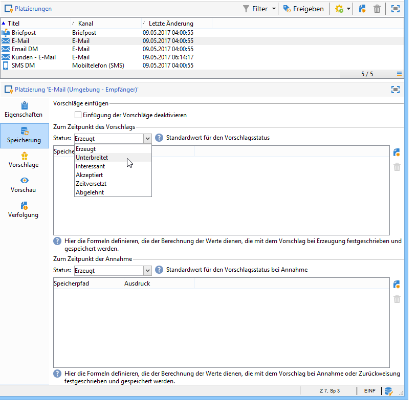

### Konfiguration des Status bei Annahme des Vorschlags {#configuring-the-status-when-the-proposition-is-accepted}

Konfigurieren Sie den bei Annahme eines Vorschlags anzuzeigenden Status, indem Sie einen der werksmäßig gelieferten Werte auswählen. Sobald ein Empfänger auf einen der im Angebot enthaltenen Links klickt, wird das Angebotsmodul abgefragt und dadurch der Statuswechsel ausgelöst.

Gehen Sie dazu wie folgt vor:

1. Gehen Sie in den **[!UICONTROL Speicherung]**-Tab der zu konfigurierenden Platzierung.
1. Wählen Sie den Status aus, den der Vorschlag erhalten soll, nachdem er akzeptiert wurde.

   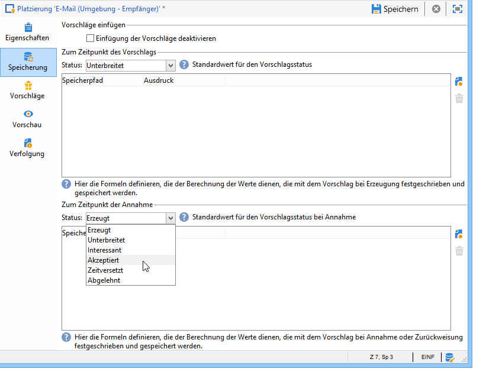

**Eingehende Interaktionen**

Über den Tab **[!UICONTROL Speicherung]** können Sie nur die Status für **unterbreitete** und **akzeptierte** Angebotsvorschläge definieren. Für eingehende Interaktionen sollte der Status von Angebotsvorschlägen nicht über die Schnittstelle, sondern direkt in der URL definiert werden, über die das Angebotsmodul aufgerufen wird. Auf diese Weise können Sie festlegen, welche Status in anderen Szenarien angewendet werden (z. B. wenn ein Angebotsvorschlag abgelehnt wird).

```
<BASE_URL>?a=UpdateStatus&p=<PRIMARY_KEY_OF_THE_PROPOSITION>&st=<NEW_STATUS_OF_THE_PROPOSITION>&r=<REDIRECT_URL>
```

So enthält beispielsweise der auf der **Neobank**-Webseite angezeigte Vorschlag mit Kennung **40004** zum Abschluss einer **Hausratsversicherung** folgende URL:

```
<BASE_URL>?a=UpdateStatus&p=<40004>&st=<3>&r=<"http://www.neobank.com/insurance/subscribe.html">
```

Wenn nun ein Besucher auf den Vorschlag und somit auf die URL klickt, wird dem Vorschlag der Status **[!UICONTROL Akzeptiert]** (entspricht dem Wert **3**) zugewiesen und der Besucher wird auf eine andere Seite der **Neobank**-Webseite weitergeleitet, um die Versicherung abzuschließen.

>[!NOTE]
>
>Wenn Sie in der URL einen anderen Status festlegen möchten (z. B. wenn ein Angebotsvorschlag abgelehnt wird), verwenden Sie den dem gewünschten Status entsprechenden Wert. Beispiel: **[!UICONTROL Abgelehnt]** = &quot;5&quot;, **[!UICONTROL Unterbreitet]** = &quot;1&quot; usw.
>
>Status und die ihnen zugehörigen Werte können aus dem Datenschema **[!UICONTROL Angebotsvorschläge (nms)]** abgerufen werden. Näheres hierzu finden Sie auf [dieser Seite](../../configuration/using/data-schemas.md).

**Ausgehende Interaktionen**

Bei ausgehenden Interaktionen besteht die Möglichkeit, dem Angebotsvorschlag automatisch den Status **[!UICONTROL Interessant]** zuzuweisen, wenn der Versand einen Link enthält. Fügen Sie hierfür den Wert **_urlType=&quot;11&quot;** in den Link ein:

```
<a _urlType="11" href="<DEST_URL>">Link inserted into the delivery</a>
```

## Vorschau der Angebote in der Platzierung {#offer-preview-per-space}

Im Vorschau-Tab können Sie die für einen Empfänger infrage kommenden Angebote einer einzelnen Platzierung ansehen. In unten stehenden Beispiel kommen für den ausgewählten Empfänger drei Vorschläge für die Briefpost-Platzierung infrage:

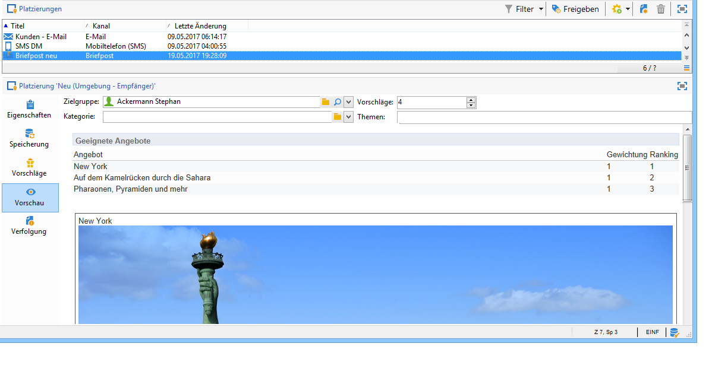

Sollte kein Angebot für einen Empfänger infrage kommen, ist dies in der Vorschau leicht erkennbar:

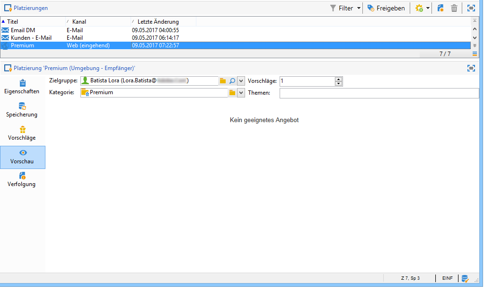

Die Vorschau kann Kontexte ignorieren, wenn diese auf eine Platzierung beschränkt sind. Dies ist der Fall, wenn das Interaktionsschema um Felder erweitert wurde, auf die in einer Platzierung mit einem eingehenden Kanal verwiesen wird (Weitere Informationen hierzu finden Sie im [Beispiel einer Erweiterung](../../interaction/using/extension-example.md)).
