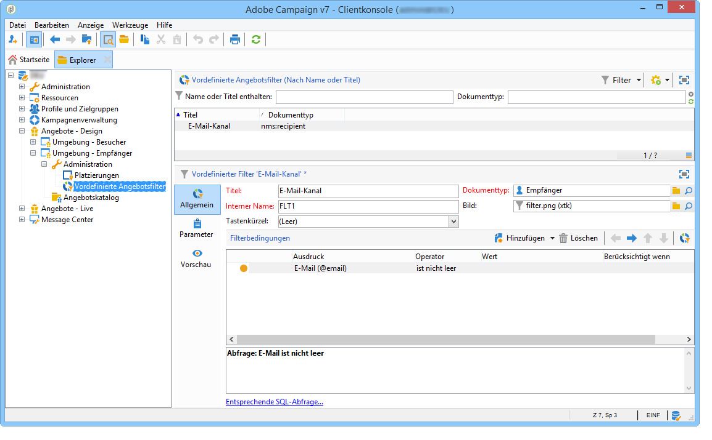
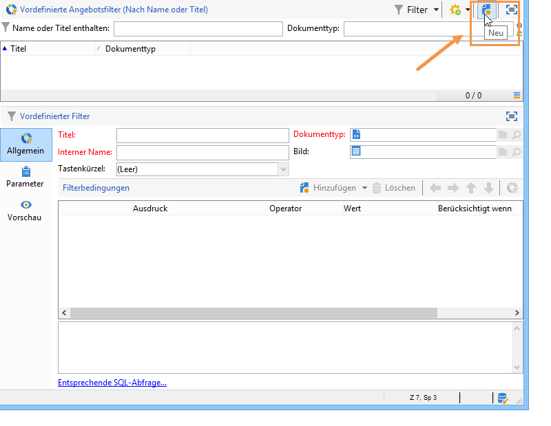
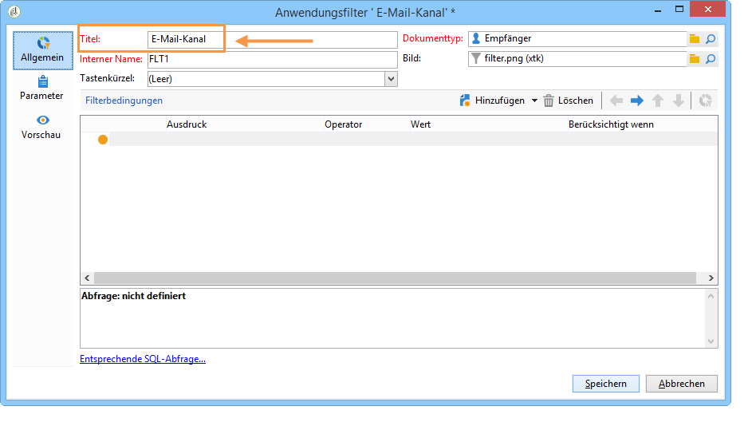
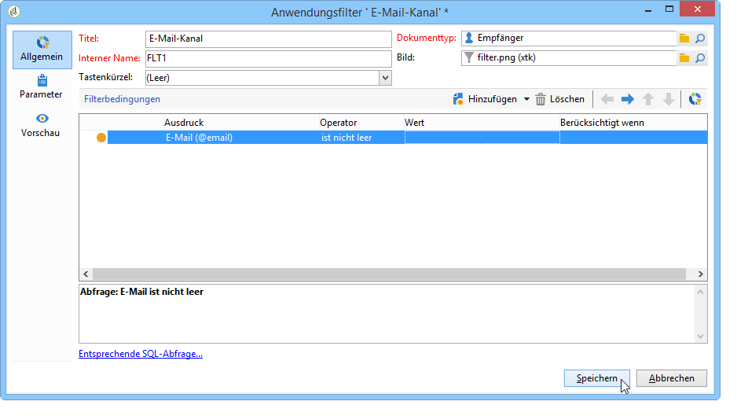
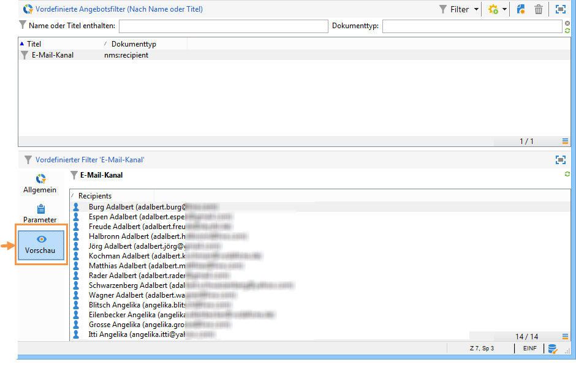

# Vordefinierte Filter{#creating-predefined-filters}

Vordefinierte Filter erleichtern die Erstellung von auf die Zielgruppe anwendbaren Eignungsregeln, die bei der Angebotskonfiguration verwendet werden können. Die Filter beziehen sich jeweils auf eine Umgebung und können Angebotsparameter berücksichtigen.

Gehen Sie wie folgt vor, um einen Filter zu erstellen:

1. Markieren Sie im Ordner **[!UICONTROL Administration]** der jeweiligen Umgebung den Knoten **[!UICONTROL Vordefinierte Angebotsfilter]**.

   

1. Klicken Sie auf **[!UICONTROL Neu]**.

   

1. Benennen Sie den Filter.

   

1. Wählen Sie nun das Feld aus, auf das sich die Filterbedingung beziehen soll.

   

1. Geben Sie den Operator und gegebenenfalls einen Wert an und speichern Sie die Abfrage.

   

1. Durch Klick auf den **[!UICONTROL Vorschau]**-Tab können Sie das Ergebnis des Filters prüfen.

   

**Verwandtes Thema**

* [Häufig verwendete Abfragen als bearbeitbare vordefinierte Filter speichern](https://helpx.adobe.com/de/campaign/kb/simplifying-campaign-management-acc.html#Savefrequentlyusedqueriesaseditablepredefinedfilters)