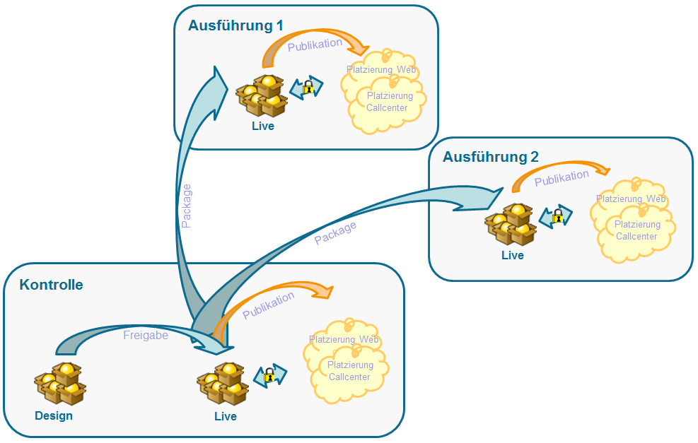
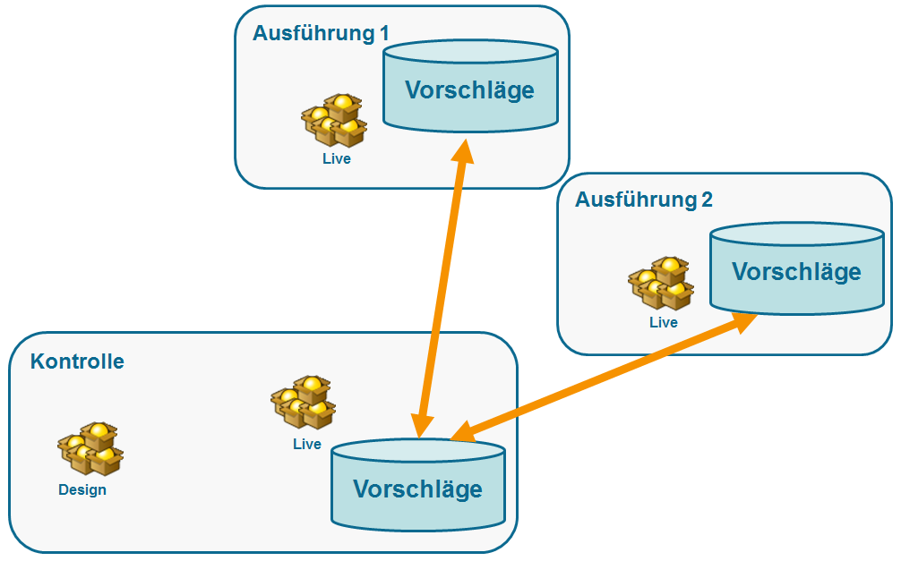
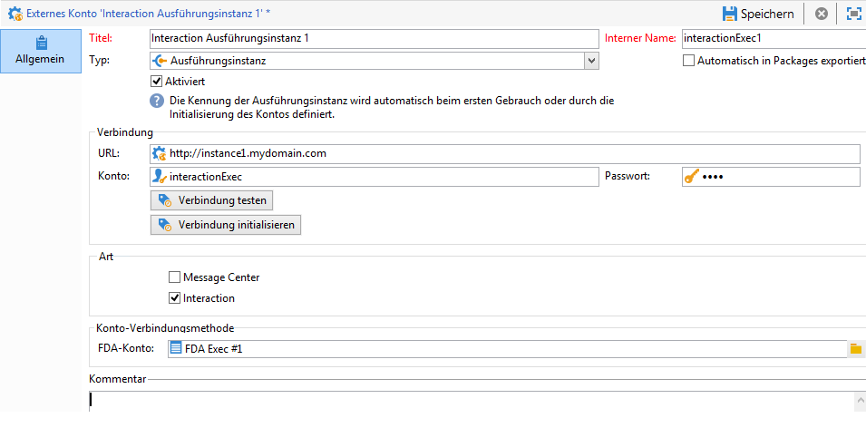
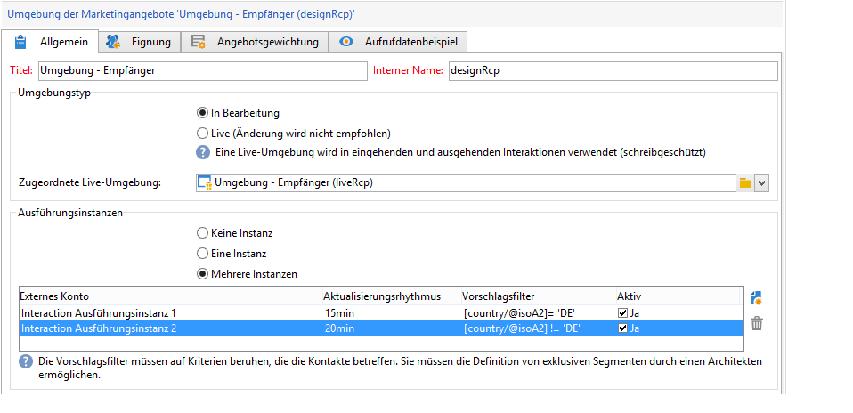
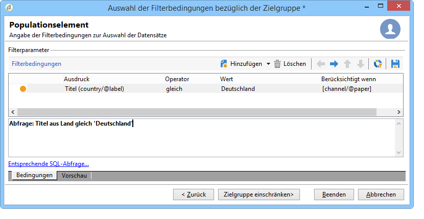

# Verteilte Architekturmodelle{#distributed-architectures}


## Funktionsprinzip {#principle}

Um die Skalierbarkeit zu unterstützen und rund um die Uhr Service für den eingehenden Kanal zu bieten, können Sie Interaction mit einer verteilten Architektur verwenden. Diese Art von Architektur wird bereits mit Message Center verwendet und besteht aus mehreren Instanzen:

* einer oder mehrerer Kontrollinstanzen für den ausgehenden Kanal, welche die Marketing-Datenbank und die Design-Umgebung beherbergen;
* einer oder mehrerer Ausführungsinstanzen für den eingehenden Kanal.



>[!NOTE]
>
>Kontrollinstanzen sind dem eingehenden Kanal vorbehalten und enthalten die Online-Version des Katalogs. Jede Ausführungsinstanz ist unabhängig und einem Kontaktsegment gewidmet (z. B. einer Ausführungsinstanz pro Land). Aufrufe des Angebotsmoduls müssen direkt an der Ausführung durchgeführt werden (eine spezifische URL pro Ausführungsinstanz). Da die Synchronisation zwischen Instanzen nicht automatisch erfolgt, müssen Interaktionen desselben Kontakts über dieselbe Instanz gesendet werden.

## Vorschlagssynchronisation {#proposition-synchronization}

Die Angebotssynchronisierung erfolgt über Pakete. In Ausführungsinstanzen wird allen Katalogobjekten der externe Kontoname vorangestellt. Dies bedeutet, dass mehrere Kontrollinstanzen (z. B. Entwicklungs- und Produktionsinstanzen) auf derselben Ausführungsinstanz unterstützt werden können.

>[!IMPORTANT]
>
>Es wird dringend empfohlen, kurze und ausdrucksstarke interne Namen zu verwenden.

Die Bereitstellung und Veröffentlichung der Angebote in den Ausführungs- und Kontrollinstanzen erfolgt automatisch.

In der Design-Umgebung gelöschte Angebote werden in allen Live-Instanzen deaktiviert. Obsolete Vorschläge und Angebote werden nach Ablauf der durch die Bereinigungsparameter im Bereitstellungassistenten aller Instanzen definierten Frist und des in den Typologieregeln definierten beweglichen Zeitraums automatisch gelöscht.



Für jede Umgebung und jedes externe Konto wird ein Workflow für die Vorschlagssynchronisierung erstellt. Die Synchronisierungsfrequenz kann für jede Umgebung und jedes externe Konto angepasst werden.

## Einschränkungen {#limitations}

* Wenn Sie die Funktion zum Wechsel von einer anonymen in eine identifizierte Umgebung (fall back) nutzen möchten, müssen sich die beiden betroffenen Umgebungen in derselben Ausführungsinstanz befinden.
* Die Synchronisierung zwischen mehreren Ausführungsinstanzen wird nicht in Echtzeit durchgeführt. Interaktionen desselben Kontakts müssen an dieselbe Instanz gesendet werden. Die Kontrollinstanz muss dem ausgehenden Kanal zugeordnet sein (keine Echtzeit).
* Die Marketing-Datenbank wird nicht automatisch synchronisiert. Die in den Gewichtungs- und Eignungsregeln verwendeten Marketing-Daten müssen in Ausführungsinstanzen dupliziert werden. Dieser Prozess ist nicht standardmäßig, Sie müssen ihn während der Integrationsphase entwickeln.
* Die Synchronisation von Vorschlägen erfolgt ausschließlich über FDA-Verbindung.
* Falls Sie Interaction und Message Center auf derselben Instanz verwenden, erfolgt die Synchronisation in beiden Fällen über das FDA-Protokoll.

## Package-Konfiguration {#packages-configuration}

Eventuelle Schemaerweiterungen in direktem Zusammenhang mit **Interaktion** (Angebote, Vorschläge, Empfänger usw.) Muss auf den Ausführungsinstanzen bereitgestellt werden.

Das Package Interaction muss auf allen Instanzen installiert sein (Kontrolle und Ausführung). Zwei zusätzliche Pakete sind verfügbar: ein Paket, das auf den Kontrollinstanzen installiert werden soll, und ein weiteres, das auf jeder Ausführungsinstanz installiert werden soll.

>[!NOTE]
>
>Wenn Sie das Paket installieren **werden die Felder vom** long **der Tabelle nms:proposition**, z. B. die Vorschlagskennung, zu Feldern vom Typ **int64**. Weiterführende Informationen zu Datentypen finden Sie in diesem [Abschnitt](../../configuration/using/schema-structure.md#mapping-the-types-of-adobe-campaign-dbms-data).

Die Aufbewahrungsdauer der Daten muss für jede Instanz konfiguriert werden (über das Fenster **[!UICONTROL Datenbereinigung]** im Bereitstellungsassistenten). Bei Ausführungsinstanzen muss dieser Zeitraum der historischen Tiefe entsprechen, die für die Berechnung von Typologieregeln (beweglicher Zeitraum) und Eignungsregeln erforderlich ist.

Bei den Kontrollinstanzen müssen Sie darüber hinaus:

1. Ein externes Konto pro Ausführungsinstanz erstellen:

   

   * Geben Sie einen Titel sowie einen kurzen und expliziten internen Namen an.
   * Wählen Sie den Typ **[!UICONTROL Ausführungsinstanz]** aus.
   * Kreuzen Sie die Option **[!UICONTROL Aktiviert]** an.
   * Geben Sie die Verbindungsparameter zur Ausführungsinstanz an.
   * Jeder Ausführungsinstanz muss eine Kennung zugeordnet werden. Dies geschieht durch Klick auf die Schaltfläche **[!UICONTROL Verbindung initialisieren]**.
   * Kreuzen Sie die verwendete Anwendung an: **[!UICONTROL Message Center]**, **[!UICONTROL Interaction]** oder beide.
   * Geben Sie das verwendete FDA-Konto ein. Auf den Ausführungsinstanzen muss ein Benutzer erstellt werden, der über die folgenden Lese- und Schreibrechte für die Datenbank der betreffenden Instanz verfügt:

     ```
     grant SELECT ON nmspropositionrcp, nmsoffer, nmsofferspace, xtkoption, xtkfolder TO user;
     grant DELETE, INSERT, UPDATE ON nmspropositionrcp TO user;
     ```

   >[!NOTE]
   >
   >Die IP-Adresse der Kontrollinstanz muss in den Ausführungsinstanzen zugelassen sein.

1. Die Umgebung konfigurieren:

   

   * Geben Sie alle Ausführungsinstanzen an.
   * Definieren Sie für jede Instanz den Aktualisierungsrhythmus und die Vorschlagsfilter (z. B. nach Land).

     >[!NOTE]
     >
     >Wenn ein Fehler auftritt, können Sie die Synchronisierungs-Workflows und Angebotsbenachrichtigungen einsehen. Diese sind in den technischen Workflows der Anwendung zu finden.

Wenn aus Optimierungsgründen nur ein Teil der Marketing-Datenbank in den Ausführungsinstanzen dupliziert wird, können Sie ein eingeschränktes, mit der Umgebung verknüpftes Schema angeben, damit die Benutzer nur Daten verwenden können, die in den Ausführungsinstanzen verfügbar sind. Sie können ein Angebot mit Daten erstellen, die in Ausführungsinstanzen nicht verfügbar sind. Dazu müssen Sie die Regel für die anderen Kanäle deaktivieren, indem Sie diese Regel auf den ausgehenden Kanal (**[!UICONTROL Wird berücksichtigt, wenn]** -Feld).



## Wartungsoptionen {#maintenance-options}

Folgende Wartungsoptionen stehen für die Kontrollinstanz zur Verfügung:

>[!IMPORTANT]
>
>Diese Optionen sind nur bei klar definierten Wartungsbedarfen zu nutzen.

* **`NmsInteraction_LastOfferEnvSynch_<offerEnvId>_<executionInstanceId>`**: Datum der letzten Synchronisation einer Umgebung in einer bestimmten Instanz.
* **`NmsInteraction_LastPropositionSynch_<propositionSchema>_<executionInstanceIdSource>_<executionInstanceIdTarget>`**: Datum der letzten Synchronisation der Vorschläge eines bestimmten Schemas zwischen zwei Instanzen.
* **`NmsInteraction_MapWorkflowId`**: Option, die die Liste aller erzeugten Synchronisations-Workflows enthält.

Die folgende Option steht für Ausführungsinstanzen zur Verfügung:

**NmsExecutionInstanceId**: Option, die die Instanzkennung enthält.

## Package-Installation {#packages-installation}

Wenn Ihre Instanz zuvor nicht über das Interaction -Package verfügt hat, ist keine Migration erforderlich. Standardmäßig liegt die Vorschlagstabelle nach der Installation der Pakete in 64 Bit vor.

>[!IMPORTANT]
>
>Je nach Anzahl an existierenden Vorschlägen in Ihrer Instanz kann dieser Vorgang sehr zeitintensiv sein.

* Wenn Ihre Instanz nur über wenige oder gar keine Vorschläge verfügt, ist keine manuelle Änderung der Vorschlagstabelle erforderlich. Die Änderung wird vorgenommen, wenn Pakete installiert werden.
* Wenn Ihre Instanz viele Vorschläge hat, ist es besser, die Struktur der Vorschlagstabelle zu ändern, bevor Sie die Steuerungspakete installieren und ausführen. Es wird empfohlen, die Abfragen während eines Zeitraums mit geringer Aktivität auszuführen.

>[!NOTE]
>
>Falls Sie spezifische Konfigurationen in Ihrer Vorschlagstabelle vorgenommen haben, müssen die Abfragen entsprechend angepasst werden.

### PostgreSQL {#postgresql}

Es gibt zwei Methoden. Der erste (mit einer Arbeitstabelle) ist etwas schneller.

**Arbeitstabellen**

```
CREATE TABLE NmsPropositionRcp_tmp AS SELECT * FROM nmspropositionrcp WHERE 0=1;
ALTER TABLE nmspropositionrcp_tmp
  ALTER COLUMN ipropositionid TYPE bigint,
  ALTER COLUMN iinteractionid TYPE bigint;
INSERT INTO nmspropositionrcp_tmp SELECT * FROM nmspropositionrcp;
DROP TABLE nmspropositionrcp;
CREATE INDEX proposition_id ON NmsPropositionRcp (ipropositionid);
CREATE INDEX nmspropositionrcp_deliveryid ON NmsPropositionRcp (ideliveryid);
CREATE INDEX nmspropositionrcp_lastmodified ON NmsPropositionRcp (tslastmodified);
CREATE INDEX nmspropositionrcp_offerid ON NmsPropositionRcp (iofferid);
CREATE INDEX nmspropositionrcp_offerspaceid ON NmsPropositionRcp (iofferspaceid);
CREATE INDEX nmspropositionrcp_recipientidid ON NmsPropositionRcp (irecipientid);
ALTER TABLE nmspropositionrcp_tmp RENAME TO nmspropositionrcp;
```

**Alter Table**

```
ALTER TABLE nmspropositionrcp
  ALTER COLUMN ipropositionid TYPE bigint,
  ALTER COLUMN iinteractionid TYPE bigint;
```

### Oracle {#oracle}

Das Bearbeiten der Größe eines **Zahl**-Typs führt nicht dazu, dass Werte oder der Index neu geschrieben werden. Es handelt sich also um eine sofortige Maßnahme.

Die auszuführende Abfrage stellt sich wie folgt dar:

```
ALTER TABLE nmspropositionrcp MODIFY (
ipropositionid NUMBER(19, 0),
iinteractionid NUMBER(19, 0)
);
```

### MSSQL {#mssql}

Die auszuführenden Abfragen stellen sich wie folgt dar:

```
SELECT * INTO NmsPropositionRcp_tmp FROM NmsPropositionRcp WHERE 1 = 0;
GO
ALTER TABLE NmsPropositionRcp_tmp ALTER COLUMN ipropositionid BIGINT;
GO
ALTER TABLE NmsPropositionRcp_tmp ALTER COLUMN iinteractionid BIGINT;
GO
INSERT INTO NmsPropositionRcp_tmp SELECT * FROM NmsPropositionRcp;
GO
DROP TABLE NmsPropositionRcp;
GO
sp_rename 'NmsPropositionRcp_tmp', NmsPropositionRcp
GO
ALTER TABLE NmsPropositionRcp ADD DEFAULT ((0)) FOR dWeight
GO
ALTER TABLE NmsPropositionRcp ADD DEFAULT ((0)) FOR iDeliveryId
GO
ALTER TABLE NmsPropositionRcp ADD DEFAULT ((0)) FOR iEngineType
GO
ALTER TABLE NmsPropositionRcp ADD DEFAULT ((0)) FOR iInteractionId
GO
ALTER TABLE NmsPropositionRcp ADD DEFAULT ((0)) FOR iOfferId
GO
ALTER TABLE NmsPropositionRcp ADD DEFAULT ((0)) FOR iOfferSpaceId
GO
ALTER TABLE NmsPropositionRcp ADD DEFAULT ((0)) FOR iPropositionId
GO
ALTER TABLE NmsPropositionRcp ADD DEFAULT ((0)) FOR iRank
GO
ALTER TABLE NmsPropositionRcp ADD DEFAULT ((0)) FOR iRecipientId
GO
ALTER TABLE NmsPropositionRcp ADD DEFAULT ((0)) FOR iStatus
GO
CREATE NONCLUSTERED INDEX NmsPropositionRcp_deliveryId ON NmsPropositionRcp (iDeliveryId)
GO
CREATE NONCLUSTERED INDEX NmsPropositionRcp_eventDate ON NmsPropositionRcp (tsEvent)
GO
CREATE UNIQUE NONCLUSTERED INDEX NmsPropositionRcp_id ON NmsPropositionRcp (iPropositionId)
GO
CREATE NONCLUSTERED INDEX NmsPropositionRcp_lastModified ON NmsPropositionRcp (tsLastModified)
GO
CREATE NONCLUSTERED INDEX NmsPropositionRcp_offerId ON NmsPropositionRcp (iOfferId)
GO
CREATE NONCLUSTERED INDEX NmsPropositionRcp_offerSpaceI ON NmsPropositionRcp (iOfferSpaceId)
GO
CREATE NONCLUSTERED INDEX NmsPropositionRcp_recipientId ON NmsPropositionRcp (iRecipientId)
GO
```
