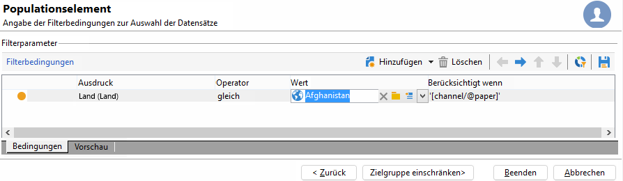

# Verteilte Architekturmodelle{#distributed-architectures}

## Funktionsprinzip {#principle}

Um eine optimale Skalierbarkeit und einen Rund-um-die-Uhr-Betrieb des eingehenden Kanals zu gewährleisten, unterstützt Interaction verteilte Architekturmodelle. Diese Art Architektur, die auch bei Message Center zum Einsatz kommt, arbeitet mit mehreren Instanzen:

* einer oder mehrerer Kontrollinstanzen für den ausgehenden Kanal, welche die Marketing-Datenbank und die Design-Umgebung beherbergen;
* einer oder mehrerer Ausführungsinstanzen für den eingehenden Kanal.


>[!NOTE]
>
>Ausführungsinstanzen sind dem eingehenden Kanal vorbehalten. Sie enthalten die Live-Version des Angebotskatalogs. Jede Ausführungsinstanz ist unabhängig und einem Kontaktsegment gewidmet (beispielsweise eine Instanz pro Land). Die Abfragen des Angebotsmoduls werden direkt von den Ausführungsinstanzen aus durchgeführt (eine URL je Ausführungsinstanz). Da keine automatische Synchronisation zwischen den verschiedenen Ausführungsinstanzen erfolgt, müssen Interaktionen eines Kontakts immer an dieselbe Instanz gesendet werden.

## Vorschlagssynchronisation {#proposition-synchronization}

Die Synchronisation von Vorschlägen erfolgt in Packages. In den Ausführungsinstanzen werden alle Katalogobjekte durch Voranstellung des Namens des externen Kontos gekennzeichnet. Dies ermöglicht die Unterstützung mehrerer Kontrollinstanzen (z. B. Design- und Live-Instanzen) auf derselben Ausführungsinstanz.

>[!CAUTION]
>
>Es wird dringend empfohlen, kurze und ausdrucksstarke interne Namen zu verwenden.

Die Freigabe und Publikation der Angebote in den Ausführungs- und Kontrollinstanzen erfolgt automatisch.

In der Design-Umgebung gelöschte Angebote werden in allen Live-Instanzen deaktiviert. Obsolete Vorschläge und Angebote werden nach Ablauf der durch die Bereinigungsparameter im Softwareverteilungs-Assistenten aller Instanzen definierten Frist und des in den Typologieregeln definierten beweglichen Zeitraums automatisch gelöscht.


Für jedes externe Konto und jede Umgebung wird ein Synchronisations-Workflow erstellt. Die Synchronisationshäufigkeit kann individuell angepasst werden.

## Einschränkungen {#limitations}

* Wenn Sie die Funktion zum Wechsel von einer anonymen in eine identifizierte Umgebung (fall back) nutzen möchten, müssen sich die beiden betroffenen Umgebungen in derselben Ausführungsinstanz befinden.
* Die Synchronisation von verschiedenen Ausführungsinstanzen erfolgt nicht in Echtzeit. Alle Interaktionen eines spezifischen Kontakts müssen immer an dieselbe Instanz gesendet werden. Die Kontrollinstanz ist dem ausgehenden Kanal vorbehalten (keine Echtzeit-Verarbeitung).
* Die Marketing-Datenbank wird nicht automatisch synchronisiert. Aus diesem Grund müssen die im Zusammenhang mit den Eignungsregeln und Gewichtungen verwendeten Marketingdaten in die Ausführungsinstanzen dupliziert werden. Dieser Prozess ist im Verlauf der Integrationsphase zu entwickeln.
* Die Synchronisation von Vorschlägen erfolgt ausschließlich über FDA-Verbindung.
* Falls Sie Interaction und Message Center auf derselben Instanz verwenden, erfolgt die Synchronisation in beiden Fällen über das FDA-Protokoll.

## Package-Konfiguration {#packages-configuration}

Eventuelle Schemaerweiterungen in direktem Zusammenhang mit **Interaction** (beispielsweise Angebots-, Vorschlags- oder Empfängerschema) sind auf die Ausführungsinstanzen freizugeben.

Das Interaction-Package muss auf allen Instanzen installiert werden (Kontroll- und Ausführungsinstanzen). Zwei weitere Packages sind je nach Instanzart zu installieren, eins auf den Kontrollinstanzen, das zweite auf allen Ausführungsinstanzen.

>[!NOTE]
>
>Im Zuge der Package-Installation werden Datenfelder der Vorschlagstabelle **nms:proposition** mit dem Typ **long**, beispielsweise die Vorschlagskennung, in den Typ **int64** umgewandelt. Weiterführende Informationen zu Datentypen finden Sie in diesem [Abschnitt](../../configuration/using/schema-structure.md#mapping-the-types-of-adobe-campaign-dbms-data).

Für jede Instanz muss außerdem die Aufbewahrungsdauer der Daten konfiguriert werden (im Fenster **[!UICONTROL Datenbereinigung]** des Softwareverteilungs-Assistenten). Bei den Ausführungsinstanzen muss diese Dauer der Verlaufstiefe entsprechen, die für die Berechnung der Eignungs- bzw. Typologieregeln (beweglicher Zeitraum) erforderlich ist.

Bei den Kontrollinstanzen müssen Sie darüber hinaus:

1. Ein externes Konto pro Ausführungsinstanz erstellen:

   

   * Geben Sie einen Titel sowie einen kurzen und expliziten internen Namen an.
   * Wählen Sie den Typ **[!UICONTROL Ausführungsinstanz]** aus.
   * Kreuzen Sie die Option **[!UICONTROL Aktiviert]** an.
   * Geben Sie die Verbindungsparameter zur Ausführungsinstanz an.
   * Jeder Ausführungsinstanz muss eine Kennung zugeordnet werden. Dies geschieht durch Klick auf die Schaltfläche **[!UICONTROL Verbindung initialisieren]**.
   * Kreuzen Sie die verwendete Anwendung an: **[!UICONTROL Message Center]**, **[!UICONTROL Interaction]** oder beide.
   * Geben Sie das genutzte FDA-Konto an. Benutzer müssen in den Ausführungsinstanzen erstellt werden und über die folgenden Lese- und Schreibberechtigungen in den entsprechenden Instanzen verfügen:

      ```
      grant SELECT ON nmspropositionrcp, nmsoffer, nmsofferspace, xtkoption, xtkfolder TO user;
      grant DELETE, INSERT, UPDATE ON nmspropositionrcp TO user;
      ```
   >[!NOTE]
   >
   >Die IP-Adresse der Kontrollinstanz muss in den Ausführungsinstanzen zugelassen sein.

1. Die Umgebung konfigurieren:

   

   * Geben Sie alle Ausführungsinstanzen an.
   * Definieren Sie für jede Instanz den Aktualisierungsrhythmus und die Vorschlagsfilter (z. B. nach Land).

      >[!NOTE]
      >
      >Sollten Fehler auftreten, sind die technischen Workflows zur Vorschlagssynchronisation und Angebotsbenachrichtigung zu prüfen.

Falls aus Optimierungsgründen nur ein Teil der Marketing-Datenbank in die Ausführungsinstanzen dupliziert wird, haben Sie die Möglichkeit, ein der Umgebung zugeordnetes eingeschränktes Schema zu definieren. Auf diese Weise können die Benutzer nur die Daten verwenden, die tatsächlich in den Ausführungsinstanzen zur Verfügung stehen. Es ist trotzdem möglich, ein Angebot zu erstellen, das Daten verwendet, die nicht in der Ausführungsinstanz verfügbar sind. Begrenzen Sie hierfür mithilfe des Felds **[!UICONTROL Berücksichtigt wenn]** die Regel auf den gewünschten ausgehenden Kanal.



## Wartungsoptionen {#maintenance-options}

Folgende Wartungsoptionen stehen für die Kontrollinstanz zur Verfügung:

>[!CAUTION]
>
>Diese Optionen sind nur bei klar definierten Wartungsbedarfen zu nutzen.

* **`NmsInteraction_LastOfferEnvSynch_<offerEnvId>_<executionInstanceId>`**: Datum der letzten Synchronisation einer Umgebung in einer bestimmten Instanz.
* **`NmsInteraction_LastPropositionSynch_<propositionSchema>_<executionInstanceIdSource>_<executionInstanceIdTarget>`**: Datum der letzten Synchronisation der Vorschläge eines bestimmten Schemas zwischen zwei Instanzen.
* **`NmsInteraction_MapWorkflowId`**: Option, die die Liste aller erzeugten Synchronisations-Workflows enthält.

Die folgende Option steht für Ausführungsinstanzen zur Verfügung:

**NmsExecutionInstanceId**: Option, die die Instanzkennung enthält.

## Package-Installation {#packages-installation}

Im Zusammenhang mit der Installation der Kontroll- und -Ausführungs-Packages erhöht sich die Größe der Vorschlagskennungen in der Datenbank von 32 auf 64 Bits.

>[!CAUTION]
>
>Je nach Anzahl an existierenden Vorschlägen in Ihrer Instanz kann dieser Vorgang sehr zeitintensiv sein.

* Wenn Ihre Instanz keine oder nur wenige Vorschläge enthält, ist kein manueller Eingriff in Bezug auf die Vorschlagstabelle erforderlich. Die Änderung erfolgt zum Zeitpunkt der Package-Installation.
* Wenn Ihre Instanz eine große Anzahl an Vorschlägen enthält, wird empfohlen, die Struktur der Vorschlagstabelle vor Installation der Ausführungs- und Kontroll-Packages anzupassen. Die diesbezüglichen Abfragen sind vorzugsweise zu einem Zeitpunkt mit geringer Auslastung auszuführen.

>[!NOTE]
>
>Falls Sie spezifische Konfigurationen in Ihrer Vorschlagstabelle vorgenommen haben, müssen die Abfragen entsprechend angepasst werden.

### PostgreSQL {#postgresql}

Zwei Methoden stehen zur Verfügung. Die erste, die eine Arbeitstabelle verwendet, ist geringfügig schneller.

**Arbeitstabellen**

```
CREATE TABLE NmsPropositionRcp_tmp AS SELECT * FROM nmspropositionrcp WHERE 0=1;
ALTER TABLE nmspropositionrcp_tmp
  ALTER COLUMN ipropositionid TYPE bigint,
  ALTER COLUMN iinteractionid TYPE bigint;
INSERT INTO nmspropositionrcp_tmp SELECT * FROM nmspropositionrcp;
DROP TABLE nmspropositionrcp;
CREATE INDEX proposition_id ON NmsPropositionRcp (ipropositionid);
CREATE INDEX nmspropositionrcp_deliveryid ON NmsPropositionRcp (ideliveryid);
CREATE INDEX nmspropositionrcp_lastmodified ON NmsPropositionRcp (tslastmodified);
CREATE INDEX nmspropositionrcp_offerid ON NmsPropositionRcp (iofferid);
CREATE INDEX nmspropositionrcp_offerspaceid ON NmsPropositionRcp (iofferspaceid);
CREATE INDEX nmspropositionrcp_recipientidid ON NmsPropositionRcp (irecipientid);
ALTER TABLE nmspropositionrcp_tmp RENAME TO nmspropositionrcp;
```

**Alter Table**

```
ALTER TABLE nmspropositionrcp
  ALTER COLUMN ipropositionid TYPE bigint,
  ALTER COLUMN iinteractionid TYPE bigint;
```

### Oracle {#oracle}

Die Änderung der Größe eines **Number**-Typs zieht keine Änderung der Werte oder Indexe nach sich. Sie ist somit augenblicklich.

Die auszuführende Abfrage stellt sich wie folgt dar:

```
ALTER TABLE nmspropositionrcp MODIFY (
ipropositionid NUMBER(19, 0),
iinteractionid NUMBER(19, 0)
);
```

### MSSQL {#mssql}

Die auszuführenden Abfragen stellen sich wie folgt dar:

```
SELECT * INTO NmsPropositionRcp_tmp FROM NmsPropositionRcp WHERE 1 = 0;
GO
ALTER TABLE NmsPropositionRcp_tmp ALTER COLUMN ipropositionid BIGINT;
GO
ALTER TABLE NmsPropositionRcp_tmp ALTER COLUMN iinteractionid BIGINT;
GO
INSERT INTO NmsPropositionRcp_tmp SELECT * FROM NmsPropositionRcp;
GO
DROP TABLE NmsPropositionRcp;
GO
sp_rename 'NmsPropositionRcp_tmp', NmsPropositionRcp
GO
ALTER TABLE NmsPropositionRcp ADD DEFAULT ((0)) FOR dWeight
GO
ALTER TABLE NmsPropositionRcp ADD DEFAULT ((0)) FOR iDeliveryId
GO
ALTER TABLE NmsPropositionRcp ADD DEFAULT ((0)) FOR iEngineType
GO
ALTER TABLE NmsPropositionRcp ADD DEFAULT ((0)) FOR iInteractionId
GO
ALTER TABLE NmsPropositionRcp ADD DEFAULT ((0)) FOR iOfferId
GO
ALTER TABLE NmsPropositionRcp ADD DEFAULT ((0)) FOR iOfferSpaceId
GO
ALTER TABLE NmsPropositionRcp ADD DEFAULT ((0)) FOR iPropositionId
GO
ALTER TABLE NmsPropositionRcp ADD DEFAULT ((0)) FOR iRank
GO
ALTER TABLE NmsPropositionRcp ADD DEFAULT ((0)) FOR iRecipientId
GO
ALTER TABLE NmsPropositionRcp ADD DEFAULT ((0)) FOR iStatus
GO
CREATE NONCLUSTERED INDEX NmsPropositionRcp_deliveryId ON NmsPropositionRcp (iDeliveryId)
GO
CREATE NONCLUSTERED INDEX NmsPropositionRcp_eventDate ON NmsPropositionRcp (tsEvent)
GO
CREATE UNIQUE NONCLUSTERED INDEX NmsPropositionRcp_id ON NmsPropositionRcp (iPropositionId)
GO
CREATE NONCLUSTERED INDEX NmsPropositionRcp_lastModified ON NmsPropositionRcp (tsLastModified)
GO
CREATE NONCLUSTERED INDEX NmsPropositionRcp_offerId ON NmsPropositionRcp (iOfferId)
GO
CREATE NONCLUSTERED INDEX NmsPropositionRcp_offerSpaceI ON NmsPropositionRcp (iOfferSpaceId)
GO
CREATE NONCLUSTERED INDEX NmsPropositionRcp_recipientId ON NmsPropositionRcp (iRecipientId)
GO
```

