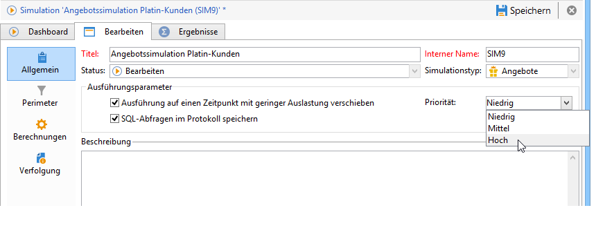

# Ausführungsparameter{#execution-settings}

Bei Erstellung einer Simulation haben Sie die Möglichkeit, Ausführungsparameter anzugeben. Auf diese Weise können Sie die Ausführung der Simulation in Abhängigkeit von ihrer Prioritätsstufe auf einen Zeitpunkt mit geringer Auslastung verschieben und die SQL-Abfragen im Protokoll speichern.

Eine Änderung dieser Parameter ist im späteren Verlauf im Tab **[!UICONTROL Allgemein]** des Simulationsfensters möglich.

* **[!UICONTROL Ausführung auf einen Zeitpunkt mit geringer Auslastung verschieben]**: plant den Simulationsstart in Abhängigkeit von der angegebenen Priorität (Niedrig, Mittel, Hoch) mit dem Ziel, die Leistungen von Adobe Campaign zu optimieren.
* **[!UICONTROL Priorität]**: auf die Simulation angewendete Dringlichkeit, die den Ausführungsbeginn entsprechend verschiebt. Wenn die Option **[!UICONTROL Ausführung auf einen Zeitpunkt mit geringer Auslastung verschieben]** aktiviert wurde, wählt der Workflow der Kampagnenvorgänge einen Zeitpunkt mit geringer Aktivität, um die Simulation zu starten.
* **[!UICONTROL SQL-Abfragen im Protokoll speichern]**: Diese Funktion ist erfahrenen Benutzern vorbehalten. Bei Aktivierung wird dem Protokoll ein Tab hinzugefügt, in dem die SQL-Abfragen angezeigt werden. Dies erleichtert die Fehlerbehebung, wenn die Simulation fehlschlägt.

