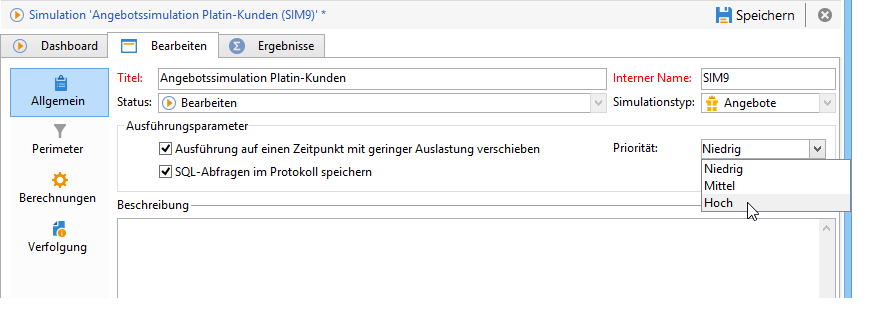

# Ausführungseinstellungen{#execution-settings}

Beim Erstellen einer Simulation können Sie bei Bedarf Ausführungseinstellungen festlegen. Mit diesen Einstellungen können Sie die Simulation in einer Zeit geringer Aktivität ausführen, je nach ihrer Priorität, oder SQL-Abfragen im Protokoll aufzeichnen. Dieser Schritt ist optional.

Eine Änderung dieser Parameter ist im späteren Verlauf im Tab **[!UICONTROL Allgemein]** des Simulationsfensters möglich.

* **[!UICONTROL Ausführung auf einen Zeitpunkt mit geringer Auslastung verschieben]**: plant den Simulationsstart in Abhängigkeit von der angegebenen Priorität (Niedrig, Mittel, Hoch) mit dem Ziel, die Performance von Adobe Campaign zu optimieren.
* **[!UICONTROL Priorität]**: auf die Simulation angewendete Dringlichkeit, die den Ausführungsbeginn entsprechend verschiebt. Wenn die Option **[!UICONTROL Ausführung auf einen Zeitpunkt mit geringer Auslastung verschieben]** aktiviert wurde, wählt der Workflow der Kampagnenvorgänge einen Zeitpunkt mit geringer Aktivität, um die Simulation zu starten.
* **[!UICONTROL SQL-Abfragen im Protokoll speichern]** : Diese Funktion ist nur für erfahrene Benutzer. Auf diese Weise können Sie dem Protokoll eine Registerkarte hinzufügen, auf der SQL-Abfragen angezeigt werden, um mögliche Fehlfunktionen zu erkennen, falls die Simulation mit Fehlern abgeschlossen wird.
