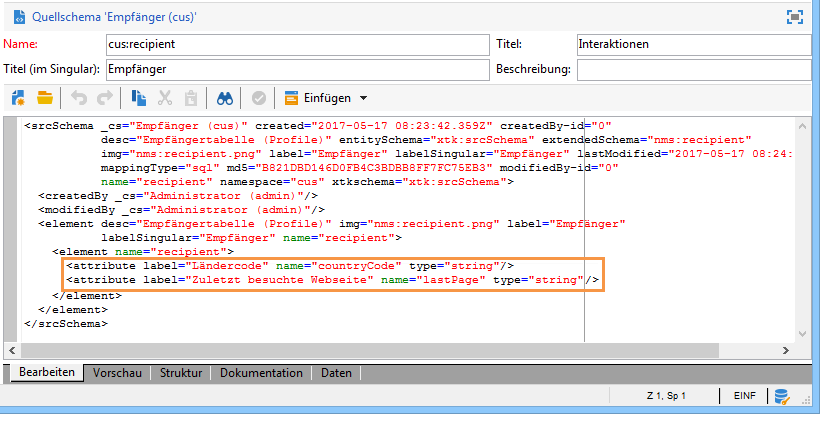
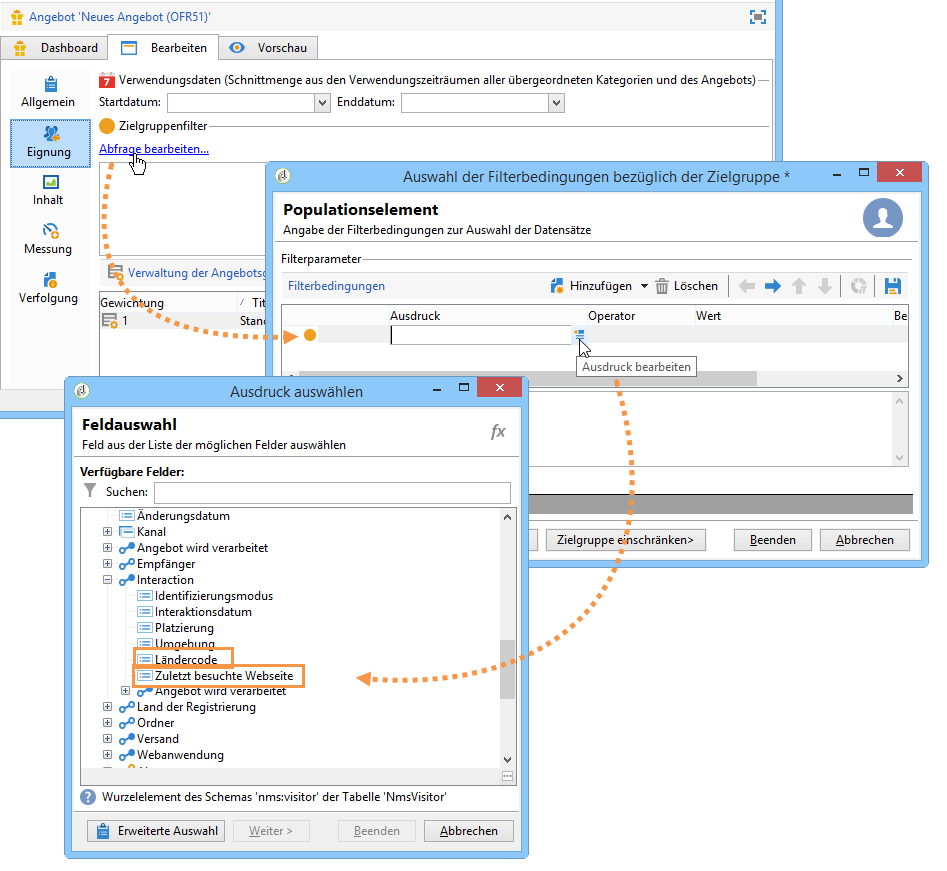

# Beispiel einer Erweiterung{#extension-example}

Im Fall eines eingehenden Kontakts (Callcenter oder Webseite) bestimmt das Angebotsmodul die besten zu unterbreitenden Angebote anhand einer Reihe von Eignungsregeln. Zur Anreicherung der Eignungskriterien Ihrer Angebote ist zunächst das Schema **nms:interaction zu erweitern**.

* Um einen neuen Anwendungskontext hinzuzufügen, erweitern Sie das Schema **nms:interaction** und fügen Sie die benötigte Anzahl an **attribute**-Elementen in das Schema ein.

   Im folgenden Beispiel wurden der Ländercode und die zuletzt besuchte Webseite hinzugefügt:

   

* Im Anschluss an die Erweiterung können Sie die neuen Attribute in der Definition der Eignungsregeln verwenden.

   Im vorliegenden Beispiel werden Eignungskriterien erstellt, die das Land und die zuletzt besuchte Seite des Kontakts berücksichtigen.

   

* Fügen Sie bei der Konfiguration der SOAP-Aufrufe das XML-Element **context** ein, um die kontextbezogenen Informationen, um die Sie zuvor das Interaction-Schema erweitert haben, zu referenzieren. Weitere Informationen hierzu finden Sie unter [SOAP-Integration (Server-seitig)](../../interaction/using/integration-via-soap--server-side-.md).

