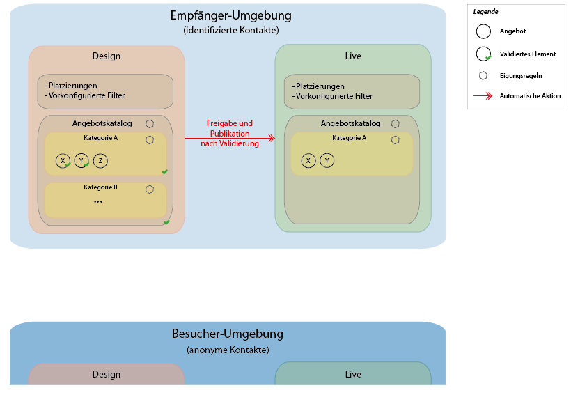
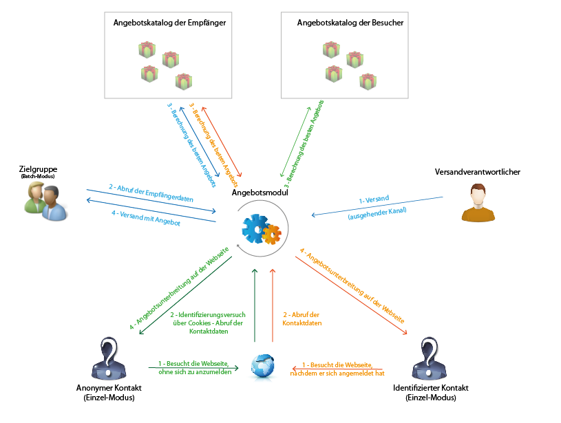

# Grundprinzipien{#fundamental-principles}

## Umgebungsfreigabe {#deploying-environments}

Für jede im Zusammenhang mit der Angebotsverwaltung verwendete Zieldimension existiert ein Umgebungspaar:

* eine Design-Umgebung, in der der Angebotsverantwortliche Angebote erstellt, ändert und kategorisiert sowie ihren Validierungsprozess auslöst, damit sie zum Einsatz kommen können. In dieser Umgebung werden darüber hinaus die für eine Kategorie geltenden Regeln, die Platzierungen, in denen die Angebote unterbreitet werden können und die für die Eignungsprüfung zu verwendenden Filter definiert.

   Kategorien können automatisch durch die Validierung oder manuell in der Live-Umgebung publiziert werden.

   Die Vorgehensweise zum Validieren von Angeboten wird im Abschnitt [Angebotsvalidierung](../../interaction/using/approving-and-activating-an-offer.md) beschrieben.

* eine Live-Umgebung, in der die in der Design-Umgebung validierten bzw. definierten Angebote sowie die verschiedenen Platzierungen, Filter, Kategorien und Regeln zur Verfügung stehen. Bei einer Abfrage des Angebotsmoduls greift dieses ausschließlich auf die Angebote der Live-Umgebung zu.

Ein Angebot wird nur für die bei der Validierung ausgewählten Platzierungen freigegeben. Dies bedeutet, dass ein Angebot u. U. live sein, aber trotzdem nicht in einer Platzierung verwendet werden kann, selbst wenn diese ebenfalls live ist.

## Interaktionstypen und Kontaktmodi {#interaction-types-and-contact-methods}

Es werden zwei grundsätzliche Interaktionstypen unterschieden: eingehende Interaktionen, die von einem Kontakt ausgelöst werden, und ausgehende Interaktionen, die durch den Angebotsinhaber initiiert werden.

Beide Interaktionstypen können entweder im Einzelmodus (das Angebot wird für einen einzelnen Kontakt berechnet) oder im Batch-Modus (das Angebot wird für mehrere Kontakte gleichzeitig berechnet) verarbeitet werden. In der Regel werden eingehende Interaktionen im Einzelmodus und ausgehende Interaktionen im Batch-Modus verarbeitet. Ausnahmen von dieser Regel bilden z. B. Transaktionsnachrichten, bei denen die ausgehende Interaktion im Einzelmodus geschieht. Weiterführende Informationen hierzu finden Sie in [diesem Abschnitt](../../message-center/using/about-transactional-messaging.md).

Wenn ein Angebot unterbreitet werden kann oder soll (je nach Konfiguration), spielt das Angebotsmodul eine zentrale Rolle: Es ermittelt automatisch aus einer Reihe von möglichen Angeboten das für den Kontakt am besten geeignete Angebot, indem es die für ihn vorliegenden Daten und die in der Anwendung definierten Regeln kombiniert und abgleicht.

