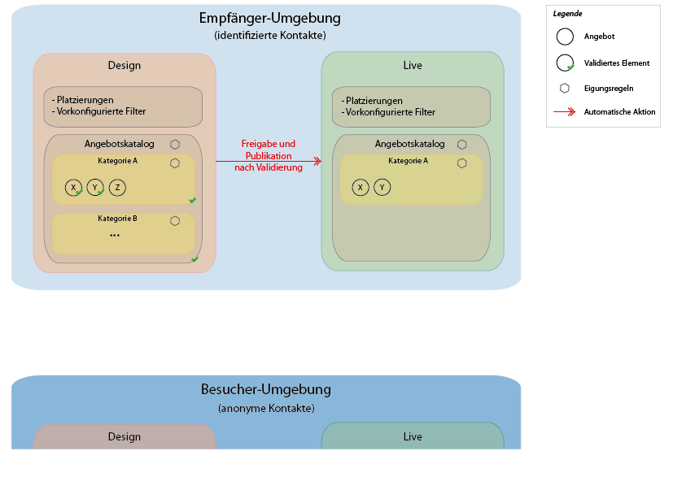
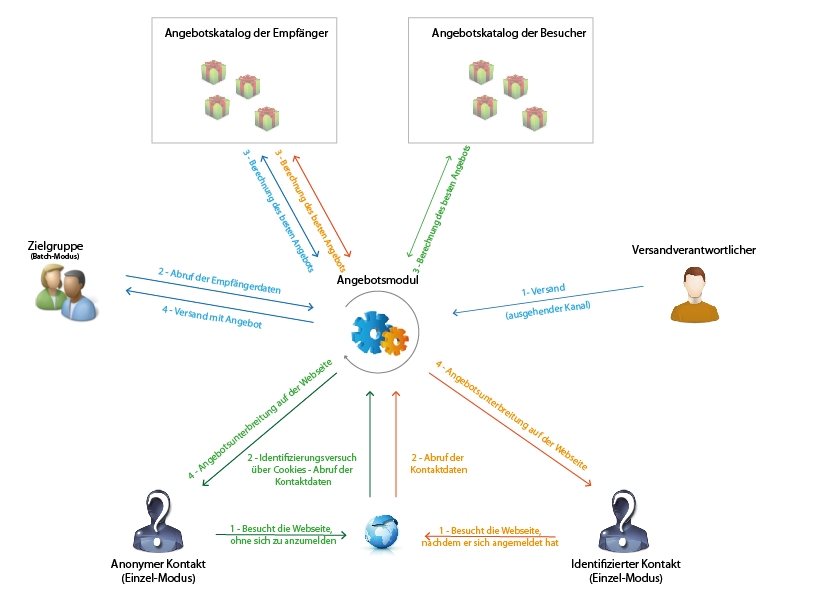

# Grundprinzipien{#fundamental-principles}

## Umgebungsbereitstellung {#deploying-environments}

Für jede im Zusammenhang mit der Angebotsverwaltung verwendete Zielgruppendimension existiert ein Umgebungspaar:

* Eine Design -Umgebung, in der der Angebotsverantwortliche sich darum kümmert, Angebote zu erstellen und zu kategorisieren, zu bearbeiten und den Validierungsprozess zu starten, damit sie verwendet werden können. Die Regeln für jede Kategorie, die Platzierungen, in denen Angebote unterbreitet werden können, und die vordefinierten Filter, die zum Definieren der Eignung eines Angebots verwendet werden, werden ebenfalls in dieser Umgebung definiert.

  Kategorien können automatisch durch die Validierung oder manuell in der Live-Umgebung veröffentlicht werden.

  Die Vorgehensweise zum Validieren von Angeboten wird im Abschnitt [Angebotsvalidierung](../../interaction/using/approving-and-activating-an-offer.md) beschrieben.

* Eine Live-Umgebung, in der die in der Design-Umgebung genehmigten Angebote sowie die verschiedenen Platzierungen, Filter, Kategorien und Regeln zur Verfügung stehen. Bei einer Abfrage des Angebotsmoduls verwendet das Modul immer Angebote aus der Live-Umgebung.

Ein Angebot wird nur für die Platzierungen bereitgestellt, die während des Genehmigungsprozesses ausgewählt wurden. Daher kann ein Angebot live sein, aber auf einer Platzierung, die ebenfalls live ist, nicht verwendet werden können.

## Interaktionstypen und Kontaktmodi {#interaction-types-and-contact-methods}

Es gibt zwei grundsätzliche Interaktionstypen: eingehende Interaktionen, die von einem Kontakt ausgelöst werden, und ausgehende Interaktionen, die durch den Angebotsersteller initiiert werden.

Diese beiden Interaktionstypen können entweder im Einzelmodus (das Angebot wird für einen einzelnen Kontakt berechnet) oder im Batch-Modus (das Angebot wird für eine Gruppe von Kontakten berechnet) verarbeitet werden. Im Allgemeinen werden eingehende Interaktionen im Einzelmodus und ausgehende Interaktionen im Batch-Modus ausgeführt. Es kann jedoch bestimmte Ausnahmen geben, beispielsweise bei Transaktionsnachrichten, bei denen die ausgehende Interaktion im einheitlichen Modus erfolgt (siehe [diesem Abschnitt](../../message-center/using/about-transactional-messaging.md)).

Wenn ein Angebot unterbreitet werden kann oder soll (je nach Konfiguration), spielt das Angebotsmodul eine zentrale Rolle: Es ermittelt automatisch aus einer Reihe von möglichen Angeboten das für den Kontakt am besten geeignete Angebot, indem es die für ihn vorliegenden Daten und die in der Anwendung definierten Regeln kombiniert und abgleicht.

