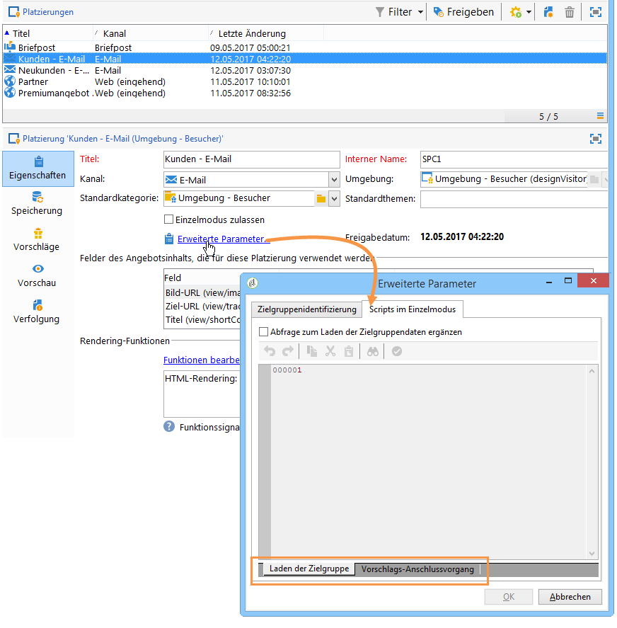
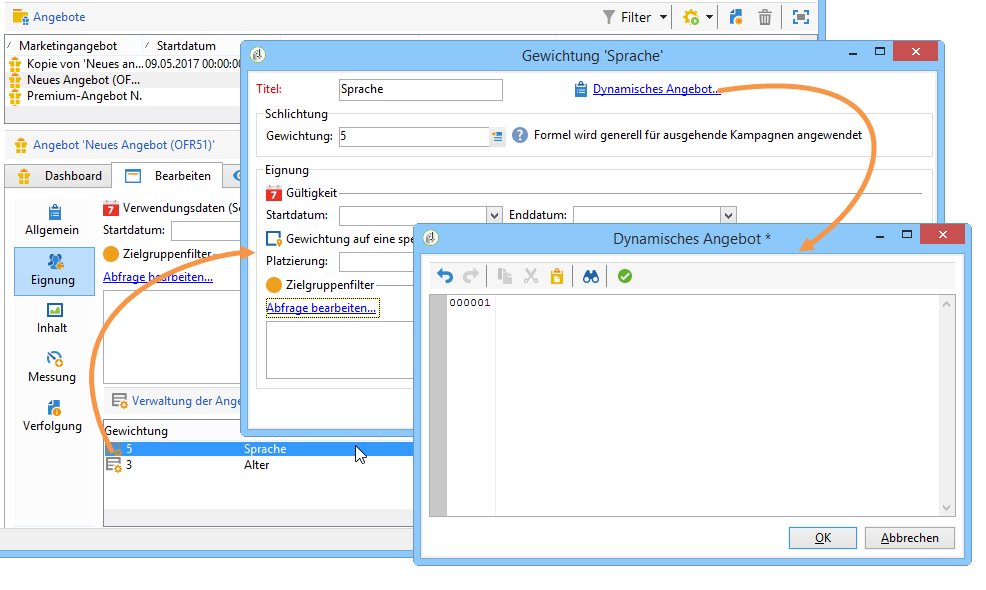
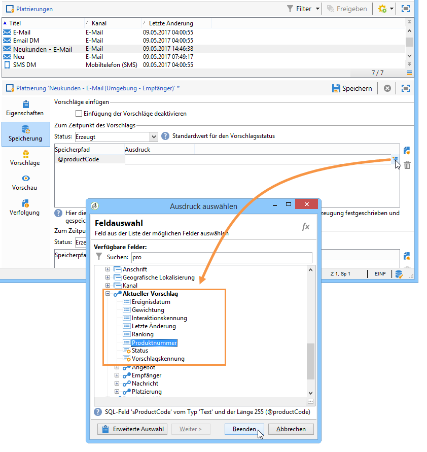

# Erweiterungspunkte{#hooks}

Erweiterungspunkte (Hooks) bieten die Möglichkeit, das **Standardverhalten des Angebotsmoduls** Ihren Bedürfnissen entsprechend anzupassen.

In Adobe Campaign stehen auf Platzierungsebene die Erweiterungspunkte **[!UICONTROL Laden der Zielgruppe]** und **[!UICONTROL Vorschlags-Anschlussvorgang]** zur Verfügung:



Auf Ebene der Gewichtung ist der Erweiterungspunkt **[!UICONTROL Dynamisches Angebot]** verfügbar:



## Laden der Zielgruppe {#target-loading}

Dieser Erweiterungspunkt erlaubt die Anreicherung des (durch die native Abfrage geladenen) Kontaktprofils mit zusätzlichen Daten aus externen Systemen.

Die derart abgerufenen Daten müssen in den Knoten der Aufrufdaten (Interaction-Knoten) eingefügt werden. Der Integrator muss zuvor das Aufrufdaten-Schema erweitern, um die Struktur der abgerufenen Daten zu definieren. Der Benutzer kann auf diese Daten auf die gleiche Weise wie auf Standard-Aufrufdaten in Eignungsregeln und bei der Personalisierung zugreifen.

**Eingabeparameter:**

* xmlInteraction (XML): Interaction-Knoten;
* aTargetId (Tabelle): Kennung des Zielkontakts;
* sUuid230 (String): Wert des permanenten Cookies uuid230;
* sNlid (String): Wert des Sitzungs-Cookies nlid.

**Ausgabeparameter:**

* angereicherter Interaction-Knoten (erster Parameter des Erweiterungspunkts).

>[!NOTE]
>
>Der Parameter **xmlInteraction** enthält sowohl die Aufrufdaten als auch das von der nativen Abfrage geladene Kontaktprofil.

**Beispiel:**

```
// Call an external system to get additional data for the target
  var additionalData  = getUrl("https://EXTERNAL_SYSTEM?target=" + encodeURIComponent(aTargetId.join("|")));
  // Enrich the context with this data
  interaction.@additionalData = additionalData;
```

## Vorschlags-Anschlussvorgang {#proposition-post-processing-}

Dieser Erweiterungspunkt ermöglicht es, Kohärenz und Kompatibilität der infrage kommenden Vorschläge innerhalb einer Interaktion zu prüfen. Darüber hinaus erlaubt er die Definition einer neuen Formel zur Berechnung von Scores und Wahrscheinlichkeiten.

Anwendungsbeispiel für Kohärenzregeln:

* Im Rahmen einer Modulabfrage: Begrenzung der Anzahl an Vorschlägen, die sich auf dasselbe Produkt oder dieselbe Kategorie beziehen.
* Innerhalb einer Interaktion: ausschließliche Unterbreitung von Angeboten, die sich auf dasselbe Produkt beziehen.

Der Anschlussvorgang wird nach Anwendung der Typologieregeln und der Sortierung der geeigneten Vorschläge, aber vor der Gewichtung durchgeführt.

**Eingabeparameter:**

* aProposition: Tabelle der infrage kommenden Vorschläge. Ein Element dieser Tabelle weist folgende Struktur auf:

   ```
   { offer_id:1234,
     weight:2}
   ```

* dicOffer (XML): Zusammenstellung aller Attribute der infrage kommenden Angebote (Angebotscode, Kategoriekennung, vollständiger Titel der Kategorie, Startdatum, Enddatum, Titel, interner Name, Angebotskennung, Zusatzfelder des Angebots). Beispiel:

   ```
   { "1242": <offer category-id="61242" categoryFullName="/FULL/PATH/TO/CATEGORY/" code="CODE" endDate="" id="62473" label="LABEL" name="OFR38_OE4" product-id="43" startDate=""/>,
     "1243": ...}
   ```

* xmlTarget (XML): Knoten der Profildaten;
* xmlInteraction (XML): Knoten der Aufrufdaten.
* iPropNumber (Integer): Anzahl erwarteter Angebote.

**Ausgabeparameter:**

* Liste der veränderten Vorschläge (erster Parameter des Erweiterungspunkts);
* veränderter Interaction-Knoten.

**Beispiel:**

```
var aReturnedProps = [];

if( aProposition.length > 0 )
{
  var iReturnedProps = 0;
  for( var iPropIdx = 0; iPropIdx < aProposition.length && iReturnedProps < iPropNumber; iPropIdx ++ )
  {
    // Check a consistency rule for instance
    if( true )
    {
      aReturnedProps.push(aProposition[iPropIdx]);
      iReturnedProps++;
    }
  }
}

return aReturnedProps;
```

## Dynamische Angebote {#dynamic-offer}

Diese Art Erweiterungspunkt ermöglicht die Abfrage eines externes Moduls, um eine Produktliste in Zusammenhang mit einem Angebot auszuwählen. Die Abfrage erfolgt nach Anwendung der Eignungsregeln, aber vor den Typologieregeln.

Der Integrator muss zuvor das Vorschlagsschema **PropositionRcp** um die mit dem Vorschlag zu speichernden zusätzlichen Produktdaten erweitern. Über die Relation **[!UICONTROL Aktueller Vorschlag]** im Tab **[!UICONTROL Speicherung]** der Platzierung lässt sich die Speicherung dieser Daten (z. B. Produktnummer) definieren.



**Eingabeparameter:**

* xmlOffer (XML): Angebot (Angebotscode, Kategoriekennung, vollständiger Name der Kategorie, Startdatum, Enddatum, Titel, interner Name, Angebotskennung, zusätzliche Angebotsfelder);
* dWeight (Double): Kontextgewichtung;
* xmlTarget (XML): Knoten der Profildaten;
* xmlInteraction (XML): Knoten der Aufrufdaten.

**Ausgabeparameter:**

Es wird eine Tabelle mit den zu erzeugenden Vorschlägen zurückgegeben. Jedes Element dieser Tabelle enthält folgende Informationen:

* Angebotskennung;
* zusätzliche Produktdaten (z. B. Produktcode);
* Gewichtung.

>[!NOTE]
>
>Das System prüft, ob Eingabe- und Ausgabekennung des Angebots übereinstimmen.

**Beispiel:**

```
var product = getUrl("https://EXTERNAL_SYSTEM?offerCode=" + encodeURIComponent(xmlOffer.@code));
if( product )
  return [{offer_id: parseInt(String(xmlOffer.@id)), weight: dWeight, productId: product}];
```

