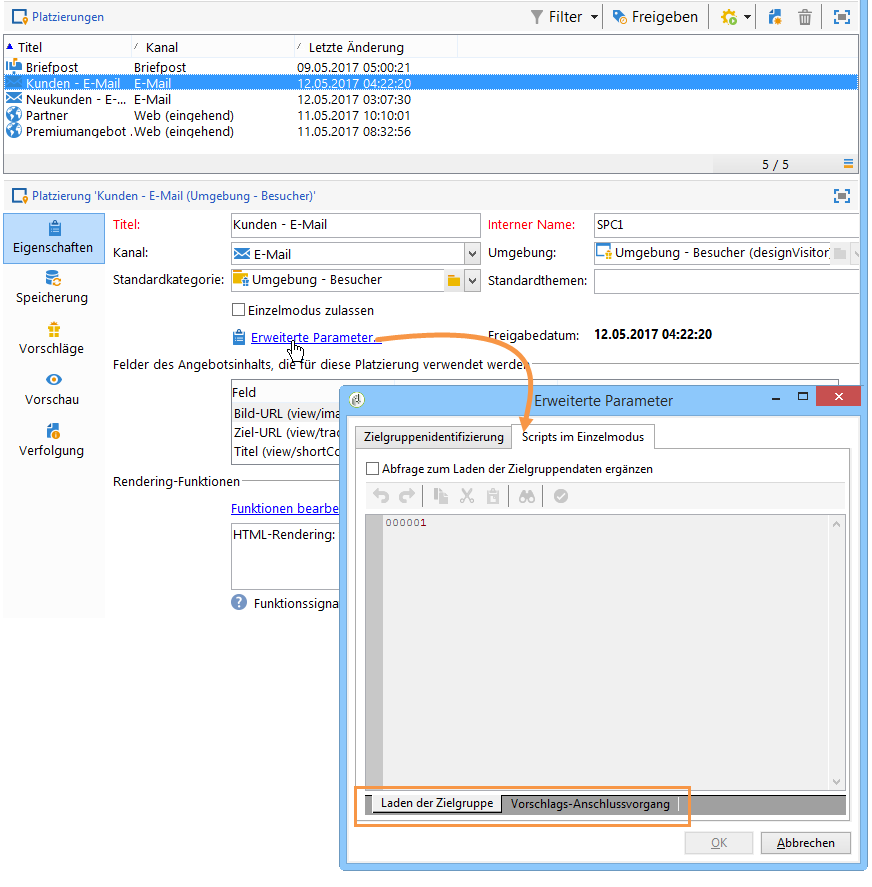
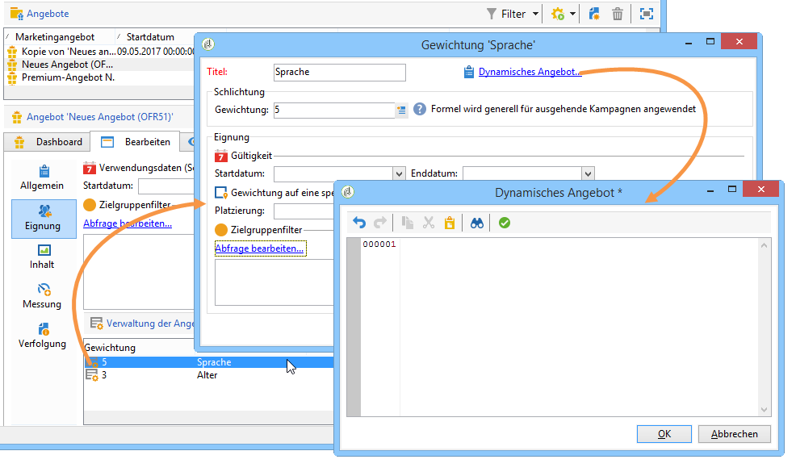
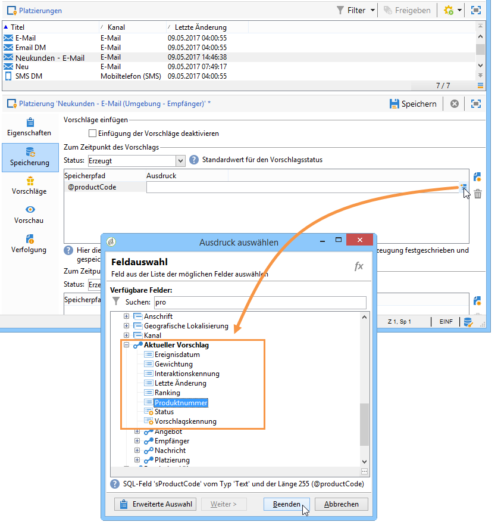

# Ändern des Standardverhaltens der Engine{#hooks}


Erweiterungspunkte (Hooks) bieten die Möglichkeit, das **Standardverhalten des Angebotsmoduls** Ihren Bedürfnissen entsprechend anzupassen.

In Adobe Campaign stehen auf Platzierungsebene die Erweiterungspunkte **[!UICONTROL Laden der Zielgruppe]** und **[!UICONTROL Vorschlags-Anschlussvorgang]** zur Verfügung:



Auf Ebene der Gewichtung ist der Erweiterungspunkt **[!UICONTROL Dynamisches Angebot]** verfügbar:



## Laden der Zielgruppe {#target-loading}

Dieser Erweiterungspunkt erlaubt die Anreicherung des (durch die native Abfrage geladenen) Kontaktprofils mit zusätzlichen Daten aus externen Systemen.

Erfasste Daten müssen in den Aufruf-Datenknoten (Interaction-Knoten) eingefügt werden. Der Integrator muss das Aufrufdatenschema zuvor erweitert haben, um die Struktur der erfassten Daten zu definieren. Der Benutzer kann auf diese Daten auf die gleiche Weise zugreifen wie für Standardaufrufdaten (auf Eignungsregeln und Personalisierungsebene).

**Eingabeparameter:**

* xmlInteraction (XML): Interaction-Knoten;
* aTargetId (Tabelle): Kennung des Zielkontakts;
* sUuid230 (String): Wert des permanenten Cookies uuid230;
* sNlid (String): Wert des Sitzungs-Cookies nlid.

**Ausgabeparameter:**

* angereicherter Interaction-Knoten (erster Parameter des Erweiterungspunkts).

>[!NOTE]
>
>Der Parameter **xmlInteraction** enthält sowohl die Aufrufdaten als auch das von der nativen Abfrage geladene Kontaktprofil.

**Beispiel:**

```
// Call an external system to get additional data for the target
  var additionalData  = getUrl("https://EXTERNAL_SYSTEM?target=" + encodeURIComponent(aTargetId.join("|")));
  // Enrich the context with this data
  interaction.@additionalData = additionalData;
```

## Vorschlags-Anschlussvorgang {#proposition-post-processing-}

Mit diesem Hook können Sie die Konsistenz und Kompatibilität der geeigneten Vorschläge in einer bestimmten Interaktion überprüfen. Außerdem können Sie eine neue Scoring- oder Wahrscheinlichkeitsberechnungsfunktion definieren.

Anwendungsbeispiel für Kohärenzregeln:

* Im Rahmen einer Modulabfrage: Begrenzung der Anzahl an Vorschlägen, die sich auf dasselbe Produkt oder dieselbe Kategorie beziehen.
* Innerhalb einer Interaktion: ausschließliche Unterbreitung von Angeboten, die sich auf dasselbe Produkt beziehen.

Der Anschlussvorgang wird nach Anwendung der Typologieregeln und der Sortierung der geeigneten Vorschläge, aber vor der Gewichtung durchgeführt.

**Eingabeparameter:**

* Vorschlag: Tabelle der zulässigen Vorschläge. Beispiel für die Struktur eines Elements in dieser Tabelle

  ```
  { offer_id:1234,
    weight:2}
  ```

* dicOffer (XML-Typ): Wörterbuch aller Attribute der geeigneten Angebote (Angebotscode, Kategorie-ID, vollständiger Kategoriename, Startdatum, Enddatum, Titel, interner Name, Angebots-ID, zusätzliche Angebotsfelder). Beispiel

  ```
  { "1242": <offer category-id="61242" categoryFullName="/FULL/PATH/TO/CATEGORY/" code="CODE" endDate="" id="62473" label="LABEL" name="OFR38_OE4" product-id="43" startDate=""/>,
    "1243": ...}
  ```

* xmlTarget (XML): Knoten der Profildaten;
* xmlInteraction (XML): Knoten der Aufrufdaten.
* iPropNumber (Integer): Anzahl erwarteter Angebote.

**Ausgabeparameter:**

* Liste der veränderten Vorschläge (erster Parameter des Erweiterungspunkts);
* veränderter Interaction-Knoten.

**Beispiel:**

```
var aReturnedProps = [];

if( aProposition.length > 0 )
{
  var iReturnedProps = 0;
  for( var iPropIdx = 0; iPropIdx < aProposition.length && iReturnedProps < iPropNumber; iPropIdx ++ )
  {
    // Check a consistency rule for instance
    if( true )
    {
      aReturnedProps.push(aProposition[iPropIdx]);
      iReturnedProps++;
    }
  }
}

return aReturnedProps;
```

## Dynamische Angebote {#dynamic-offer}

Mit diesem Hook können Sie eine externe Engine aufrufen, um eine Liste von Produkten auszuwählen, die mit einem Angebot verknüpft sind. Sie wird im Angebot nach den Eignungsregeln und vor der Anwendung der Typologieregeln konfiguriert.

Der Integrator muss zuvor das Vorschlagsschema **PropositionRcp** um die mit dem Vorschlag zu speichernden zusätzlichen Produktdaten erweitern. Über die Relation **[!UICONTROL Aktueller Vorschlag]** auf der Registerkarte **[!UICONTROL Speicherung]** der Platzierung lässt sich die Speicherung dieser Daten (z. B. Produktnummer) definieren.



**Eingabeparameter:**

* xmlOffer (XML): Angebot (Angebotscode, Kategoriekennung, vollständiger Name der Kategorie, Startdatum, Enddatum, Titel, interner Name, Angebotskennung, zusätzliche Angebotsfelder);
* dWeight (Double): Kontextgewichtung;
* xmlTarget (XML): Knoten der Profildaten;
* xmlInteraction (XML): Knoten der Aufrufdaten.

**Ausgabeparameter:**

Eine Tabelle mit zu erzeugenden Vorschlägen wird zurückgegeben. Jedes Element dieser Tabelle besteht aus den folgenden Informationen:

* Angebotskennung;
* zusätzliche Produktdaten (z. B. Produktcode);
* Gewichtung.

>[!NOTE]
>
>Das System prüft, ob Eingabe- und Ausgabekennung des Angebots übereinstimmen.

**Beispiel:**

```
var product = getUrl("https://EXTERNAL_SYSTEM?offerCode=" + encodeURIComponent(xmlOffer.@code));
if( product )
  return [{offer_id: parseInt(String(xmlOffer.@id)), weight: dWeight, productId: product}];
```
