# Integration über Workflows{#integrating-an-offer-via-a-workflow}

Neben der eigentlichen Versand-Aktivität bieten auch diverse andere Workflow-Aktivitäten die Möglichkeit, Angebotsunterbreitungen zu konfigurieren:

* Versandentwurf
* Anreicherung
* Angebotsmodul
* Angebote pro Segment

## Versandentwurf {#delivery-outline}

Die in Kampagnen-Workflows zur Verfügung stehende Versandentwurfsaktivität erlaubt es, Angebote zu unterbreiten, die in einem Versandentwurf der aktuellen Kampagne referenziert wurden.

1. Platzieren Sie hierfür im Workflow die Versandentwurfsaktivität vor einer Versandaktivität.
1. Geben Sie in der Versandentwurfsaktivität den gewünschten Entwurf an.

   Weiterführende Informationen zu Versandentwürfen finden Sie in der [Dokumentation zu Campaign v8](https://experienceleague.adobe.com/docs/campaign/automation/campaign-orchestration/marketing-campaign-assets#delivery-outlines.html?lang=de){target="_blank"}.

1. Füllen Sie die verfügbaren Felder Ihrem Versand entsprechend aus.
1. Sie haben zwei Möglichkeiten:

   * Wenn das Angebotsmodul aufgerufen werden soll, aktivieren Sie das Kontrollkästchen **[!UICONTROL Anzahl der ausgewählten Vorschläge]**. Geben Sie die Platzierung und die Anzahl der Vorschläge an, die im Versand unterbreitet werden sollen.

     Gewichtung und Eignungsregeln der Angebote werden vom Angebotsmodul berücksichtigt.

   * Versand ohne Abfrage an das Angebotsmodul: Alle im Versandentwurf enthaltenen Angebote werden unterbreitet.

   >[!NOTE]
   >
   >Die Vorschau berücksichtigt die Anzahl der im Versand angegebenen Angebote. Beim Ausführen eines Workflows wird die im Versandentwurf angegebene Zahl berücksichtigt.

   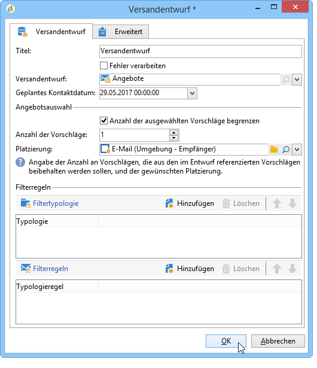

## Anreicherung {#enrichment}

Die Anreicherungsaktivität ermöglicht das Hinzufügen von Angeboten oder von Relationen zu Angeboten für Versandempfangende.

>[!NOTE]
>
>Weitere Informationen zur Anreicherungsaktivität finden Sie in der [Dokumentation zu Campaign v8](https://experienceleague.adobe.com/docs/campaign/automation/workflows/wf-activities/targeting-activities/enrichment.html?lang=de){target="_blank"}.

Sie können beispielsweise aus einer Abfrage stammende Empfängerdaten vor Durchführung eines Versands anreichern.

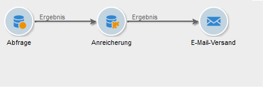

Zwei Methoden ermöglichen in diesem Fall die Auswahl der Angebotsvorschläge:

* Konfiguration eines Angebots oder einer Abfrage des Angebotsmoduls;
* Referenzierung einer Relation zu einem Angebot.

### Angebot oder Angebotsmodul-Abfrage konfigurieren {#specifying-an-offer-or-a-call-to-the-offer-engine}

Konfigurieren Sie Ihre Abfrage (siehe [Dokumentation zu Campaign v8](https://experienceleague.adobe.com/docs/campaign/automation/workflows/wf-activities/targeting-activities/query.html?lang=de){target="_blank"}). Gehen Sie dann wie folgt vor:

1. Platzieren Sie im Anschluss an die Abfrage eine Anreicherungsaktivität und öffnen Sie sie zur weiteren Bearbeitung.
1. Wählen Sie **[!UICONTROL Daten hinzufügen]** im Tab **[!UICONTROL Anreicherung]**.
1. Wählen Sie **[!UICONTROL Angebotsvorschlag]** als hinzuzufügenden Datentyp aus.

   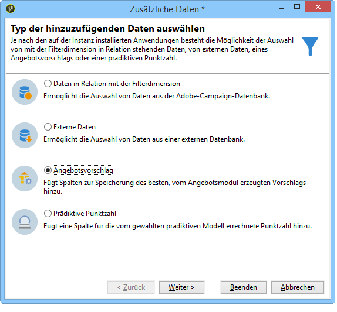

1. Geben Sie eine Kennung und einen Titel für den hinzuzufügenden Vorschlag an.
1. Geben Sie die Angebotsauswahl an. Hierfür gibt es zwei mögliche Optionen:

   * **[!UICONTROL Suche nach dem besten Angebot in einer Kategorie]** : Wenn Sie diese Option aktivieren, geben Sie die Aufrufparameter des Angebotsmoduls an (Platzierung, Kategorie oder Themen, Kontaktdatum, Anzahl der beizubehaltenden Angebote). Das Modul berechnet automatisch die hinzuzufügenden Angebote, die den Parametern entsprechen. Wir empfehlen, entweder das Feld **[!UICONTROL Kategorie]** oder das Feld **[!UICONTROL Thema]** vollständig auszufüllen, und nicht beide gleichzeitig.

     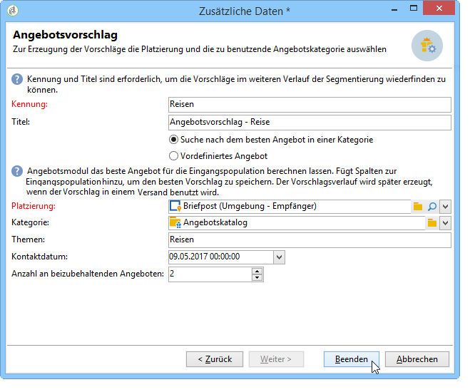

   * **[!UICONTROL Vordefiniertes Angebot]**: Beim Aktivieren dieser Option können Sie ohne Abfrage des Angebotsmoduls direkt das einzufügende Angebot konfigurieren (Platzierung, Kontaktdatum).

     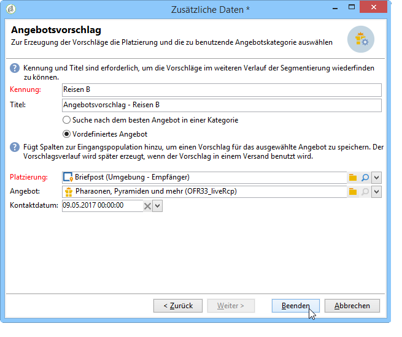

1. Konfigurieren Sie dann eine Versandaktivität, die dem von Ihnen gewählten Kanal entspricht. Weitere Informationen hierzu finden Sie im Abschnitt [Angebotsvorschläge in einen Versand einfügen](../../interaction/using/integrating-an-offer-via-the-wizard.md#inserting-an-offer-proposition-into-a-delivery).

   >[!NOTE]
   >
   >Die Anzahl an für die Vorschau verfügbaren Vorschlägen hängt von der Konfiguration der Anreicherung und nicht von im Versand konfigurierten Parametern ab.

### Referenzierung einer Relation zu einem Angebot {#referencing-a-link-to-an-offer}

In einer Anreicherungsaktivität besteht darüber hinaus die Möglichkeit, eine Relation zu einem Angebot zu referenzieren.

Gehen Sie dazu wie folgt vor:

1. Klicken Sie im Tab **[!UICONTROL Anreicherung]** der Aktivität auf den Link **[!UICONTROL Daten hinzufügen...]**.
1. Wählen Sie im folgenden Fenster den Datentyp **[!UICONTROL Relation]** aus.
1. Wählen Sie die Art des Links, den Sie erstellen möchten, sowie seine Zielgruppe aus. In diesem Fall ist das Angebotsschema die Zielgruppe.

   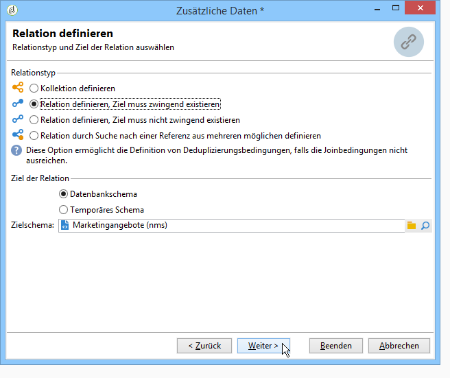

1. Relation zwischen den Daten der Eingangstabelle der Aktivität Anreicherung (hier die Empfängertabelle) und der Angebotstabelle Sie können beispielsweise einen Angebots-Code mit einem Empfänger verknüpfen.

   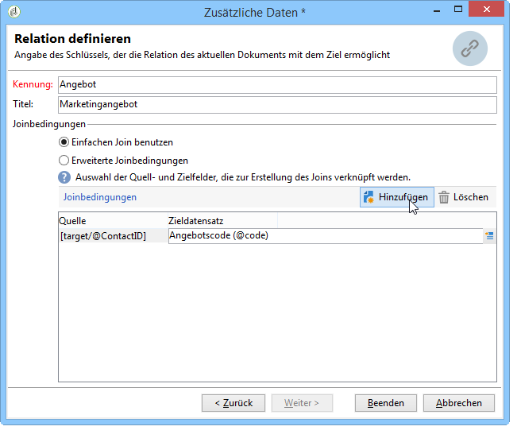

1. Konfigurieren Sie dann eine Versandaktivität, die dem von Ihnen gewählten Kanal entspricht. Weitere Informationen hierzu finden Sie im Abschnitt [Angebotsvorschläge in einen Versand einfügen](../../interaction/using/integrating-an-offer-via-the-wizard.md#inserting-an-offer-proposition-into-a-delivery).

   >[!NOTE]
   >
   >Die Anzahl an für die Vorschau verfügbaren Vorschlägen hängt von den im Versand konfigurierten Parametern ab.

### Ranking und Gewichtung von Angeboten speichern {#storing-offer-rankings-and-weights}

Standardmäßig werden Ranking und Gewichtung bei Verwendung der Aktivität **Anreicherung** nicht in der Vorschlagstabelle gespeichert.

>[!NOTE]
>
>Die Aktivität **[!UICONTROL Angebotsmodul]** speichert diese Informationen standardmäßig.

Gehen Sie wie folgt vor, wenn Sie diese Informationen dennoch speichern möchten:

1. Erstellen Sie eine Angebotsmodul-Abfrage in einer Anreicherungsaktivität, die nach einer Abfrage und vor einer Versandaktivität platziert wird. Siehe Abschnitt [Angebot oder Angebotsmodul-Abfrage konfigurieren](../../interaction/using/integrating-an-offer-via-a-workflow.md#specifying-an-offer-or-a-call-to-the-offer-engine).
1. Klicken Sie im Anreicherung-Tab der gleichnamigen Aktivität auf den Link **[!UICONTROL Zusätzliche Daten bearbeiten...]**.

   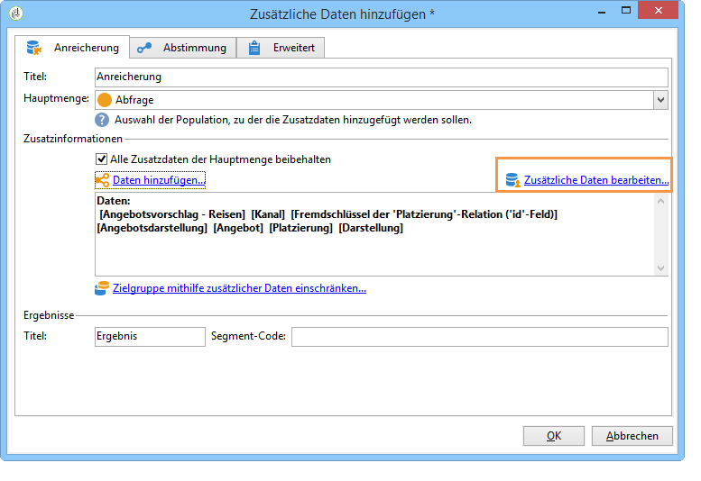

1. Fügen Sie für das Ranking die Spalte **[!UICONTROL @rank]** und für die Gewichtung die Spalte **[!UICONTROL @weight]** hinzu.

   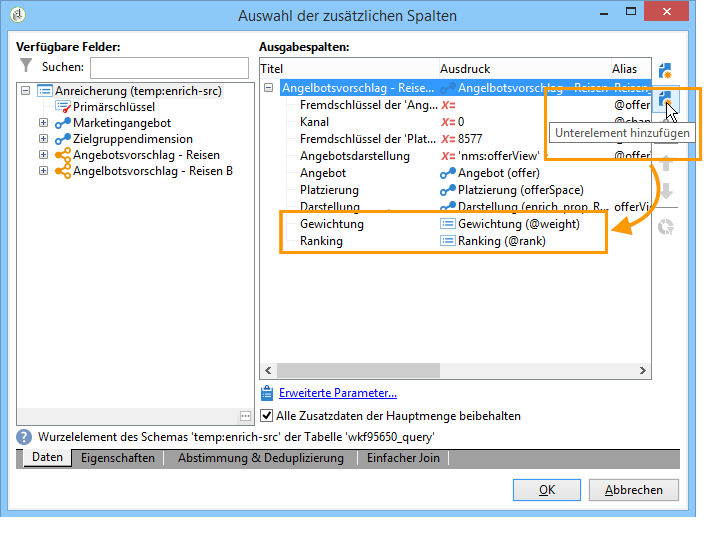

1. Bestätigen Sie Ihre Wahl und speichern Sie den Workflow.

Der Versand speichert automatisch die Rangfolge und Gewichtung der Angebote. Diese Informationen werden in der Registerkarte **[!UICONTROL Angebote]** des Versands angezeigt.

## Angebotsmodul {#offer-engine}

Auch die Aktivität **[!UICONTROL Angebotsmodul]** ermöglicht die Konfiguration einer einem Versand vorangestellten Modulabfrage.

Das Prinzip dieser Aktivität entspricht dem der Anreicherung. Auch hier werden die Daten der Eingangspopulation mit einem vom Modul berechneten Angebot angereichert, bevor die eigentliche Versandaktivität startet.

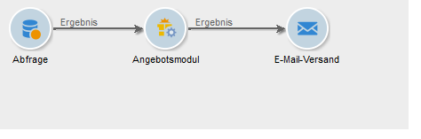

Nach der Konfiguration Ihrer Abfrage (siehe [Workflow](../../workflow/using/query.md)-Handbuch):

1. Platzieren Sie im Anschluss an die Abfrage ein **[!UICONTROL Angebotsmodul]** und öffnen Sie es zur weiteren Bearbeitung.
1. Füllen Sie die verschiedenen verfügbaren Felder aus, um die Parameter der Abfrage des Angebotsmoduls anzugeben (Platzierung, Kategorie oder Themen, Kontaktdatum, Anzahl beizubehaltender Angebote). Das Modul berechnet automatisch die hinzuzufügenden Angebote, die den Parametern entsprechen.

   >[!NOTE]
   >
   >Wenn Sie diese Aktivität nutzen, werden nur die im Versand verwendeten Vorschläge gespeichert.

   

1. Konfigurieren Sie dann eine Versandaktivität, die dem von Ihnen gewählten Kanal entspricht. Weitere Informationen hierzu finden Sie im Abschnitt [Angebotsvorschläge in einen Versand einfügen](../../interaction/using/integrating-an-offer-via-the-wizard.md#inserting-an-offer-proposition-into-a-delivery).

## Angebote pro Segment {#offers-by-cell}

Mithilfe der Aktivität **[!UICONTROL Angebote pro Segment]** lässt sich die eingehende Population (die beispielsweise aus einer Abfrage hervorgeht) in mehrere Zielgruppen aufspalten, um so je Segment spezifische Angebote zu unterbreiten.

Gehen Sie dazu wie folgt vor:

1. Platzieren Sie im Anschluss an die Abfrage der Zielpopulation eine Aktivität **[!UICONTROL Angebote pro Segment]** und öffnen Sie sie zur weiteren Bearbeitung.
1. Wählen Sie auf der Registerkarte **[!UICONTROL Allgemein]** die Platzierung, über die Sie Angebote unterbreiten möchten.
1. Definieren Sie nun auf der Registerkarte **[!UICONTROL Segmente]** über die Schaltfläche **[!UICONTROL Hinzufügen]** die verschiedenen Segmente:

   * Konfigurieren Sie anhand der verfügbaren Filter und Begrenzungen die Population des Segments.
   * Wählen Sie dann das Angebot aus, das Sie der Untergruppe unterbreiten möchten. Die verfügbaren Angebote sind diejenigen, die in der im vorherigen Schritt ausgewählten Angebotsumgebung geeignet sind.

     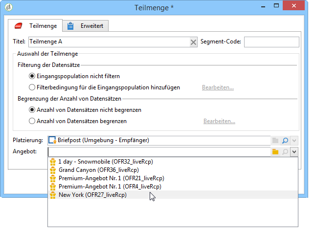

1. Konfigurieren Sie dann eine Versandaktivität, die dem von Ihnen gewählten Kanal entspricht. Weitere Informationen hierzu finden Sie im Abschnitt [Angebotsvorschläge in einen Versand einfügen](../../interaction/using/integrating-an-offer-via-the-wizard.md#inserting-an-offer-proposition-into-a-delivery).
