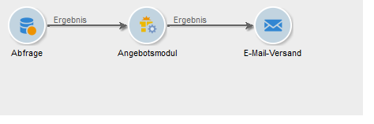

# Integration über Workflows{#integrating-an-offer-via-a-workflow}

Neben der eigentlichen Versand-Aktivität bieten auch diverse andere Workflow-Aktivitäten die Möglichkeit, Angebotsunterbreitungen zu konfigurieren:

* Versandentwurf
* Anreicherung
* Angebotsmodul
* Angebote pro Segment

## Versandentwurf {#delivery-outline}

Die in Kampagnen-Workflows zur Verfügung stehende Versandentwurfsaktivität erlaubt es, Angebote zu unterbreiten, die in einem Versandentwurf der aktuellen Kampagne referenziert wurden.

1. Platzieren Sie hierfür im Workflow die Versandentwurfsaktivität vor einer Versandaktivität.
1. Geben Sie in der Versandentwurfsaktivität den gewünschten Entwurf an.

   Weiterführende Informationen zu Versandentwürfen können Sie dem [Campaign](../../campaign/using/marketing-campaign-deliveries.md#associating-and-structuring-resources-linked-via-a-delivery-outline)-Handbuch entnehmen.

1. Füllen Sie die verfügbaren Felder Ihrem Versand entsprechend aus.
1. Sie haben zwei Möglichkeiten:

   * Versand mit Abfrage an das Angebotsmodul: Kreuzen Sie in diesem Fall die Option **[!UICONTROL Anzahl der ausgewählten Vorschläge begrenzen]** an. Konfigurieren Sie die Platzierung und die Anzahl an zu unterbreitenden Angeboten.

      Gewichtung und Eignungsregeln der Angebote werden vom Angebotsmodul berücksichtigt.

   * Versand ohne Abfrage an das Angebotsmodul: Alle im Versandentwurf enthaltenen Angebote werden unterbreitet.
   >[!NOTE]
   >
   >Die Vorschau berücksichtigt die im Versand konfigurierte Anzahl an Angeboten. Bei Ausführung des Workflows hingegen wird die im Versandentwurf konfigurierte Anzahl verwendet.

   

## Anreicherung {#enrichment}

Die Anreicherungsaktivität ermöglicht das Hinzufügen von Angeboten oder von Relationen zu Angeboten für Versandempfänger.

>[!NOTE]
>
>Weiterführende Informationen zur Anreicherung finden Sie im [Workflow](../../workflow/using/enrichment.md)-Handbuch.

Sie können beispielsweise aus einer Abfrage stammende Empfängerdaten vor Durchführung eines Versands anreichern.

Zwei Methoden ermöglichen in diesem Fall die Auswahl der Angebotsvorschläge:

* Konfiguration eines Angebots oder einer Abfrage des Angebotsmoduls;
* Referenzierung einer Relation zu einem Angebot.

### Angebot oder Angebotsmodul-Abfrage konfigurieren {#specifying-an-offer-or-a-call-to-the-offer-engine}

Nach der Konfiguration Ihrer Anfrage (siehe [Workflow](../../workflow/using/query.md)-Handbuch):

1. Platzieren Sie im Anschluss an die Abfrage eine Anreicherungsaktivität und öffnen Sie sie zur weiteren Bearbeitung.
1. Wählen Sie **[!UICONTROL Daten hinzufügen]** im Tab **[!UICONTROL Anreicherung]**.
1. Wählen Sie **[!UICONTROL Angebotsvorschlag]** als hinzuzufügenden Datentyp aus.

   

1. Geben Sie eine Kennung und einen Titel für den hinzuzufügenden Vorschlag an.
1. Konfigurieren Sie die Angebotsauswahl. Zwei Optionen stehen zur Auswahl:

   * **[!UICONTROL Suche nach dem besten Angebot in einer Kategorie]**: Wenn Sie diese Option ankreuzen, berechnet das Angebotsmodul automatisch das oder die einzufügenden Angebote, die den angegebenen Parametern (Platzierung, Kategorie oder Themen, Kontaktdatum, Anzahl beizubehaltender Angebote) entsprechen. Es wird empfohlen, entweder eine **[!UICONTROL Kategorie]** oder **[!UICONTROL Themen]** anzugeben.

      

   * **[!UICONTROL Vordefiniertes Angebot]**: Bei Ankreuzen dieser Option können Sie ohne Abfrage des Angebotsmoduls direkt das einzufügende Angebot konfigurieren (Platzierung, Kontaktdatum).

      

1. Konfigurieren Sie dann eine Versandaktivität, die dem von Ihnen gewählten Kanal entspricht. Weitere Informationen hierzu finden Sie im Abschnitt [Angebotsvorschläge in einen Versand einfügen](../../interaction/using/integrating-an-offer-via-the-wizard.md#inserting-an-offer-proposition-into-a-delivery).

   >[!NOTE]
   >
   >Die Anzahl an für die Vorschau verfügbaren Vorschlägen hängt von der Konfiguration der Anreicherung und nicht von im Versand konfigurierten Parametern ab.

### Relation zu einem Angebot referenzieren {#referencing-a-link-to-an-offer}

In einer Anreicherungsaktivität besteht darüber hinaus die Möglichkeit, eine Relation zu einem Angebot zu referenzieren.

Gehen Sie dazu wie folgt vor:

1. Klicken Sie im Tab **[!UICONTROL Anreicherung]** der Aktivität auf den Link **[!UICONTROL Daten hinzufügen...]**.
1. Wählen Sie im folgenden Fenster den Datentyp **[!UICONTROL Relation]** aus.
1. Definieren Sie nun den Relationstyp und das Ziel der Relation. Im vorliegenden Beispiel handelt es sich beim Ziel um das Angebotsschema.

   

1. Definieren Sie die Art der Relation zwischen den Daten der Eingangstabelle der Anreicherungsaktivität (hier die Empfängertabelle) und der Angebotstabelle. Sie können beispielsweise einem Empfänger einen Angebotscode zuordnen.

   

1. Konfigurieren Sie dann eine Versandaktivität, die dem von Ihnen gewählten Kanal entspricht. Weitere Informationen hierzu finden Sie im Abschnitt [Angebotsvorschläge in einen Versand einfügen](../../interaction/using/integrating-an-offer-via-the-wizard.md#inserting-an-offer-proposition-into-a-delivery).

   >[!NOTE]
   >
   >Die Anzahl an für die Vorschau verfügbaren Vorschlägen hängt von den im Versand konfigurierten Parametern ab.

### Rang und Gewichtung von Angeboten speichern {#storing-offer-rankings-and-weights}

Standardmäßig werden Rang und Gewichtung bei Verwendung der Aktivität **Anreicherung** nicht in der Vorschlagstabelle gespeichert.

>[!NOTE]
>
>Die Aktivität **[!UICONTROL Angebotsmodul]** speichert diese Informationen standardmäßig.

Gehen Sie wie folgt vor, wenn Sie diese Informationen dennoch speichern möchten:

1. Erstellen Sie eine Angebotsmodul-Abfrage in einer Anreicherungsaktivität, die nach einer Abfrage und vor einer Versandaktivität platziert wird. Siehe Abschnitt [Angebot oder Angebotsmodul-Abfrage konfigurieren](../../interaction/using/integrating-an-offer-via-a-workflow.md#specifying-an-offer-or-a-call-to-the-offer-engine).
1. Klicken Sie im Anreicherung-Tab der gleichnamigen Aktivität auf den Link **[!UICONTROL Zusätzliche Daten bearbeiten...]**.

   

1. Fügen Sie für den Rang die Spalte **[!UICONTROL @rank]** und die Gewichtung die Spalte **[!UICONTROL @weight]** hinzu.

   

1. Bestätigen Sie Ihre Wahl und speichern Sie den Workflow.

Der Versand speichert nun automatisch Rang und Gewichtung der Angebote. Die Informationen können im Tab **[!UICONTROL Angebote]** des Versands eingesehen werden.

## Angebotsmodul {#offer-engine}

Auch die Aktivität **[!UICONTROL Angebotsmodul]** ermöglicht die Konfiguration einer einem Versand vorangestellten Modulabfrage.

Das Prinzip dieser Aktivität entspricht dem der Anreicherung. Auch hier werden die Daten der Eingangspopulation mit einem vom Modul berechneten Angebot angereichert, bevor die eigentliche Versandaktivität startet.

Nach der Konfiguration Ihrer Anfrage (siehe [Workflow](../../workflow/using/query.md)-Handbuch):

1. Platzieren Sie im Anschluss an die Abfrage ein **[!UICONTROL Angebotsmodul]** und öffnen Sie es zur weiteren Bearbeitung.
1. Konfigurieren Sie die verschiedenen Parameter der Abfrage des Angebotsmoduls (Platzierung, Kategorie oder Themen, Kontaktdatum, Anzahl beizubehaltender Angebote). Das Modul berechnet automatisch die den Parametern entsprechenden Angebote.

   >[!NOTE]
   >
   >Wenn Sie diese Aktivität nutzen, werden nur die im Versand verwendeten Vorschläge gespeichert.

   

1. Konfigurieren Sie dann eine Versandaktivität, die dem von Ihnen gewählten Kanal entspricht. Weitere Informationen hierzu finden Sie im Abschnitt [Angebotsvorschläge in einen Versand einfügen](../../interaction/using/integrating-an-offer-via-the-wizard.md#inserting-an-offer-proposition-into-a-delivery).

## Angebote pro Segment {#offers-by-cell}

Mithilfe der Aktivität **[!UICONTROL Angebote pro Segment]** lässt sich die eingehende Population (die beispielsweise aus einer Abfrage hervorgeht) in mehrere Zielgruppen aufspalten, um so je Segment spezifische Angebote zu unterbreiten.

Gehen Sie dazu wie folgt vor:

1. Platzieren Sie im Anschluss an die Abfrage eine Aktivität **[!UICONTROL Angebote pro Segment]** und öffnen Sie sie zur weiteren Bearbeitung.
1. Wählen Sie im **[!UICONTROL Allgemein]**-Tab die Platzierung, über die Sie Angebote unterbreiten möchten.
1. Definieren Sie nun im **[!UICONTROL Segmente]**-Tab über die Schaltfläche **[!UICONTROL Hinzufügen]** die verschiedenen Segmente:

   * Konfigurieren Sie anhand der verfügbaren Filter und Begrenzungen die Population des Segments.
   * Wählen Sie dann das Angebot aus, das Sie dem Segment unterbreiten möchten. Es stehen die Angebote zur Verfügung, die der Konfiguration der zuvor ausgewählten Platzierung entsprechen.

      

1. Konfigurieren Sie dann eine Versandaktivität, die dem von Ihnen gewählten Kanal entspricht. Weitere Informationen hierzu finden Sie im Abschnitt [Angebotsvorschläge in einen Versand einfügen](../../interaction/using/integrating-an-offer-via-the-wizard.md#inserting-an-offer-proposition-into-a-delivery).

