# Integration über den Assistenten{#integrating-an-offer-via-the-wizard}

Zwei Möglichkeiten stehen zur Verfügung, um Angebote zum Zeitpunkt der Versanderstellung zu integrieren:

* durch Abfrage des Angebotsmoduls im Nachrichten-Textkörper;
* durch Referenzierung der Angebote in einem Versandentwurf im Rahmen einer Kampagne. Diese Methode wird insbesondere bei Briefpostkampagnen verwendet.

## Versand mit Abfrage des Angebotsmoduls {#delivering-with-a-call-to-the-offer-engine}

Die Einbindung von Angeboten in Marketingkampagnen geschieht innerhalb von klassischen Versandaktionen. Die Abfrage des Angebotsmoduls wird bei der Erstellung des Versandinhalts eingebunden, indem Sie in der Symbolleiste auf **[!UICONTROL Angebote]** klicken.

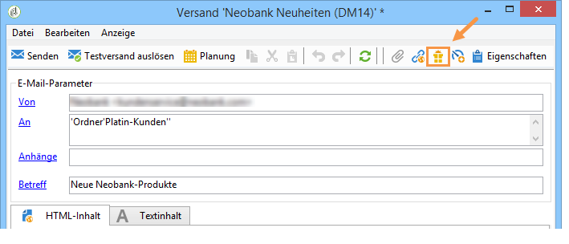

Weiterführende Informationen zu Versandaktionen und Marketingkampagnen finden Sie in den Handbüchern [Delivery](../../delivery/using/about-direct-mail-channel.md) und [Campaign](../../campaign/using/setting-up-marketing-campaigns.md).

### Angebote in Sendungen einschließen {#main-steps-for-inserting-an-offer-into-a-delivery}

Gehen Sie wie folgt vor, um Angebotsvorschläge in Sendungen einzufügen:

1. Klicken Sie im Versandfenster auf das Angebotssymbol.

   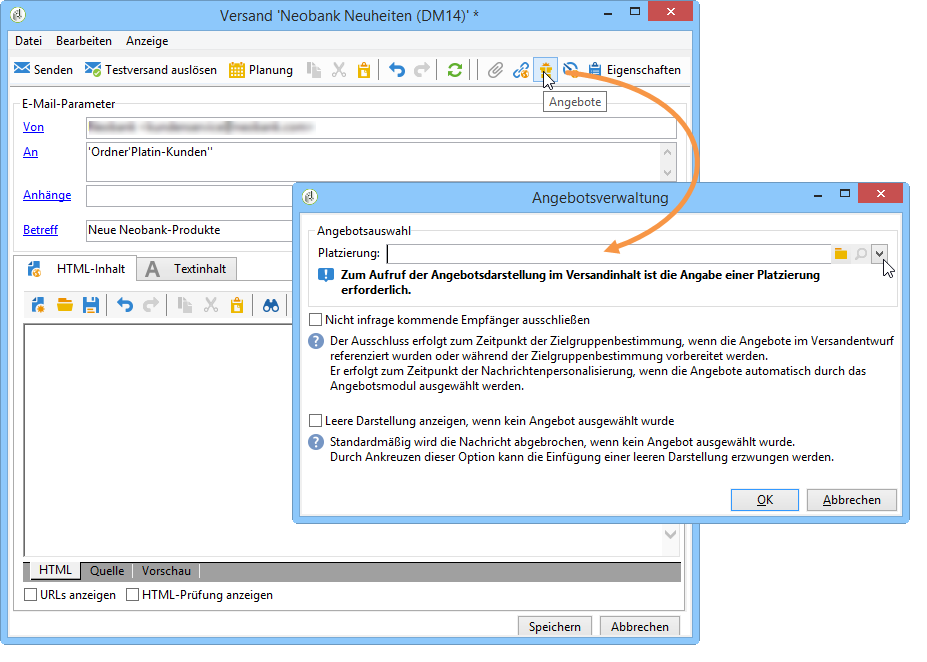

1. Wählen Sie die Ihrer Angebotsumgebung entsprechende Platzierung aus.

   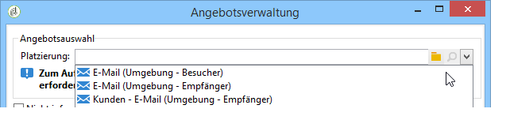

1. Wählen Sie die Kategorie aus, der die zu unterbreitenden Angebote angehören, oder ein oder mehrere Themen, um die vom Angebotsmodul getroffene Auswahl einzugrenzen. Es wird empfohlen, nur eins der beiden Felder zu verwenden, um die Auswahlmöglichkeiten nicht zu stark einzuschränken.

   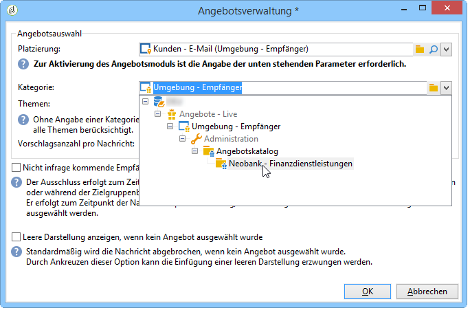

   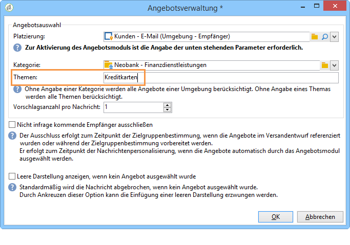

1. Geben Sie die Anzahl an Angeboten an, die im Nachrichten-Textkörper erscheinen sollen.

   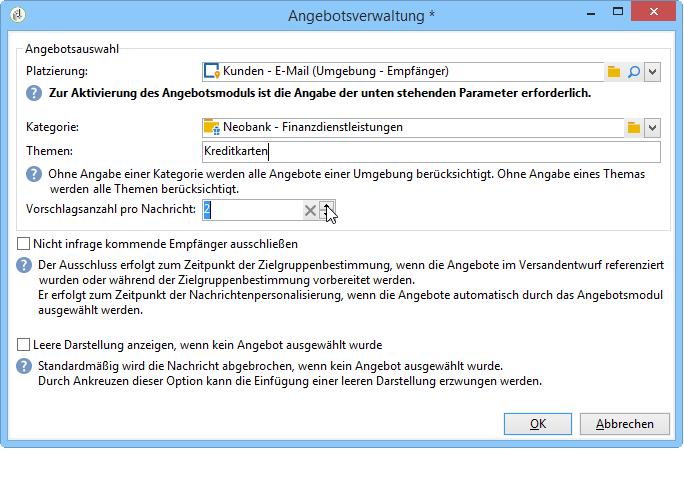

1. Wählen Sie bei Bedarf die Option **[!UICONTROL Nicht infrage kommende Empfänger ausschließen]** aus. Weitere Informationen hierzu finden Sie unter [Parameter der Abfragen an das Angebotsmodul](#parameters-for-calling-offer-engine).

   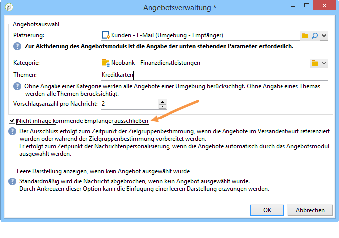

1. Wählen Sie bei Bedarf die Option **[!UICONTROL Leere Darstellung anzeigen, wenn kein Angebot ausgewählt wurde]** aus. Weitere Informationen hierzu finden Sie unter [Parameter der Abfragen an das Angebotsmodul](#parameters-for-calling-offer-engine).

   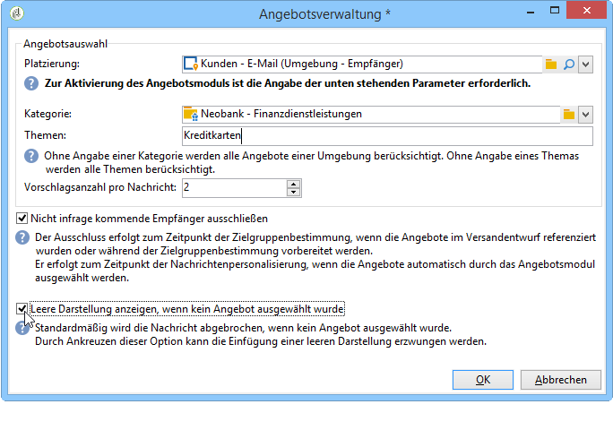

1. Fügen Sie nun mithilfe der Personalisierungsfelder die Angebotsvorschläge in den Versandinhalt ein. Die Anzahl der verfügbaren Vorschläge hängt von der Konfiguration der Abfrage an das Angebotsmodul, ihre Reihenfolge von der Angebotspriorität ab.

   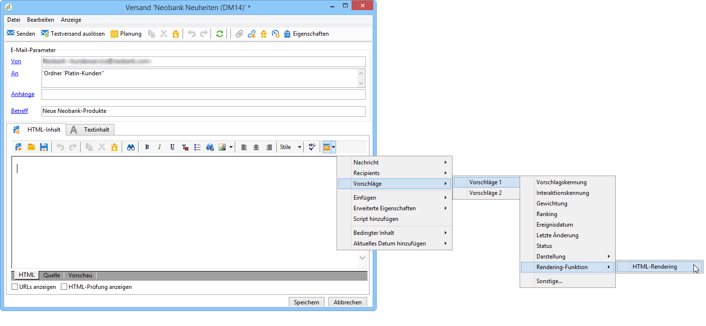

1. Erstellen Sie den weiteren Versandinhalt und starten Sie den Versand wie gewohnt.

   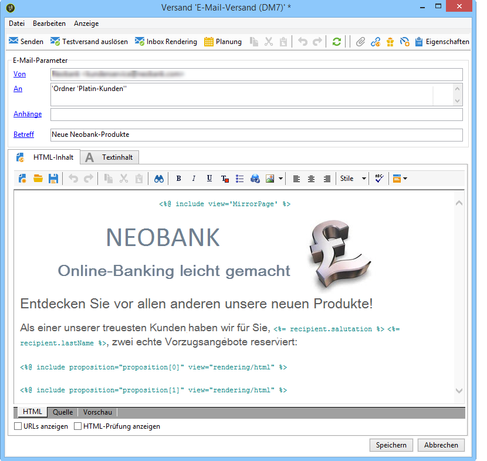

### Parameter der Abfragen an das Angebotsmodul {#parameters-for-calling-offer-engine}

* **[!UICONTROL Platzierung]**: Zur Aktivierung des Angebotsmoduls ist die Angabe einer Platzierung aus der Angebotsumgebung zwingend erforderlich.
* **[!UICONTROL Kategorie]**: spezifischer Ordner, indem die Angebote gespeichert werden. Wenn keine Kategorie angegeben wird, berücksichtigt das Angebotsmodul alle in der Umgebung enthaltenen Angebote, es sei denn, die Auswahl wird durch ein Thema eingegrenzt.
* **[!UICONTROL Themen]**: zuvor auf Kategorieebene definierte Schlüsselwörter, die wie ein Filter agieren. Die zu unterbreitenden Angebote werden den Themen entsprechend aus einer Gruppe von Kategorien ausgewählt.
* **[!UICONTROL Vorschlagsanzahl]**: Anzahl von Angeboten, die in den Nachrichten-Textkörper eingeschlossen werden können. Auch wenn sie nicht in die Nachricht eingeschlossen werden, werden die Angebote erzeugt aber nicht unterbreitet.
* **[!UICONTROL Nicht infrage kommende Empfänger ausschließen]**: Diese Option erlaubt es, Empfänger, für die nicht ausreichend Angebote infrage kommen, vom Versand auszuschließen. Wenn Sie diese Option nicht ankreuzen, erhält ein Empfänger den Versand, auch wenn für ihn nicht die gewünschte Anzahl an Angeboten ausgewählt werden konnte. Seine Nachricht enthält somit weniger oder gar keine Angebote.
* **[!UICONTROL Leere Darstellung anzeigen, wenn kein Angebot ausgewählt wurde]**: Mithilfe dieser Option wählen Sie den Umgang mit Nachrichten aus, für die ein einzufügender Vorschlag nicht (mehr) existiert. Wenn Sie die Option ankreuzen, erscheint in der Nachricht nichts, was sich auf den fehlenden Vorschlag bezieht, und der Versand wird wie üblich verarbeitet. Im anderen Fall wird die gesamte Nachricht vom Versand ausgeschlossen und die entsprechenden Empfänger erhalten keine Nachricht.

### Angebotsvorschläge in einen Versand einfügen {#inserting-an-offer-proposition-into-a-delivery}

Die Darstellung der zu unterbreitenden Angebote wird mithilfe der Personalisierungsfelder in den Body des Versands eingeschlossen. Die Anzahl der einzuschließenden Vorschläge wird in den Parametern der Angebotsmodul-Abfrage konfiguriert.

Die Nachrichtenpersonalisierung kann entweder über Felder des Angebots oder im Fall von E-Mails über Rendering-Funktionen geschehen.

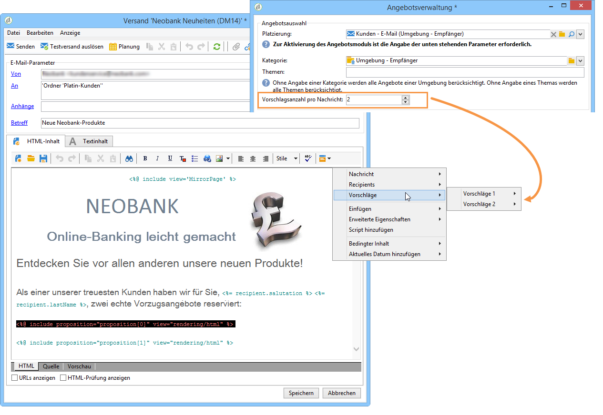

## Versand mit Versandentwurf {#delivering-with-delivery-outlines}

Eine weitere Möglichkeit ist die Verwendung von Versandentwürfen, um im Zuge von Kampagnen Angebote zu unterbreiten.

Weiterführende Informationen zu Versandentwürfen können Sie dem [Campaign](../../campaign/using/marketing-campaign-deliveries.md#associating-and-structuring-resources-linked-via-a-delivery-outline)-Handbuch entnehmen.

1. Erstellen Sie eine neue oder öffnen Sie eine existierende Kampagne.
1. Versandentwürfe sind im Tab **[!UICONTROL Bearbeiten]** > **[!UICONTROL Dokumente]** der Kampagne zugänglich.
1. Gehen Sie in den Tab **[!UICONTROL Versandentwürfe]** und fügen Sie einen neuen Entwurf hinzu. Klicken Sie nun für jedes im Versandentwurf zu referenzierende Angebot mit der rechten Maustaste auf den Entwurf und wählen Sie **[!UICONTROL Neu > Angebot]**. Speichern Sie zum Abschluss die Kampagne.

   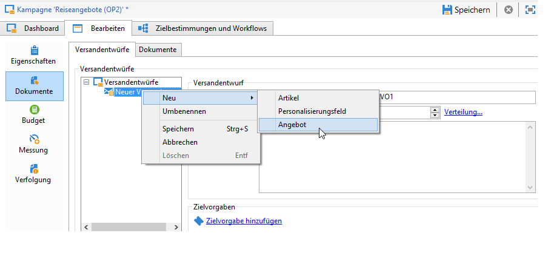

1. Erstellen Sie nun einen Versand, in dem Sie auf Versandentwürfe zugreifen können, z. B. einen Briefpost-Versand.
1. Klicken Sie anschließend auf den Link **[!UICONTROL Versandentwurf auswählen]**.

   >[!NOTE]
   >
   >Bei anderen Versandtypen (beispielsweise E-Mail) kann auf diese Option im Menü **[!UICONTROL Eigenschaften]** > **[!UICONTROL Erweitert]** zugegriffen werden.

   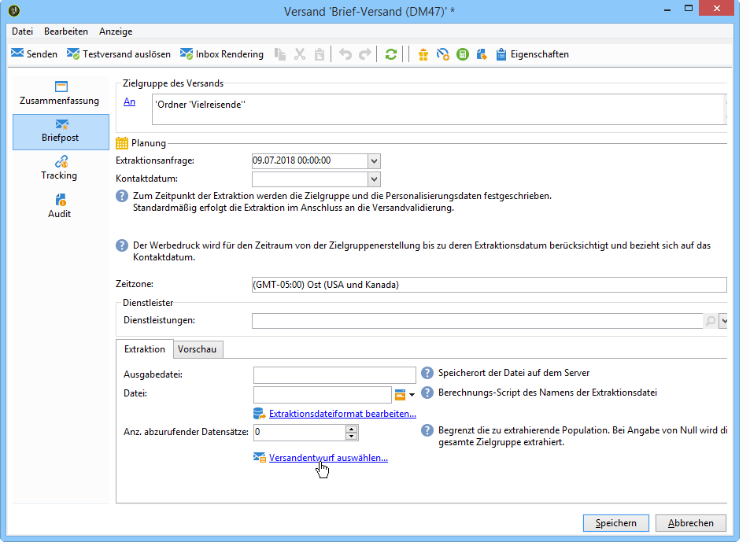

1. Konfigurieren Sie nun über die **[!UICONTROL Angebote]**-Schaltfläche die Platzierung sowie die Anzahl an im Versand zu unterbreitenden Angeboten.

   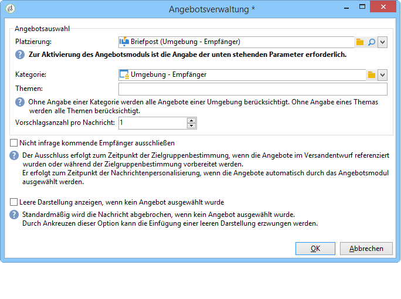

1. Fügen Sie die Vorschläge mithilfe der Personalisierungsfelder in den Nachrichten-Textkörper ein (siehe diesbezüglich den Abschnitt [Angebotsvorschläge in einen Versand einfügen](#inserting-an-offer-proposition-into-a-delivery)), bzw. durch Klick auf den Link zum Bearbeiten des Formats der Extraktionsdatei im Fall eines Briefpost-Versands.

   Die Auswahl der zu unterbreiteten Angebote erfolgt aus denen, die im Versandentwurf referenziert wurden.

   >[!NOTE]
   >
   >Informationen bezüglich Rang und Gewichtung der Angebote werden nur dann in der Vorschlagstabelle gespeichert, wenn die Angebote direkt im Versand erzeugt werden.

