# Einbinden eines Angebots über den Assistenten{#integrating-an-offer-via-the-assistant}

Zwei Möglichkeiten stehen zur Verfügung, um Angebote zum Zeitpunkt der Versanderstellung zu integrieren:

* durch Abfrage des Angebotsmoduls im Nachrichten-Textkörper;
* Referenzieren von Angeboten über die Versandentwürfe einer Kampagne Diese Methode wird im Allgemeinen für Papierkampagnen verwendet.

## Versand mit Abfrage des Angebotsmoduls {#delivering-with-a-call-to-the-offer-engine}

Um ein Angebot während einer Marketing-Kampagne zu präsentieren, erstellen Sie einfach eine klassische Versandaktion auf Basis des ausgewählten Kanals. Das Angebotsmodul wird bei der Definition des Versandinhalts aufgerufen, indem Sie auf das Symbol **[!UICONTROL Angebote]** in der Symbolleiste klicken.

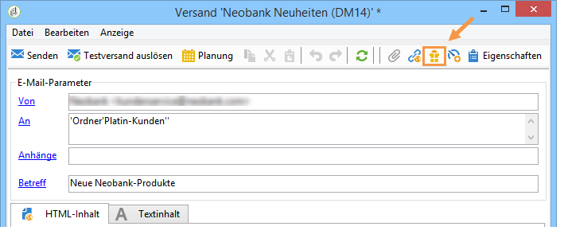

Weitere Informationen zum Briefpost-Versand finden Sie [in diesem Abschnitt](../../delivery/using/about-direct-mail-channel.md). Weitere Informationen zu Marketing-Kampagnen finden Sie in der [Dokumentation zu Campaign v8](https://experienceleague.adobe.com/docs/campaign/automation/campaign-orchestration/set-up-campaigns.html?lang=de){target=_blank}.

### Angebote in Sendungen einschließen {#main-steps-for-inserting-an-offer-into-a-delivery}

Gehen Sie wie folgt vor, um Angebotsvorschläge in Sendungen einzufügen:

1. Klicken Sie im Versandfenster auf das Angebotssymbol.

   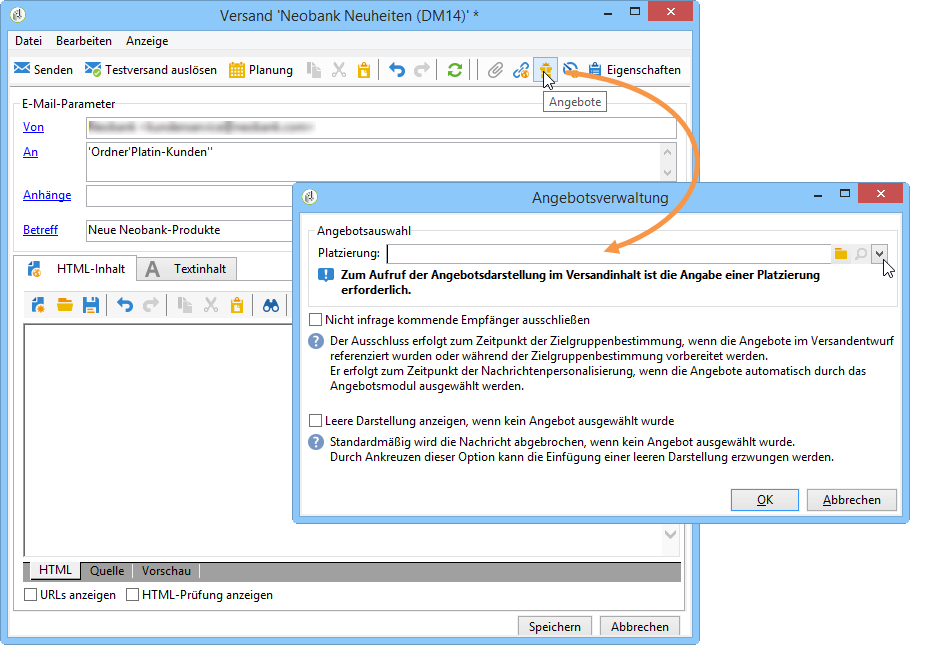

1. Wählen Sie die Ihrer Angebotsumgebung entsprechende Platzierung aus.

   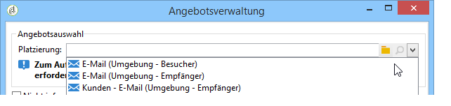

1. Um die Angebotsauswahl des Moduls zu verfeinern, wählen Sie entweder die Kategorie, zu der die zu unterbreitenden Angebote gehören, oder ein/mehrere Themen aus. Es wird empfohlen, jeweils nur eines dieser Felder gleichzeitig zu verwenden, um eine Überlastung der Einschränkungen zu vermeiden.

   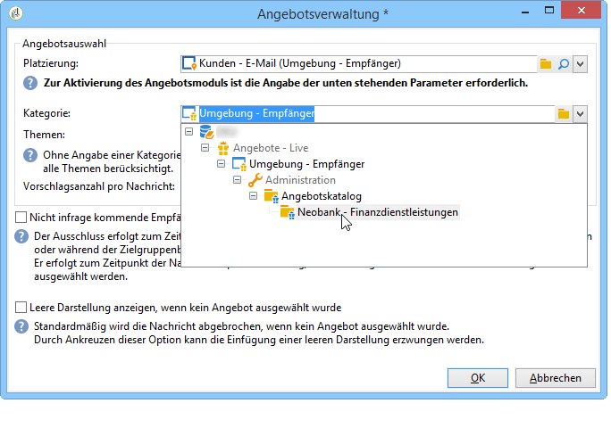

   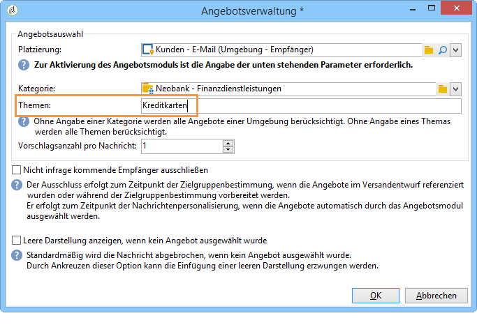

1. Geben Sie die Anzahl an Angeboten an, die im Nachrichten-Textkörper erscheinen sollen.

   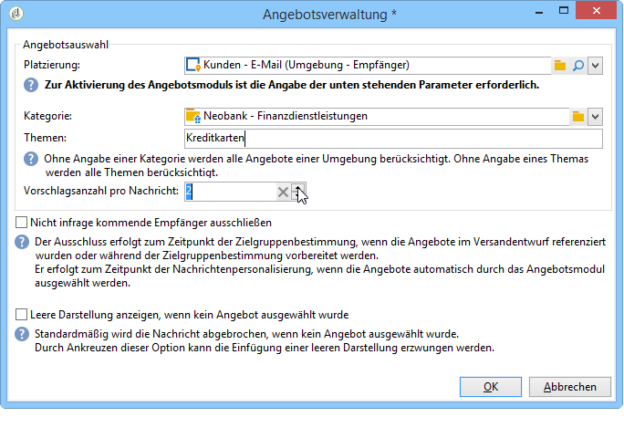

1. Wählen Sie bei Bedarf die Option **[!UICONTROL Nicht infrage kommende Empfänger ausschließen]** aus. Weitere Informationen hierzu finden Sie unter [Parameter der Abfragen an das Angebotsmodul](#parameters-for-calling-offer-engine).

   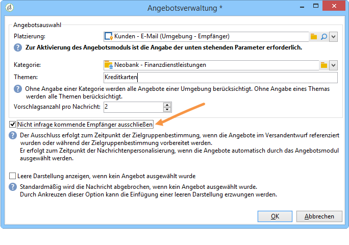

1. Wählen Sie bei Bedarf die Option **[!UICONTROL Leere Darstellung anzeigen, wenn kein Angebot ausgewählt wurde]** aus. Weitere Informationen hierzu finden Sie unter [Parameter der Abfragen an das Angebotsmodul](#parameters-for-calling-offer-engine).

   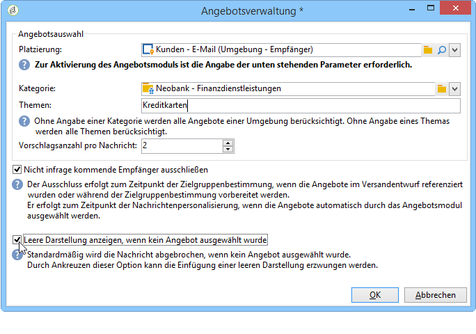

1. Fügen Sie die Eigenschaft(en) mithilfe der Zusammenführungsfelder in den Versandinhalt ein. Die Anzahl der verfügbaren Vorschläge hängt von der Konfiguration des Angebotsmodul-Aufrufs ab und ihre Reihenfolge hängt von der Priorität der Angebote ab.

   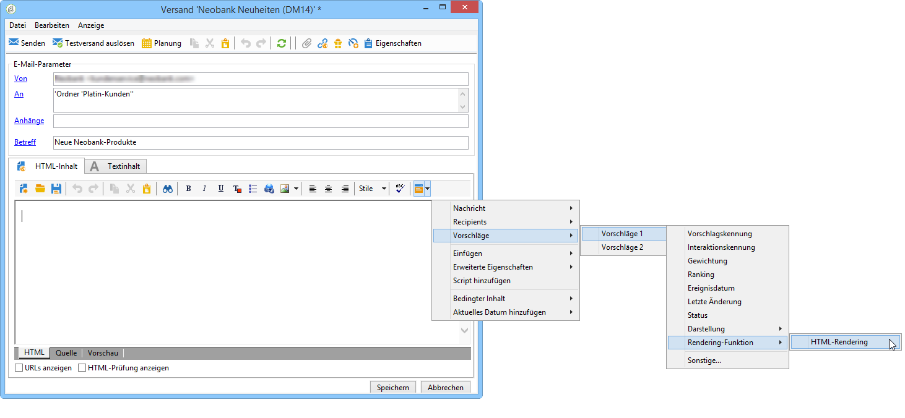

1. Erstellen Sie den weiteren Versandinhalt und starten Sie den Versand wie gewohnt.

   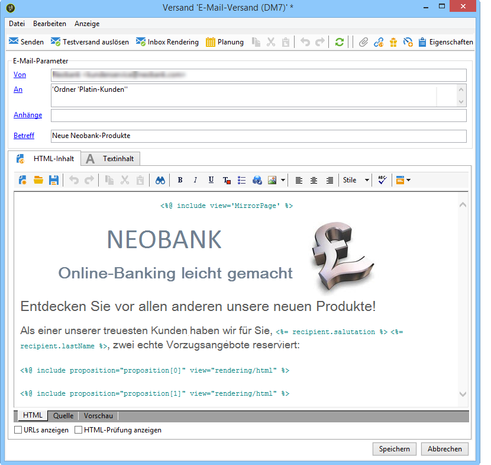

### Parameter der Abfragen an das Angebotsmodul {#parameters-for-calling-offer-engine}

* **[!UICONTROL Platzierung]**: Zur Aktivierung des Angebotsmoduls ist die Angabe einer Platzierung aus der Angebotsumgebung zwingend erforderlich.
* **[!UICONTROL Kategorie]** : spezifischer Ordner, in dem Angebote sortiert werden. Wenn keine Kategorie angegeben wird, werden alle in der Umgebung enthaltenen Angebote vom Angebotsmodul berücksichtigt, es sei denn, ein Design wird ausgewählt.
* **[!UICONTROL Themes]** : Schlüsselwörter, die zuvor in den Kategorien definiert wurden. Diese dienen als Filter und ermöglichen es Ihnen, die Anzahl der zu unterbreitenden Angebote zu verfeinern, indem Sie sie in einer Reihe von Kategorien auswählen.
* **[!UICONTROL Anzahl der Vorschläge]** : Anzahl der vom Modul zurückgegebenen Angebote, die in den Versandtext eingefügt werden können. Wenn sie nicht in die Nachricht eingefügt werden, werden die Angebote weiterhin generiert, aber nicht angezeigt.
* **[!UICONTROL Nicht geeignete Empfänger ausschließen]** : Mit dieser Option können Sie den Ausschluss von Empfängern aktivieren oder deaktivieren, für die nicht genügend geeignete Angebote vorhanden sind. Die Anzahl der geeigneten Vorschläge kann kleiner sein als die angeforderte Anzahl von Vorschlägen. Wenn diese Option aktiviert ist, werden Empfänger, für die nicht genügend Vorschläge vorhanden sind, vom Versand ausgeschlossen. Wenn Sie diese Option nicht auswählen, werden diese Empfänger nicht ausgeschlossen, erhalten jedoch nicht die angeforderte Anzahl an Vorschlägen.
* **[!UICONTROL Leere Darstellung anzeigen, wenn kein Angebot ausgewählt wurde]** : Mit dieser Option wählen Sie aus, wie die Nachricht verarbeitet werden soll, wenn ein Vorschlag nicht existiert. Wenn dieses Kontrollkästchen aktiviert ist, wird die Darstellung des fehlenden Vorschlags nicht angezeigt und es wird kein Inhalt in der Nachricht für diesen Vorschlag angezeigt. Wenn das Kontrollkästchen nicht aktiviert ist, wird die Nachricht selbst während des Versands abgebrochen und die Empfänger erhalten keine Nachrichten mehr.

### Angebotsvorschläge in einen Versand einfügen {#inserting-an-offer-proposition-into-a-delivery}

Die Darstellung der zu unterbreitenden Angebote wird über die Zusammenführungsfelder in den Versandkörper eingefügt. Die Anzahl der Vorschläge wird in den Parametern der Angebotsmodul-Abfrage definiert.

Die Nachrichtenpersonalisierung kann entweder über Felder des Angebots oder im Fall von E-Mails über Rendering-Funktionen geschehen.

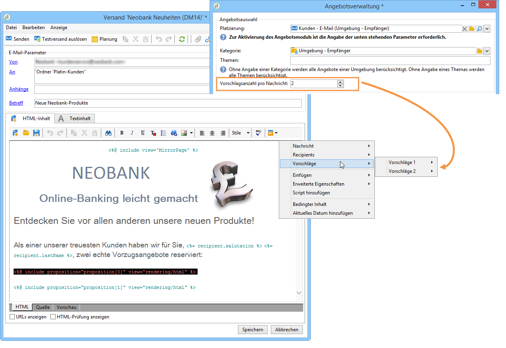

## Versand mit Versandentwurf {#delivering-with-delivery-outlines}

Eine weitere Möglichkeit ist die Verwendung von Versandentwürfen, um im Zuge von Kampagnen Angebote zu unterbreiten.

Weiterführende Informationen zu Versandentwürfen finden Sie in der [Dokumentation zu Campaign v8](https://experienceleague.adobe.com/docs/campaign/automation/campaign-orchestration/marketing-campaign-assets#delivery-outlines.html?lang=de){target="_blank"}.

1. Erstellen Sie eine neue oder öffnen Sie eine existierende Kampagne.
1. Versandentwürfe sind im Tab **[!UICONTROL Bearbeiten]** > **[!UICONTROL Dokumente]** der Kampagne zugänglich.
1. Gehen Sie in den Tab **[!UICONTROL Versandentwürfe]** und fügen Sie einen neuen Entwurf hinzu. Klicken Sie nun für jedes im Versandentwurf zu referenzierende Angebot mit der rechten Maustaste auf den Entwurf und wählen Sie **[!UICONTROL Neu > Angebot]**. Speichern Sie zum Abschluss die Kampagne.

   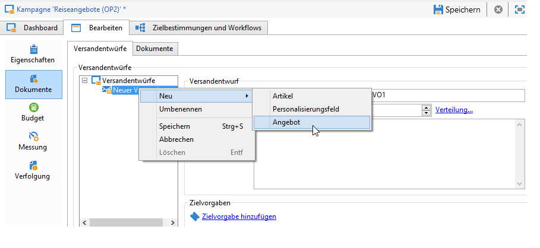

1. Erstellen Sie nun einen Versand, in dem Sie auf Versandentwürfe zugreifen können, z. B. einen Briefpost-Versand.
1. Klicken Sie anschließend auf den Link **[!UICONTROL Versandentwurf auswählen]**.

   >[!NOTE]
   >
   >Bei anderen Versandtypen (beispielsweise E-Mail) kann auf diese Option im Menü **[!UICONTROL Eigenschaften]** > **[!UICONTROL Erweitert]** zugegriffen werden.

   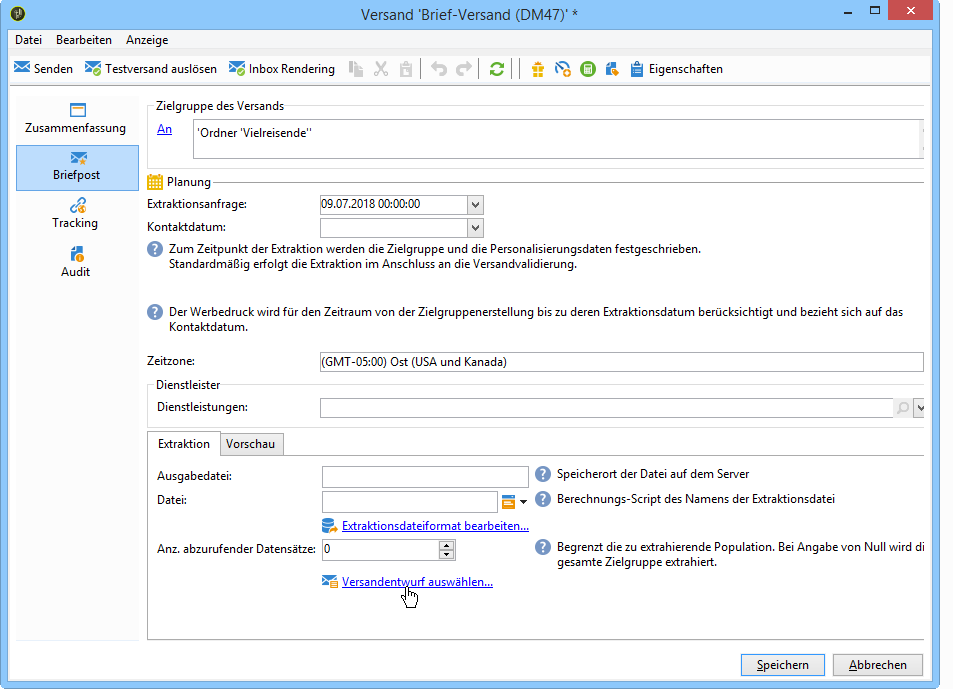

1. Konfigurieren Sie nun über die **[!UICONTROL Angebote]**-Schaltfläche die Platzierung sowie die Anzahl an im Versand zu unterbreitenden Angeboten.

   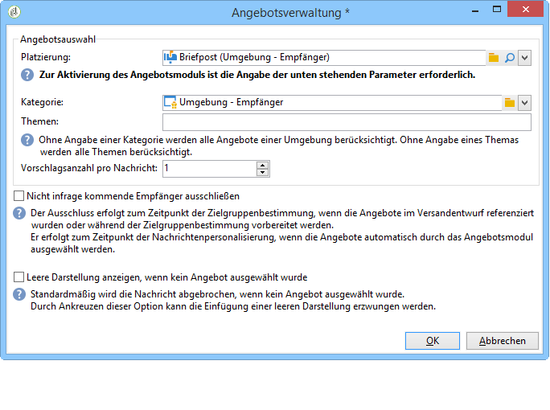

1. Fügen Sie die Vorschläge mithilfe der Personalisierungsfelder in den Nachrichten-Textkörper ein (siehe diesbezüglich den Abschnitt [Angebotsvorschläge in einen Versand einfügen](#inserting-an-offer-proposition-into-a-delivery)), bzw. durch Klick auf den Link zum Bearbeiten des Formats der Extraktionsdatei im Fall eines Briefpost-Versands.

   Die Auswahl der zu unterbreiteten Angebote erfolgt aus denen, die im Versandentwurf referenziert wurden.

   >[!NOTE]
   >
   >Informationen bezüglich Ranking und Gewichtung der Angebote werden nur dann in der Vorschlagstabelle gespeichert, wenn die Angebote direkt im Versand erzeugt werden.
