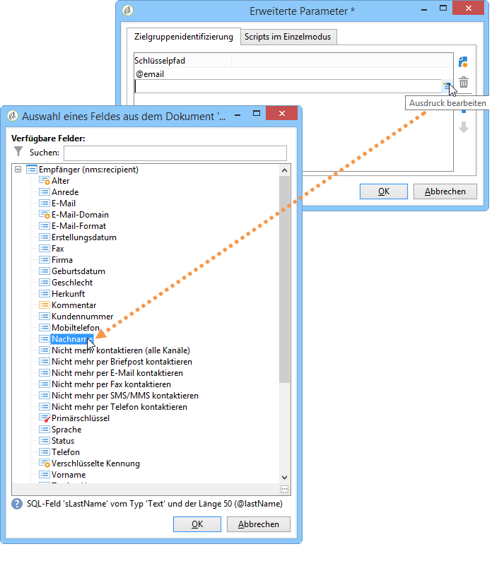
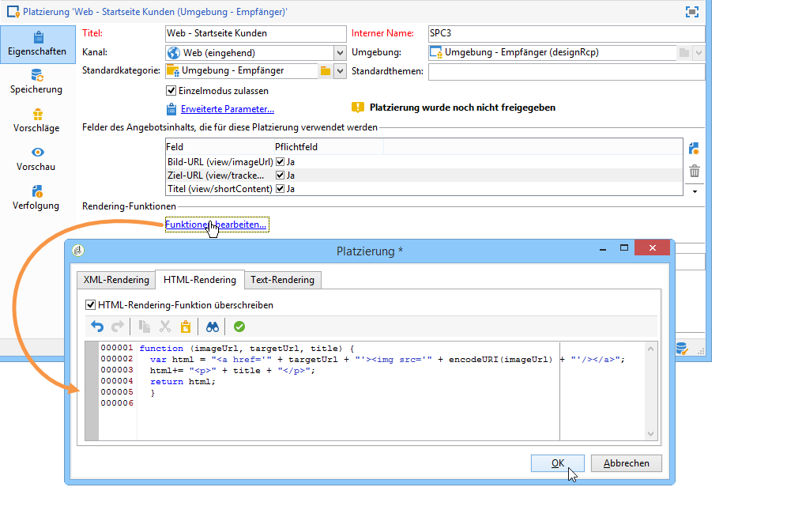
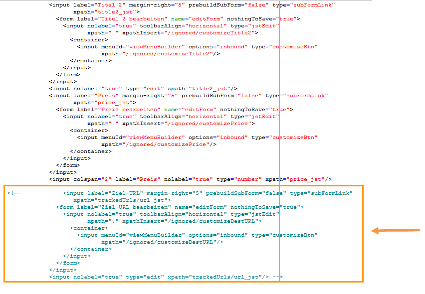
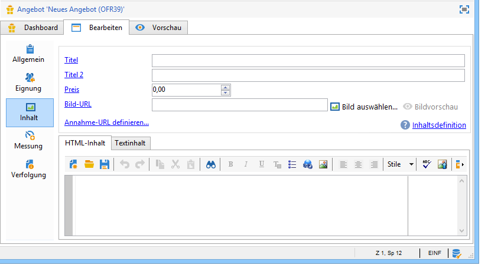
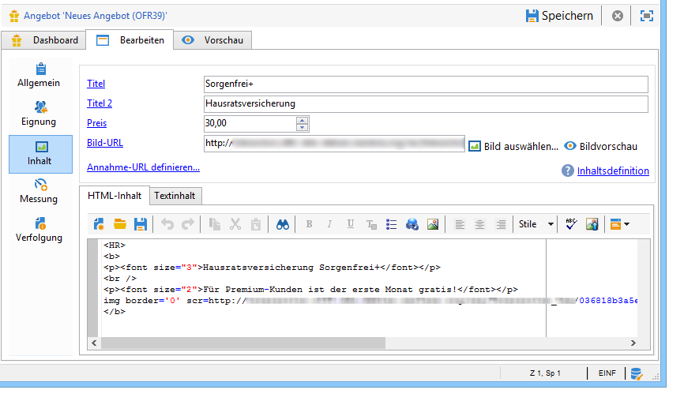
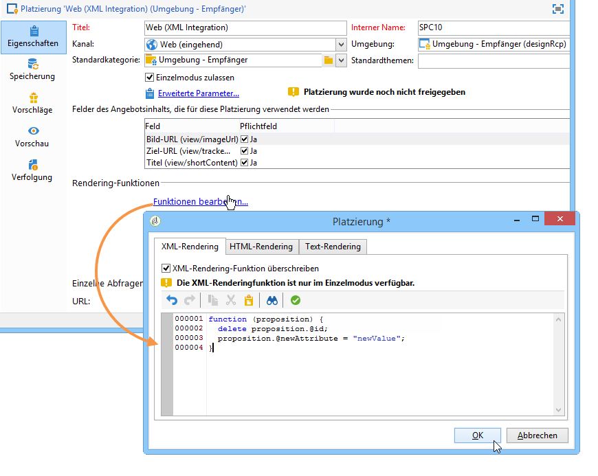

# JavaScript-Integration (Client-seitig){#integration-via-javascript-client-side}


Innerhalb einer Webseite erfolgt die Abfrage an das Interaction-Angebotsmodul direkt durch Integration eines JavaScript-Aufrufs. Dieser Aufruf gibt den Angebotsinhalt zurück in einem gezielten

Element.

Adobe empfiehlt die Verwendung der JavaScript-Integrationsmethode.

Die URL des Aufruf-Scripts stellt sich wie folgt dar:

```
<script id="interactionProposalScript" src="https://<SERVER_URL>/nl/interactionProposal.js?env=" type="text/javascript"></script>
```

Der Parameter &quot;**env**&quot; erhält den internen Namen der anonymen Interaktionen vorbehaltenen Live-Umgebung.

Um ein Angebot zu unterbreiten, müssen somit eine Umgebung und eine Platzierung in Adobe Campaign erstellt sowie eine HTML-Seite konfiguriert werden.

Unten stehend werden verschiedene Integrationsmöglichkeiten mit JavaScript beispielhaft dargestellt.

## HTML-Modus {#html-mode}

### Angebote für anonyme Kontakte {#presenting-an-anonymous-offer}

1. **Vorbereitung des Angebotsmoduls**

   Konfigurieren Sie in Adobe Campaign eine anonyme Umgebung.

   Erstellen Sie dann eine dieser Umgebung zugeordnete Platzierung.

   Erstellen Sie schließlich ein Angebot und eine der Platzierung entsprechende Darstellung.

1. **Inhalt der HTML-Seite**

   Die HTML-Seite muss ein

   -Element mit einem „@id“-Attribut enthalten, das den Wert des internen Namens der erstellten Platzierung hat („i_internal name space“). Das Angebot wird durch Interaction in dieses Element eingefügt.

   Im vorliegenden Beispiel nimmt das Attribut @id den Wert &quot;i_SPC12&quot; an, wobei &quot;SPC12&quot; der interne Name der zuvor erstellten Platzierung ist:

   ```
   <div id="i_SPC12"></div>
   ```

   Im vorliegenden Beispiel stellt sich die URL des Script-Aufrufs wie folgt dar (&quot;OE3&quot; ist der interne Name der Live-Umgebung):

   ```
   <script id="interactionProposalScript" src="https://instance.adobe.org:8080/nl/interactionProposal.js?env=OE3" type="text/javascript"></script>
   ```

   >[!IMPORTANT]
   >
   >Das `<script>`-Element darf nicht in sich geschlossen sein.

   Dieser statische Aufruf erzeugt automatisch einen dynamischen Aufruf, welcher alle vom Angebotsmodul benötigten Parameter enthält.

   Dies ermöglicht es beispielsweise, verschiedene Platzierungen innerhalb einer Seite mit einer einzigen Abfrage des Angebotsmoduls abzudecken.

1. **Ergebnis in der HTML-Seite**

   Der Inhalt der Angebotsdarstellung wird durch das Angebotsmodul an die HTML-Seite zurückgegeben:

   ```
   <div id="banner_header">
     <div id="i_SPC12">
       <table>
         <tbody>
           <tr>
             <td><h3>Fly to Japan!</h3></td>
           </tr>
           <tr>
             <td></td>
             <td>
               <p>Discover Japan for 2 weeks at an unbelievable price!!</p>
               <p><b>2345 Dollars - All inclusive</b></p>
             </td>
           </tr>
         </tbody>
       </table>
     </div>
     <script src="https://instance.adobe.org:8080/nl/interactionProposal.js?env=OE3" id="interactionProposalScript" type="text/javascript"></script>
   </div>
   ```

### Angebote für identifizierte Kontakte {#presenting-an-identified-offer}

Um einem identifizierten Kontakt ein Angebot zu unterbreiten, läuft der Prozess ähnlich ab, wie hier beschrieben: [Angebote für anonyme Kontakte](#presenting-an-anonymous-offer). Im Inhalt der Web-Seite müssen Sie das folgende Script hinzufügen, das während des Aufrufs an das Modul den Kontakt identifiziert:

```
<script type="text/javascript">
  interactionTarget = <contact_identifier>;
</script>
```

1. Klicken Sie in der Platzierung, die von der Webseite aus aufgerufen werden soll, auf **[!UICONTROL Erweiterte Parameter]** und fügen Sie mindestens einen Identifikationsschlüssel hinzu.

   

   Im vorliegenden Beispiel handelt es sich um einen zusammengesetzten Identifikationsschlüssel, da er sowohl auf die E-Mail-Adresse als auch auf den Namen des Kontakts Bezug nimmt.

1. Wenn die Webseite aufgerufen wird, ermöglicht es die Auswertung des Scripts, die Kennung des Kontakts an das Angebotsmodul zu übergeben. Bei zusammengesetzten Kennungen werden die Schlüssel in der gleichen Reihenfolge angezeigt wie in den erweiterten Parametern und durch | getrennt.

   In folgendem Beispielcode hat sich der Kontakt auf der Webseite mit seinen Kundendaten angemeldet. Er wurde somit bei der Abfrage des Angebotsmodul mithilfe seiner E-Mail-Adresse und seines Familiennamens identifiziert:

   ```
   <script type="text/javascript">
     interactionTarget = myEmail|myName;
   </script>
   ```

### HTML-Rendering-Funktion verwenden {#using-an-html-rendering-function}

Die Verwendung einer HTML-Rendering-Funktion bietet den Vorteil, das die HTML-Darstellung des Angebots automatisch erzeugt wird.

1. Klicken Sie in der Angebotsplatzierung auf den Link **[!UICONTROL Funktionen bearbeiten...]**.
1. Kreuzen Sie die Option **[!UICONTROL HTML-Rendering-Funktion überschreiben]** an.
1. Geben Sie dann im Tab **[!UICONTROL HTML-Rendering]** die den in der Platzierung für den Angebotsinhalt definierten Feldern entsprechenden Variablen ein.

   

   Im vorliegenden Beispiel wird das Angebot in Form eines Webseitenbanners unterbreitet. Es besteht aus einem anklickbaren Bild mit Untertitel, entsprechend den im Angebotsinhalt definierten Feldern.

## XML-Modus {#xml-mode}

### Angebote unterbreiten {#presenting-an-offer}

Interaction bietet die Möglichkeit, der das Angebotsmodul abfragenden HTML-Seite einen XML-Knoten zurückzugeben. Dieser XML-Knoten kann von clientseitig zu entwickelnden Funktionen verarbeitet werden.

Die Angebotsmodul-Abfrage stellt sich wie folgt dar:

```
<script type="text/javascript" id="interactionProposalScript" src="https://<SERVER_URL>/nl/interactionProposal.js?env=&cb="></script>
```

Der Parameter &quot;**env**&quot; erhält den internen Namen der Live-Umgebung.

Der optionale Parameter &quot;**cb**&quot; erhält den Namen der Funktion, die den vom Angebotsmodul zurückgegebenen XML-Knoten auswerten wird (Callback).

Die &quot;**t** Der Parameter erhält den Wert der Zielgruppe, nur für eine identifizierte Interaktion. Dieser Parameter kann auch mit der **interactionTarget** -Variable. Dieser Parameter ist optional.

Der optionale Parameter &quot;**c**&quot; erhält die Liste der internen Kategorienamen.

Der optionale Parameter &quot;**th**&quot; erhält die Liste der Themen.

Der optionale Parameter &quot;**gctx**&quot; erhält die globalen Aufrufdaten (Kontext) der gesamten Seite.

Der zurückgegebene XML-Knoten stellt sich wie folgt dar:

```
<propositions>
 <proposition id="" offer-id="" weight="" rank="" space="" div=""> //proposition identifiers
   ...XML content defined in Adobe Campaign...
 </proposition>
 ...
</propositions>
```

Das folgende Anwendungsbeispiel beschreibt die in Adobe Campaign vorzunehmenden Konfigurationen zur Aktivierung des XML-Modus und zeigt das Ergebnis der Angebotsmodul-Abfrage in der HTML-Seite. Gehen Sie wie folgt vor.

1. **Erstellung einer Umgebung und einer Platzierung**

   Weitere Informationen zum Erstellen einer Umgebung finden Sie unter [Live-/Design-Umgebungen](../../interaction/using/live-design-environments.md).

   Die Erstellung von Platzierungen wird im Abschnitt [Angebotsplatzierungen](../../interaction/using/creating-offer-spaces.md) genauer erläutert.

1. **Erweiterung des Angebotsschemas zur Hinzufügung neuer Felder**

   Das Schema definiert die Felder Titel 2 und Preis.

   Im vorliegenden Beispiel trägt es den Namen **cus:offer**.

   ```
   <srcSchema _cs="Marketing offers (cus)" created="2013-01-18 17:14:20.762Z" createdBy-id="0"
              desc="" entitySchema="xtk:srcSchema" extendedSchema="nms:offer" img="nms:offer.png"
              label="Marketing offers" labelSingular="Marketing offers" lastModified="2013-01-18 15:20:18.373Z"
              mappingType="sql" md5="F14A7AA009AE1FCE31B0611E72866AC3" modifiedBy-id="0"
              name="offer" namespace="cus" xtkschema="xtk:srcSchema">
     <createdBy _cs="Administrator (admin)"/>
     <modifiedBy _cs="Administrator (admin)"/>
     <element img="nms:offer.png" label="Marketing offers" labelSingular="Marketing offer"
              name="offer">
       <element label="Content" name="view">
         <element label="Price" name="price" type="long" xml="true"/>
         <element label="Title 2" name="title2" type="string" xml="true"/>
   
         <element advanced="true" desc="Price calculation script." label="Script price"
                  name="price_jst" type="CDATA" xml="true"/>
         <element advanced="true" desc="Title calculation script." label="Script title"
                  name="title2_jst" type="CDATA" xml="true"/>
       </element>
     </element>
   </srcSchema>
   ```

   >[!IMPORTANT]
   >
   >Jedes Element muss zweimal definiert werden. CDATA-Elemente (&quot;_jst&quot;) können Personalisierungsfelder enthalten.
   >
   >Vergessen Sie nicht, die Datenbankstruktur zu aktualisieren. Weiterführende Informationen hierzu finden Sie in [diesem Abschnitt](../../configuration/using/updating-the-database-structure.md).

   >[!NOTE]
   >
   >Sie können das Angebotsschema erweitern, um neue Felder sowohl im Batch- als auch im Einzelmodus sowie in jedem beliebigen Format (Text, HTML und XML) hinzuzufügen.

1. **Erweiterung des Angebotsformulars zur Hinzufügung der neuen Felder und Änderung eines existierenden Felds**

   Öffnen Sie das Formular **Angebot (nms)**.

   Fügen Sie im Abschnitt &quot;Views&quot; die zwei neuen Felder mit folgendem Inhalt ein:

   ```
   <input label="Title 2" margin-right="5" prebuildSubForm="false" type="subFormLink"
                        xpath="title2_jst">
                   <form label="Edit title 2" name="editForm" nothingToSave="true">
                     <input nolabel="true" toolbarAlign="horizontal" type="jstEdit"
                            xpath="." xpathInsert="/ignored/customizeTitle2">
                       <container>
                         <input menuId="viewMenuBuilder" options="inbound" type="customizeBtn"
                                xpath="/ignored/customizeTitle2"/>
                       </container>
                     </input>
                   </form>
                 </input>
                 <input nolabel="true" type="edit" xpath="title2_jst"/>
   
                 <input label="Price" margin-right="5" prebuildSubForm="false" type="subFormLink"
                        xpath="price_jst">
                   <form label="Edit price" name="editForm" nothingToSave="true">
                     <input nolabel="true" toolbarAlign="horizontal" type="jstEdit"
                            xpath="." xpathInsert="/ignored/customizePrice">
                       <container>
                         <input menuId="viewMenuBuilder" options="inbound" type="customizeBtn"
                                xpath="/ignored/customizePrice"/>
                       </container>
                     </input>
                   </form>
                 </input>
                 <input colspan="2" label="Prix" nolabel="true" type="number" xpath="price_jst"/>
   ```

   Kommentieren Sie das Ziel-URL-Feld:

   

   >[!IMPORTANT]
   >
   >Die Formularfelder (`<input>`) müssen auf die im zuvor erstellten Schema definierten CDATA-Elemente verweisen.

   Im Formular der Angebotsdarstellungen schlagen sich die Änderungen wie folgt nieder:

   

   Die Felder **[!UICONTROL Titel 2]** und **[!UICONTROL Preis]** wurden eingefügt und das Feld **[!UICONTROL Ziel-URL]** wird nicht mehr angezeigt.

1. **Erstellung eines Angebots**

   Weitere Informationen zum Erstellen von Angeboten finden Sie unter [Erstellung eines Angebots](../../interaction/using/creating-an-offer.md).

   Im vorliegenden Anwendungsbeispiel wird das Angebot wie folgt konfiguriert:

   

1. Validieren Sie das Angebot oder lassen Sie es validieren und aktivieren Sie es in der zuvor erstellten Platzierung, um es in der entsprechenden Live-Umgebung verfügbar zu machen.
1. **Abfrage des Angebotsmoduls und Ergebnis in der HTML-Seite**

   Die Modulabfrage in der HTML-Seite stellt sich wie folgt dar:

   ```
   <script id="interactionProposalScript" src="https://<SERVER_URL>/nl/interactionProposal.js?env=OE7&cb=alert" type="text/javascript">
   ```

   Der Parameter &quot;**env**&quot; nimmt als Wert den internen Namen der Live-Umgebung an.

   Der Parameter &quot;**cb**&quot; nimmt als Wert den Namen der Funktion an, die den vom Angebotsmodul zurückgegebenen XML-Knoten auswerten soll. Im vorliegenden Beispiel öffnet die aufgerufene Funktion ein Modalfenster (alert()-Funktion).

   Der vom Angebotsmodul zurückgegebene XML-Knoten stellt sich wie folgt dar:

   ```
   <propositions>
    <proposition id="a28002" offer-id="10322005" weight="1" rank="1" space="SPC14" div="i_SPC14">
     <xmlOfferView>
      <title>Travel to Russia</title>
      <price>3456</price>
      <description>Discover this vacation package!INCLUDES 10 nights. FEATURES buffet breakfast daily. BONUS 5th night free.</description>
      <image>
       <path>https://myinstance.com/res/Track/ae1d2113ed732d58a3beb441084e5960.jpg</path>
       <alt>Travel to Russia</alt>
      </image>
     </xmlOfferView>
    </proposition>
   </propositions>
   ```

### Verwendung einer Rendering-Funktion {#using-a-rendering-function-}

Es besteht die Möglichkeit, Angebotsdarstellungen mithilfe von XML-Rendering-Funktionen zu erzeugen. Diese Funktion ändert den infolge der Modulabfrage an die HTML-Seite zurückgegebenen XML-Knoten.

1. Klicken Sie in der Angebotsplatzierung auf den Link **[!UICONTROL Funktionen bearbeiten...]**.
1. Kreuzen Sie die Option **[!UICONTROL XML-Rendering-Funktion überschreiben]** an.
1. Fügen Sie im Tab **[!UICONTROL XML-Rendering]** die gewünschte Funktion ein.

   Die Funktion kann folgendem Beispiel entsprechen:

   ```
   function (proposition) {
     delete proposition.@id;
     proposition.@newAttribute = "newValue";
   } 
   ```


