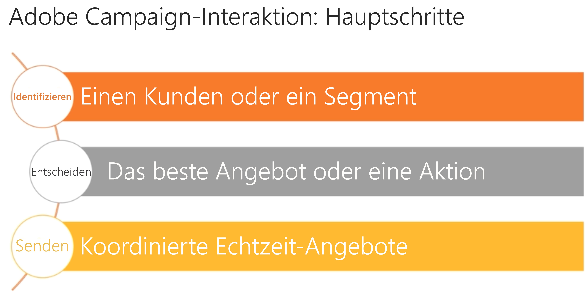

# Angebote in Interaction{#interaction-and-offer-management}

Interaction ermöglicht es, Kontaktpunkte mit Kunden oder Interessenten in Echtzeit zu nutzen und ihnen auf sie zugeschnittene Angebot zu unterbreiten. Hierbei kann es sich um einfache Informationsnachrichten oder um Sonder- oder Serviceangebote handeln.

Angebote können sowohl bei eingehenden Kontakten (über eine Webseite, einen Anruf im Callcenter) als auch ausgehenden Kontakten (E-Mail-, Briefpost- oder SMS-Versand im Rahmen einer Marketingkampagne) unterbreitet werden.

Konkret geschieht dies über die Erstellung eines Angebotskatalogs, aus dem bei Inbound- oder Outbound-Kontakten das im aktuellen Kontext beste Angebot für den Kunden oder Interessenten ausgewählt wird. Dabei stellen Regeln zur Prüfung der Angebotseignung sicher, dass ein Angebot wirklich auf den jeweiligen Empfänger zugeschnitten ist. Darüber hinaus ermöglichen Prioritätsregeln die Auswahl des besten Angebots aus einer Reihe von geeigneten Angeboten. Unterbreitungsregeln schließlich berücksichtigen vorhergehende Interaktionen mit einem Kontakt, damit bereits unterbreitete Angebote nicht erneut vorgeschlagen werden.

Neben der Verwaltung des Angebotskatalogs bietet Interaction die Möglichkeit, Eignungsregeln und ihnen zugeordnete Anwendungsthemen zu definieren. Der Inhalt der Angebote kann je nach Kanal mithilfe der verschiedenen Darstellungen personalisiert werden. Das Simulationsmodul erlaubt es Ihnen zudem, vor Unterbreitung eines Angebots seine voraussichtliche Wirkung einzuschätzen.

Sehen Sie sich dieses Video an, um sich mit den in Campaign Interaction verwendeten Funktionen und Begriffen vertraut zu machen: [Adobe Campaign Interaction – Übersicht](https://helpx.adobe.com/campaign/classic/how-to/acs-overview.html?playlist=/ccx/v1/collection/product/campaign/classic/segment/digital-marketers/explevel/intermediate/applaunch/get-started/collection.ccx.js&amp;ref=helpx.adobe.com).

## Verwandte Themen

| Nützliche Seiten | Zusätzliche Ressourcen |
|---|---|
| [Implementierungsschritte für Interaktionen](../../interaction/using/implementation-steps.md) | [Testen der Distribution von Angeboten](../../interaction/using/about-offers-simulation.md) |
| [Live-/Design-Umgebungen](../../interaction/using/live-design-environments.md) | [Hinzufügen eines Angebots in einer E-Mail](../../interaction/using/integrating-an-offer-via-the-wizard.md) |
| [Angebotsplatzierungen](../../interaction/using/creating-offer-spaces.md) | [Verwendungsfall: Hinzufügen eines Angebots zu einer Website](../../interaction/using/offers-on-an-inbound-channel.md) |