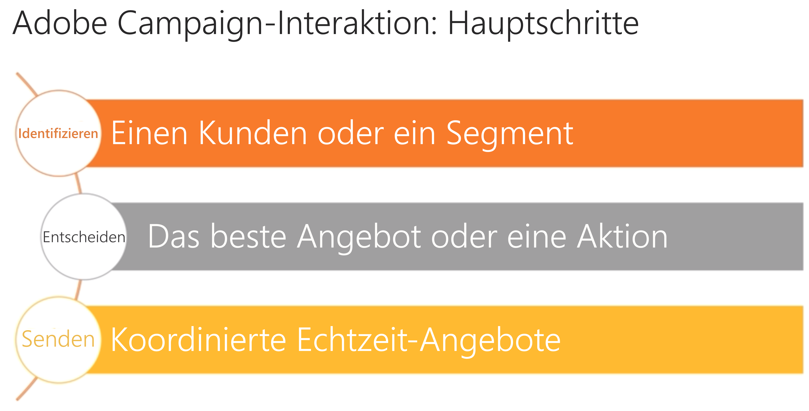

# Interaction und Angebotsverwaltung{#interaction-and-offer-management}

Interaction ermöglicht es Ihnen, während einer Interaktion mit einem bestimmten Kontakt (einem Kunden oder einer Zielgruppe) in Echtzeit zu reagieren, indem Sie ihm ein oder mehrere angepasste Angebote unterbreiten. Dabei kann es sich beispielsweise um einfache Kommunikationsnachrichten, Sonderangebote für ein oder mehrere Produkte oder einen Service handeln.

Angebote können sowohl bei eingehenden Kontakten (über eine Website, einen Anruf im Callcenter) als auch ausgehenden Kontakten (E-Mail-, Briefpost- oder SMS-Versand im Rahmen einer Marketing-Kampagne) unterbreitet werden.

Sie können einen Angebotskatalog erstellen, der mit eingehenden und ausgehenden Kanälen verbunden ist, um das beste Angebot auszuwählen, das einem Kontakt in einem bestimmten Kontext gesendet werden soll. Die Angebotsrelevanz für einen Empfänger wird anhand von Eignungsregeln definiert. Die Auswahl eines Angebots aus einem Paket relevanter Angebote wird mithilfe von Prioritätsregeln bestimmt. Die Regeln zur Angebotsunterbreitung berücksichtigen den Austauschverlauf des Kontakts und helfen zu vermeiden, dass der Kontakt nicht mehrmals dasselbe Angebot erhält.

Interaction ermöglicht Ihnen die Erstellung und Verwaltung eines Angebotskatalogs sowie die Konfiguration der Eignungsregeln und der mit ihnen verknüpften Anwendungsthemen. Je nach ausgewähltem Kanal kann der Angebotsinhalt mithilfe verschiedener Rendering-Funktionen personalisiert werden. Schließlich können Sie das Simulationsmodul verwenden, um die Wirkung einer Angebotsunterbreitung zu berechnen.

 Sehen Sie sich [dieses Video](https://helpx.adobe.com/campaign/classic/how-to/acs-overview.html?playlist=/ccx/v1/collection/product/campaign/classic/segment/digital-marketers/explevel/intermediate/applaunch/get-started/collection.ccx.js&ref=helpx.adobe.com) an, um sich mit den in Campaign Interaction verwendeten Funktionen und Begriffen vertraut zu machen:.

## Verwandte Themen

| Nützliche Seiten | Zusätzliche Ressourcen |
|---|---|
| [Implementierungsschritte für Interaction](../../interaction/using/implementation-steps.md) | [Testen der Angebotsverteilung](../../interaction/using/about-offers-simulation.md) |
| [Live-/Design-Umgebungen](../../interaction/using/live-design-environments.md) | [Hinzufügen eines Angebots in einer E-Mail](../../interaction/using/integrating-an-offer-via-the-wizard.md) |
| [Angebotsplatzierungen](../../interaction/using/creating-offer-spaces.md) | [Anwendungsbeispiel: Hinzufügen eines Angebots auf einer Website](../../interaction/using/offers-on-an-inbound-channel.md) |
