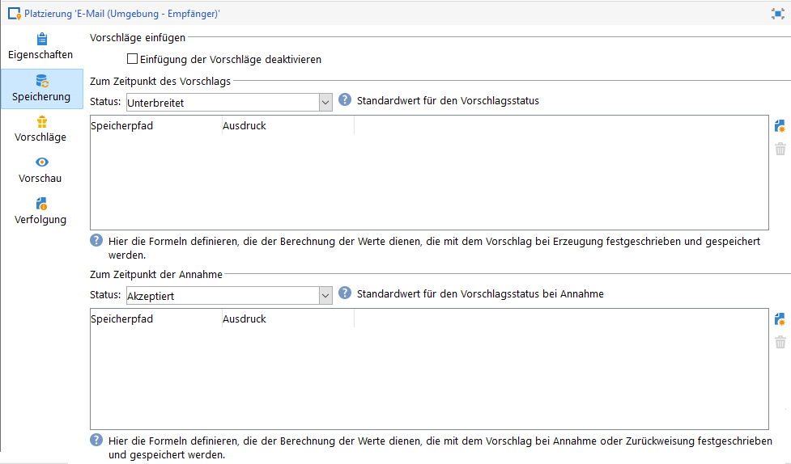

# Best Practices für Interaction{#interaction-best-practices}

## Allgemeine Empfehlungen {#general-recommendations}

In diesem Abschnitt werden die Best Practices für die Verwaltung des Interaktionsmoduls in Adobe Campaign Classic vorgestellt, einschließlich der Berechtigungsregeln, vordefinierter Filter, Workflow-Aktivitäten und Datenbankoptionen.

Das Interaction-Modul in Adobe Campaign erfordert eine sorgfältige Verwaltung, um reibungslos zu funktionieren. Dabei muss die Anzahl der Kontakte gegen die Anzahl der Angebotskategorien und Angebote abgewogen werden. Wenn diese Faktoren nicht sorgfältig abgestimmt werden, kann es bei Ihrer Adobe Campaign-Instanz zu Problemen kommen.

### Umsetzung {#implementation}

Im Folgenden sind wichtige Elemente aufgelistet, die bei der Implementierung und Konfiguration von Interaktionen beachtet werden sollten.

* Für das Batch-Modul (typischerweise in der ausgehenden Kommunikation wie E-Mails verwendet) ist der Durchsatz das Hauptproblem, da mehrere Kontakte gleichzeitig verarbeitet werden können. Der typische Engpass hier ist die Datenbankleistung.
* Die Haupteinschränkung für das Einzel-Modul (die typischerweise in der eingehenden Kommunikation wie bei einem Banner auf einer Website verwendet wird) ist die Latenzzeit, da eine Antwort erwartet wird. Der typische Engpass hier ist die CPU-Leistung.
* Das Angebotskatalogdesign hat enorme Auswirkungen auf die Leistung von Adobe Campaign Classic.
* Wenn es viele Angebote gibt, teilen Sie diese in mehrere Angebotskataloge auf.

### Eignungsregeln {#eligibility-rules}

Nachfolgend sind einige Best Practices zu den Regeln zur Prüfung der Angebotseignung aufgeführt.

* Vereinfachen Sie die Regeln. Die Komplexität der Regeln wirkt sich auf die Leistung aus, da sie den Suchvorgang verlängert. Eine komplexe Regel ist jede Regel, die mehr als fünf Bedingungen enthält.
* Um die Leistung zu verbessern, können Regeln in verschiedenen vordefinierten Filtern aufgelöst werden, die von mehreren Angebote gemeinsam verwendet werden.
* Setzen Sie die restriktivsten Angebotskategorieregeln an die oberste Position im Baum. Auf diese Weise filtern sie zuerst die meisten Kontakte heraus, wodurch die Zielgruppe verkleinert wird, sodass die Kontakte nicht von weiteren Regeln verarbeitet werden.
* Setzen Sie die teuersten Regeln in Bezug auf Zeit oder Verarbeitung an die unterste Position im Baum. Auf diese Weise werden diese Regeln nur auf die verbleibende Zielgruppe angewendet.
* Beginnen Sie bei einer bestimmten Kategorie, um zu vermeiden, dass der gesamte Baum durchsucht wird.
* Um Verarbeitungszeit zu sparen, berechnen Sie Aggregate vor, anstatt komplexe Regeln mit Joins zu erstellen. Speichern Sie dazu Kundendaten in einer Referenztabelle, die anhand von Eignungsregeln durchsucht werden kann.
* Verwenden Sie eine minimale Anzahl von Gewichtungen, um die Anzahl der Abfragen zu begrenzen.
* Es wird empfohlen, eine begrenzte Anzahl von Angeboten pro Angebotsplatzierung zu verwenden. Dies ermöglicht je nach Platz einen schnelleren Abruf von Angeboten.
* Verwenden Sie Indizes, insbesondere für häufig verwendete Suchspalten.

### Vorschlagstabelle {#proposition-table}

Nachfolgend sind einige Best Practices bezüglich der Vorschlagstabelle aufgeführt.

* Verwenden Sie möglichst wenige Regeln, um die Verarbeitung so schnell wie möglich zu gestalten.
* Beschränken Sie die Anzahl der Datensätze in der Vorschlagstabelle: Bewahren Sie nur die Datensätze auf, die zum Tracken der Statusaktualisierung und für die Regeln erforderlich sind, und archivieren Sie sie dann in einem anderen System.
* Führen Sie eine intensive Datenbankwartung für die Vorschlagstabelle durch, wie z. B. eine Neuerstellung des Index oder der Tabelle.
* Begrenzen Sie die Anzahl der pro Zielgruppe abgefragten Vorschläge. Definieren Sie nicht mehr als die tatsächlich verwendete Anzahl.
* Vermeiden Sie möglichst Joins in den Regelbedingungen.

## Tipps und Tricks zur Verwaltung von Angeboten {#tips-managing-offers}

Dieser Abschnitt enthält ausführlichere Ratschläge zur Verwaltung von Angeboten und zum Einsatz des Interaktionsmoduls in Adobe Campaign Classic.

### Verwenden mehrerer Angebotsbereiche in einer E-Mail-Auslieferung {#multiple-offer-spaces}

Wenn Angebote in Auslieferungen einbezogen werden, werden die Angebote in der Regel im Upstream im Kampagnen-Workflow über eine Anreicherungsaktivität (oder eine andere ähnliche Aktivität) ausgewählt.

Bei der Auswahl von Angeboten in einer Anreicherungsaktivität können Sie festlegen, welcher Angebotsbereich verwendet werden soll. Das Menü zur Anpassung der Bereitstellung hängt jedoch unabhängig vom ausgewählten Angebotsbereich vom Angebotsbereich ab, der in der Bereitstellung eingerichtet wurde.

Im Beispiel unten ist der in der Bereitstellung ausgewählte Angebotsraum **[!UICONTROL Email (Environment - Recipient)]**:


Wenn für den Angebotsbereich, den Sie in der Bereitstellung auswählen, keine HTML-Renderfunktion eingerichtet ist, wird er nicht im Bereitstellungsmenü angezeigt und kann nicht ausgewählt werden. Auch dies ist unabhängig vom Angebotsbereich, der in der Anreicherungsaktivität ausgewählt wurde.

Im folgenden Beispiel ist die HTML-Renderfunktion in der Dropdown-Liste verfügbar, da der in der Bereitstellung ausgewählte Angebotsbereich eine Renderfunktion hat:


Diese Funktion fügt Code wie folgt ein: `<%@ include proposition="targetData.proposition" view="rendering/html" %>`.

Wenn Sie den Vorschlag auswählen, lautet der Wert des **[!UICONTROL view]** Attributs wie folgt:
* &quot;rendering/html&quot;: HTML-Rendering. Es verwendet die HTML-Renderfunktion.
* &quot;offer/view/html&quot;: HTML-Inhalt. Es wird nicht die HTML-Renderfunktion verwendet. Es enthält nur das HTML-Feld.

Wenn Sie mehrere Angebotsplätze in einer einzelnen E-Mail-Auslieferung einschließen und einige von ihnen Renderfunktionen haben und andere nicht, müssen Sie sich merken, welche Angebote welche Angebotsobjekte verwenden und welche Angebotsobjekte Renderfunktionen haben.

Um ein Problem zu vermeiden, wird daher empfohlen, dass für alle Angebotsobjekte eine HTML-Renderfunktion definiert ist, auch wenn für Ihren Angebotsumfang nur HTML-Inhalte erforderlich sind.

### Rang in der Tabelle des Propositionsprotokolls festlegen {#rank-proposition-log-table}

Angebotsplätze haben die Möglichkeit, Daten in der Propositionstabelle zu speichern, wenn Vorschläge generiert oder akzeptiert werden:



Dies gilt jedoch nur für eingehende Interaktionen.

Es ist auch möglich, zusätzliche Daten in der Propositionstabelle zu speichern, wenn ausgehende Interaktionen verwendet werden und auch wenn ausgehende Angebote ohne das Interaktionsmodul verwendet werden.

Jedes Feld aus der Tabelle der Workflow-Vorlage, dessen Name mit einem Feldnamen in der Tabelle &quot;Proposition&quot;übereinstimmt, wird in dasselbe Feld in der Tabelle &quot;Proposition&quot;kopiert.

Bei der manuellen Auswahl eines Angebots (ohne Interaktion) in einer Anreicherung werden die Standardfelder beispielsweise wie folgt definiert:


Zusätzliche Felder können hinzugefügt werden, z. B. ein @rank-Feld:


Da sich in der Propositionstabelle &quot;@rank&quot;ein Feld befindet, wird der Wert in der Workflow-Temp-Tabelle kopiert.

Weitere Informationen zum Speichern zusätzlicher Felder in der Tabelle &quot;Angebot&quot;finden Sie unter [Integrieren eines Angebots über einen Workflow](../../interaction/using/integrating-an-offer-via-a-workflow.md#storing-offer-rankings-and-weights).

Bei ausgehenden Angeboten mit Interaktion ist dies nützlich, wenn mehrere Angebote ausgewählt sind und Sie feststellen möchten, in welcher Reihenfolge sie in einer E-Mail angezeigt werden.

Sie können auch zusätzliche Metadaten direkt in der Tabelle &quot;Angebot&quot;speichern, z. B. die aktuelle Ausgabenebene, um historische Aufzeichnungen über die Ausgaben zu speichern, die zum Zeitpunkt der Erstellung der Angebote getätigt wurden.

Bei Verwendung der ausgehenden Interaktion kann das Feld &quot;@rank&quot;hinzugefügt werden, wie im Beispiel oben, aber der Wert wird automatisch auf Basis der von Interaction zurückgegebenen Reihenfolge festgelegt. Wenn Sie beispielsweise mit Interaktion drei Angebote auswählen, werden im Feld &quot;@rank&quot;die Werte 1, 2 und 3 zurückgegeben.

Bei der Verwendung von Interaktion und der manuellen Auswahl von Angeboten können beide Ansätze kombiniert werden. Beispielsweise kann der Benutzer das Feld &quot;@rank&quot;für das manuell ausgewählte Angebot manuell auf &quot;1&quot;setzen und einen Ausdruck wie &quot;1 + @rank&quot;für die von Interaktion zurückgegebenen Angebote verwenden. Wenn Interaktion drei Angebote auswählt, werden die von beiden Ansätzen zurückgegebenen Angebote nach 1-4 bewertet:


### Erweitern des nms:offer-Schemas {#extending-nms-offer-schema}

Wenn Sie das Schema nms:offer erweitern, stellen Sie sicher, dass Sie die bereits vordefinierte Struktur befolgen:
* Definieren Sie ein neues Feld für die Inhaltsspeicherung unter `<element name="view">`.
* Jedes neue Feld muss zweimal definiert werden. Einmal als normales XML-Feld und einmal als CDATA-XML-Feld mit &quot;_jst&quot;an den Namen angehängt. Beispiel:

   ```
   <element label="Price" name="price" type="long" xml="true"/>
   <element advanced="true" label="Script price" name="price_jst" type="CDATA" xml="true"/>
   ```

* Alle Felder, die URLs enthalten, die verfolgt werden sollen, müssen unter `<element name="trackedUrls">` die `<element name="view" >`gesetzt werden.