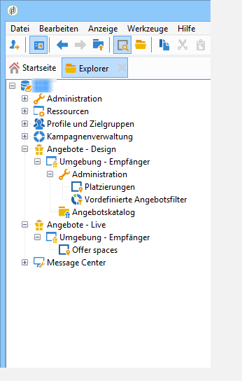
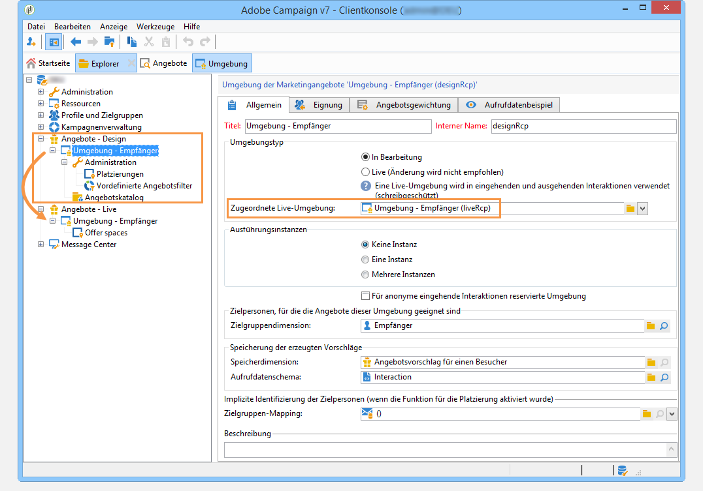
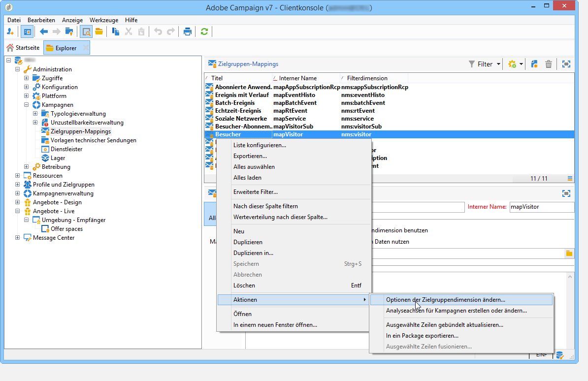
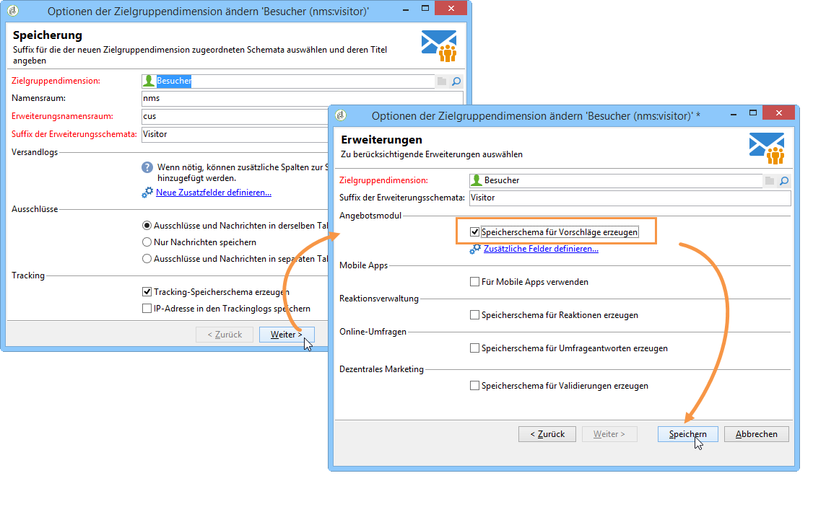
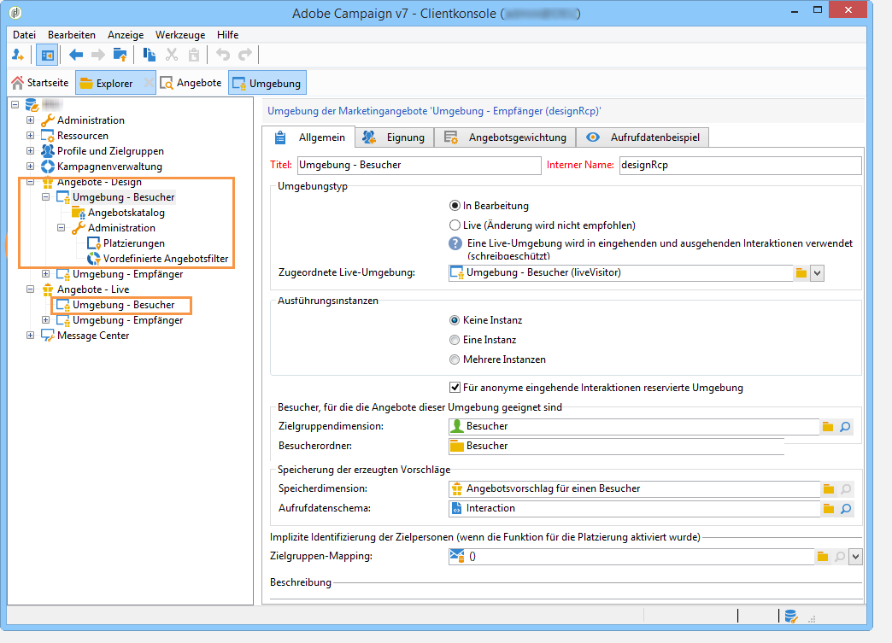

# Live-/Design-Umgebungen{#live-design-environments}

## Grundprinzip {#operating-principle}

Interaction arbeitet mit zwei Angebotsumgebungstypen:

* **[!UICONTROL Design]**-Angebotsumgebungen, in denen Angebote bearbeitet werden und verändert werden können. Diese Angebote haben den Validierungszyklus nicht durchlaufen und werden nicht an Kontakte gesendet.
* **[!UICONTROL Live]**-Angebotsumgebungen, in denen validierte Angebote so zur Verfügung stehen, wie sie Kontakten unterbreitet werden.Die Angebote in dieser Umgebung sind schreibgeschützt.

Jede **[!UICONTROL Design]**-Umgebung ist mit einer **[!UICONTROL Live]**-Umgebung verknüpft. Nach Erstellung eines Angebots durchlaufen sein Inhalt und seine Eignungsregeln einen Validierungszyklus. Das Angebot wird automatisch für die **[!UICONTROL Live-Umgebung]** bereitgestellt. Ab diesem Zeitpunkt ist es für den Versand verfügbar.

Standardmäßig verfügt Campaign über eine **[!UICONTROL Design]**-Umgebung und eine **[!UICONTROL Live]**-Umgebung, die mit der Design-Umgebung verknüpft ist. Beide Umgebungen sind für die integrierte Empfängertabelle vorkonfiguriert.

>[!NOTE]
>
>Sollten Sie eine andere Tabelle (beispielsweise die Besuchertabelle für anonyme Angebote oder eine spezifische Empfängertabelle) verwenden wollen, steht Ihnen ein Assistent zur Verfügung, um die Umgebungen mit den entsprechenden Zielgruppen-Mappings zu erstellen. Weiterführende Informationen dazu finden Sie unter [Angebotsumgebungen](#creating-an-offer-environment).

Angebots- und versandverantwortliche Benutzer greifen auf unterschiedliche Weise auf die Umgebungen zu. Versandverantwortliche haben nur Lesezugriff auf die **[!UICONTROL Design-Umgebung]**, deren Angebote sie in Sendungen verwenden können. Angebotsverantwortliche hingegen haben Schreibzugriff auf die **[!UICONTROL Design-Umgebung]**, aber nur Lesezugriff auf die **[!UICONTROL Live-Umgebung]**. Weitere Informationen hierzu finden Sie im Abschnitt [Benutzerprofile](../../interaction/using/operator-profiles.md).

## Erstellen einer Angebotsumgebung {#creating-an-offer-environment}

Interactio verfügt standardmäßig über eine vorab konfigurierte Umgebung, in der die Empfängertabelle (identifizierte Angebote) ausgewählt werden kann. Wenn Sie eine andere Tabelle verwenden möchten (Besuchertabelle für anonyme Angebote oder eine bestimmte Empfängertabelle), müssen Sie die folgenden Konfigurationen anwenden:

1. Markieren Sie den Knoten **[!UICONTROL Administration]** > **[!UICONTROL Kampagnen]** > **[!UICONTROL Zielgruppen-Mappings]**. Klicken Sie mit der rechten Maustaste auf das Mapping, das Sie verwenden möchten (**[!UICONTROL Besucher]** im Fall von anonymen Angeboten) und wählen Sie im Kontextmenü die Option **[!UICONTROL Aktionen]** > **[!UICONTROL Optionen der Zielgruppendimension ändern...]** aus.

   

1. Klicken Sie auf **[!UICONTROL Weiter]** und aktivieren Sie im nächsten Bildschirm das Feld **[!UICONTROL Speicherschema für Vorschläge erzeugen]**. Klicken Sie zum Abschluss auf **[!UICONTROL Speichern]**.

   

   >[!NOTE]
   >
   >Falls das Feld bereits angekreuzt war, muss es zunächst deaktiviert und dann erneut aktiviert werden.

1. Adobe Campaign erstellt zwei Umgebungen (**[!UICONTROL Design]** und **[!UICONTROL Live]**) mit Zielgruppenbestimmungsinformationen vom zuvor aktivierten Zielgruppen-Mapping. Die Umgebung ist mit den Zielgruppenbestimmungsinformationen vorkonfiguriert.

   Im Falle eines Mappings mit der **[!UICONTROL Besuchertabelle]** ist das Feld **[!UICONTROL Für anonyme eingehende Interaktionen reservierte Umgebung]** im Tab **[!UICONTROL Allgemein]** der Umgebung automatisch ausgewählt.

   Mit dieser Option können Sie anonyme, für Interaktionen spezifische Funktionen aktivieren, insbesondere bei der Konfiguration von Platzierungen in der Umgebung. Sie können außerdem Optionen konfigurieren, die es Ihnen ermöglichen von einer „identifizierten“ Umgebung zu einer „anonymen“ Umgebung zu wechseln.

   Sie können beispielsweise eine Platzierung der Empfängerumgebung (identifizierter Kontakt) mit einer Platzierung verknüpfen, die einer Besucherumgebung (nicht identifizierter Kontakt) entspricht. Auf diese Weise werden dem Kontakt verschiedene Angebote unterbreitet, je nachdem, ob er identifiziert wurde oder nicht. Weitere Informationen hierzu finden Sie unter [Angebotsplatzierungen](../../interaction/using/creating-offer-spaces.md).

   

>[!NOTE]
>
>Weiterführende Informationen zu anonymen Interaktionen in einem eingehenden Kanal finden Sie im Abschnitt [Anonyme Interaktionen](../../interaction/using/anonymous-interactions.md).
