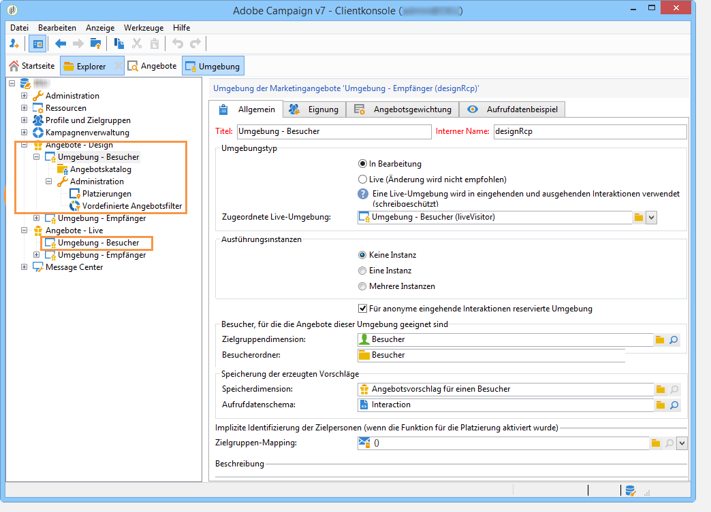

# Live-/Design-Umgebungen{#live-design-environments}

## Grundprinzip {#operating-principle}

Interaction arbeitet mit zwei Angebotsumgebungstypen:

* **[!UICONTROL Design-Umgebungen]**, in denen Angebote erstellt und geändert werden können. Vor Validierung der Angebote oder etwaiger Änderungen stehen sie nicht zur Unterbreitung zur Verfügung.
* **[!UICONTROL Live-Umgebungen]**, in denen die validierten Angebote zur Unterbreitung zur Verfügung stehen. Die hier enthaltenen Angebote sind schreibgeschützt.

Jeder **[!UICONTROL Design]** -Umgebung mit einer **[!UICONTROL Live]** Umgebung. Nach Abschluss eines Angebots werden Inhalt und Eignungsregeln einem Validierungszyklus unterzogen. Sobald dieser Zyklus abgeschlossen ist, wird das betreffende Angebot automatisch für die **[!UICONTROL Live]** Umgebung. Ab diesem Zeitpunkt ist es für den Versand verfügbar.

Standardmäßig verfügt Campaign über eine **[!UICONTROL Design]**-Umgebung und eine **[!UICONTROL Live]**-Umgebung, die mit der Design-Umgebung verknüpft ist. Beide Umgebungen sind für die integrierte Empfängertabelle vorkonfiguriert.

>[!NOTE]
>
>Sollten Sie eine andere Tabelle (beispielsweise die Besuchertabelle für anonyme Angebote oder eine spezifische Empfängertabelle) verwenden wollen, steht Ihnen ein Assistent zur Verfügung, um die Umgebungen mit den entsprechenden Zielgruppen-Mappings zu erstellen. Weiterführende Informationen dazu finden Sie unter [Angebotsumgebungen](#creating-an-offer-environment).

Angebotsverantwortliche und Versand-Manager haben Zugriff auf verschiedene Umgebungsansichten. Versandverantwortliche Benutzer können nur die **[!UICONTROL Live]** Angebotsumgebungen anzubieten und Angebote zu nutzen, um sie bereitzustellen. Angebotsverantwortliche Benutzer können die **[!UICONTROL Design]** Umgebung und Ansicht des **[!UICONTROL Live]** Umgebung. Weitere Informationen hierzu finden Sie im Abschnitt [Benutzerprofile](../../interaction/using/operator-profiles.md).

## Erstellen einer Angebotsumgebung {#creating-an-offer-environment}

Standardmäßig wird Interaction mit einer Umgebung geliefert, die für ein Zielgruppenmapping der Empfängertabelle konfiguriert ist, also für Angebote an identifizierte Kontakte. Sollten Sie eine andere Tabelle (beispielsweise die Besuchertabelle für anonyme Angebote oder eine spezifische Empfängertabelle) verwenden wollen, gehen Sie wie folgt vor:

1. Platzieren Sie den Cursor auf der **[!UICONTROL Administration]** > **[!UICONTROL Kampagnenverwaltung]** > **[!UICONTROL Versandzuordnungen]** Knoten. Klicken Sie mit der rechten Maustaste auf das Versand-Mapping, das Sie verwenden möchten (**[!UICONTROL Besucher]** , wenn Sie anonyme Angebote verwenden möchten) und wählen Sie **[!UICONTROL Aktionen]** > **[!UICONTROL Ändern der Optionen der Zielgruppendimension]**.

   

1. Klicken Sie auf **[!UICONTROL Weiter]** und kreuzen Sie im nächsten Bildschirm das Feld **[!UICONTROL Speicherschema für Vorschläge erzeugen]** an. Klicken Sie zum Abschluss auf **[!UICONTROL Speichern]**.

   

   >[!NOTE]
   >
   >Falls das Feld bereits angekreuzt war, muss es zunächst deaktiviert und dann erneut aktiviert werden.

1. Adobe Campaign erstellt nun die beiden dem zuvor ausgewählten Zielgruppen-Mapping entsprechenden Umgebungen (**[!UICONTROL Design-Umgebung]** und **[!UICONTROL Live-Umgebung]**). Beide Umgebungen sind mit den gewünschten Zielgruppeninformationen vorkonfiguriert.

   Im Falle eines Mappings mit der **[!UICONTROL Besuchertabelle]** ist das Feld **[!UICONTROL Für anonyme eingehende Interaktionen reservierte Umgebung]** im Tab **[!UICONTROL Allgemein]** der Umgebung automatisch ausgewählt.

   Diese Option ermöglicht die Aktivierung von für anonyme Interaktionen reservierten Funktionen, beispielsweise in Bezug auf die Konfiguration der Umgebungsplatzierungen. Dies ermöglicht es, Optionen zu konfigurieren, die den Wechsel von &quot;identifizierten&quot; zu &quot;anonymen&quot; Umgebungen erlauben.

   Sie können beispielsweise eine Platzierung der Empfängerumgebung (identifizierter Kontakt) mit einer Platzierung verknüpfen, die einer Besucherumgebung (nicht identifizierter Kontakt) entspricht. Auf diese Weise werden dem Kontakt verschiedene Angebote unterbreitet, je nachdem, ob er identifiziert wurde oder nicht. Weitere Informationen hierzu finden Sie unter [Angebotsplatzierungen](../../interaction/using/creating-offer-spaces.md).

   

>[!NOTE]
>
>Weiterführende Informationen zu anonymen Interaktionen in einem eingehenden Kanal finden Sie im Abschnitt [Anonyme Interaktionen](../../interaction/using/anonymous-interactions.md).
