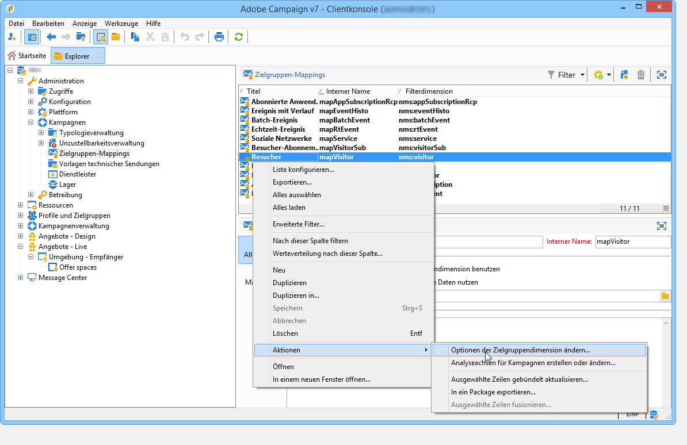

# Live-/Design-Umgebungen{#live-design-environments}

## Grundprinzip {#operating-principle}

Interaction arbeitet mit zwei Angebotsumgebungstypen:

* **[!UICONTROL Design-Umgebungen]**, in denen Angebote erstellt und geändert werden können. Vor Validierung der Angebote oder etwaiger Änderungen stehen sie nicht zur Unterbreitung zur Verfügung.
* **[!UICONTROL Live-Umgebungen]**, in denen die validierten Angebote zur Unterbreitung zur Verfügung stehen. Die hier enthaltenen Angebote sind schreibgeschützt.

Jeder **[!UICONTROL Design-Umgebung]** entspricht eine **[!UICONTROL Live-Umgebung]**. Nach Erstellung eines Angebots unterlaufen sein Inhalt und die konfigurierten Eignungsregeln einen Validierungszyklus, nach dessen erfolgreichem Abschluss das Angebot automatisch für die **[!UICONTROL Live-Umgebung]** freigegeben wird. Nun kann es in Sendungen verwendet werden.

Standardmäßig sind im Interaction-Package bereits eine **[!UICONTROL Design-Umgebung]** und ihre entsprechende **[!UICONTROL Live-Umgebung]** enthalten. Beide sind werksmäßig dahin gehend konfiguriert, die native Empfängertabelle zu mappen.

>[!NOTE]
>
>Sollten Sie eine andere Tabelle (beispielsweise die Besuchertabelle für anonyme Angebote oder eine spezifische Empfängertabelle) verwenden wollen, steht Ihnen ein Assistent zur Verfügung, um die Umgebungen mit den entsprechenden Zielgruppen-Mappings zu erstellen. Weiterführende Informationen dazu finden Sie unter [Angebotsumgebungen](#creating-an-offer-environment).

Angebots- und versandverantwortliche Benutzer greifen auf unterschiedliche Weise auf die Umgebungen zu. Versandverantwortliche haben nur Lesezugriff auf die **[!UICONTROL Design-Umgebung]**, deren Angebote sie in Sendungen verwenden können. Angebotsverantwortliche hingegen haben Schreibzugriff auf die **[!UICONTROL Design-Umgebung]**, aber nur Lesezugriff auf die **[!UICONTROL Live-Umgebung]**. Weitere Informationen hierzu finden Sie im Abschnitt [Benutzerprofile](../../interaction/using/operator-profiles.md).

## Angebotsumgebungen {#creating-an-offer-environment}

Standardmäßig wird Interaction mit einer Umgebung geliefert, die für ein Zielgruppenmapping der Empfängertabelle konfiguriert ist, also für Angebote an identifizierte Kontakte. Sollten Sie eine andere Tabelle (beispielsweise die Besuchertabelle für anonyme Angebote oder eine spezifische Empfängertabelle) verwenden wollen, gehen Sie wie folgt vor:

1. Markieren Sie den Knoten **[!UICONTROL Administration]** > **[!UICONTROL Kampagnen]** > **[!UICONTROL Zielgruppen-Mappings]**. Klicken Sie mit der rechten Maustaste auf das Mapping, das Sie verwenden möchten (**[!UICONTROL Besucher]** im Fall von anonymen Angeboten) und wählen Sie im Kontextmenü die Option **[!UICONTROL Aktionen]** > **[!UICONTROL Optionen der Zielgruppendimension ändern...]** aus.

   

1. Klicken Sie auf **[!UICONTROL Weiter]** und kreuzen Sie im nächsten Bildschirm das Feld **[!UICONTROL Speicherschema für Vorschläge erzeugen]** an. Klicken Sie zum Abschluss auf **[!UICONTROL Speichern]**.

   

   >[!NOTE]
   >
   >Falls das Feld bereits angekreuzt war, muss es zunächst deaktiviert und dann erneut aktiviert werden.

1. Adobe Campaign erstellt nun die beiden dem zuvor ausgewählten Zielgruppen-Mapping entsprechenden Umgebungen (**[!UICONTROL Design-Umgebung]** und **[!UICONTROL Live-Umgebung]**). Beide Umgebungen sind mit den gewünschten Zielgruppeninformationen vorkonfiguriert.

   Im Falle eines Mappings mit der **[!UICONTROL Besuchertabelle]** ist das Feld **[!UICONTROL Für anonyme eingehende Interaktionen reservierte Umgebung]** im Tab **[!UICONTROL Allgemein]** der Umgebung automatisch ausgewählt.

   Diese Option ermöglicht die Aktivierung von für anonyme Interaktionen reservierten Funktionen, beispielsweise in Bezug auf die Konfiguration der Umgebungsplatzierungen. Dies ermöglicht es, Optionen zu konfigurieren, die den Wechsel von &quot;identifizierten&quot; zu &quot;anonymen&quot; Umgebungen erlauben.

   Sie können zum Beispiel eine Platzierung der Empfängerumgebung (identifizierter Kontakt) mit der entsprechenden Platzierung der Besucherumgebung (nicht identifizierter Kontakt) verknüpfen. Auf diese Weise werden dem Kontakt verschiedene Angebote unterbreitet, je nachdem ob er identifiziert werden konnte oder nicht. Weitere Informationen hierzu finden Sie unter [Angebotsplatzierungen](../../interaction/using/creating-offer-spaces.md).

   

>[!NOTE]
>
>Weiterführende Informationen zu anonymen Interaktionen in einem eingehenden Kanal finden Sie im Abschnitt [Anonyme Interaktionen](../../interaction/using/anonymous-interactions.md).

