# Verwalten einer Angebotsunterbreitung{#managing-offer-presentation}

## Unterbreitungsregeln – Überblick {#presentation-rules-overview}

Interaction ermöglicht die Steuerung des Flusses der Angebotsvorschläge anhand von Unterbreitungsregeln. Diese Regeln, die speziell für Interaction gelten, heißen Typologieregeln. Sie ermöglichen den Ausschluss von Angeboten, die auf dem Verlauf der einem bestimmten Empfänger zuvor unterbreiteten Vorschläge basieren. Diese werden in der Umgebung referenziert.

## Unterbreitungsregeln erstellen und zuweisen {#creating-and-referencing-an-offer-presentation-rule}

1. Gehen Sie in den Knoten **[!UICONTROL Administration]** > **[!UICONTROL Kampagnen]** > **[!UICONTROL Typologieverwaltung]** > **[!UICONTROL Typologieregeln]**.
1. Erstellen Sie eine neue Typologieregel und wählen Sie den Typ **[!UICONTROL Angebotsunterbreitung]**.

   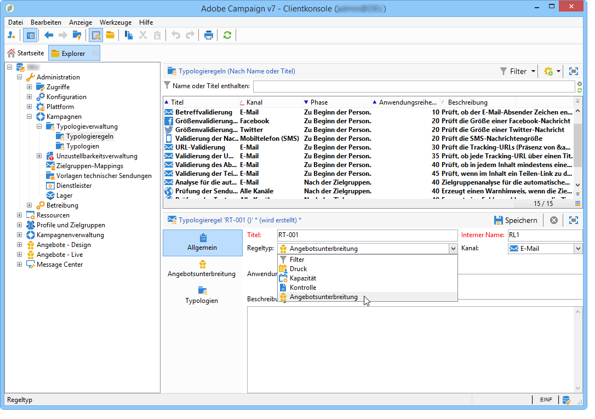

1. Geben Sie gegebenenfalls den Kanal an, auf den die Regel angewendet werden soll.

   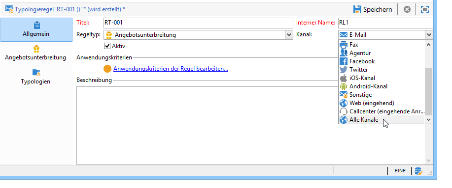

1. Konfigurieren Sie die Anwendungskriterien der Regel. Weitere Informationen hierzu finden Sie unter [Parameter der Unterbreitungsregeln](#presentation-rule-settings).
1. Gehen Sie in den Knoten **[!UICONTROL Administration]** > **[!UICONTROL Kampagnen]** > **[!UICONTROL Typologieverwaltung]** > **[!UICONTROL Typologien]** und erstellen Sie eine Typologie, um alle Regeln des Typs **[!UICONTROL Angebotsunterbreitung]** zusammenzufassen.

   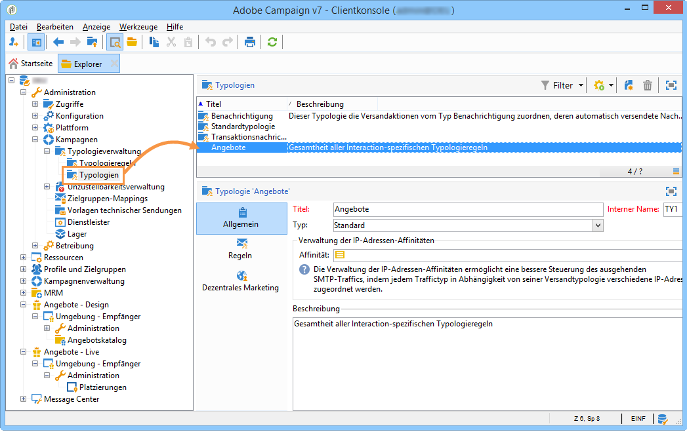

1. Kehren Sie nun zurück zu den Regeln und ordnen Sie sie der zuvor erstellten Typologie zu.

   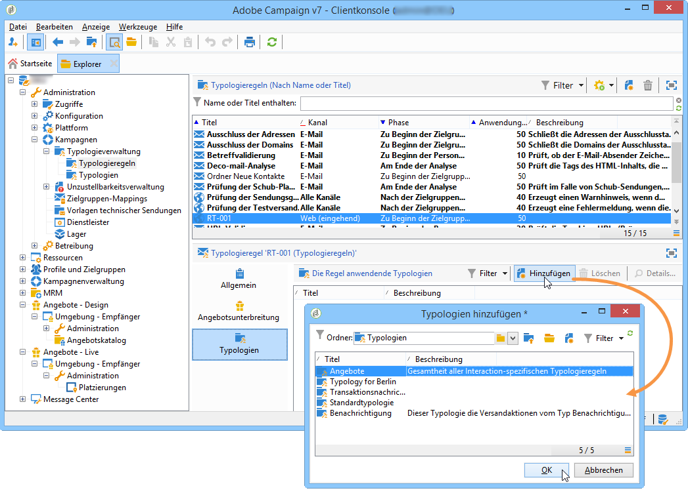

1. Weisen Sie abschließend auf Ebene der Angebotsumgebung die Typologie zu.

   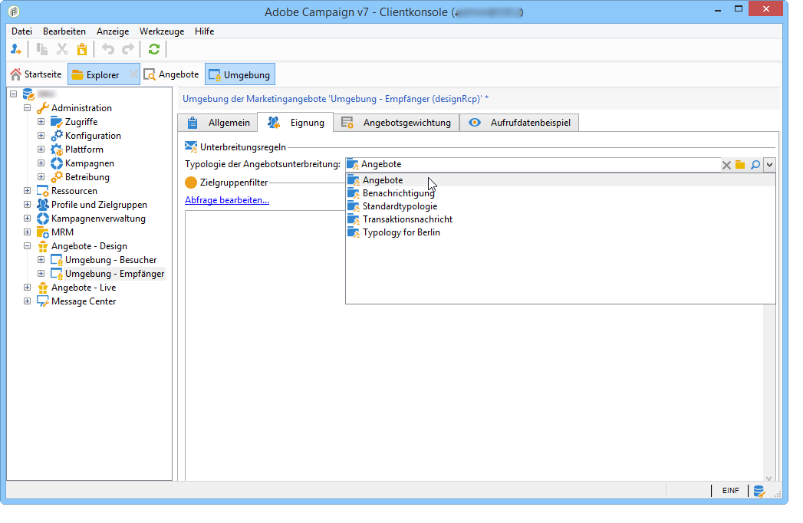

## Parameter der Unterbreitungsregeln {#presentation-rule-settings}

### Anwendungskriterien {#application-criteria-}

Mit den Anwendungskriterien in der Registerkarte **[!UICONTROL Allgemein]** können Sie die Angebote angeben, für die die Unterbreitungsregel gelten soll. Dazu müssen Sie wie unten beschrieben eine Abfrage erstellen und die betroffenen Angebote auswählen.

1. Klicken Sie auf den Link **[!UICONTROL Anwendungskriterien der Regel bearbeiten...]**.

   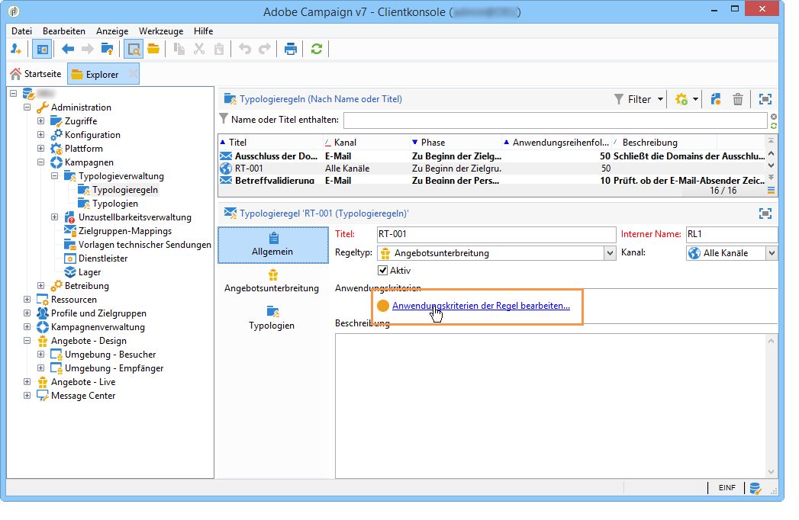

1. Konfigurieren Sie im Abfragefenster den Filter, dem die von der Typologieregel betroffenen Angebote entsprechen müssen.

   Dieser kann beispielsweise eine Angebotskategorie betreffen.

   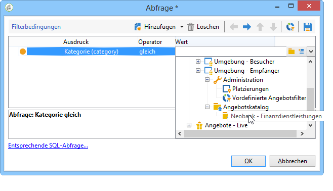

### Angebotsdimensionen {#offer-dimensions}

Die im Tab **[!UICONTROL Angebotsunterbreitung]** konfigurierten Dimensionen für die Unterbreitungsregel müssen mit denen auf Umgebungsebene übereinstimmen.

Die **[!UICONTROL Zielgruppendimension]** entspricht der Tabelle (standardmäßig: `nms:recipients`) mit den Empfängern , die die Angebotsvorschläge erhalten. Die **[!UICONTROL Speicherdimension]** entspricht der Tabelle (standardmäßig: `nms:propositionRcp`), die den mit der Zielgruppendimension verknüpften Vorschlagsverlauf enthält.

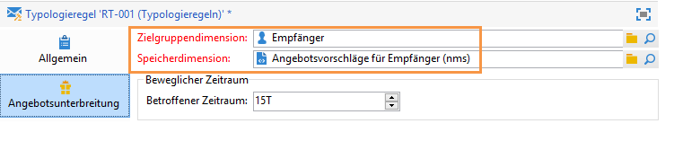

>[!NOTE]
>
>Sie können auch nicht-standardmäßige Tabellen verwenden. Zur Nutzung einer bestimmten Zielgruppendimension ist die Erstellung von entsprechenden Tabellen und einer dedizierten Umgebung mit dem passenden Ziel-Mapping erforderlich. Weiterführende Informationen dazu finden Sie unter [Angebotsumgebungen](../../interaction/using/live-design-environments.md#creating-an-offer-environment).

### Zeitraum {#period}

Dies ist ein gleitender Zeitraum, der am Tag der Angebotsunterbreitung beginnt. Er legt eine Frist für die Gültigkeit von Angebotsvorschlägen fest. Die Regel gilt nicht für Angebotsvorschläge, die nach diesem Zeitraum unterbreitet werden.

Der Zeitraum beginnt **X** Tage vor und endet **X** Tage nach der Unterbreitung, wobei **X** dem im Feld **[!UICONTROL Betroffener Zeitraum]** angegebenen Wert entspricht:

* Bei Platzierungen vom Typ &quot;eingehend&quot; entspricht das Vorschlagsdatum dem Unterbreitungsdatum.
* Bei Platzierungen vom Typ &quot;ausgehend&quot; entspricht das Vorschlagsdatum dem Kontaktdatum des Versands (z. B. das in einem Zielgruppen-Workflow angegebene Versanddatum).

Verwenden Sie die Pfeile des Felds, um die Anzahl an Tagen zu ändern, oder geben Sie direkt die gewünschte Dauer ein (z. B. &quot;2T 6h&quot;).

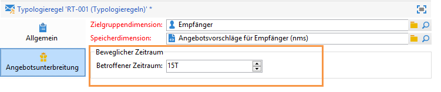

### Anzahl der Vorschläge {#number-of-propositions}

An dieser Stelle können Sie angeben, wie oft die Angebote maximal vorgeschlagen werden dürfen, bevor sie ausgeschlossen werden.

Verwenden Sie die Pfeile des Felds, um die Anzahl zu ändern, oder geben Sie direkt die gewünschte Zahl ein.

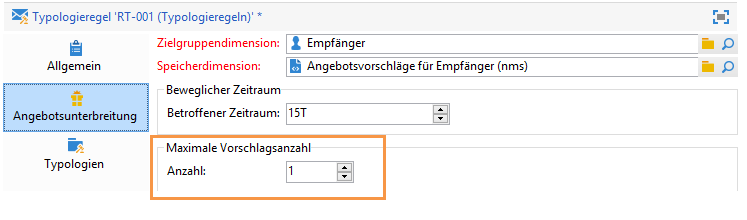

## Vorschläge und Empfänger konfigurieren {#defining-propositions-and-recipients}

Im Bereich **[!UICONTROL Zu zählende Vorschläge]** können Sie die Angebote und die Empfänger angeben, die zu einem Ausschluss der im **[!UICONTROL Allgemein]**-Tab definierten Angebote führen, wenn Sie im Vorschlagsverlauf mit einer ausreichenden Häufigkeit vorkommen.

### Vorschläge filtern {#filtering-propositions}

Standardmäßig kann nach Kanal, betroffenen Angeboten und Vorschlagstatus gefiltert werden.

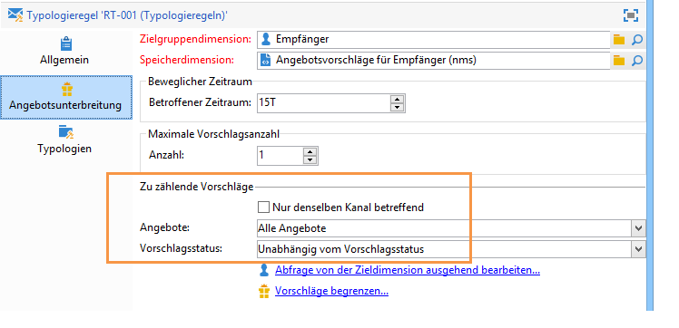

Hierbei handelt es sich um die gängigsten Anwendungen für Unterbreitungsregeln. Wenn Sie andere Kriterien verwenden möchten, haben Sie die Möglichkeit, mithilfe des Links **[!UICONTROL Vorschläge begrenzen...]** eine Abfrage zu konfigurieren. Lesen Sie diesbezüglich auch den Abschnitt [Abfrage bezüglich der Vorschläge erstellen](#creating-a-query-on-propositions).

* **Kanalfilter**

  **[!UICONTROL Nur denselben Kanal betreffend]**: ermöglicht den Ausschluss der Vorschläge, die den im **[!UICONTROL Allgemein]**-Tab angegebenen Kanal betreffen.

  Beispielsweise ist der für die Regel auf der Registerkarte **[!UICONTROL Allgemein]** angegebene Kanal E-Mail. Wenn die von der Regel betroffenen Angebote bisher nur über den Web-Kanal unterbreitet wurden, kann das Interaktionsmodul die Angebote für einen E-Mail-Versand auswählen. Sobald die Angebote jedoch per E-Mail unterbreitet wurden, wählt das Interaktionsmodul einen anderen Kanal für die Angebote aus.

  >[!NOTE]
  >
  >Es handelt sich hier um den Kanal, nicht um die Platzierung. Wenn die Regel beispielsweise den Ausschluss eines Angebots über den Web-Kanal vorsieht, wird ein Angebot, das auf einer Website in zwei Platzierungen (z. B. in einem Banner und im Textkörper der Seite) unterbreitet werden soll, nicht auf der Site angezeigt, wenn es zuvor schon unterbreitet wurde.
  >
  >Im Falle eines Workflows, der eine Angebotsunterbreitung enthält, können Regeln nur korrekt berücksichtigt werden, wenn der Parameter **[!UICONTROL Alle Kanäle]** ausgewählt wurde.

* **Angebotsfilter**

  Dieses Feld ermöglicht es, die Zählung der Angebote auf gewisse Angebotsgruppen zu beschränken.

  **[!UICONTROL Alle Angebote]**: Standardwert. Die Angebote werden nicht gefiltert.

  **[!UICONTROL Nur das aktuell unterbreitete Angebot]**: Das im **[!UICONTROL Allgemein]**-Tab angegebene Angebot wird ausgeschlossen, wenn es zuvor bereits unterbreitet wurde.

  **[!UICONTROL Angebote derselben Kategorie]**: Ein Angebot wird ausgeschlossen, wenn bereits ein anderes Angebot derselben Kategorie unterbreitet wurde.

  **[!UICONTROL Angebote, für die die Regel Anwendung findet]**: Wenn im **[!UICONTROL Allgemein]**-Tab mehrere Angebote angegeben wurden, wird jeder einzelne Vorschlag dieser Angebotsgruppe gezählt und bei Erreichen der maximalen Vorschlagsanzahl werden alle angegebenen Angebote ausgeschlossen.

  Zum Beispiel werden die Angebote 2, 3 und 5 auf der Registerkarte **[!UICONTROL Allgemein]** definiert. Die maximale Anzahl von Vorschlägen ist auf 2 festgelegt. Wenn Angebot 2 und 5 jeweils einmal unterbreitet werden, beträgt die Anzahl der Vorschläge 2. Daher wird Angebot 3 nie unterbreitet.

* **Vorschlagsstatusfilter**

  Dieses Feld ermöglicht die direkte Auswahl der gängigsten Vorschlagsstatus, die zu berücksichtigen sind, wenn sie im Verlauf erscheinen.

  **[!UICONTROL Unabhängig vom Vorschlagsstatus]**: Standardwert. Der Vorschlagsstatus wird nicht gefiltert.

  **[!UICONTROL Angenommene oder abgelehnte Vorschläge]**: ermöglicht den Ausschluss von bereits vorgeschlagenen Angeboten, die angenommen oder abgelehnt wurden.

  **[!UICONTROL Angenommene Vorschläge]**: ermöglicht den Ausschluss von bereits vorgeschlagenen Angeboten, die akzeptiert wurden.

  **[!UICONTROL Abgelehnte Vorschläge]**: ermöglicht den Ausschluss von bereits vorgeschlagenen Angeboten, die abgelehnt wurden.

### Empfänger definieren {#defining-recipients}

Klicken Sie auf den Link **[!UICONTROL Abfrage von der Zielgruppendimension ausgehend bearbeiten...]** und wählen Sie die von der Regel betroffenen Empfänger aus.

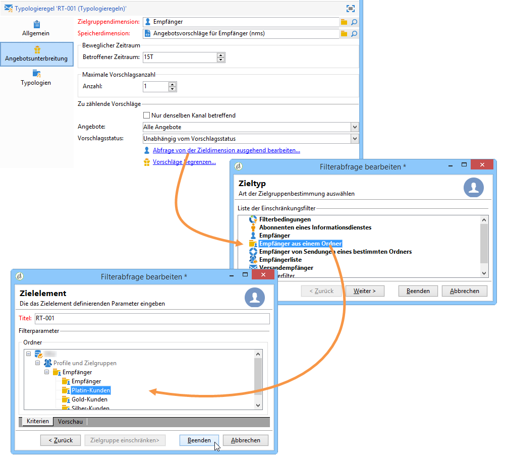

### Abfrage bezüglich der Vorschläge erstellen {#creating-a-query-on-propositions}

Um die zu zählenden Vorschläge über eine Abfrage zu definieren, klicken Sie auf den Link **[!UICONTROL Vorschläge begrenzen...]** und geben Sie die Bedingungen für die Berücksichtigung an.

In unten stehendem Beispiel werden ab der zweiten Unterbreitung die Angebote der Kategorie **Spezialangebote** in der Platzierung **Callcenter** mit einer Gewichtung von unter **20** gezählt.

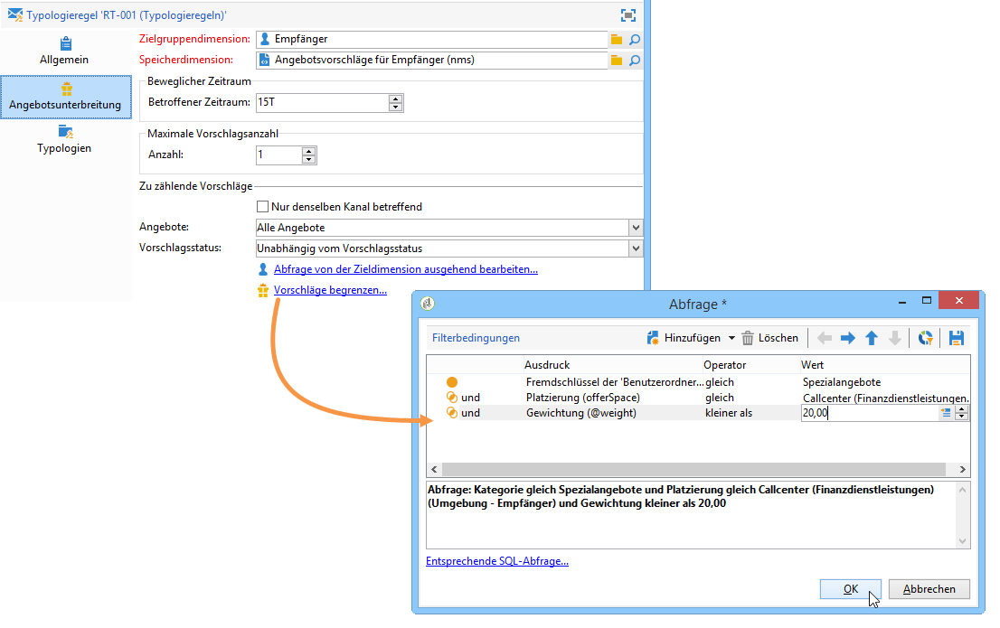
