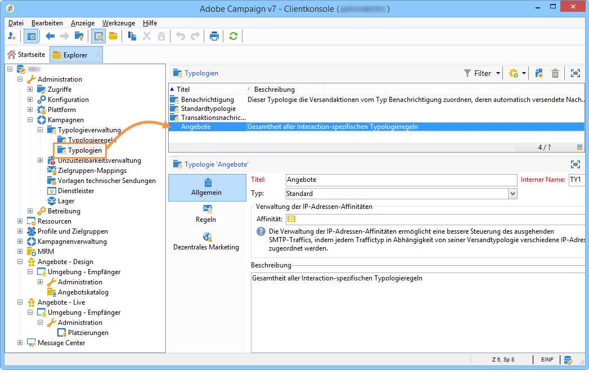

# Angebotsunterbreitung{#managing-offer-presentation}

## Unterbreitungsregeln – Übersicht {#presentation-rules-overview}

Interaction bietet die Möglichkeit, die Menge der Angebotsvorschläge mithilfe von s. g. Unterbreitungsregeln zu regulieren. Diese speziell in Interaction zur Anwendung kommenden Regeln gehören zur Gruppe der Typologieregeln. Sie erlauben es, basierend auf den einem Kontakt zuvor vorgeschlagenen Angeboten bestimmte Angebote von der Unterbreitung auszuschließen. Die Zuweisung der Regeln erfolgt auf Umgebungsebene.

## Unterbreitungsregeln erstellen und zuweisen {#creating-and-referencing-an-offer-presentation-rule}

1. Gehen Sie in den Knoten **[!UICONTROL Administration]** > **[!UICONTROL Kampagnen]** > **[!UICONTROL Typologieverwaltung]** > **[!UICONTROL Typologieregeln]**.
1. Erstellen Sie eine neue Typologieregel und wählen Sie den Typ **[!UICONTROL Angebotsunterbreitung]**.

   

1. Geben Sie gegebenenfalls den Kanal an, auf den die Regel angewendet werden soll.

   

1. Konfigurieren Sie die Anwendungskriterien der Regel. Weitere Informationen hierzu finden Sie unter [Parameter der Unterbreitungsregeln](#presentation-rule-settings).
1. Gehen Sie in den Knoten **[!UICONTROL Administration]** > **[!UICONTROL Kampagnen]** > **[!UICONTROL Typologieverwaltung]** > **[!UICONTROL Typologien]** und erstellen Sie eine Typologie, um alle Regeln des Typs **[!UICONTROL Angebotsunterbreitung]** zusammenzufassen.

   

1. Kehren Sie nun zurück zu den Regeln und ordnen Sie sie der zuvor erstellten Typologie zu.

   

1. Weisen Sie abschließend auf Ebene der Angebotsumgebung die Typologie zu.

   

## Parameter der Unterbreitungsregeln {#presentation-rule-settings}

### Anwendungskriterien {#application-criteria-}

Auf die Anwendungskriterien kann im **[!UICONTROL Allgemein]**-Tab der Typologieregeln zugegriffen werden. Sie erlauben die Zuweisung der Regel zu einer Auswahl an Angeboten. Die Auswahl geschieht mithilfe einer Abfrage. Gehen Sie wie folgt vor:

1. Klicken Sie auf den Link **[!UICONTROL Anwendungskriterien der Regel bearbeiten...]**.

   

1. Konfigurieren Sie im Abfragefenster den Filter, dem die von der Typologieregel betroffenen Angebote entsprechen müssen.

   Dieser kann beispielsweise eine Angebotskategorie betreffen.

   

### Angebotsdimensionen {#offer-dimensions}

Die im Tab **[!UICONTROL Angebotsunterbreitung]** konfigurierten Dimensionen für die Unterbreitungsregel müssen mit denen auf Umgebungsebene übereinstimmen.

Die **[!UICONTROL Zielgruppendimension]** entspricht der Tabelle der Empfänger, denen die Angebote unterbreitet werden sollen (standardmäßig nms:recipients). Die **[!UICONTROL Speicherdimension]** entspricht der Tabelle, die den mit der Zieldimension verknüpften Vorschlagsverlauf enthält (standardmäßig nms:propositionRcp).

>[!NOTE]
>
>Sie haben die Möglichkeit, andere Tabellen zu verwenden. Zur Nutzung einer anderen Zielgruppendimension ist die Erstellung von entsprechenden Tabellen und einer dedizierten Umgebung mit dem passenden Mapping erforderlich. Weiterführende Informationen dazu finden Sie unter [Angebotsumgebungen](../../interaction/using/live-design-environments.md#creating-an-offer-environment).

### Beweglicher Zeitraum {#period}

Es handelt sich um den Zeitraum, während dessen die Vorschläge von der Regel einbezogen werden. Er definiert, für welche Dauer der Vorschlagsverlauf bei Anwendung der Regel berücksichtigt wird. Die Regel kommt somit nicht bei Vorschlägen zum Tragen, die außerhalb dieses Zeitraums unterbreitet werden.

Der Zeitraum beginnt **X** Tage vor und endet **X** Tage nach der Unterbreitung, wobei **X** dem im Feld **[!UICONTROL Betroffener Zeitraum]** angegebenen Wert entspricht:

* Bei Platzierungen vom Typ &quot;eingehend&quot; entspricht das Vorschlagsdatum dem Unterbreitungsdatum.
* Bei Platzierungen vom Typ &quot;ausgehend&quot; entspricht das Vorschlagsdatum dem Kontaktdatum des Versands (z. B. das in einem Zielgruppen-Workflow angegebene Versanddatum).

Verwenden Sie die Pfeile des Felds, um die Anzahl an Tagen zu ändern, oder geben Sie direkt die gewünschte Dauer ein (z. B. &quot;2T 6h&quot;).

### Maximale Vorschlagsanzahl {#number-of-propositions}

An dieser Stelle können Sie angeben, wie oft die Angebote maximal vorgeschlagen werden dürfen, bevor sie ausgeschlossen werden.

Verwenden Sie die Pfeile des Felds, um die Anzahl zu ändern, oder geben Sie direkt die gewünschte Zahl ein.

## Vorschläge und Empfänger konfigurieren {#defining-propositions-and-recipients}

Im Bereich **[!UICONTROL Zu zählende Vorschläge]** können Sie die Angebote und die Empfänger angeben, die zu einem Ausschluss der im **[!UICONTROL Allgemein]**-Tab definierten Angebote führen, wenn Sie im Vorschlagsverlauf mit einer ausreichenden Häufigkeit vorkommen.

### Vorschläge filtern {#filtering-propositions}

Standardmäßig kann nach Kanal, betroffenen Angeboten und Vorschlagstatus gefiltert werden.

Hierbei handelt es sich um die gängigsten Anwendungen für Unterbreitungsregeln. Wenn Sie andere Kriterien verwenden möchten, haben Sie die Möglichkeit, mithilfe des Links **[!UICONTROL Vorschläge begrenzen...]** eine Abfrage zu konfigurieren. Lesen Sie diesbezüglich auch den Abschnitt [Abfrage bezüglich der Vorschläge erstellen](#creating-a-query-on-propositions).

* **Kanalfilter**

   **[!UICONTROL Nur denselben Kanal betreffend]**: ermöglicht den Ausschluss der Vorschläge, die den im **[!UICONTROL Allgemein]**-Tab angegebenen Kanal betreffen.

   Angenommen, der in der Regel angegebene Kanal ist der E-Mail-Kanal. Wenn die von der Regel betroffenen Angebote bisher nur im Web-Kanal unterbreitet wurden, kann das Angebotsmodul die Angebote für einen E-Mail-Versand auswählen. Sobald die Angebote jedoch einmal per E-Mail unterbreitet wurden, wählt das Angebotsmodul für künftige Vorschläge einen anderen Kanal aus.****

   >[!NOTE]
   >
   >Es handelt sich hier um den Kanal, nicht um die Platzierung. Wenn die Regel beispielsweise den Ausschluss eines Angebots im Web-Kanal betrifft, wird ein Angebot, das auf einer Webseite in zwei Platzierungen (z. B. in einem Banner und im Textkörper) vorgeschlagen werden soll, weder in der einen noch in der anderen Platzierung auf der Webseite angezeigt, wenn es zuvor bereits auf der Webseite unterbreitet wurde.
   >
   >Im Falle eines Workflows, der eine Angebotsunterbreitung enthält, können Regeln nur korrekt berücksichtigt werden, wenn der Parameter **[!UICONTROL Alle Kanäle]** ausgewählt wurde.

* **Angebotsfilter**

   Dieses Feld ermöglicht es, die Zählung der Angebote auf gewisse Angebotsgruppen zu beschränken.

   **[!UICONTROL Alle Angebote]**: Standardoption, die Angebote werden nicht gefiltert.

   **[!UICONTROL Nur das aktuell unterbreitete Angebot]**: Das im **[!UICONTROL Allgemein]**-Tab angegebene Angebot wird ausgeschlossen, wenn es zuvor bereits unterbreitet wurde.

   **[!UICONTROL Angebote derselben Kategorie]**: Ein Angebot wird ausgeschlossen, wenn bereits ein anderes Angebot derselben Kategorie unterbreitet wurde.

   **[!UICONTROL Angebote, für die die Regel Anwendung findet]**: Wenn im **[!UICONTROL Allgemein]**-Tab mehrere Angebote angegeben wurden, wird jeder einzelne Vorschlag dieser Angebotsgruppe gezählt und bei Erreichen der maximalen Vorschlagsanzahl werden alle angegebenen Angebote ausgeschlossen.

   Angenommen, die Regel bezieht sich auf die Angebote Nr. 2, 3 und 5 und die maximale Anzahl an Vorschlägen wurde auf 2 begrenzt. Wenn die Angebote Nr. 2 und 5 jeweils einmal unterbreitet wurden, erreicht die Anzahl zu zählender Vorschläge 2. Das Angebot Nr. 3 wird somit nicht unterbreitet.****

* **Vorschlagsstatusfilter**

   Dieses Feld ermöglicht die direkte Auswahl der gängigsten Vorschlagsstatus, die zu berücksichtigen sind, wenn sie im Verlauf erscheinen.

   **[!UICONTROL Unabhängig vom Vorschlagsstatus]**: Standardoption, die Vorschlagsstatus werden nicht gefiltert.

   **[!UICONTROL Angenommene oder abgelehnte Vorschläge]**: ermöglicht den Ausschluss von bereits vorgeschlagenen Angeboten, die angenommen oder abgelehnt wurden.

   **[!UICONTROL Angenommene Vorschläge]**: ermöglicht den Ausschluss von bereits vorgeschlagenen Angeboten, die akzeptiert wurden.

   **[!UICONTROL Abgelehnte Vorschläge]**: ermöglicht den Ausschluss von bereits vorgeschlagenen Angeboten, die abgelehnt wurden.

### Empfänger definieren {#defining-recipients}

Klicken Sie auf den Link **[!UICONTROL Abfrage von der Zieldimension ausgehend bearbeiten...]** und wählen Sie die von der Regel betroffenen Empfänger aus.

### Abfrage bezüglich der Vorschläge erstellen {#creating-a-query-on-propositions}

Um die zu zählenden Vorschläge über eine Abfrage zu definieren, klicken Sie auf den Link **[!UICONTROL Vorschläge begrenzen...]** und geben Sie die Bedingungen für die Berücksichtigung an.

In unten stehendem Beispiel werden ab der zweiten Unterbreitung die Angebote der Kategorie **Spezialangebote** in der Platzierung **Callcenter** mit einer Gewichtung von unter **20** gezählt.

